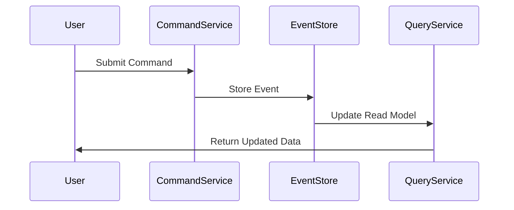

---

linkTitle: "4.3.2 Consistency Models in CQRS"
title: "Consistency Models in CQRS: Balancing Consistency and Availability in Distributed Systems"
description: "Explore the intricacies of consistency models in CQRS, including strong and eventual consistency, their implementation challenges, and practical use cases."
categories:
- Software Architecture
- Distributed Systems
- Event-Driven Architecture
tags:
- CQRS
- Consistency Models
- Strong Consistency
- Eventual Consistency
- Distributed Systems
date: 2024-10-25
type: docs
nav_weight: 4320

---

## 4.3.2 Consistency Models in CQRS

In the realm of distributed systems, consistency is a cornerstone concept that ensures the reliability and correctness of data across different nodes. When integrating Command Query Responsibility Segregation (CQRS) with Event Sourcing, understanding and implementing the appropriate consistency model becomes crucial. This section delves into the various consistency models applicable to CQRS, exploring their characteristics, challenges, and practical applications.

### Understanding Consistency in Distributed Systems

Consistency in distributed systems refers to the guarantee that all nodes or replicas in the system reflect the same data state at any given time. It is critical for maintaining system reliability, as inconsistencies can lead to incorrect data being presented to users or processed by other systems. In CQRS, where the command and query sides are segregated, ensuring consistency between these two sides is vital for coherent system behavior.

### Strong Consistency

#### Definition and Characteristics

Strong consistency ensures that once a write operation is completed, all subsequent read operations will reflect that write. This means that all clients see the most recent data immediately after a change is made. In the context of CQRS, strong consistency would imply that the query model is instantly updated after a command is processed.

#### Implementation Challenges

Achieving strong consistency in distributed CQRS systems presents several challenges:

- **Increased Latency:** Ensuring that all nodes are updated before a read can occur introduces latency, as the system must wait for confirmation from all replicas.
- **Reduced Availability:** In the event of a network partition, maintaining strong consistency may require sacrificing availability, as updates cannot be processed until all nodes are reachable.
- **Complexity in Coordination:** Coordinating updates across distributed nodes requires sophisticated mechanisms to ensure atomicity and consistency.

#### Use Cases Suitable for Strong Consistency

Strong consistency is essential in scenarios where data correctness is critical:

- **Financial Transactions:** Ensuring that account balances are accurately updated after each transaction to prevent overdrafts or double spending.
- **Inventory Management:** Maintaining accurate stock levels to prevent overselling or stockouts.

### Eventual Consistency

#### Definition and Characteristics

Eventual consistency is a model where the system guarantees that all replicas will converge to the same state over time, but not necessarily immediately. This model allows for temporary inconsistencies, which are resolved as updates propagate through the system.

#### Benefits of Eventual Consistency

- **Improved Availability:** Systems can continue to operate and accept writes even during network partitions, enhancing availability.
- **Scalability:** Eventual consistency supports horizontal scaling by allowing replicas to update independently.
- **Reduced Latency:** Read operations can proceed without waiting for all replicas to synchronize, reducing response times.

#### Handling Inconsistencies

Managing temporary inconsistencies involves strategies such as:

- **User Notifications:** Informing users of potential delays in data synchronization.
- **State Reconciliation:** Implementing mechanisms to detect and resolve conflicts when replicas diverge.

#### Use Cases Suitable for Eventual Consistency

Eventual consistency is appropriate for scenarios where immediate consistency is not critical:

- **User Profile Updates:** Allowing profile changes to propagate gradually across the system.
- **Recommendation Systems:** Aggregating user interactions over time to update recommendations.

### Causality and Ordering

Maintaining causality and event ordering is crucial in CQRS to ensure that related events are processed in the correct sequence. This is particularly important in event-sourced systems, where the order of events determines the state of the system.

### Tunable Consistency

Tunable consistency allows systems to adjust the level of consistency based on specific requirements and contexts. This flexibility enables developers to balance consistency and performance by choosing the appropriate consistency level for different operations.

### Consistency in Read Models

In CQRS, the consistency model impacts the design and implementation of the query model. Ensuring that data retrieval aligns with the desired consistency guarantees is essential for providing accurate and timely information to users.

### Balancing Consistency and Availability

The CAP theorem highlights the trade-offs between consistency, availability, and partition tolerance in distributed systems. In CQRS, balancing these aspects requires careful consideration of the system's requirements and constraints.

### Example Scenarios

#### Scenario 1: E-Commerce Platform

In an e-commerce platform, strong consistency might be required for processing payments and updating inventory, while eventual consistency could be acceptable for updating user reviews and recommendations.

#### Scenario 2: Social Media Application

A social media application might use eventual consistency for propagating user posts and comments, allowing for quick updates and high availability, while ensuring strong consistency for user authentication and profile management.

### Conclusion

Understanding and implementing the appropriate consistency model in CQRS is crucial for building reliable and efficient distributed systems. By carefully considering the trade-offs and requirements of each model, developers can design systems that meet their specific needs while maintaining high performance and availability.

## Quiz Time!



### What is strong consistency in distributed systems?

- [x] All readers see the most recent write immediately after it occurs.
- [ ] All nodes eventually converge to the same state.
- [ ] Data is replicated across all nodes without delay.
- [ ] Writes are acknowledged only after all nodes are updated.

> **Explanation:** Strong consistency ensures that all readers see the most recent write immediately after it occurs, providing a consistent view of the data.

### What is a major challenge of implementing strong consistency in CQRS?

- [x] Increased latency
- [ ] Reduced scalability
- [ ] Lack of data integrity
- [ ] Simplified coordination

> **Explanation:** Strong consistency can increase latency because it requires confirmation from all nodes before a read can occur, ensuring that all nodes reflect the most recent write.

### Which use case is suitable for eventual consistency?

- [ ] Financial transactions
- [ ] Inventory management
- [x] User profile updates
- [ ] Real-time bidding

> **Explanation:** Eventual consistency is suitable for user profile updates, where immediate consistency is not critical, allowing for improved availability and reduced latency.

### How does eventual consistency benefit distributed systems?

- [x] Improved availability and scalability
- [ ] Immediate data synchronization
- [ ] Reduced data redundancy
- [ ] Simplified data models

> **Explanation:** Eventual consistency improves availability and scalability by allowing systems to continue operating during network partitions and supporting horizontal scaling.

### What is the role of causality in CQRS?

- [x] Ensuring related events are processed in the correct sequence
- [ ] Reducing the complexity of event processing
- [ ] Simplifying data synchronization
- [ ] Enhancing data redundancy

> **Explanation:** Causality ensures that related events are processed in the correct sequence, which is crucial for maintaining the correct state in event-sourced systems.

### What does tunable consistency allow in distributed systems?

- [x] Adjusting the level of consistency based on specific requirements
- [ ] Ensuring immediate consistency across all nodes
- [ ] Simplifying data replication
- [ ] Reducing network latency

> **Explanation:** Tunable consistency allows systems to adjust the level of consistency based on specific requirements, balancing consistency and performance.

### Which consistency model is more suitable for a recommendation system?

- [ ] Strong consistency
- [x] Eventual consistency
- [ ] Immediate consistency
- [ ] Causal consistency

> **Explanation:** Eventual consistency is suitable for recommendation systems, where immediate consistency is not critical, allowing for improved availability and scalability.

### What is a key trade-off highlighted by the CAP theorem?

- [x] Consistency vs. availability
- [ ] Scalability vs. performance
- [ ] Latency vs. throughput
- [ ] Security vs. usability

> **Explanation:** The CAP theorem highlights the trade-off between consistency and availability in distributed systems, especially during network partitions.

### How does strong consistency impact availability?

- [ ] It improves availability by ensuring immediate data synchronization.
- [x] It reduces availability during network partitions.
- [ ] It has no impact on availability.
- [ ] It simplifies data replication.

> **Explanation:** Strong consistency can reduce availability during network partitions, as updates cannot be processed until all nodes are reachable.

### True or False: Eventual consistency guarantees that all replicas will become consistent immediately.

- [ ] True
- [x] False

> **Explanation:** False. Eventual consistency guarantees that all replicas will become consistent over time, but not necessarily immediately.


