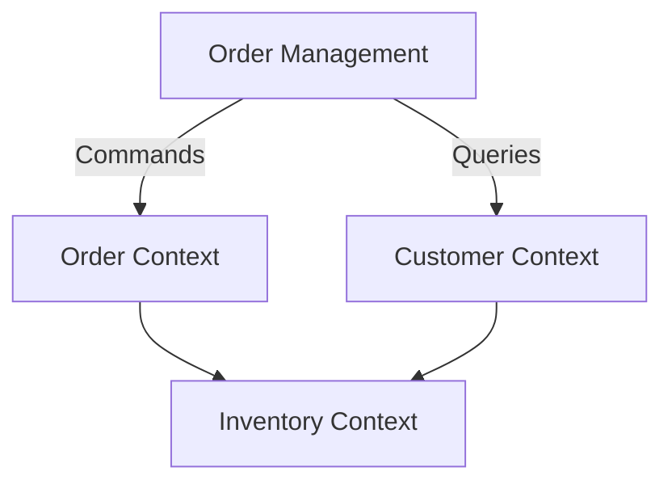
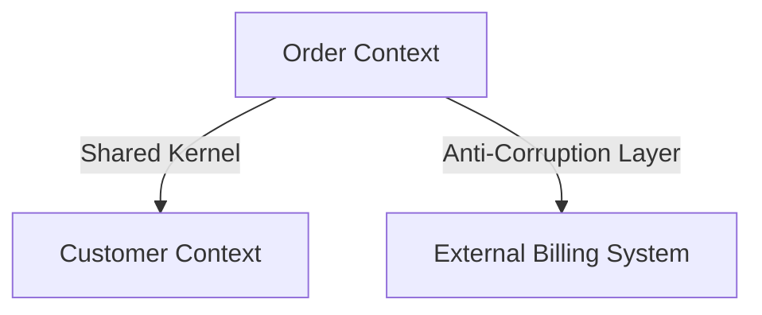
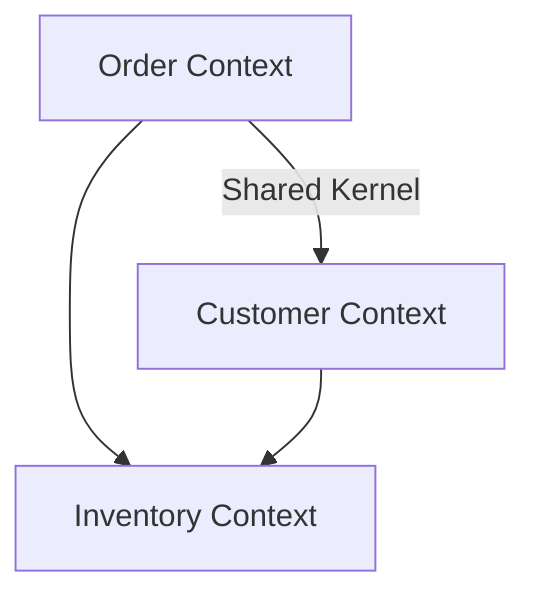
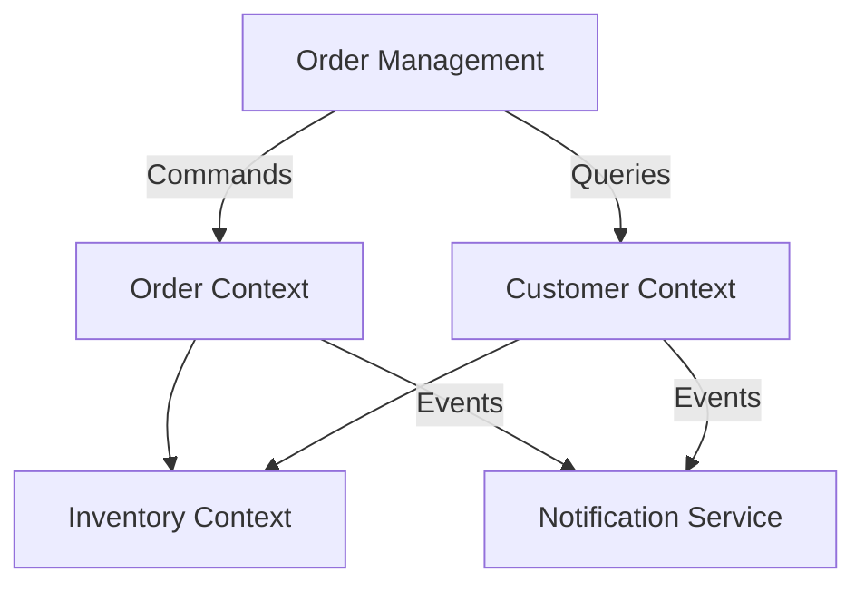

## 4.4.2 Tactical and Strategic Patterns

In the realm of Command Query Responsibility Segregation (CQRS), understanding and implementing both tactical and strategic patterns is crucial for designing scalable, maintainable, and robust event-driven systems. This section delves into these patterns, providing insights and practical guidance on how to effectively apply them in your projects.

### Tactical Patterns in CQRS

Tactical patterns in CQRS focus on the implementation details that enable the separation of command and query responsibilities. These patterns are essential for encapsulating business logic, ensuring data consistency, and managing state changes.

#### Commands and Command Handlers

In CQRS, commands represent the intent to perform an action or change the state of the system. They are typically immutable objects that encapsulate all necessary information to execute a specific operation. Command handlers are responsible for processing these commands, executing business logic, and triggering subsequent events.

**Example: Implementing Commands and Command Handlers in Java**

```java
// Command to create a new order
public class CreateOrderCommand {
    private final String orderId;
    private final String customerId;
    private final List<OrderItem> items;

    public CreateOrderCommand(String orderId, String customerId, List<OrderItem> items) {
        this.orderId = orderId;
        this.customerId = customerId;
        this.items = items;
    }

    // Getters
}

// Command Handler
public class CreateOrderCommandHandler {

    private final OrderRepository orderRepository;

    public CreateOrderCommandHandler(OrderRepository orderRepository) {
        this.orderRepository = orderRepository;
    }

    public void handle(CreateOrderCommand command) {
        // Validate command
        if (command.getItems().isEmpty()) {
            throw new IllegalArgumentException("Order must contain at least one item.");
        }

        // Business logic to create an order
        Order order = new Order(command.getOrderId(), command.getCustomerId(), command.getItems());
        orderRepository.save(order);

        // Publish event
        // eventPublisher.publish(new OrderCreatedEvent(command.getOrderId(), command.getCustomerId()));
    }
}
```

In this example, the `CreateOrderCommand` encapsulates the data required to create an order, while the `CreateOrderCommandHandler` processes the command, applies business rules, and persists the order.

#### Events and Event Handlers

Events in CQRS are used to communicate state changes across different parts of the system. They are typically immutable and represent facts that have occurred. Event handlers listen for these events and update the query model or trigger other processes.

**Example: Defining Events and Event Handlers**

```java
// Event representing an order creation
public class OrderCreatedEvent {
    private final String orderId;
    private final String customerId;

    public OrderCreatedEvent(String orderId, String customerId) {
        this.orderId = orderId;
        this.customerId = customerId;
    }

    // Getters
}

// Event Handler
public class OrderCreatedEventHandler {

    private final OrderViewRepository orderViewRepository;

    public OrderCreatedEventHandler(OrderViewRepository orderViewRepository) {
        this.orderViewRepository = orderViewRepository;
    }

    public void on(OrderCreatedEvent event) {
        // Update the query model
        OrderView orderView = new OrderView(event.getOrderId(), event.getCustomerId());
        orderViewRepository.save(orderView);
    }
}
```

Here, the `OrderCreatedEvent` is published when an order is created, and the `OrderCreatedEventHandler` updates the query model accordingly.

#### Event Sourcing

Event Sourcing is a tactical pattern that complements CQRS by storing state changes as a sequence of events. This approach allows for reconstructing the current state of an entity by replaying its events, providing a complete audit trail and facilitating complex business logic.

**Example: Implementing Event Sourcing**

```java
// Event Store Interface
public interface EventStore {
    void saveEvents(String aggregateId, List<DomainEvent> events, int expectedVersion);
    List<DomainEvent> getEvents(String aggregateId);
}

// Order Aggregate
public class OrderAggregate {
    private String orderId;
    private List<OrderItem> items;

    public OrderAggregate(List<DomainEvent> events) {
        for (DomainEvent event : events) {
            apply(event);
        }
    }

    public void apply(DomainEvent event) {
        if (event instanceof OrderCreatedEvent) {
            OrderCreatedEvent orderCreated = (OrderCreatedEvent) event;
            this.orderId = orderCreated.getOrderId();
            // Apply other properties
        }
        // Handle other events
    }
}
```

Event Sourcing ensures that every change to the state of an entity is captured as an event, allowing for precise state reconstruction and auditing.

#### Aggregates

Aggregates are a fundamental concept in Domain-Driven Design (DDD) and CQRS, representing a cluster of related entities that are treated as a single unit for data changes. They enforce business rules and ensure consistency within their boundaries.

**Example: Defining an Aggregate**

```java
// Order Aggregate Root
public class Order {
    private final String orderId;
    private final List<OrderItem> items;

    public Order(String orderId, List<OrderItem> items) {
        this.orderId = orderId;
        this.items = items;
    }

    public void addItem(OrderItem item) {
        // Business rule: Check if item is already in the order
        if (items.contains(item)) {
            throw new IllegalArgumentException("Item already added to the order.");
        }
        items.add(item);
    }

    // Other business logic
}
```

Aggregates help manage complex business logic by encapsulating related entities and operations, ensuring that all changes are consistent and valid.

### Strategic Patterns in CQRS

Strategic patterns in CQRS focus on the broader architectural design and alignment with Domain-Driven Design (DDD) principles. These patterns help manage complexity by defining clear boundaries and interactions between different parts of the system.

#### Bounded Contexts

Bounded contexts are a core concept in DDD, representing a specific domain model with its own ubiquitous language. In CQRS, aligning command and query models with bounded contexts ensures that each part of the system is modeled independently, reducing complexity and improving maintainability.

**Example: Bounded Contexts in CQRS**



In this diagram, the `Order Management` system interacts with different bounded contexts, each responsible for its domain logic.

#### Context Mapping

Context mapping techniques are used to define relationships and interactions between bounded contexts in a CQRS architecture. These mappings help identify dependencies and integration points, ensuring smooth communication and data flow.

**Example: Context Mapping**



This diagram illustrates how the `Order Context` shares a kernel with the `Customer Context` and uses an anti-corruption layer to interact with an external billing system.

#### Anti-Corruption Layers

Anti-corruption layers (ACLs) are used to protect bounded contexts from external changes and maintain model integrity. They act as a translation layer, converting external data models into the internal domain model.

**Example: Implementing an Anti-Corruption Layer**

```java
// External Billing System Adapter
public class BillingSystemAdapter {

    private final BillingService billingService;

    public BillingSystemAdapter(BillingService billingService) {
        this.billingService = billingService;
    }

    public Invoice translateAndProcess(ExternalInvoice externalInvoice) {
        // Translate external invoice to internal model
        Invoice invoice = new Invoice(externalInvoice.getId(), externalInvoice.getAmount());
        // Process invoice
        billingService.processInvoice(invoice);
        return invoice;
    }
}
```

The `BillingSystemAdapter` translates external invoices into the internal `Invoice` model, ensuring that the `Order Context` remains unaffected by external changes.

#### Shared Kernel

A shared kernel is a strategic pattern where common concepts and entities are shared across bounded contexts. While this approach can reduce duplication, it requires careful management to avoid coupling and ensure that changes do not inadvertently affect other contexts.

**Example: Using a Shared Kernel**



In this diagram, the `Order Context` and `Customer Context` share a kernel for common entities like `Customer` and `Product`.

### Combining Tactical and Strategic Patterns

Effectively combining tactical and strategic patterns in CQRS involves aligning the detailed implementation of commands, events, and aggregates with the broader architectural strategies of bounded contexts, context mapping, and anti-corruption layers. This alignment ensures a cohesive and maintainable system design.

**Guidance for Combining Patterns**

1. **Align Commands and Events with Bounded Contexts:** Ensure that commands and events are specific to their bounded context, reducing cross-context dependencies.
   
2. **Use Aggregates to Enforce Business Rules:** Within each bounded context, use aggregates to encapsulate business logic and maintain consistency.

3. **Implement Anti-Corruption Layers for External Interactions:** Protect bounded contexts from external changes by using ACLs to translate and adapt external data.

4. **Leverage Shared Kernels Judiciously:** Share only essential concepts across contexts, and manage changes carefully to avoid unintended consequences.

### Example Implementations

To illustrate the application of both tactical and strategic patterns in CQRS, consider a sample e-commerce system where orders, customers, and inventory are managed across different bounded contexts.

**Example: E-Commerce System with CQRS**



In this example, the `Order Management` system uses commands to interact with the `Order Context` and queries to retrieve customer information from the `Customer Context`. Events are published to the `Notification Service` to inform users of order status changes.

By applying both tactical and strategic patterns, this system achieves a clear separation of concerns, robust business logic enforcement, and seamless integration across different domains.

## Quiz Time!



### What is the primary role of command handlers in CQRS?

- [x] To process commands and execute business logic
- [ ] To update the query model directly
- [ ] To handle user interface interactions
- [ ] To manage database transactions

> **Explanation:** Command handlers in CQRS are responsible for processing commands and executing the associated business logic, often resulting in state changes and event publication.

### How do events function in a CQRS architecture?

- [x] They communicate state changes across the system
- [ ] They directly modify the database
- [ ] They are used to validate commands
- [ ] They serve as user notifications only

> **Explanation:** Events in CQRS communicate state changes across different parts of the system, allowing for updates to query models and triggering additional processes.

### What is the purpose of event sourcing in CQRS?

- [x] To store state changes as a sequence of events
- [ ] To directly update the query model
- [ ] To validate user inputs
- [ ] To manage user sessions

> **Explanation:** Event sourcing stores state changes as a sequence of events, enabling state reconstruction and providing a complete audit trail.

### What is an aggregate in the context of CQRS and DDD?

- [x] A cluster of related entities treated as a single unit
- [ ] A collection of unrelated objects
- [ ] A database table
- [ ] A user interface component

> **Explanation:** An aggregate is a cluster of related entities that are treated as a single unit for data changes, enforcing business rules and ensuring consistency.

### How do bounded contexts relate to CQRS?

- [x] They ensure different parts of the system are modeled independently
- [ ] They are used to store events
- [ ] They define user roles and permissions
- [ ] They manage database connections

> **Explanation:** Bounded contexts in CQRS ensure that different parts of the system are modeled independently, reducing complexity and improving maintainability.

### What is the role of an anti-corruption layer in CQRS?

- [x] To protect bounded contexts from external changes
- [ ] To manage database transactions
- [ ] To handle user authentication
- [ ] To optimize query performance

> **Explanation:** An anti-corruption layer protects bounded contexts from external changes by translating external data models into the internal domain model.

### What is a shared kernel in CQRS?

- [x] A set of common concepts shared across bounded contexts
- [ ] A type of database schema
- [ ] A user interface framework
- [ ] A network protocol

> **Explanation:** A shared kernel is a set of common concepts and entities shared across bounded contexts, requiring careful management to avoid coupling.

### How can tactical and strategic patterns be combined in CQRS?

- [x] By aligning commands, events, and aggregates with bounded contexts
- [ ] By using a single database for all contexts
- [ ] By centralizing all business logic
- [ ] By avoiding the use of events

> **Explanation:** Tactical and strategic patterns can be combined by aligning the detailed implementation of commands, events, and aggregates with the broader architectural strategies of bounded contexts and context mapping.

### What is the benefit of using aggregates in CQRS?

- [x] They encapsulate business logic and maintain consistency
- [ ] They simplify user interface design
- [ ] They enhance database performance
- [ ] They reduce network latency

> **Explanation:** Aggregates encapsulate business logic and maintain consistency within their boundaries, ensuring that all changes are valid and consistent.

### True or False: In CQRS, commands and queries are processed by the same model.

- [ ] True
- [x] False

> **Explanation:** In CQRS, commands and queries are processed by separate models, allowing for optimized handling of write and read operations.


