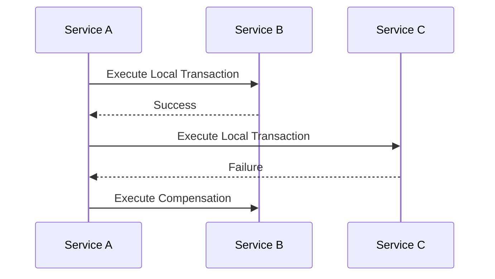

## 5.1.1 Definition and Purpose

In the realm of microservices and distributed systems, ensuring data consistency across multiple services is a formidable challenge. Traditional ACID (Atomicity, Consistency, Isolation, Durability) transactions, which are effective in monolithic architectures, fall short in distributed environments due to their inherent complexity and performance constraints. Enter the **Saga Pattern**, a design pattern specifically crafted to manage distributed transactions in microservices architectures, providing a robust solution to maintain data consistency without the need for traditional ACID transactions.

### Defining the Saga Pattern

The Saga Pattern is a sequence of local transactions where each transaction updates data within a single service and publishes an event or message to trigger the next transaction in the sequence. If a transaction fails, the saga executes a series of compensating transactions to undo the changes made by the preceding transactions, thus maintaining consistency across the system.

### Purpose of Sagas

The primary purpose of sagas is to ensure data consistency across multiple services by decomposing a large transaction into a series of smaller, manageable local transactions. Each of these transactions is paired with a compensating action that can be invoked to revert the transaction if necessary. This approach allows systems to maintain consistency without the need for distributed locks or complex coordination mechanisms, which are often impractical in microservices architectures.

### Atomicity in Distributed Systems

In distributed systems, achieving atomicity—where a transaction is completed fully or not at all—is challenging due to the lack of a global transaction manager. Sagas address this by ensuring that each step in the transaction process is either completed successfully or compensated for if it fails. This method of maintaining system consistency through coordinated steps allows for more flexible and resilient transaction management.

### Components of Sagas

Sagas consist of two main components:

1. **Transactions:** These are the individual operations that make up the saga. Each transaction updates data within a single service and triggers the next step in the saga.

2. **Compensations:** These are the actions taken to undo a transaction if it fails. Compensating transactions are crucial for maintaining consistency, as they allow the system to revert to a previous state if necessary.

### Saga Execution Models

There are two primary execution models for implementing sagas:

- **Choreography:** In this model, each service involved in the saga listens for events and decides when to act based on the events it receives. This decentralized approach allows services to operate independently, reducing the need for a central coordinator.

- **Orchestration:** Here, a central orchestrator is responsible for managing the saga's workflow. The orchestrator sends commands to each service to execute transactions and compensations, providing a more controlled and predictable execution flow.

### Benefits of Using Sagas

The Saga Pattern offers several benefits over traditional transaction models:

- **Improved Scalability:** By breaking down transactions into smaller, independent steps, sagas allow systems to scale more effectively, as each service can operate autonomously.

- **Fault Tolerance:** Sagas enhance fault tolerance by providing compensating actions that can undo changes in case of failures, ensuring the system remains consistent.

- **Better Performance:** Without the need for distributed locks or global transactions, sagas can improve system performance by reducing overhead and complexity.

### Real-World Relevance

In modern distributed architectures, particularly those based on microservices, sagas are essential for managing complex transactions across multiple services. They provide a flexible and resilient approach to maintaining data consistency, making them a vital tool for developers and architects working with distributed systems.

### Visual Representation

To better understand how sagas manage distributed transactions, consider the following diagram illustrating a simple saga workflow:



In this diagram, Service A initiates a local transaction in Service B, which succeeds. Service A then proceeds to Service C, where the transaction fails. As a result, Service A triggers a compensating transaction in Service B to revert the changes, maintaining system consistency.

### Practical Java Code Example

Let's explore a practical Java code example using Spring Boot to implement a simple saga pattern:

```java
import org.springframework.stereotype.Service;
import org.springframework.transaction.annotation.Transactional;

@Service
public class OrderService {

    @Transactional
    public void createOrder(Order order) {
        // Step 1: Create Order
        orderRepository.save(order);
        // Step 2: Reserve Inventory
        try {
            inventoryService.reserveInventory(order);
        } catch (Exception e) {
            // Compensate: Cancel Order
            orderRepository.delete(order);
            throw new RuntimeException("Failed to reserve inventory, order cancelled.");
        }
    }
}
```

In this example, the `OrderService` attempts to create an order and reserve inventory. If the inventory reservation fails, the order creation is compensated by deleting the order, ensuring consistency.

### Conclusion

The Saga Pattern is a powerful tool for managing distributed transactions in microservices architectures. By breaking down transactions into smaller, manageable steps and providing compensating actions, sagas ensure data consistency without the need for traditional ACID transactions. This approach enhances scalability, fault tolerance, and performance, making it an essential pattern for modern distributed systems.

## Quiz Time!



### What is the primary purpose of the Saga Pattern?

- [x] To ensure data consistency across multiple services by breaking down a transaction into a series of local transactions.
- [ ] To provide a global transaction manager for distributed systems.
- [ ] To eliminate the need for compensating actions in distributed transactions.
- [ ] To increase the complexity of transaction management in microservices.

> **Explanation:** The Saga Pattern ensures data consistency by breaking down a transaction into local transactions, each with its own compensating action.

### How do sagas address the lack of atomicity in distributed systems?

- [x] By maintaining system consistency through coordinated steps and compensating actions.
- [ ] By using distributed locks to ensure atomicity.
- [ ] By relying on a global transaction manager.
- [ ] By avoiding the use of transactions altogether.

> **Explanation:** Sagas maintain consistency through coordinated steps and compensating actions, addressing the lack of atomicity in distributed systems.

### What are the two main components of sagas?

- [x] Transactions and compensations
- [ ] Transactions and rollbacks
- [ ] Services and events
- [ ] Commands and queries

> **Explanation:** Sagas consist of transactions and compensations, where transactions perform operations and compensations undo them if necessary.

### What are the two primary execution models for implementing sagas?

- [x] Choreography and orchestration
- [ ] Synchronization and coordination
- [ ] Centralized and decentralized
- [ ] Sequential and parallel

> **Explanation:** Sagas can be implemented using choreography, where services listen for events, or orchestration, where a central orchestrator manages the workflow.

### Which of the following is a benefit of using sagas?

- [x] Improved scalability
- [x] Fault tolerance
- [ ] Increased complexity
- [ ] Reduced performance

> **Explanation:** Sagas improve scalability and fault tolerance by breaking down transactions into smaller steps and providing compensating actions.

### In a choreography-based saga, how do services decide when to act?

- [x] By listening for events and acting based on the events received.
- [ ] By waiting for commands from a central orchestrator.
- [ ] By polling a central database for updates.
- [ ] By using distributed locks to coordinate actions.

> **Explanation:** In choreography, services listen for events and decide when to act based on the events they receive.

### What is the role of compensating actions in a saga?

- [x] To undo changes made by a transaction if it fails.
- [ ] To enhance the performance of transactions.
- [ ] To ensure transactions are completed faster.
- [ ] To replace the need for local transactions.

> **Explanation:** Compensating actions undo changes made by a transaction if it fails, maintaining consistency.

### Why are sagas essential in microservices-based systems?

- [x] They provide a flexible and resilient approach to managing complex transactions across multiple services.
- [ ] They eliminate the need for service communication.
- [ ] They simplify the architecture by reducing the number of services.
- [ ] They ensure all transactions are completed in parallel.

> **Explanation:** Sagas are essential in microservices-based systems as they manage complex transactions flexibly and resiliently.

### Which execution model uses a central orchestrator to manage the saga's workflow?

- [x] Orchestration
- [ ] Choreography
- [ ] Synchronization
- [ ] Decentralization

> **Explanation:** In the orchestration model, a central orchestrator manages the saga's workflow.

### True or False: Sagas eliminate the need for compensating actions in distributed transactions.

- [ ] True
- [x] False

> **Explanation:** False. Sagas rely on compensating actions to maintain consistency in distributed transactions.


