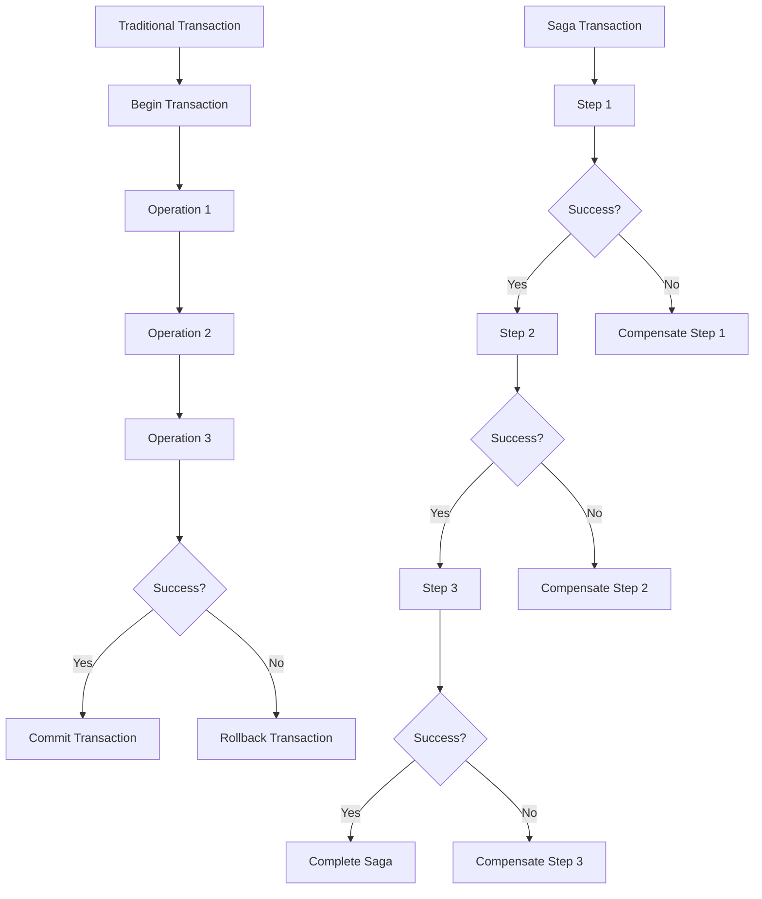

## 5.1.2 Sagas vs. Traditional Transaction Models

In the realm of software architecture, managing transactions effectively is crucial for ensuring data consistency and system reliability. Traditionally, transactions have been managed using ACID-compliant models, which work well in monolithic architectures. However, as systems evolve towards distributed architectures, such as microservices, the limitations of traditional transaction models become apparent. This section explores these limitations and how the saga pattern offers a viable alternative for distributed systems.

### Overview of Traditional Transactions

Traditional transactions are often characterized by the ACID properties:

- **Atomicity:** Ensures that all operations within a transaction are completed successfully. If any operation fails, the entire transaction is rolled back.
- **Consistency:** Guarantees that a transaction will bring the database from one valid state to another, maintaining database invariants.
- **Isolation:** Ensures that concurrent transactions do not interfere with each other.
- **Durability:** Once a transaction is committed, it remains so, even in the event of a system failure.

In monolithic architectures, these properties are enforced by a single database system, making it relatively straightforward to maintain consistency and reliability.

### Limitations of Traditional Transactions in Distributed Systems

As systems transition to distributed architectures, such as microservices, the traditional transaction model faces several challenges:

1. **Tight Coupling:** Traditional transactions require a tightly coupled system where all components must be available and operational to commit a transaction. This is difficult to achieve in distributed systems where services may be independently deployed and managed.

2. **Scalability Issues:** The need for a single transaction coordinator can become a bottleneck, limiting the system's ability to scale horizontally.

3. **Single Points of Failure:** A failure in the transaction coordinator or any participating service can cause the entire transaction to fail, affecting system reliability.

4. **Complexity in Coordination:** Coordinating a transaction across multiple services and databases increases complexity and the likelihood of errors.

### How Sagas Address These Limitations

Sagas offer a more scalable and resilient approach by decomposing a large transaction into a series of smaller, manageable steps, each of which is a local transaction. Each step in a saga is followed by a compensating action in case of failure, allowing the system to maintain consistency without requiring a global transaction coordinator.

- **Decentralized Coordination:** Sagas do not rely on a central coordinator, reducing the risk of a single point of failure and allowing services to operate independently.
- **Scalability:** By breaking down transactions into smaller steps, sagas enable systems to scale more effectively, as each service can handle its own transactions.
- **Resilience:** The use of compensating transactions allows sagas to handle failures gracefully, ensuring that the system can recover from errors without rolling back the entire transaction.

### Comparison of Atomicity

In traditional transactions, atomicity is achieved through the "all-or-nothing" principle, where a transaction either completes fully or not at all. In contrast, sagas embrace an eventual consistency model, where each step of the saga is atomic, but the overall transaction may take time to reach a consistent state.

- **Traditional Transactions:** Ensure immediate consistency through strict atomicity.
- **Sagas:** Achieve eventual consistency by allowing intermediate states and using compensating actions to resolve inconsistencies.

### Failure Handling Mechanisms

Traditional transactions handle failures using rollbacks, which revert the system to its previous state. This approach is effective in monolithic systems but can be challenging in distributed environments.

Sagas, on the other hand, use compensating transactions to handle failures. If a step in the saga fails, a compensating action is executed to undo the effects of the previous steps, allowing the system to continue operating.

- **Traditional Transactions:** Use rollbacks to revert changes.
- **Sagas:** Use compensating transactions to maintain consistency.

### Performance Implications

Traditional transactions can introduce significant performance overhead due to the need for coordination and locking mechanisms. This can lead to increased latency and reduced throughput, particularly in distributed systems.

Sagas typically have lower performance overhead because they do not require a central coordinator and allow services to operate independently. This decentralized nature enables higher throughput and reduced latency, making sagas well-suited for high-performance distributed systems.

### Use Case Suitability

Sagas are particularly suitable for distributed environments where:

- **Independent Services:** Each service can manage its own transactions without relying on a central coordinator.
- **High Availability:** The system must remain operational even in the event of partial failures.
- **Scalability:** The system needs to handle a high volume of transactions across multiple services.

In contrast, traditional transactions are more appropriate for monolithic systems where tight coupling and immediate consistency are required.

### Visual Comparison

To better understand the differences between traditional transaction flow and saga-based transaction flow, consider the following diagram:

In this diagram, the traditional transaction follows a linear path with a single commit or rollback point, while the saga transaction consists of multiple steps, each with its own success or compensation path.

### Conclusion

Sagas provide a robust alternative to traditional transaction models in distributed systems, offering scalability, resilience, and reduced performance overhead. By understanding the differences between these models, architects and developers can make informed decisions about which approach best suits their system's needs.

For further exploration, consider reviewing the official documentation for frameworks that support sagas, such as Spring Boot's Saga pattern implementation or Akka's persistence library. Additionally, books like "Designing Data-Intensive Applications" by Martin Kleppmann provide deeper insights into distributed systems and transaction management.

## Quiz Time!



### Which of the following is a characteristic of traditional transactions?

- [x] Atomicity
- [ ] Eventual consistency
- [ ] Decentralized coordination
- [ ] Compensating transactions

> **Explanation:** Traditional transactions are characterized by the ACID properties, including atomicity, which ensures that all operations within a transaction are completed successfully or not at all.

### What is a key limitation of traditional transactions in distributed systems?

- [x] Tight coupling
- [ ] Decentralized coordination
- [ ] Eventual consistency
- [ ] Use of compensating transactions

> **Explanation:** Traditional transactions require tight coupling, which can be challenging to achieve in distributed systems where services may be independently deployed and managed.

### How do sagas handle failures differently from traditional transactions?

- [x] Using compensating transactions
- [ ] Using rollbacks
- [ ] By ensuring immediate consistency
- [ ] By locking resources

> **Explanation:** Sagas handle failures using compensating transactions, which undo the effects of previous steps, allowing the system to maintain consistency without rolling back the entire transaction.

### What is a performance advantage of sagas over traditional transactions?

- [x] Lower performance overhead
- [ ] Higher latency
- [ ] Centralized coordination
- [ ] Increased locking mechanisms

> **Explanation:** Sagas typically have lower performance overhead because they do not require a central coordinator and allow services to operate independently, enabling higher throughput and reduced latency.

### In what type of environment are sagas particularly suitable?

- [x] Distributed environments
- [ ] Monolithic systems
- [ ] Systems requiring immediate consistency
- [ ] Systems with tight coupling

> **Explanation:** Sagas are particularly suitable for distributed environments where services can manage their own transactions independently, and the system must remain operational even in the event of partial failures.

### What is the main difference in atomicity between traditional transactions and sagas?

- [x] Traditional transactions ensure immediate consistency, while sagas achieve eventual consistency.
- [ ] Both ensure immediate consistency.
- [ ] Both achieve eventual consistency.
- [ ] Sagas ensure immediate consistency, while traditional transactions achieve eventual consistency.

> **Explanation:** Traditional transactions ensure immediate consistency through strict atomicity, whereas sagas achieve eventual consistency by allowing intermediate states and using compensating actions to resolve inconsistencies.

### Which of the following is a challenge of using traditional transactions in microservices?

- [x] Scalability issues
- [ ] Decentralized coordination
- [ ] Use of compensating transactions
- [ ] Eventual consistency

> **Explanation:** Traditional transactions can become a bottleneck in microservices due to the need for a single transaction coordinator, limiting the system's ability to scale horizontally.

### What is a common mechanism used by traditional transactions to handle failures?

- [x] Rollbacks
- [ ] Compensating transactions
- [ ] Eventual consistency
- [ ] Decentralized coordination

> **Explanation:** Traditional transactions handle failures using rollbacks, which revert the system to its previous state.

### How do sagas achieve resilience in distributed systems?

- [x] By using compensating transactions
- [ ] By ensuring immediate consistency
- [ ] By centralizing coordination
- [ ] By locking resources

> **Explanation:** Sagas achieve resilience by using compensating transactions to handle failures, ensuring that the system can recover from errors without rolling back the entire transaction.

### True or False: Sagas require a central transaction coordinator.

- [ ] True
- [x] False

> **Explanation:** False. Sagas do not require a central transaction coordinator, which reduces the risk of a single point of failure and allows services to operate independently.


