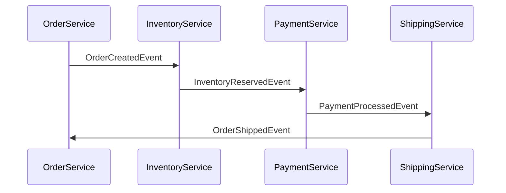

## 5.2.1 Choreography-Based Sagas

In the realm of distributed systems, managing transactions across multiple services can be complex. The Saga pattern offers a solution by breaking down a transaction into a series of smaller, isolated steps that can be coordinated to achieve a consistent outcome. Among the types of sagas, choreography-based sagas stand out for their decentralized approach to coordination.

### Defining Choreography-Based Sagas

Choreography-based sagas rely on a decentralized coordination mechanism where each service involved in the transaction emits and listens to events. Unlike orchestration-based sagas, which use a central coordinator to manage the transaction flow, choreography-based sagas allow each service to autonomously manage its part of the saga. This autonomy is achieved through event-driven communication, where services react to events and trigger subsequent actions or compensations as needed.

### Decentralized Coordination

The core principle of choreography-based sagas is decentralized coordination. Each service in the saga is responsible for executing its transaction step and publishing an event upon completion. Other services listen for these events and decide whether to proceed with their respective steps. This model eliminates the need for a central coordinator, reducing single points of failure and enhancing system resilience.

### Event Flow Mechanism

In a choreography-based saga, events flow organically between services. The flow begins when an initiating service publishes an event to start the saga. Subsequent services listen for this event and, upon receiving it, perform their operations and emit new events. This chain reaction continues until the saga completes successfully or compensatory actions are triggered in case of a failure.

Consider the following diagram illustrating the event flow in a choreography-based saga:



### Advantages of Choreography

Choreography-based sagas offer several advantages:

1. **Simplicity:** The absence of a central coordinator simplifies the architecture, making it easier to understand and implement.
2. **Scalability:** Decentralized control allows services to scale independently, improving overall system scalability.
3. **Reduced Single Points of Failure:** With no central coordinator, the system is less prone to single points of failure, enhancing reliability.
4. **Flexibility:** Services can be developed and deployed independently, allowing for greater flexibility in managing changes.

### Challenges in Choreography

Despite their advantages, choreography-based sagas come with challenges:

1. **Complexity in Debugging:** The decentralized nature can make it difficult to trace the flow of events and diagnose issues.
2. **Ensuring Event Order:** Maintaining the correct order of events is crucial to ensure consistency, which can be challenging in distributed environments.
3. **Managing Implicit Dependencies:** Services may develop implicit dependencies on each other's events, complicating maintenance and evolution.

### Implementation Steps

Implementing a choreography-based saga involves several key steps:

1. **Define Events:** Clearly define the events that will be used to coordinate the saga. Ensure that each event carries sufficient information for the receiving service to perform its task.

2. **Set Up Event Listeners:** Implement event listeners in each service to react to relevant events. Use a reliable message broker like Apache Kafka or RabbitMQ to facilitate event communication.

3. **Manage Compensations:** Define compensatory actions for each service to handle failures gracefully. Compensations should be idempotent to ensure consistent recovery.

4. **Test the Saga:** Thoroughly test the saga to ensure that all services correctly handle events and compensations. Use integration tests to simulate various failure scenarios.

### Best Practices

To effectively implement choreography-based sagas, consider the following best practices:

- **Clear Event Naming Conventions:** Use descriptive names for events to make it clear what each event represents.
- **Thorough Documentation:** Document the saga flow and the role of each service to aid in understanding and maintenance.
- **Robust Error Handling:** Implement comprehensive error handling to manage failures and trigger compensations as needed.

### Example Scenario: Order Processing Saga

Let's consider a practical example of an order processing saga involving services like inventory, payment, and shipping. Here's a simplified Java implementation using Spring Boot and Kafka:

```java
// OrderService.java
@Service
public class OrderService {

    @Autowired
    private KafkaTemplate<String, String> kafkaTemplate;

    public void createOrder(Order order) {
        // Logic to create order
        kafkaTemplate.send("order-topic", "OrderCreatedEvent", order.getId());
    }

    @KafkaListener(topics = "shipping-topic", groupId = "order-group")
    public void handleOrderShippedEvent(String orderId) {
        // Logic to complete order
    }
}

// InventoryService.java
@Service
public class InventoryService {

    @Autowired
    private KafkaTemplate<String, String> kafkaTemplate;

    @KafkaListener(topics = "order-topic", groupId = "inventory-group")
    public void handleOrderCreatedEvent(String orderId) {
        // Logic to reserve inventory
        kafkaTemplate.send("inventory-topic", "InventoryReservedEvent", orderId);
    }
}

// PaymentService.java
@Service
public class PaymentService {

    @Autowired
    private KafkaTemplate<String, String> kafkaTemplate;

    @KafkaListener(topics = "inventory-topic", groupId = "payment-group")
    public void handleInventoryReservedEvent(String orderId) {
        // Logic to process payment
        kafkaTemplate.send("payment-topic", "PaymentProcessedEvent", orderId);
    }
}

// ShippingService.java
@Service
public class ShippingService {

    @Autowired
    private KafkaTemplate<String, String> kafkaTemplate;

    @KafkaListener(topics = "payment-topic", groupId = "shipping-group")
    public void handlePaymentProcessedEvent(String orderId) {
        // Logic to ship order
        kafkaTemplate.send("shipping-topic", "OrderShippedEvent", orderId);
    }
}
```

In this example, each service listens for specific events and performs its operation, emitting a new event to trigger the next step. This flow continues until the order is successfully shipped.

### Conclusion

Choreography-based sagas offer a powerful approach to managing distributed transactions in event-driven architectures. By leveraging decentralized coordination, they enhance scalability and resilience while reducing single points of failure. However, they also introduce challenges in debugging and maintaining event order. By following best practices and carefully designing the event flow, you can effectively implement choreography-based sagas in your systems.

## Quiz Time!



### What is a key characteristic of choreography-based sagas?

- [x] Decentralized coordination without a central coordinator
- [ ] Centralized coordination with a central coordinator
- [ ] Use of a single service to manage all transactions
- [ ] Reliance on synchronous communication

> **Explanation:** Choreography-based sagas rely on decentralized coordination, where each service manages its part of the saga without a central coordinator.

### What is an advantage of choreography-based sagas?

- [x] Reduced single points of failure
- [ ] Increased complexity due to central coordination
- [ ] Dependence on a single service for coordination
- [ ] Limited scalability

> **Explanation:** Choreography-based sagas reduce single points of failure by eliminating the need for a central coordinator, enhancing system resilience.

### What is a challenge associated with choreography-based sagas?

- [x] Complexity in debugging
- [ ] Simplified event flow
- [ ] Centralized error handling
- [ ] Reduced flexibility

> **Explanation:** The decentralized nature of choreography-based sagas can make debugging complex, as there is no central point to trace the event flow.

### How do services in a choreography-based saga communicate?

- [x] By emitting and listening to events
- [ ] Through direct method calls
- [ ] Using a central coordinator
- [ ] Via shared databases

> **Explanation:** Services in a choreography-based saga communicate by emitting and listening to events, allowing for decentralized coordination.

### What is a best practice for implementing choreography-based sagas?

- [x] Clear event naming conventions
- [ ] Centralized error handling
- [ ] Use of synchronous communication
- [ ] Avoiding documentation

> **Explanation:** Clear event naming conventions help in understanding the role of each event, which is crucial for maintaining choreography-based sagas.

### In a choreography-based saga, what triggers the next step in the transaction?

- [x] An event emitted by the previous service
- [ ] A direct call from a central coordinator
- [ ] A scheduled task
- [ ] A manual intervention

> **Explanation:** The next step in a choreography-based saga is triggered by an event emitted by the previous service, allowing for autonomous progression.

### What is a common tool used for event communication in choreography-based sagas?

- [x] Apache Kafka
- [ ] SQL Database
- [ ] REST API
- [ ] FTP Server

> **Explanation:** Apache Kafka is commonly used for event communication in choreography-based sagas due to its reliability and scalability.

### What should be defined for each service in a choreography-based saga to handle failures?

- [x] Compensatory actions
- [ ] Direct calls to a central coordinator
- [ ] Shared database transactions
- [ ] Manual rollback procedures

> **Explanation:** Compensatory actions should be defined for each service to handle failures gracefully and ensure consistent recovery.

### What is the role of event listeners in a choreography-based saga?

- [x] To react to relevant events and trigger actions
- [ ] To manage a central transaction log
- [ ] To perform synchronous operations
- [ ] To store data in a shared database

> **Explanation:** Event listeners react to relevant events and trigger actions, allowing services to autonomously manage their part of the saga.

### True or False: Choreography-based sagas rely on a central coordinator to manage the transaction flow.

- [ ] True
- [x] False

> **Explanation:** False. Choreography-based sagas do not rely on a central coordinator; instead, they use decentralized coordination through events.


