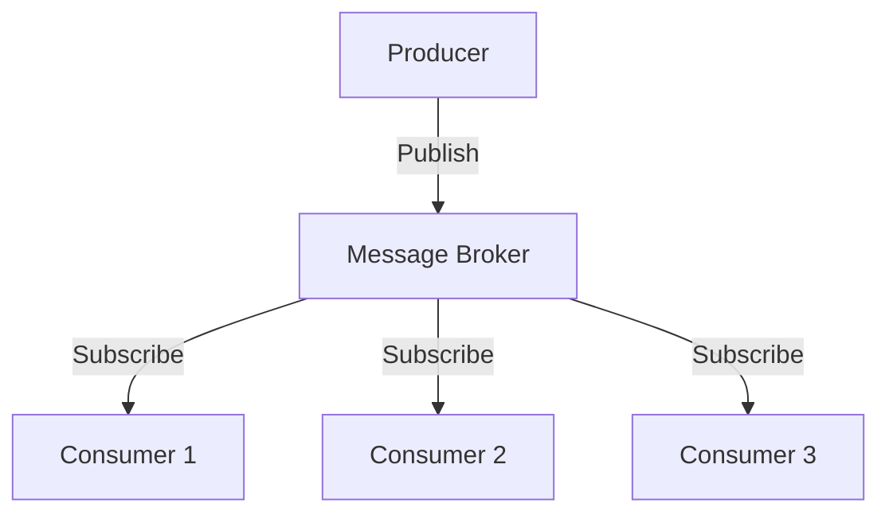

## 6.1.1 Importance of Messaging Patterns in Event-Driven Architecture

In the realm of Event-Driven Architecture (EDA), messaging patterns are the backbone that facilitates seamless communication between decoupled components. These patterns are not just about sending and receiving messages; they are about ensuring that the entire system operates efficiently, reliably, and is capable of scaling to meet growing demands. This section delves into the importance of messaging patterns in EDA, highlighting their role in communication, scalability, flexibility, reliability, and more.

### Facilitating Communication

Messaging patterns are essential for enabling reliable and efficient communication between decoupled components in an EDA. By using a common messaging infrastructure, such as message brokers, components can communicate without needing to know the details of each other's implementation. This decoupling is crucial for maintaining a clean architecture where components can be developed, deployed, and scaled independently.

**Example: Publish-Subscribe Pattern**

In a publish-subscribe pattern, producers (publishers) send messages to a topic, and consumers (subscribers) receive messages from that topic. This pattern allows multiple consumers to receive the same message, facilitating broad communication across the system.

```java
import org.apache.kafka.clients.producer.KafkaProducer;
import org.apache.kafka.clients.producer.ProducerRecord;
import java.util.Properties;

public class Publisher {
    public static void main(String[] args) {
        Properties props = new Properties();
        props.put("bootstrap.servers", "localhost:9092");
        props.put("key.serializer", "org.apache.kafka.common.serialization.StringSerializer");
        props.put("value.serializer", "org.apache.kafka.common.serialization.StringSerializer");

        KafkaProducer<String, String> producer = new KafkaProducer<>(props);
        producer.send(new ProducerRecord<>("my-topic", "key", "Hello, World!"));
        producer.close();
    }
}
```

### Supporting Scalability

Messaging patterns inherently support the horizontal scaling of services. By allowing multiple producers and consumers to interact seamlessly, these patterns enable systems to handle increased loads by simply adding more instances of producers or consumers.

**Example: Load Balancing with Message Queues**

Message queues can distribute messages across multiple consumers, balancing the load and ensuring that no single consumer is overwhelmed. This approach is particularly useful in scenarios where the system needs to process a high volume of messages.

```java
import org.apache.kafka.clients.consumer.KafkaConsumer;
import org.apache.kafka.clients.consumer.ConsumerRecords;
import org.apache.kafka.clients.consumer.ConsumerRecord;
import java.util.Properties;

public class Consumer {
    public static void main(String[] args) {
        Properties props = new Properties();
        props.put("bootstrap.servers", "localhost:9092");
        props.put("group.id", "test-group");
        props.put("key.deserializer", "org.apache.kafka.common.serialization.StringDeserializer");
        props.put("value.deserializer", "org.apache.kafka.common.serialization.StringDeserializer");

        KafkaConsumer<String, String> consumer = new KafkaConsumer<>(props);
        consumer.subscribe(List.of("my-topic"));

        while (true) {
            ConsumerRecords<String, String> records = consumer.poll(Duration.ofMillis(100));
            for (ConsumerRecord<String, String> record : records) {
                System.out.printf("Consumed message: %s%n", record.value());
            }
        }
    }
}
```

### Enhancing Flexibility

Messaging patterns provide the flexibility needed to adapt to changing business requirements and integrate new services. By decoupling the communication between components, these patterns allow new services to be added or existing ones to be modified without impacting the entire system.

**Example: Event-Driven Microservices**

In a microservices architecture, services can be added or removed as needed. Messaging patterns enable this flexibility by ensuring that services communicate through well-defined messages rather than direct calls.

### Ensuring Reliability

Reliability is a cornerstone of any robust system, and messaging patterns contribute significantly by providing mechanisms for message delivery guarantees and fault tolerance. These patterns ensure that messages are delivered even in the face of network failures or system crashes.

**Example: Guaranteed Delivery with Message Brokers**

Message brokers like Apache Kafka provide features such as message persistence and replication, ensuring that messages are not lost and can be recovered in case of failures.

### Promoting Loose Coupling

Loose coupling is a fundamental principle in software architecture, allowing services to evolve independently without tight dependencies. Messaging patterns promote loose coupling by abstracting the communication between components, enabling each component to focus on its core functionality.

**Example: Decoupled Services with Asynchronous Messaging**

By using asynchronous messaging, services can send and receive messages without waiting for a response, allowing them to continue processing other tasks and reducing dependencies.

### Enabling Asynchronous Processing

Asynchronous processing is vital for improving system responsiveness and throughput. Messaging patterns facilitate this by allowing components to process messages at their own pace, without blocking other operations.

**Example: Asynchronous Event Handling**

In an event-driven system, events can be processed asynchronously, enabling the system to handle a large number of events efficiently.

### Managing Complexity

Structured messaging patterns help manage the complexity of interactions in large-scale distributed systems. By providing a clear framework for communication, these patterns simplify the design and implementation of complex systems.

**Example: Complex Event Processing**

In systems that require complex event processing, such as financial trading platforms, messaging patterns provide the necessary structure to handle and process events in real-time.

### Providing Real-World Relevance

Messaging patterns have been successfully implemented in various real-world applications, significantly improving system performance and reliability. For instance, e-commerce platforms use messaging patterns to handle order processing and inventory management efficiently.

**Real-World Example: E-Commerce Order Processing**

In an e-commerce platform, when a customer places an order, an event is generated and published to a message broker. Various services, such as payment processing, inventory management, and shipping, subscribe to this event and perform their respective tasks asynchronously.

### Diagrams and Visuals

To better understand the flow of messages in an event-driven architecture, consider the following diagram illustrating a publish-subscribe pattern:



In this diagram, a producer publishes messages to a message broker, which then distributes the messages to multiple consumers. This setup exemplifies how messaging patterns facilitate communication and scalability in EDA.

### Conclusion

Messaging patterns are indispensable in event-driven architectures, providing the foundation for reliable, scalable, and flexible systems. By facilitating communication, supporting scalability, enhancing flexibility, ensuring reliability, promoting loose coupling, enabling asynchronous processing, and managing complexity, these patterns empower developers to build robust and efficient systems. As you continue to explore EDA, consider how these patterns can be applied to your projects to achieve the desired architectural goals.

## Quiz Time!



### What is the primary role of messaging patterns in EDA?

- [x] Facilitating communication between decoupled components
- [ ] Ensuring components are tightly coupled
- [ ] Reducing system performance
- [ ] Increasing system complexity

> **Explanation:** Messaging patterns facilitate communication between decoupled components, allowing them to interact without direct dependencies.

### How do messaging patterns support scalability in EDA?

- [x] By allowing multiple producers and consumers to interact seamlessly
- [ ] By limiting the number of consumers
- [ ] By reducing the number of producers
- [ ] By enforcing synchronous communication

> **Explanation:** Messaging patterns support scalability by enabling multiple producers and consumers to interact seamlessly, allowing the system to handle increased loads.

### What is a key benefit of using the publish-subscribe pattern?

- [x] It allows multiple consumers to receive the same message
- [ ] It restricts message delivery to a single consumer
- [ ] It requires synchronous communication
- [ ] It increases coupling between components

> **Explanation:** The publish-subscribe pattern allows multiple consumers to receive the same message, facilitating broad communication across the system.

### How do messaging patterns enhance flexibility in EDA?

- [x] By allowing new services to be added without impacting the entire system
- [ ] By enforcing rigid communication protocols
- [ ] By limiting system adaptability
- [ ] By increasing dependency between services

> **Explanation:** Messaging patterns enhance flexibility by allowing new services to be added or existing ones to be modified without impacting the entire system.

### What mechanism do messaging patterns provide to ensure reliability?

- [x] Message delivery guarantees and fault tolerance
- [ ] Synchronous communication
- [ ] Direct service calls
- [ ] Increased system complexity

> **Explanation:** Messaging patterns provide mechanisms for message delivery guarantees and fault tolerance, ensuring reliability even in the face of failures.

### How do messaging patterns promote loose coupling?

- [x] By abstracting communication between components
- [ ] By enforcing direct dependencies
- [ ] By requiring synchronous communication
- [ ] By increasing service interdependencies

> **Explanation:** Messaging patterns promote loose coupling by abstracting the communication between components, allowing them to evolve independently.

### What is the benefit of asynchronous processing in EDA?

- [x] Improved system responsiveness and throughput
- [ ] Increased system latency
- [ ] Reduced system performance
- [ ] Synchronous message handling

> **Explanation:** Asynchronous processing improves system responsiveness and throughput by allowing components to process messages at their own pace.

### How do messaging patterns help manage complexity in distributed systems?

- [x] By providing a clear framework for communication
- [ ] By increasing system complexity
- [ ] By enforcing direct service calls
- [ ] By limiting system scalability

> **Explanation:** Messaging patterns help manage complexity by providing a clear framework for communication, simplifying the design and implementation of complex systems.

### What is a real-world application of messaging patterns?

- [x] E-commerce order processing
- [ ] Direct database access
- [ ] Monolithic application design
- [ ] Synchronous service calls

> **Explanation:** Messaging patterns are used in e-commerce order processing to handle tasks like payment processing and inventory management efficiently.

### True or False: Messaging patterns are only useful for small-scale systems.

- [ ] True
- [x] False

> **Explanation:** Messaging patterns are crucial for both small-scale and large-scale systems, providing scalability, flexibility, and reliability.


