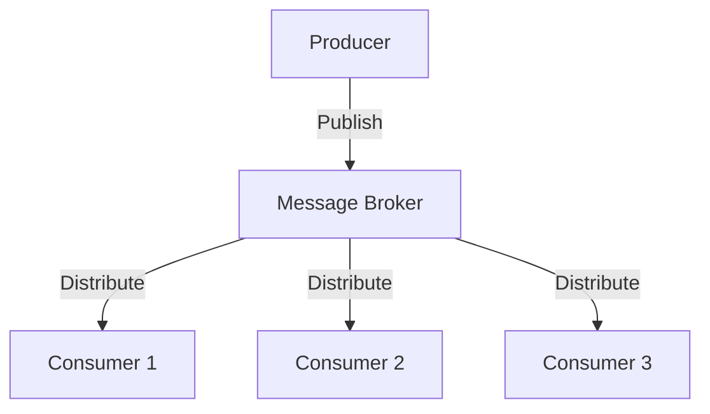

## 6.1.3 Selecting Appropriate Messaging Patterns

Selecting the right messaging pattern is crucial for the success of an event-driven architecture (EDA). The choice impacts scalability, reliability, latency, and overall system performance. This section provides a comprehensive guide to help you evaluate and select the most suitable messaging pattern for your application.

### Assess Use Case Requirements

The first step in selecting a messaging pattern is to thoroughly understand the specific requirements of your application. Consider the following aspects:

- **Scalability:** Determine if your application needs to handle a large number of messages or users. If scalability is a priority, patterns like Publish-Subscribe (Pub/Sub) or Competing Consumers can distribute the load across multiple consumers.
- **Reliability:** Assess the importance of message delivery guarantees. For applications where message loss is unacceptable, patterns that support acknowledgments and retries are essential.
- **Communication Style:** Decide whether your application requires synchronous or asynchronous communication. Synchronous patterns like Request-Reply are suitable for real-time interactions, while asynchronous patterns are better for decoupled systems.

### Consider Message Volume

The expected volume of messages significantly influences the choice of messaging pattern:

- **High-Volume Systems:** For systems that process a large number of messages, patterns like Pub/Sub and Competing Consumers are ideal. They allow multiple consumers to process messages concurrently, improving throughput and reducing bottlenecks.
- **Low-Volume Systems:** In scenarios where message volume is low, simpler patterns like Point-to-Point (P2P) might suffice, as they involve direct communication between a producer and a single consumer.

### Evaluate Latency Sensitivity

Latency sensitivity is another critical factor:

- **Latency-Sensitive Applications:** Applications that require immediate responses, such as online gaming or financial trading platforms, benefit from synchronous patterns like Request-Reply. These patterns ensure timely communication between components.
- **Latency-Tolerant Systems:** For applications where latency is less critical, asynchronous patterns like Pub/Sub or Event Notification can be used. These patterns allow for more flexible message processing without blocking the sender.

### Determine Consumer Count

The number of consumers that need to process messages also affects pattern selection:

- **Multiple Consumers:** If your system has multiple consumers that need to process the same message, Pub/Sub is a suitable choice. It allows messages to be broadcast to all interested subscribers.
- **Single Consumer:** For scenarios where only one consumer should process a message, P2P is appropriate. It ensures that each message is delivered to a single, designated consumer.

### Analyze Fault Tolerance Needs

Fault tolerance is essential for maintaining system reliability:

- **Built-in Fault Tolerance:** Choose patterns that offer built-in fault tolerance mechanisms. For example, Dead Letter Queues (DLQs) can handle failed messages, ensuring that they are not lost and can be reprocessed later.
- **Error Handling:** Consider patterns that support error handling and retries, allowing the system to recover from transient failures without manual intervention.

### Integration with Existing Systems

Your existing infrastructure and technology stack can influence the choice of messaging patterns:

- **Compatibility:** Ensure that the chosen pattern is compatible with your current systems and technologies. For instance, if you're using Apache Kafka, leveraging its native Pub/Sub capabilities might be beneficial.
- **Ease of Integration:** Consider how easily the pattern can be integrated into your existing architecture. Patterns that align with your current tools and frameworks will reduce implementation complexity.

### Scalability Requirements

Scalability is a key consideration for growing applications:

- **Inherent Scalability:** Select patterns that inherently support scalability. Pub/Sub and Competing Consumers are designed to scale horizontally, allowing you to add more consumers as needed.
- **Future Growth:** Plan for future growth by choosing patterns that can accommodate increasing message volumes and consumer counts without significant rearchitecture.

### Cost and Complexity Trade-offs

Finally, balance the benefits of advanced messaging patterns against their complexity and cost:

- **Implementation Complexity:** Advanced patterns often come with increased complexity. Evaluate whether the benefits justify the additional effort required for implementation and maintenance.
- **Cost Considerations:** Consider the cost implications of the chosen pattern, including infrastructure, development, and operational costs. Ensure that the pattern aligns with your budget and system architecture goals.

### Practical Java Code Example

Let's explore a simple Java example using Spring Boot and Apache Kafka to implement a Pub/Sub pattern. This example demonstrates how to publish and consume messages in a scalable and reliable manner.

```java
// Producer Configuration
@Configuration
public class KafkaProducerConfig {

    @Value("${kafka.bootstrap-servers}")
    private String bootstrapServers;

    @Bean
    public ProducerFactory<String, String> producerFactory() {
        Map<String, Object> configProps = new HashMap<>();
        configProps.put(ProducerConfig.BOOTSTRAP_SERVERS_CONFIG, bootstrapServers);
        configProps.put(ProducerConfig.KEY_SERIALIZER_CLASS_CONFIG, StringSerializer.class);
        configProps.put(ProducerConfig.VALUE_SERIALIZER_CLASS_CONFIG, StringSerializer.class);
        return new DefaultKafkaProducerFactory<>(configProps);
    }

    @Bean
    public KafkaTemplate<String, String> kafkaTemplate() {
        return new KafkaTemplate<>(producerFactory());
    }
}

// Consumer Configuration
@Configuration
@EnableKafka
public class KafkaConsumerConfig {

    @Value("${kafka.bootstrap-servers}")
    private String bootstrapServers;

    @Bean
    public ConsumerFactory<String, String> consumerFactory() {
        Map<String, Object> props = new HashMap<>();
        props.put(ConsumerConfig.BOOTSTRAP_SERVERS_CONFIG, bootstrapServers);
        props.put(ConsumerConfig.GROUP_ID_CONFIG, "group_id");
        props.put(ConsumerConfig.KEY_DESERIALIZER_CLASS_CONFIG, StringDeserializer.class);
        props.put(ConsumerConfig.VALUE_DESERIALIZER_CLASS_CONFIG, StringDeserializer.class);
        return new DefaultKafkaConsumerFactory<>(props);
    }

    @Bean
    public ConcurrentKafkaListenerContainerFactory<String, String> kafkaListenerContainerFactory() {
        ConcurrentKafkaListenerContainerFactory<String, String> factory = new ConcurrentKafkaListenerContainerFactory<>();
        factory.setConsumerFactory(consumerFactory());
        return factory;
    }
}

// Producer Service
@Service
public class ProducerService {

    private final KafkaTemplate<String, String> kafkaTemplate;

    @Autowired
    public ProducerService(KafkaTemplate<String, String> kafkaTemplate) {
        this.kafkaTemplate = kafkaTemplate;
    }

    public void sendMessage(String message) {
        kafkaTemplate.send("topic_name", message);
    }
}

// Consumer Service
@Service
public class ConsumerService {

    @KafkaListener(topics = "topic_name", groupId = "group_id")
    public void consume(String message) {
        System.out.println("Consumed message: " + message);
    }
}
```

### Diagram: Pub/Sub Architecture



### Conclusion

Selecting the appropriate messaging pattern is a critical decision in designing an event-driven architecture. By carefully assessing your application's requirements, message volume, latency sensitivity, consumer count, fault tolerance needs, and integration with existing systems, you can choose a pattern that aligns with your goals. Balancing scalability, cost, and complexity ensures that your messaging infrastructure supports your application's growth and performance.

## Quiz Time!



### Which messaging pattern is ideal for high-volume systems?

- [x] Publish-Subscribe
- [ ] Point-to-Point
- [ ] Request-Reply
- [ ] Synchronous Messaging

> **Explanation:** Publish-Subscribe allows multiple consumers to process messages concurrently, making it suitable for high-volume systems.

### What is a key benefit of using the Request-Reply pattern?

- [x] Low latency
- [ ] High throughput
- [ ] Scalability
- [ ] Fault tolerance

> **Explanation:** Request-Reply is a synchronous pattern that provides low latency, suitable for real-time interactions.

### Which pattern is best for systems with multiple consumers?

- [x] Publish-Subscribe
- [ ] Point-to-Point
- [ ] Request-Reply
- [ ] Asynchronous Messaging

> **Explanation:** Publish-Subscribe allows messages to be broadcast to all interested subscribers, making it ideal for multiple consumers.

### What is a common feature of patterns that offer built-in fault tolerance?

- [x] Dead Letter Queues
- [ ] High latency
- [ ] Low throughput
- [ ] Synchronous communication

> **Explanation:** Dead Letter Queues handle failed messages, providing built-in fault tolerance.

### Which factor is crucial when integrating messaging patterns with existing systems?

- [x] Compatibility
- [ ] Latency
- [ ] Message volume
- [ ] Consumer count

> **Explanation:** Compatibility ensures that the chosen pattern aligns with current systems and technologies.

### What is a primary consideration for latency-sensitive applications?

- [x] Synchronous communication
- [ ] Asynchronous communication
- [ ] High throughput
- [ ] Fault tolerance

> **Explanation:** Synchronous communication ensures timely interactions, crucial for latency-sensitive applications.

### Which pattern inherently supports scalability?

- [x] Competing Consumers
- [ ] Point-to-Point
- [ ] Request-Reply
- [ ] Synchronous Messaging

> **Explanation:** Competing Consumers allow multiple consumers to process messages, supporting scalability.

### What is a potential trade-off when choosing advanced messaging patterns?

- [x] Increased complexity
- [ ] Reduced reliability
- [ ] Lower latency
- [ ] Decreased scalability

> **Explanation:** Advanced patterns often come with increased complexity, requiring careful consideration.

### Why is message volume important in pattern selection?

- [x] It influences throughput and performance.
- [ ] It affects fault tolerance.
- [ ] It determines consumer count.
- [ ] It impacts latency.

> **Explanation:** Message volume affects throughput and performance, guiding pattern selection.

### True or False: Point-to-Point is suitable for multiple consumers.

- [ ] True
- [x] False

> **Explanation:** Point-to-Point is designed for single consumer scenarios, not multiple consumers.


