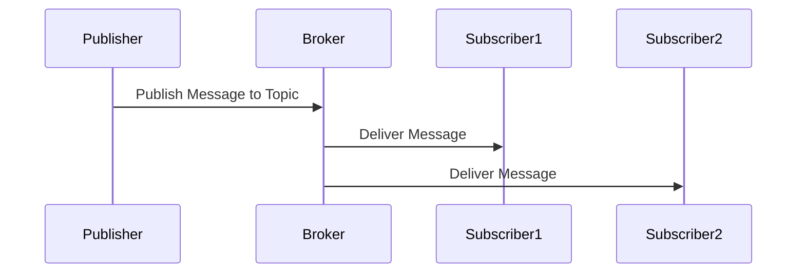

## 6.2.1 Mechanism and Workflow

The Publish-Subscribe (Pub/Sub) pattern is a fundamental messaging pattern in Event-Driven Architecture (EDA) that facilitates communication between different components of a system. It enables the decoupling of message producers (publishers) from message consumers (subscribers), allowing for scalable and flexible system designs. In this section, we will delve into the mechanism and workflow of the Pub/Sub pattern, exploring its components, message flow, subscription management, filtering, routing, scalability, and reliability.

### Defining the Pub/Sub Pattern

The Publish-Subscribe pattern is a messaging paradigm where publishers emit messages to a topic, and subscribers receive messages by expressing interest in one or more topics. This pattern is widely used in distributed systems to enable asynchronous communication and decouple the components that produce messages from those that consume them.

### Components Involved

The Pub/Sub pattern involves several key components:

- **Publishers:** These are the entities that produce and send messages to a topic. Publishers are unaware of the subscribers and do not need to manage the delivery of messages to them.

- **Topics:** A topic is a logical channel to which messages are published. Topics act as a conduit for messages and are used to categorize and organize messages based on their content or purpose.

- **Subscribers:** These are the entities that express interest in receiving messages from specific topics. Subscribers register with the message broker to receive messages from the topics they are interested in.

- **Message Broker:** The message broker is a central component that manages the distribution of messages from publishers to subscribers. It handles the routing, filtering, and delivery of messages, ensuring that subscribers receive the messages they are interested in.

### Message Flow

The flow of messages in a Pub/Sub system is as follows:

1. **Publishing:** A publisher sends a message to a specific topic on the message broker. The publisher does not need to know about the subscribers or manage the delivery of the message.

2. **Broker Processing:** The message broker receives the message and determines which subscribers are interested in the topic. It may apply filtering and routing logic to ensure that only relevant subscribers receive the message.

3. **Delivery:** The message broker delivers the message to all subscribers that have registered interest in the topic. Each subscriber receives a copy of the message independently.

This flow illustrates the decoupling of producers and consumers, as publishers and subscribers do not need to be aware of each other's existence.

### Subscription Management

Subscription management is a critical aspect of the Pub/Sub pattern. Subscribers register their interest in specific topics by subscribing to them. This registration process involves:

- **Expressing Interest:** Subscribers indicate which topics they are interested in by subscribing to them. This can be done programmatically or through configuration.

- **Receiving Messages:** Once subscribed, subscribers automatically receive messages published to the topics they are interested in. The message broker handles the delivery of messages to the appropriate subscribers.

- **Managing Subscriptions:** Subscribers can manage their subscriptions by adding or removing topics they are interested in. This flexibility allows subscribers to dynamically adjust their interests based on changing requirements.

### Filtering and Routing

Message brokers often provide filtering and routing capabilities to ensure that messages are delivered to the appropriate subscribers. These capabilities include:

- **Content-Based Filtering:** The broker can filter messages based on their content, ensuring that only relevant messages are delivered to subscribers. This is useful in scenarios where subscribers are interested in specific types of messages within a topic.

- **Routing Logic:** The broker can implement routing logic to direct messages to specific subscribers based on predefined criteria. This allows for more sophisticated message delivery strategies, such as load balancing or priority-based delivery.

### Scalability Features

The Pub/Sub pattern is inherently scalable, allowing systems to grow by adding more publishers or subscribers without affecting existing components. Scalability features include:

- **Horizontal Scaling:** The system can scale horizontally by adding more instances of publishers or subscribers. This allows the system to handle increased load and accommodate more users or devices.

- **Load Balancing:** The message broker can distribute messages across multiple subscribers to balance the load and ensure efficient resource utilization.

- **Elasticity:** The system can dynamically adjust the number of publishers or subscribers based on demand, providing elasticity and cost efficiency.

### Reliability Mechanisms

Ensuring reliable message delivery is crucial in Pub/Sub systems. Common reliability mechanisms include:

- **Message Persistence:** The broker can persist messages to ensure they are not lost in case of failures. This is particularly important for critical messages that must be delivered reliably.

- **Acknowledgments:** Subscribers can acknowledge the receipt of messages, allowing the broker to track delivery and retry if necessary.

- **Durable Subscriptions:** Subscribers can create durable subscriptions, ensuring they receive all messages published to a topic, even if they are temporarily disconnected.

### Example Workflow

Let's consider a typical Pub/Sub workflow in a news distribution system:

1. **News Agency (Publisher):** A news agency publishes breaking news alerts to a "Breaking News" topic on the message broker.

2. **News Channels (Subscribers):** Multiple news channels subscribe to the "Breaking News" topic to receive alerts. Each channel may have different criteria for filtering the news they broadcast.

3. **Message Broker:** The broker receives the alerts from the news agency and routes them to the subscribed news channels. It applies any necessary filtering based on the channels' criteria.

4. **Delivery:** Each news channel receives the alerts and broadcasts them to their audience, ensuring timely and relevant news delivery.

### Practical Java Code Example

Let's explore a practical Java code example using Apache Kafka, a popular message broker, to implement a simple Pub/Sub system.

```java
import org.apache.kafka.clients.producer.KafkaProducer;
import org.apache.kafka.clients.producer.ProducerRecord;
import org.apache.kafka.clients.consumer.KafkaConsumer;
import org.apache.kafka.clients.consumer.ConsumerRecords;
import org.apache.kafka.clients.consumer.ConsumerConfig;
import org.apache.kafka.clients.consumer.ConsumerRecord;

import java.util.Properties;
import java.util.Collections;

public class PubSubExample {

    public static void main(String[] args) {
        // Publisher
        Thread publisherThread = new Thread(() -> {
            Properties producerProps = new Properties();
            producerProps.put("bootstrap.servers", "localhost:9092");
            producerProps.put("key.serializer", "org.apache.kafka.common.serialization.StringSerializer");
            producerProps.put("value.serializer", "org.apache.kafka.common.serialization.StringSerializer");

            KafkaProducer<String, String> producer = new KafkaProducer<>(producerProps);
            String topic = "breaking-news";

            for (int i = 0; i < 10; i++) {
                String message = "Breaking News Alert " + i;
                producer.send(new ProducerRecord<>(topic, Integer.toString(i), message));
                System.out.println("Published: " + message);
            }

            producer.close();
        });

        // Subscriber
        Thread subscriberThread = new Thread(() -> {
            Properties consumerProps = new Properties();
            consumerProps.put("bootstrap.servers", "localhost:9092");
            consumerProps.put("group.id", "news-channel");
            consumerProps.put("key.deserializer", "org.apache.kafka.common.serialization.StringDeserializer");
            consumerProps.put("value.deserializer", "org.apache.kafka.common.serialization.StringDeserializer");
            consumerProps.put(ConsumerConfig.AUTO_OFFSET_RESET_CONFIG, "earliest");

            KafkaConsumer<String, String> consumer = new KafkaConsumer<>(consumerProps);
            consumer.subscribe(Collections.singletonList("breaking-news"));

            while (true) {
                ConsumerRecords<String, String> records = consumer.poll(100);
                for (ConsumerRecord<String, String> record : records) {
                    System.out.println("Received: " + record.value());
                }
            }
        });

        publisherThread.start();
        subscriberThread.start();
    }
}
```

**Explanation:**

- **Publisher:** The publisher thread creates a Kafka producer and sends messages to the "breaking-news" topic. Each message is a simple string representing a news alert.

- **Subscriber:** The subscriber thread creates a Kafka consumer, subscribes to the "breaking-news" topic, and continuously polls for new messages. When a message is received, it is printed to the console.

- **Broker Configuration:** The Kafka broker is assumed to be running locally on `localhost:9092`. Ensure Kafka is set up and running before executing the code.

### Diagram: Pub/Sub Workflow



### Best Practices and Common Pitfalls

- **Best Practices:**
  - Use durable subscriptions for critical messages to ensure reliable delivery.
  - Implement content-based filtering to reduce unnecessary message traffic.
  - Monitor and scale the broker to handle increased load efficiently.

- **Common Pitfalls:**
  - Overloading the broker with too many messages can lead to performance issues.
  - Failing to manage subscriptions can result in missed messages or unnecessary processing.
  - Ignoring message persistence can lead to data loss in case of failures.

### References and Further Reading

- [Apache Kafka Documentation](https://kafka.apache.org/documentation/)
- [Event-Driven Architecture: How to Build Event-Driven Microservices](https://www.oreilly.com/library/view/event-driven-architecture-how/9781492057891/)
- [Designing Data-Intensive Applications by Martin Kleppmann](https://dataintensive.net/)

## Quiz Time!



### What is the primary purpose of the Publish-Subscribe pattern?

- [x] To decouple message producers from consumers
- [ ] To ensure synchronous communication
- [ ] To directly connect producers to consumers
- [ ] To store messages permanently

> **Explanation:** The Publish-Subscribe pattern is designed to decouple message producers from consumers, allowing for asynchronous communication and scalability.

### Which component in the Pub/Sub pattern is responsible for managing message distribution?

- [ ] Publisher
- [ ] Subscriber
- [x] Message Broker
- [ ] Topic

> **Explanation:** The message broker is responsible for managing the distribution of messages from publishers to subscribers.

### How do subscribers express interest in receiving messages in a Pub/Sub system?

- [ ] By directly contacting publishers
- [x] By subscribing to specific topics
- [ ] By sending acknowledgments
- [ ] By filtering messages manually

> **Explanation:** Subscribers express interest in receiving messages by subscribing to specific topics on the message broker.

### What is a key benefit of the Pub/Sub pattern in terms of scalability?

- [ ] It requires fewer resources
- [x] It allows horizontal scaling by adding more publishers or subscribers
- [ ] It reduces the need for message brokers
- [ ] It simplifies message filtering

> **Explanation:** The Pub/Sub pattern allows horizontal scaling by adding more publishers or subscribers without affecting existing components.

### Which mechanism ensures reliable message delivery in Pub/Sub systems?

- [ ] Message filtering
- [ ] Direct connections
- [x] Message persistence and acknowledgments
- [ ] Manual message routing

> **Explanation:** Reliable message delivery is ensured through mechanisms like message persistence and acknowledgments.

### In a Pub/Sub system, what is the role of a topic?

- [ ] To store messages permanently
- [x] To act as a logical channel for message categorization
- [ ] To directly connect publishers and subscribers
- [ ] To manage message acknowledgments

> **Explanation:** A topic acts as a logical channel to categorize and organize messages based on their content or purpose.

### What is a common pitfall when implementing the Pub/Sub pattern?

- [ ] Using too many topics
- [ ] Implementing content-based filtering
- [x] Overloading the broker with too many messages
- [ ] Using durable subscriptions

> **Explanation:** Overloading the broker with too many messages can lead to performance issues and is a common pitfall.

### How can message brokers filter messages in a Pub/Sub system?

- [ ] By using direct connections
- [ ] By storing messages permanently
- [x] By applying content-based filtering
- [ ] By reducing the number of topics

> **Explanation:** Message brokers can apply content-based filtering to ensure that only relevant messages are delivered to subscribers.

### What is a durable subscription in a Pub/Sub system?

- [ ] A temporary subscription
- [ ] A subscription that requires manual renewal
- [x] A subscription that ensures message delivery even if the subscriber is temporarily disconnected
- [ ] A subscription that filters messages manually

> **Explanation:** A durable subscription ensures that subscribers receive all messages published to a topic, even if they are temporarily disconnected.

### True or False: In the Pub/Sub pattern, publishers need to know about the subscribers.

- [ ] True
- [x] False

> **Explanation:** In the Pub/Sub pattern, publishers do not need to know about the subscribers, as the message broker handles the delivery of messages.


