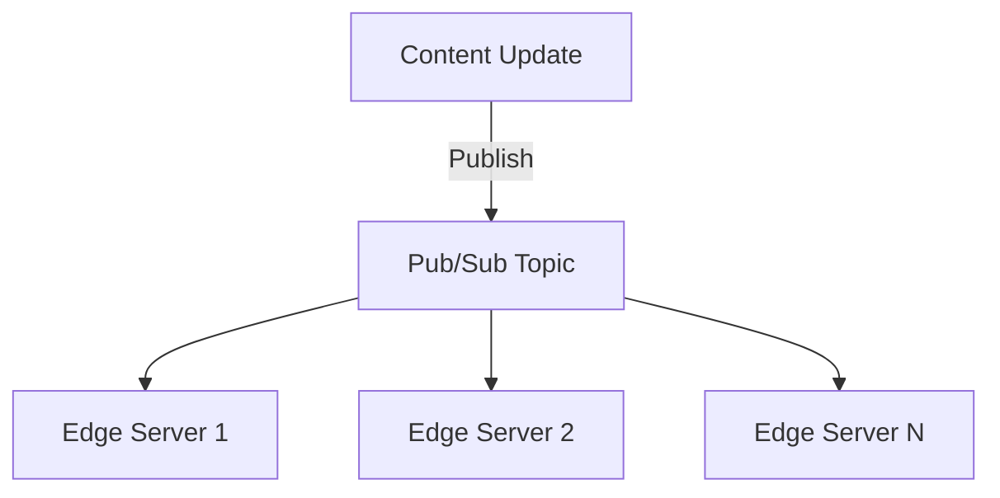
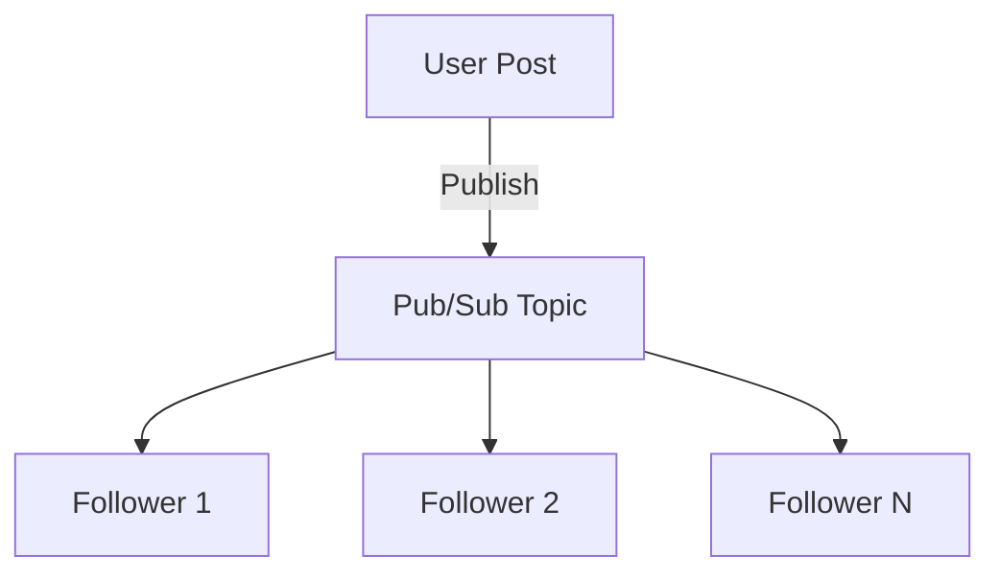

## 6.2.2 Use Cases and Examples

The Publish-Subscribe (Pub/Sub) pattern is a cornerstone of event-driven architecture, enabling systems to efficiently handle real-time data and communication across distributed components. This section explores various real-world use cases and examples where the Pub/Sub pattern is effectively applied, demonstrating its versatility and power in modern software systems.

### Real-Time Notifications

Real-time notifications are crucial in many applications, such as stock price alerts and sports score updates. The Pub/Sub pattern facilitates these notifications by allowing publishers to broadcast events to multiple subscribers without knowing their identities or locations.

#### Stock Price Alerts

In financial applications, real-time stock price alerts are vital for traders and investors. A Pub/Sub system can be used where stock price updates are published to a topic, and subscribers, such as trading platforms or mobile apps, receive these updates instantly.

```java
import org.apache.kafka.clients.producer.KafkaProducer;
import org.apache.kafka.clients.producer.ProducerRecord;
import java.util.Properties;

public class StockPricePublisher {
    public static void main(String[] args) {
        Properties props = new Properties();
        props.put("bootstrap.servers", "localhost:9092");
        props.put("key.serializer", "org.apache.kafka.common.serialization.StringSerializer");
        props.put("value.serializer", "org.apache.kafka.common.serialization.StringSerializer");

        KafkaProducer<String, String> producer = new KafkaProducer<>(props);
        String topic = "stock-prices";

        // Simulate stock price updates
        producer.send(new ProducerRecord<>(topic, "AAPL", "150.00"));
        producer.send(new ProducerRecord<>(topic, "GOOGL", "2800.00"));

        producer.close();
    }
}
```

In this example, a Kafka producer publishes stock price updates to a `stock-prices` topic. Subscribers can listen to this topic and receive updates in real-time.

### Event Broadcasting

Event broadcasting is another common use case for the Pub/Sub pattern, where events such as system logs or monitoring data are sent to multiple services or dashboards simultaneously.

#### System Logs Broadcasting

In a distributed system, centralizing logs from various services can be challenging. Using Pub/Sub, each service can publish logs to a common topic, and multiple subscribers, such as log analysis tools or alerting systems, can process these logs concurrently.

```java
import org.apache.kafka.clients.consumer.ConsumerRecord;
import org.apache.kafka.clients.consumer.ConsumerRecords;
import org.apache.kafka.clients.consumer.KafkaConsumer;
import java.util.Collections;
import java.util.Properties;

public class LogSubscriber {
    public static void main(String[] args) {
        Properties props = new Properties();
        props.put("bootstrap.servers", "localhost:9092");
        props.put("group.id", "log-subscribers");
        props.put("key.deserializer", "org.apache.kafka.common.serialization.StringDeserializer");
        props.put("value.deserializer", "org.apache.kafka.common.serialization.StringDeserializer");

        KafkaConsumer<String, String> consumer = new KafkaConsumer<>(props);
        consumer.subscribe(Collections.singletonList("system-logs"));

        while (true) {
            ConsumerRecords<String, String> records = consumer.poll(100);
            for (ConsumerRecord<String, String> record : records) {
                System.out.printf("Received log: %s%n", record.value());
            }
        }
    }
}
```

This Kafka consumer subscribes to the `system-logs` topic, receiving log messages published by various services.

### Content Distribution Networks (CDNs)

CDNs use the Pub/Sub pattern to efficiently distribute content updates to multiple edge servers. When content is updated, a message is published to a topic, and all edge servers subscribed to this topic receive the update, ensuring content consistency across the network.

#### Diagram: CDN Content Update Flow



In this diagram, a content update is published to a Pub/Sub topic, and multiple edge servers subscribe to this topic to receive updates.

### Microservices Communication

Microservices architectures benefit greatly from the Pub/Sub pattern, which enables services to remain decoupled while still exchanging necessary information.

#### Order Processing System

Consider an e-commerce platform where different microservices handle order processing, inventory management, and notification services. When an order is placed, an event is published to a topic, and relevant services subscribe to this topic to perform their respective tasks.

```java
// OrderService.java
public class OrderService {
    public void placeOrder(Order order) {
        // Publish order placed event
        producer.send(new ProducerRecord<>("order-events", "order-placed", order.toString()));
    }
}

// InventoryService.java
public class InventoryService {
    public void onOrderPlaced(String orderDetails) {
        // Update inventory based on order details
    }
}

// NotificationService.java
public class NotificationService {
    public void onOrderPlaced(String orderDetails) {
        // Send notification to customer
    }
}
```

In this example, the `OrderService` publishes an `order-placed` event, and both `InventoryService` and `NotificationService` subscribe to handle the event accordingly.

### IoT Data Streams

IoT devices generate vast amounts of data that need to be processed in real-time. The Pub/Sub pattern allows IoT devices to publish sensor data to topics, enabling multiple consumers like analytics engines and monitoring dashboards to subscribe and process the data.

#### Smart Home Sensors

In a smart home setup, various sensors (temperature, humidity, motion) publish data to specific topics. Applications like home automation systems and monitoring dashboards subscribe to these topics to react to changes.

```java
// TemperatureSensor.java
public class TemperatureSensor {
    public void publishTemperature(double temperature) {
        producer.send(new ProducerRecord<>("temperature-data", "sensor1", String.valueOf(temperature)));
    }
}

// TemperatureDashboard.java
public class TemperatureDashboard {
    public void onTemperatureUpdate(String sensorId, String temperature) {
        // Update dashboard with new temperature reading
    }
}
```

Here, a temperature sensor publishes data to a `temperature-data` topic, and a dashboard subscribes to display the latest readings.

### Social Media Feeds

Social media platforms use the Pub/Sub pattern to distribute posts, comments, and likes to a large number of users in real-time. When a user posts an update, it is published to a topic, and all followers subscribed to this topic receive the update instantly.

#### Diagram: Social Media Post Distribution



This diagram illustrates how a user's post is published to a topic, and all followers subscribed to this topic receive the update.

### Gaming Events

Online gaming platforms utilize the Pub/Sub pattern to broadcast game state updates and events to players in real-time. This ensures that all players have a consistent view of the game world.

#### Multiplayer Game State Updates

In a multiplayer game, when a player performs an action, an event is published to a topic, and all other players subscribed to this topic receive the update, ensuring synchronized gameplay.

```java
// GameServer.java
public class GameServer {
    public void broadcastPlayerAction(PlayerAction action) {
        producer.send(new ProducerRecord<>("game-events", "player-action", action.toString()));
    }
}

// GameClient.java
public class GameClient {
    public void onPlayerAction(String actionDetails) {
        // Update game state based on action
    }
}
```

In this example, the `GameServer` publishes player actions to a `game-events` topic, and `GameClient` instances subscribe to update their game state.

### Case Study: E-Commerce Platform

Let's explore a detailed case study of an e-commerce platform using the Pub/Sub pattern to manage order updates, inventory changes, and notification services.

#### Scenario

An e-commerce platform has multiple microservices handling different aspects of the business, such as order processing, inventory management, and customer notifications. The platform needs to ensure that when an order is placed, all relevant services are notified and can act accordingly.

#### Implementation

1. **Order Service**: Publishes an `order-placed` event to a topic.
2. **Inventory Service**: Subscribes to the `order-placed` topic to update inventory levels.
3. **Notification Service**: Subscribes to the same topic to send order confirmation emails to customers.

```java
// OrderService.java
public class OrderService {
    public void placeOrder(Order order) {
        // Publish order placed event
        producer.send(new ProducerRecord<>("order-events", "order-placed", order.toString()));
    }
}

// InventoryService.java
public class InventoryService {
    public void onOrderPlaced(String orderDetails) {
        // Update inventory based on order details
    }
}

// NotificationService.java
public class NotificationService {
    public void onOrderPlaced(String orderDetails) {
        // Send notification to customer
    }
}
```

#### Benefits

- **Scalability**: Each service can scale independently based on its workload.
- **Decoupling**: Services are loosely coupled, allowing for easier maintenance and updates.
- **Real-Time Processing**: Events are processed in real-time, ensuring timely updates and notifications.

### Conclusion

The Publish-Subscribe pattern is a powerful tool in the arsenal of event-driven architecture, enabling systems to handle real-time data and communication efficiently. By exploring these use cases and examples, we see how Pub/Sub can be applied across various domains, from financial applications to IoT and gaming, providing scalability, decoupling, and real-time responsiveness.

## Quiz Time!



### What is a key benefit of using the Publish-Subscribe pattern for real-time notifications?

- [x] It allows multiple subscribers to receive updates simultaneously.
- [ ] It requires a direct connection between publishers and subscribers.
- [ ] It limits the number of subscribers to a single topic.
- [ ] It only supports batch processing of events.

> **Explanation:** The Publish-Subscribe pattern enables multiple subscribers to receive updates simultaneously without requiring direct connections between publishers and subscribers.

### How do Content Distribution Networks (CDNs) use the Publish-Subscribe pattern?

- [x] To distribute content updates to multiple edge servers efficiently.
- [ ] To limit content distribution to a single server.
- [ ] To synchronize database transactions.
- [ ] To manage user authentication.

> **Explanation:** CDNs use the Publish-Subscribe pattern to distribute content updates to multiple edge servers, ensuring content consistency across the network.

### In a microservices architecture, what is a benefit of using the Publish-Subscribe pattern?

- [x] It allows services to remain decoupled while exchanging information.
- [ ] It requires all services to be tightly coupled.
- [ ] It mandates synchronous communication between services.
- [ ] It restricts communication to a single service.

> **Explanation:** The Publish-Subscribe pattern allows services to remain decoupled, enabling them to exchange information without being directly connected.

### How can IoT devices benefit from the Publish-Subscribe pattern?

- [x] By publishing sensor data to topics for multiple consumers to process.
- [ ] By requiring direct connections to each consumer.
- [ ] By limiting data distribution to a single consumer.
- [ ] By storing data in a centralized database.

> **Explanation:** IoT devices can publish sensor data to topics, allowing multiple consumers like analytics engines and monitoring dashboards to subscribe and process the data.

### What role does the Publish-Subscribe pattern play in social media platforms?

- [x] It distributes posts, comments, and likes to users in real-time.
- [ ] It restricts content distribution to a single user.
- [ ] It delays updates until all users are online.
- [ ] It requires users to manually refresh their feeds.

> **Explanation:** Social media platforms use the Publish-Subscribe pattern to distribute posts, comments, and likes to users in real-time, ensuring timely updates.

### In online gaming, how is the Publish-Subscribe pattern utilized?

- [x] To broadcast game state updates to players in real-time.
- [ ] To limit game updates to a single player.
- [ ] To synchronize game data with a central server.
- [ ] To delay updates until all players are online.

> **Explanation:** Online gaming platforms use the Publish-Subscribe pattern to broadcast game state updates to players in real-time, ensuring synchronized gameplay.

### What is a common use case for event broadcasting using the Publish-Subscribe pattern?

- [x] Broadcasting system logs to multiple services or dashboards.
- [ ] Limiting log distribution to a single service.
- [ ] Synchronizing database transactions.
- [ ] Managing user authentication.

> **Explanation:** Event broadcasting using the Publish-Subscribe pattern allows system logs to be sent to multiple services or dashboards simultaneously.

### How does the Publish-Subscribe pattern enhance scalability in an e-commerce platform?

- [x] By allowing services to scale independently based on workload.
- [ ] By requiring all services to scale together.
- [ ] By limiting the number of orders processed.
- [ ] By centralizing all processing in a single service.

> **Explanation:** The Publish-Subscribe pattern enhances scalability by allowing each service to scale independently based on its workload, improving system responsiveness.

### Which of the following is NOT a benefit of the Publish-Subscribe pattern?

- [ ] Scalability
- [ ] Decoupling
- [ ] Real-Time Processing
- [x] Direct Connections

> **Explanation:** The Publish-Subscribe pattern does not require direct connections between publishers and subscribers, which is one of its key benefits.

### True or False: The Publish-Subscribe pattern requires synchronous communication between publishers and subscribers.

- [ ] True
- [x] False

> **Explanation:** The Publish-Subscribe pattern supports asynchronous communication, allowing publishers and subscribers to operate independently.


