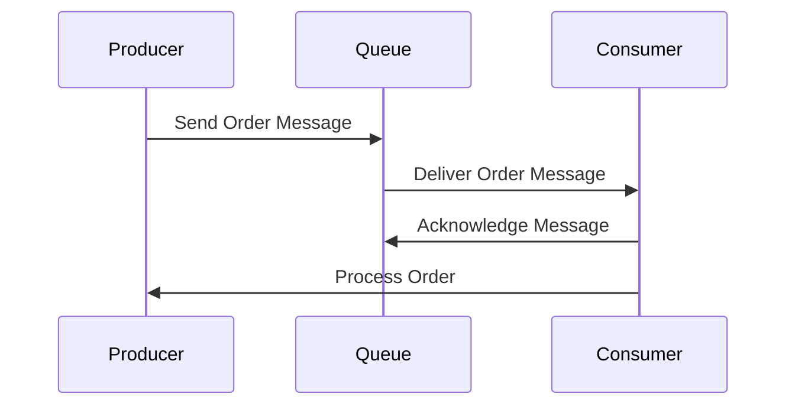

## 6.3.1 Queue-Based Communication

Queue-based communication is a fundamental concept in event-driven architectures, enabling asynchronous and decoupled interactions between different components of a system. This section delves into the mechanics of queue-based messaging, exploring its components, message lifecycle, types, and practical applications.

### Defining Queue-Based Messaging

Queue-based messaging involves the use of a queue as an intermediary between message producers and consumers. Producers send messages to a queue, where they are stored until a consumer retrieves and processes them. This pattern allows for asynchronous communication, meaning that producers and consumers do not need to interact with each other directly or at the same time.

### Components Involved

The primary components in queue-based communication are:

- **Producers (Senders):** These are the entities that generate and send messages to the queue. Producers can be any part of the system that needs to communicate information or requests to other components.

- **Queues:** These are the storage mechanisms that hold messages until they are consumed. Queues ensure that messages are delivered reliably and can handle varying loads by buffering messages.

- **Consumers (Receivers):** These are the entities that retrieve and process messages from the queue. Consumers can be multiple, allowing for parallel processing of messages.

### Message Lifecycle

The lifecycle of a message in a queue-based system involves several stages:

1. **Production:** A producer creates a message and sends it to the queue. This message contains the necessary data for the consumer to process.

2. **Queuing:** The message is stored in the queue. Queues can handle messages in various ways, depending on their configuration (e.g., FIFO, priority).

3. **Consumption:** A consumer retrieves the message from the queue and processes it. The consumer can acknowledge the message, indicating successful processing.

4. **Acknowledgment:** Once processed, the message is acknowledged, and it is removed from the queue. If the message cannot be processed, it may be retried or moved to a dead letter queue.

### Types of Queues

Different types of queues cater to various needs:

- **Standard Queues:** These allow for multiple deliveries of messages, meaning a message can be delivered more than once. They are suitable for scenarios where order is not critical.

- **FIFO Queues:** First-In-First-Out queues ensure that messages are processed in the exact order they are received. They guarantee single delivery, making them ideal for tasks where order is crucial.

### Load Balancing with Queues

Queues inherently provide load balancing by distributing messages among multiple consumers. This prevents any single consumer from being overwhelmed and allows the system to scale horizontally. As more consumers are added, they can pull messages from the queue, balancing the workload.

### Message Prioritization

In some systems, certain messages may need to be processed before others. Queue-based systems can implement message prioritization, where high-priority messages are moved to the front of the queue. This ensures that critical tasks are handled promptly.

### Dead Letter Queues (DLQ)

Dead Letter Queues are special queues used to handle messages that cannot be processed successfully after multiple attempts. These messages are isolated in a DLQ for further analysis and troubleshooting, preventing them from blocking the main processing flow.

### Example Workflow: Order Processing System

Let's consider an example of a queue-based communication workflow in an order processing system:

1. **Order Placement:** A customer places an order on an e-commerce platform. The order details are sent as a message to the "Orders" queue by the order management service.

2. **Queuing:** The message is stored in the "Orders" queue, waiting to be processed by an available worker.

3. **Order Processing:** Multiple worker services act as consumers, retrieving messages from the "Orders" queue. Each worker processes an order, updating inventory, and generating an invoice.

4. **Acknowledgment:** Once a worker successfully processes an order, it acknowledges the message, removing it from the queue.

5. **Error Handling:** If a worker encounters an error while processing an order, the message may be retried a few times. If it still fails, the message is moved to a Dead Letter Queue for further investigation.

### Java Code Example

Below is a simple Java example using the Spring Boot framework and RabbitMQ as the message broker to demonstrate queue-based communication:

```java
import org.springframework.amqp.rabbit.annotation.RabbitListener;
import org.springframework.amqp.rabbit.core.RabbitTemplate;
import org.springframework.beans.factory.annotation.Autowired;
import org.springframework.stereotype.Service;

@Service
public class OrderService {

    private final RabbitTemplate rabbitTemplate;

    @Autowired
    public OrderService(RabbitTemplate rabbitTemplate) {
        this.rabbitTemplate = rabbitTemplate;
    }

    public void placeOrder(Order order) {
        // Convert and send the order to the "Orders" queue
        rabbitTemplate.convertAndSend("OrdersQueue", order);
        System.out.println("Order placed: " + order);
    }

    @RabbitListener(queues = "OrdersQueue")
    public void processOrder(Order order) {
        // Process the order
        System.out.println("Processing order: " + order);
        // Simulate order processing logic
        // Acknowledge the message after successful processing
    }
}
```

### Diagram: Queue-Based Communication Workflow



### Best Practices and Considerations

- **Ensure Idempotency:** Consumers should be designed to handle duplicate messages gracefully, ensuring that processing the same message multiple times does not cause issues.

- **Monitor Queue Lengths:** Keep an eye on queue lengths to detect bottlenecks or backlogs, which may indicate that consumers are not keeping up with the message production rate.

- **Implement DLQs:** Use Dead Letter Queues to capture and analyze messages that cannot be processed, helping to identify and resolve underlying issues.

- **Prioritize Messages:** Consider implementing message prioritization if certain tasks need to be processed more urgently than others.

### Conclusion

Queue-based communication is a powerful pattern in event-driven architectures, providing asynchronous, decoupled interactions between system components. By understanding the components, message lifecycle, and types of queues, developers can design robust systems that handle varying loads and ensure reliable message processing.

## Quiz Time!



### What is the primary role of a queue in queue-based messaging?

- [x] To store messages until they are consumed
- [ ] To process messages directly
- [ ] To generate messages for consumers
- [ ] To delete messages after a certain time

> **Explanation:** A queue's primary role is to store messages until they are retrieved and processed by a consumer, enabling asynchronous communication.

### Which type of queue ensures messages are processed in the order they are received?

- [x] FIFO Queue
- [ ] Standard Queue
- [ ] Priority Queue
- [ ] Dead Letter Queue

> **Explanation:** FIFO (First-In-First-Out) queues ensure that messages are processed in the exact order they are received.

### What is a Dead Letter Queue used for?

- [x] To store messages that cannot be processed successfully
- [ ] To prioritize messages
- [ ] To delete old messages
- [ ] To store processed messages

> **Explanation:** A Dead Letter Queue is used to store messages that cannot be processed successfully after multiple attempts, allowing for further analysis.

### How do queues help in load balancing?

- [x] By distributing messages among multiple consumers
- [ ] By processing messages faster
- [ ] By storing messages longer
- [ ] By deleting messages automatically

> **Explanation:** Queues help in load balancing by distributing messages among multiple consumers, preventing any single consumer from being overwhelmed.

### What is the benefit of message prioritization in queues?

- [x] High-priority messages are processed before others
- [ ] Messages are deleted faster
- [ ] Consumers are notified immediately
- [ ] Messages are stored longer

> **Explanation:** Message prioritization allows high-priority messages to be processed before others, ensuring critical tasks are handled promptly.

### In a queue-based system, what is the role of a producer?

- [x] To send messages to the queue
- [ ] To process messages from the queue
- [ ] To delete messages from the queue
- [ ] To store messages in the queue

> **Explanation:** A producer's role is to send messages to the queue, initiating the communication process.

### What is a common challenge when using standard queues?

- [x] Messages may be delivered more than once
- [ ] Messages are always delivered in order
- [ ] Messages cannot be prioritized
- [ ] Messages are deleted immediately

> **Explanation:** A common challenge with standard queues is that messages may be delivered more than once, requiring consumers to handle duplicates.

### Which component retrieves and processes messages from a queue?

- [x] Consumer
- [ ] Producer
- [ ] Queue Manager
- [ ] Message Broker

> **Explanation:** A consumer retrieves and processes messages from a queue, completing the communication cycle.

### What should be monitored to detect bottlenecks in a queue-based system?

- [x] Queue lengths
- [ ] Message sizes
- [ ] Consumer speeds
- [ ] Producer counts

> **Explanation:** Monitoring queue lengths helps detect bottlenecks or backlogs, indicating that consumers may not be keeping up with message production.

### True or False: In queue-based messaging, producers and consumers must interact directly.

- [ ] True
- [x] False

> **Explanation:** False. In queue-based messaging, producers and consumers interact indirectly through the queue, allowing for asynchronous communication.


