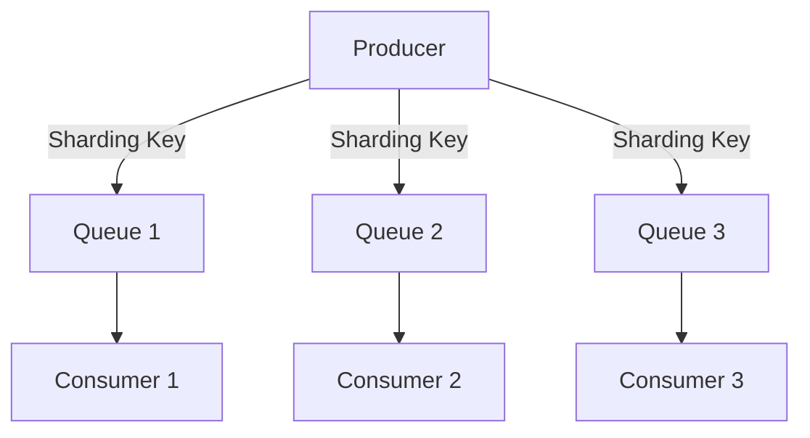
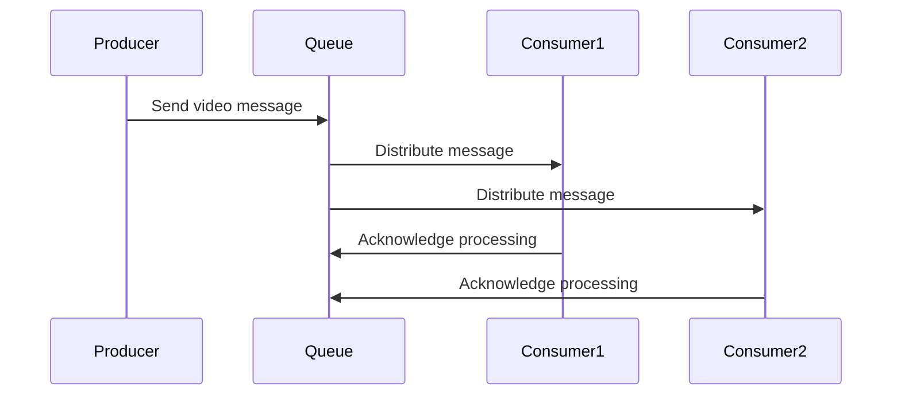

## 6.3.2 Load Balancing and Distribution

In the realm of event-driven architecture (EDA), message queues play a pivotal role in ensuring that workloads are distributed evenly across multiple consumers. This not only enhances the scalability and reliability of systems but also ensures that resources are utilized efficiently. In this section, we will delve into various strategies and techniques for load balancing and distribution using message queues, providing practical insights and examples to help you implement these concepts effectively.

### Role of Queues in Load Balancing

Message queues act as intermediaries that decouple producers and consumers, allowing for asynchronous communication. This decoupling is crucial for load balancing as it enables the distribution of workloads across multiple consumers. By placing messages in a queue, you allow multiple consumer instances to pull and process messages independently, thus distributing the load evenly.

**Key Benefits:**
- **Scalability:** Queues enable horizontal scaling by allowing you to add more consumer instances to handle increased loads.
- **Reliability:** If a consumer fails, messages remain in the queue until they are successfully processed by another consumer.
- **Flexibility:** Queues can buffer messages during peak loads, smoothing out spikes in demand.

### Consumer Scaling

To handle increased message volumes efficiently, scaling consumers horizontally is a common strategy. This involves adding more consumer instances to process messages concurrently. 

**Strategies for Consumer Scaling:**
- **Auto-Scaling:** Use cloud services or container orchestration platforms like Kubernetes to automatically scale consumer instances based on queue length or processing time.
- **Manual Scaling:** Manually adjust the number of consumer instances based on anticipated workloads or historical data.

**Java Example with Spring Boot and RabbitMQ:**

```java
import org.springframework.amqp.rabbit.annotation.RabbitListener;
import org.springframework.stereotype.Service;

@Service
public class VideoProcessingService {

    @RabbitListener(queues = "videoQueue")
    public void processVideo(String videoMessage) {
        // Process the video message
        System.out.println("Processing video: " + videoMessage);
    }
}
```

In this example, you can deploy multiple instances of `VideoProcessingService` to scale horizontally, allowing each instance to process messages from the `videoQueue` independently.

### Sharding Queues

Sharding queues involve distributing messages across multiple physical queues to prevent bottlenecks associated with a single queue. This technique is particularly useful when dealing with high throughput systems.

**Implementation Steps:**
1. **Partition Messages:** Determine a sharding key (e.g., user ID, region) to partition messages.
2. **Create Multiple Queues:** Set up multiple queues, each responsible for a shard of the data.
3. **Route Messages:** Use a routing mechanism to direct messages to the appropriate queue based on the sharding key.

**Mermaid Diagram:**



### Message Routing and Affinity

Message routing and affinity ensure that related messages are processed by the same consumer, which can be crucial for maintaining state consistency or processing order.

**Techniques:**
- **Sticky Sessions:** Use sticky sessions to route messages with the same key to the same consumer.
- **Consistent Hashing:** Implement consistent hashing to distribute messages while maintaining affinity.

### Using Multiple Queues for Different Services

Using multiple queues for different services or processing tasks can optimize load distribution and improve system performance. This approach allows you to prioritize resources and tailor processing logic for specific types of messages.

**Example:**
- **Queue A:** Handles video encoding tasks.
- **Queue B:** Manages video metadata extraction.
- **Queue C:** Processes video thumbnail generation.

### Implementing Priority Queues

Priority queues ensure that critical messages are processed before lower-priority ones, which is essential in systems where certain tasks must be expedited.

**Implementation in Java:**

```java
import org.springframework.amqp.core.Queue;
import org.springframework.amqp.rabbit.core.RabbitTemplate;
import org.springframework.beans.factory.annotation.Autowired;
import org.springframework.stereotype.Service;

@Service
public class PriorityQueueService {

    @Autowired
    private RabbitTemplate rabbitTemplate;

    public void sendPriorityMessage(String message, int priority) {
        rabbitTemplate.convertAndSend("priorityQueue", message, m -> {
            m.getMessageProperties().setPriority(priority);
            return m;
        });
    }
}
```

### Monitoring Consumer Performance

Monitoring consumer performance is crucial for identifying and addressing load balancing issues. Key metrics include message processing time, queue length, and consumer throughput.

**Tools and Techniques:**
- **Prometheus and Grafana:** Use these tools to visualize metrics and set up alerts for anomalies.
- **Cloud Monitoring Services:** Leverage AWS CloudWatch, Azure Monitor, or Google Cloud Monitoring for real-time insights.

### Example Implementation: Video Processing System

Consider a video processing system where videos are uploaded, processed, and stored. The system uses message queues to distribute video processing tasks among multiple instances.

**Steps:**
1. **Upload Video:** A producer uploads a video and sends a message to the `videoQueue`.
2. **Distribute Tasks:** Multiple consumer instances pull messages from the queue and process videos concurrently.
3. **Monitor Performance:** Use monitoring tools to track queue length and processing times, scaling consumers as needed.

**Mermaid Diagram:**



### Conclusion

Load balancing and distribution using message queues are fundamental to building scalable and reliable event-driven systems. By leveraging techniques such as consumer scaling, sharding, message routing, and priority queues, you can optimize your system's performance and ensure efficient resource utilization. Monitoring and adjusting your setup based on real-time metrics will further enhance your system's resilience and responsiveness.

## Quiz Time!



### What is the primary role of message queues in load balancing?

- [x] To distribute workloads evenly among multiple consumers
- [ ] To store messages indefinitely
- [ ] To ensure messages are delivered in order
- [ ] To encrypt messages

> **Explanation:** Message queues distribute workloads evenly among multiple consumers, enhancing system scalability and reliability.

### How can consumer scaling be achieved in a message queue system?

- [x] By adding more consumer instances
- [ ] By reducing the number of producers
- [ ] By increasing the size of each message
- [ ] By using a single consumer for all messages

> **Explanation:** Consumer scaling is achieved by adding more consumer instances to handle increased message volumes efficiently.

### What is sharding in the context of message queues?

- [x] Distributing messages across multiple physical queues
- [ ] Encrypting messages before sending
- [ ] Combining multiple queues into one
- [ ] Prioritizing messages based on content

> **Explanation:** Sharding involves distributing messages across multiple physical queues to prevent bottlenecks.

### What technique ensures related messages are processed by the same consumer?

- [x] Message routing and affinity
- [ ] Message encryption
- [ ] Message compression
- [ ] Message duplication

> **Explanation:** Message routing and affinity ensure that related messages are processed by the same consumer.

### Why would you use multiple queues for different services?

- [x] To optimize load distribution and system performance
- [ ] To reduce the number of consumers needed
- [ ] To increase message size
- [ ] To simplify message encryption

> **Explanation:** Using multiple queues for different services optimizes load distribution and improves system performance.

### What is the purpose of implementing priority queues?

- [x] To ensure critical messages are processed before lower-priority ones
- [ ] To reduce the number of messages in the queue
- [ ] To increase message size
- [ ] To simplify message encryption

> **Explanation:** Priority queues ensure that critical messages are processed before lower-priority ones.

### Which tool can be used to monitor consumer performance?

- [x] Prometheus
- [ ] RabbitMQ
- [ ] Java
- [ ] Spring Boot

> **Explanation:** Prometheus is a tool that can be used to monitor consumer performance.

### What is a common strategy for scaling consumers?

- [x] Auto-scaling based on queue length
- [ ] Reducing the number of queues
- [ ] Increasing message size
- [ ] Using a single consumer for all messages

> **Explanation:** Auto-scaling based on queue length is a common strategy for scaling consumers.

### In a video processing system, what role do message queues play?

- [x] Distributing video processing tasks among multiple instances
- [ ] Storing videos permanently
- [ ] Encrypting video content
- [ ] Ensuring videos are processed in order

> **Explanation:** Message queues distribute video processing tasks among multiple instances.

### True or False: Sharding queues can help prevent single queue bottlenecks.

- [x] True
- [ ] False

> **Explanation:** Sharding queues can help prevent single queue bottlenecks by distributing messages across multiple physical queues.


