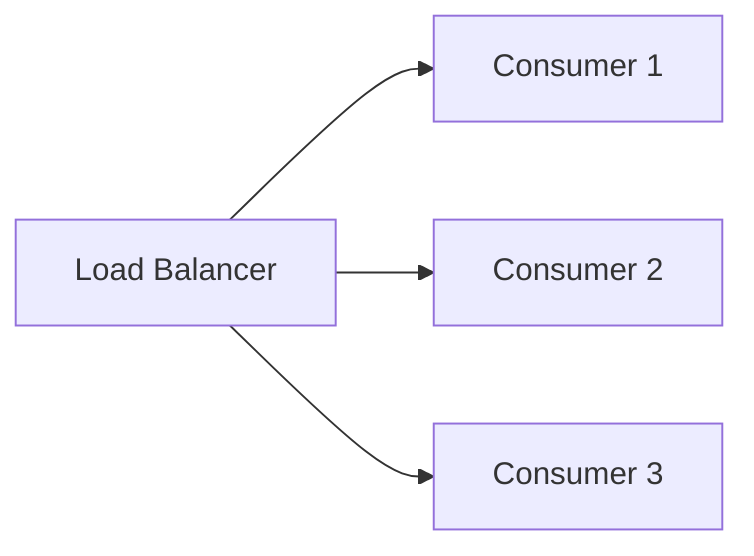

## 7.3.1 Horizontal Scaling Techniques

In the realm of event-driven architectures, the ability to efficiently process a high volume of events is crucial. Horizontal scaling, a fundamental technique in distributed systems, plays a pivotal role in achieving this goal. This section delves into the intricacies of horizontal scaling, its benefits, and practical implementation techniques, providing you with the knowledge to enhance your event-driven systems' capacity and resilience.

### Understanding Horizontal Scaling

Horizontal scaling, also known as scaling out, involves adding more consumer instances to your system to distribute the processing load. Unlike vertical scaling, which increases the capacity of a single instance (e.g., adding more CPU or memory), horizontal scaling enhances system capacity by leveraging multiple instances. This approach not only boosts throughput but also improves fault tolerance and cost-effectiveness.

### Benefits of Horizontal Scaling

#### Increased Throughput

By adding more consumer instances, horizontal scaling allows your system to handle a higher volume of messages. This increase in processing capacity directly translates to improved throughput, enabling your system to efficiently manage peak loads and maintain performance under varying conditions.

#### Enhanced Fault Tolerance

Horizontal scaling inherently enhances fault tolerance. In a horizontally scaled system, the failure of individual consumer instances has a minimal impact on overall processing. Other instances can continue processing events, ensuring system availability and reliability.

#### Cost-Effectiveness

Horizontal scaling can be more cost-effective than vertical scaling, particularly in cloud environments. Cloud platforms offer dynamic resource allocation, allowing you to scale consumer instances up or down based on demand. This flexibility helps optimize costs by ensuring you only pay for the resources you need.

### Techniques for Implementing Horizontal Scaling

#### Auto-Scaling Groups

Auto-scaling groups are a powerful feature provided by cloud platforms like AWS, Azure, and Google Cloud. They automatically adjust the number of consumer instances based on predefined metrics, such as CPU utilization or message queue length. This automation ensures that your system can dynamically respond to changes in load without manual intervention.

**Example: Configuring Auto-Scaling on AWS**

```java
// AWS SDK for Java example to configure an auto-scaling group
import software.amazon.awssdk.services.autoscaling.AutoScalingClient;
import software.amazon.awssdk.services.autoscaling.model.*;

public class AutoScalingExample {
    public static void main(String[] args) {
        AutoScalingClient autoScalingClient = AutoScalingClient.builder().build();

        CreateAutoScalingGroupRequest request = CreateAutoScalingGroupRequest.builder()
                .autoScalingGroupName("ConsumerAutoScalingGroup")
                .instanceId("i-1234567890abcdef0")
                .minSize(1)
                .maxSize(10)
                .desiredCapacity(2)
                .build();

        autoScalingClient.createAutoScalingGroup(request);
        System.out.println("Auto-scaling group created successfully.");
    }
}
```

#### Containerization and Orchestration

Containerization technologies like Docker, combined with orchestration platforms such as Kubernetes, facilitate horizontal scaling by managing consumer replicas. Containers encapsulate application code and dependencies, ensuring consistent deployment across environments. Kubernetes automates the deployment, scaling, and management of containerized applications, making it an ideal choice for horizontal scaling.

**Example: Kubernetes Deployment for Consumers**

```yaml
apiVersion: apps/v1
kind: Deployment
metadata:
  name: consumer-deployment
spec:
  replicas: 3
  selector:
    matchLabels:
      app: consumer
  template:
    metadata:
      labels:
        app: consumer
    spec:
      containers:
      - name: consumer
        image: my-consumer-image:latest
        resources:
          requests:
            memory: "64Mi"
            cpu: "250m"
          limits:
            memory: "128Mi"
            cpu: "500m"
```

#### Load Balancers Integration

Load balancers play a crucial role in distributing messages evenly among multiple consumer instances. By ensuring balanced processing loads, load balancers prevent any single instance from becoming a bottleneck, thereby optimizing resource utilization and enhancing system performance.

**Diagram: Load Balancer Distributing Messages to Consumers**



#### Stateless Consumer Design

Designing consumers to be stateless is a best practice in horizontal scaling. Stateless consumers do not maintain any session-specific data, allowing them to be easily added or removed without affecting the overall system state. This design simplifies scaling and enhances system flexibility.

#### Monitoring and Metrics

Monitoring key metrics, such as message queue length and consumer CPU/memory usage, is essential for informed scaling decisions. Tools like Prometheus and Grafana can provide real-time insights into system performance, enabling proactive scaling adjustments.

**Example: Monitoring with Prometheus**

```yaml
apiVersion: monitoring.coreos.com/v1
kind: ServiceMonitor
metadata:
  name: consumer-monitor
spec:
  selector:
    matchLabels:
      app: consumer
  endpoints:
  - port: http
    interval: 30s
```

### Implementation Steps

To set up horizontal scaling for consumers using a cloud platform or container orchestration tool, follow these steps:

1. **Define Scaling Policies:** Establish metrics and thresholds for scaling decisions, such as CPU utilization or message queue length.
2. **Configure Auto-Scaling Groups:** Set up auto-scaling groups on your chosen cloud platform, specifying minimum and maximum instance counts.
3. **Deploy Containerized Consumers:** Use Docker and Kubernetes to deploy consumer instances, ensuring consistent configuration and resource allocation.
4. **Integrate Load Balancers:** Implement load balancers to distribute messages evenly across consumer instances.
5. **Monitor System Performance:** Continuously monitor key metrics to ensure optimal performance and make adjustments as needed.

### Example Implementation

Consider a microservices-based logging system that needs to handle increased log ingestion rates. By implementing horizontal scaling, additional consumer instances can be dynamically added to process logs efficiently.

**Scenario: Scaling a Logging System**

1. **Initial Setup:** Deploy a base number of consumer instances to handle normal log ingestion rates.
2. **Monitor Load:** Use Prometheus to monitor log queue length and consumer CPU usage.
3. **Auto-Scaling Trigger:** When log queue length exceeds a predefined threshold, trigger the auto-scaling group to add more consumer instances.
4. **Load Balancing:** Ensure the load balancer distributes incoming log messages evenly among all active consumer instances.
5. **Scale Down:** When log ingestion rates decrease, automatically reduce the number of consumer instances to optimize costs.

### Best Practices

- **Rapid Scaling Responses:** Ensure your system can quickly respond to changes in load by configuring appropriate scaling policies and thresholds.
- **Avoid Over-Provisioning:** Balance the number of consumer instances to avoid unnecessary resource allocation and costs.
- **Consistent Configurations:** Maintain consistent configurations across all consumer instances to ensure uniform performance and reliability.
- **Regular Testing:** Periodically test your scaling setup to verify its effectiveness and make improvements as needed.

### Conclusion

Horizontal scaling is a powerful technique for enhancing the capacity and resilience of event-driven systems. By leveraging auto-scaling, containerization, load balancing, and monitoring, you can effectively manage consumer applications to meet varying demands. Implementing these techniques ensures your system remains responsive, fault-tolerant, and cost-effective, providing a robust foundation for handling high volumes of events.

## Quiz Time!



### What is horizontal scaling?

- [x] Adding more consumer instances to distribute the processing load
- [ ] Increasing the capacity of a single instance
- [ ] Reducing the number of consumer instances
- [ ] Enhancing the memory of existing instances

> **Explanation:** Horizontal scaling involves adding more consumer instances to distribute the processing load, enhancing system capacity and resilience.

### Which of the following is a benefit of horizontal scaling?

- [x] Increased throughput
- [ ] Decreased fault tolerance
- [ ] Higher costs
- [ ] Reduced system capacity

> **Explanation:** Horizontal scaling increases throughput by allowing more consumer instances to handle a higher volume of messages.

### What role do auto-scaling groups play in horizontal scaling?

- [x] Automatically adjust the number of consumer instances based on predefined metrics
- [ ] Manually increase the capacity of a single instance
- [ ] Reduce the number of consumer instances
- [ ] Enhance the memory of existing instances

> **Explanation:** Auto-scaling groups automatically adjust the number of consumer instances based on predefined metrics, ensuring dynamic response to changes in load.

### How does containerization facilitate horizontal scaling?

- [x] By managing consumer replicas and ensuring consistent deployment
- [ ] By increasing the capacity of a single instance
- [ ] By reducing the number of consumer instances
- [ ] By enhancing the memory of existing instances

> **Explanation:** Containerization facilitates horizontal scaling by managing consumer replicas and ensuring consistent deployment across environments.

### What is the purpose of load balancers in horizontal scaling?

- [x] Distribute messages evenly among multiple consumer instances
- [ ] Increase the capacity of a single instance
- [ ] Reduce the number of consumer instances
- [ ] Enhance the memory of existing instances

> **Explanation:** Load balancers distribute messages evenly among multiple consumer instances, ensuring balanced processing loads.

### Why is stateless consumer design important in horizontal scaling?

- [x] It allows consumers to be easily added or removed without affecting the system state
- [ ] It increases the capacity of a single instance
- [ ] It reduces the number of consumer instances
- [ ] It enhances the memory of existing instances

> **Explanation:** Stateless consumer design allows consumers to be easily added or removed without affecting the system state, simplifying scaling.

### Which tool can be used for monitoring key metrics in horizontal scaling?

- [x] Prometheus
- [ ] Docker
- [ ] Kubernetes
- [ ] AWS SDK

> **Explanation:** Prometheus is a tool used for monitoring key metrics, providing real-time insights into system performance.

### What is a best practice for horizontal scaling?

- [x] Ensuring rapid scaling responses
- [ ] Over-provisioning resources
- [ ] Maintaining inconsistent configurations
- [ ] Avoiding regular testing

> **Explanation:** Ensuring rapid scaling responses is a best practice for horizontal scaling, allowing the system to quickly adapt to changes in load.

### How can horizontal scaling improve fault tolerance?

- [x] By minimizing the impact of individual consumer failures
- [ ] By increasing the capacity of a single instance
- [ ] By reducing the number of consumer instances
- [ ] By enhancing the memory of existing instances

> **Explanation:** Horizontal scaling improves fault tolerance by minimizing the impact of individual consumer failures, ensuring system availability.

### True or False: Horizontal scaling is more cost-effective than vertical scaling in cloud environments.

- [x] True
- [ ] False

> **Explanation:** Horizontal scaling can be more cost-effective than vertical scaling in cloud environments due to dynamic resource allocation and optimization.


