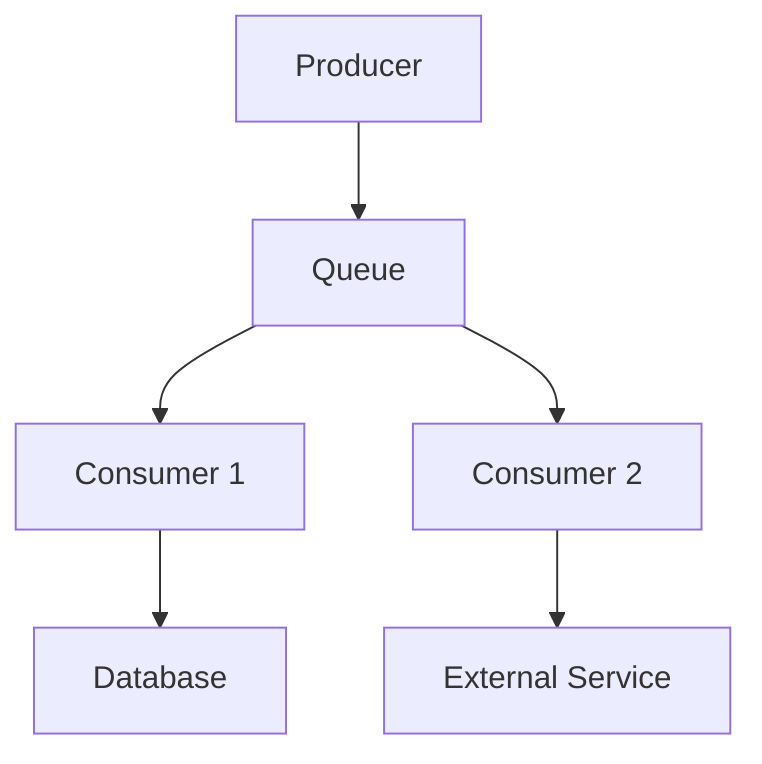

## 7.4.2 Identifying Bottlenecks

In event-driven architectures, ensuring optimal performance of consumer applications is crucial for maintaining system responsiveness and reliability. Bottlenecks can arise from various sources, such as inefficient message handling, resource constraints, or external dependencies. This section delves into methods for identifying these bottlenecks, offering insights into monitoring techniques and practical strategies for resolution.

### Analyzing Queue Depth

Queue depth is a critical indicator of consumer performance. A growing queue depth suggests that consumers are unable to process incoming messages at the rate they are being produced. This can lead to increased latency and potential message loss if not addressed.

**Key Steps for Queue Depth Analysis:**

1. **Monitor Queue Length:** Regularly check the length of your message queues. A consistently increasing queue length indicates that consumers are falling behind.
   
2. **Set Threshold Alerts:** Implement alerts for when queue depth exceeds a predefined threshold, prompting immediate investigation.

3. **Analyze Trends:** Use historical data to identify patterns, such as peak times when queue depths typically increase.

**Example:**

```java
// Pseudo-code for monitoring queue depth
Queue queue = messageBroker.getQueue("orders");
int threshold = 1000;

if (queue.getDepth() > threshold) {
    System.out.println("Alert: Queue depth exceeds threshold!");
}
```

### Assessing Consumer Performance Metrics

High CPU or memory usage on consumer instances can reveal inefficiencies in message processing or indicate that the system is under-resourced.

**Key Metrics to Monitor:**

- **CPU Usage:** High CPU usage may suggest that consumers are processing messages inefficiently or that the workload is too high for the current resources.
  
- **Memory Usage:** Excessive memory consumption can lead to slowdowns or crashes, particularly if consumers are handling large message payloads.

**Example:**

```java
// Java code snippet to monitor CPU and memory usage
OperatingSystemMXBean osBean = ManagementFactory.getOperatingSystemMXBean();
double cpuLoad = osBean.getSystemLoadAverage();
long freeMemory = Runtime.getRuntime().freeMemory();

System.out.println("CPU Load: " + cpuLoad);
System.out.println("Free Memory: " + freeMemory);
```

### Monitoring Processing Latency

Increased processing latency can be a sign of performance degradation. Monitoring the time taken to process each message helps identify slowdowns in the system.

**Steps to Monitor Latency:**

1. **Log Processing Times:** Record the time taken to process each message and calculate averages over time.
   
2. **Set Latency Thresholds:** Define acceptable latency thresholds and alert when these are exceeded.

3. **Analyze Latency Spikes:** Investigate sudden spikes in latency to determine their cause.

**Example:**

```java
// Java code to measure processing latency
long startTime = System.currentTimeMillis();
// Process message
long endTime = System.currentTimeMillis();
long processingTime = endTime - startTime;

System.out.println("Processing Time: " + processingTime + "ms");
```

### Evaluating Error and Retry Rates

Elevated error and retry rates can indicate issues in message processing logic or with external dependencies, such as databases or third-party services.

**Key Actions:**

- **Track Error Rates:** Monitor the frequency of errors during message processing.
  
- **Analyze Retry Patterns:** High retry rates may suggest transient issues or persistent problems with message handling.

- **Investigate Root Causes:** Use logs and error messages to identify the underlying issues causing errors and retries.

### Tracing Message Flow

Distributed tracing tools like Jaeger or Zipkin can help trace the flow of messages through the system, identifying slow or failing components.

**Benefits of Tracing:**

- **Visualize Message Paths:** See how messages traverse through different services and identify bottlenecks.
  
- **Identify Latency Sources:** Pinpoint where delays occur in the message flow.

- **Detect Failures:** Quickly identify components that are failing or causing errors.

**Example:**



### Benchmarking and Load Testing

Conducting benchmarking and load testing is essential for simulating high-load scenarios and identifying potential performance bottlenecks before they impact production.

**Steps for Effective Load Testing:**

1. **Define Test Scenarios:** Identify key scenarios that reflect real-world usage patterns.
   
2. **Simulate Load:** Use tools like Apache JMeter or Gatling to simulate high volumes of messages.

3. **Analyze Results:** Evaluate the system's performance under load and identify bottlenecks.

### Resource Utilization Analysis

Analyzing resource utilization trends helps pinpoint whether hardware limitations or misconfigurations are causing processing slowdowns.

**Key Areas to Analyze:**

- **CPU and Memory Usage:** Ensure that resources are not being maxed out, leading to slowdowns.
  
- **Network Bandwidth:** Check for network bottlenecks that could be affecting message throughput.

- **Disk I/O:** Monitor disk usage, especially if consumers are writing logs or data to disk.

### Example Bottleneck Identification

Consider a scenario where a log processing consumer is experiencing high queue depths and increased processing latencies. By monitoring the queue depth and processing times, you identify that the consumer is unable to keep up with the incoming log messages.

**Steps Taken:**

1. **Analyze Queue Depth:** Notice a significant increase in queue depth during peak hours.
   
2. **Monitor Latency:** Observe that processing latency spikes coincide with high queue depths.

3. **Evaluate Resource Usage:** Check CPU and memory usage, finding that the consumer is CPU-bound.

4. **Implement Mitigation:** Optimize the consumer code to improve processing efficiency and scale the number of consumer instances to handle the load.

### Implementing Mitigation Strategies

Once bottlenecks are identified, implementing effective mitigation strategies is crucial for maintaining system performance.

**Strategies Include:**

- **Code Optimization:** Refactor consumer code to improve efficiency and reduce processing time.
  
- **Scaling Consumers:** Increase the number of consumer instances to distribute the load more effectively.

- **Enhancing Message Processing:** Use techniques like batch processing to handle messages more efficiently.

**Example:**

```java
// Java code for scaling consumer instances
public void scaleConsumers(int additionalInstances) {
    for (int i = 0; i < additionalInstances; i++) {
        new Thread(new Consumer()).start();
    }
}
```

By following these strategies and continuously monitoring performance metrics, you can effectively identify and mitigate bottlenecks in your event-driven architecture, ensuring a robust and responsive system.

## Quiz Time!



### What does a growing queue depth indicate in an event-driven system?

- [x] Consumers are struggling to keep up with incoming messages.
- [ ] The system is over-provisioned.
- [ ] There are no issues with the system.
- [ ] The message broker is malfunctioning.

> **Explanation:** A growing queue depth indicates that consumers are not processing messages as quickly as they are being produced, suggesting a potential bottleneck.

### Which metric is crucial for identifying processing inefficiencies in consumers?

- [x] High CPU usage
- [ ] Low disk space
- [ ] High network bandwidth
- [ ] Low memory usage

> **Explanation:** High CPU usage can indicate processing inefficiencies or that the workload is too high for the current resources.

### What can increased processing latency signal in a consumer application?

- [x] Performance degradation
- [ ] Improved system performance
- [ ] Reduced error rates
- [ ] Increased throughput

> **Explanation:** Increased processing latency can signal performance degradation or issues in consumer message handling.

### What do elevated error and retry rates indicate?

- [x] Underlying issues in message processing logic or external dependencies
- [ ] Efficient message processing
- [ ] High system availability
- [ ] Low resource utilization

> **Explanation:** Elevated error and retry rates can point to issues in message processing logic or problems with external dependencies.

### Which tool can be used for distributed tracing in event-driven systems?

- [x] Jaeger
- [ ] JUnit
- [ ] Maven
- [ ] Jenkins

> **Explanation:** Jaeger is a distributed tracing tool that helps trace the flow of messages through the system.

### Why is benchmarking and load testing important in event-driven systems?

- [x] To simulate high-load scenarios and identify potential performance bottlenecks
- [ ] To reduce system complexity
- [ ] To eliminate the need for monitoring
- [ ] To increase system costs

> **Explanation:** Benchmarking and load testing simulate high-load scenarios to identify potential performance bottlenecks before they impact production.

### What should be analyzed to pinpoint hardware limitations causing slowdowns?

- [x] Resource utilization trends
- [ ] Message payload size
- [ ] Message broker configuration
- [ ] Consumer application logs

> **Explanation:** Analyzing resource utilization trends helps pinpoint whether hardware limitations or misconfigurations are causing processing slowdowns.

### What is a practical strategy for mitigating identified bottlenecks?

- [x] Optimizing consumer code
- [ ] Reducing the number of consumer instances
- [ ] Increasing message payload size
- [ ] Disabling monitoring tools

> **Explanation:** Optimizing consumer code can improve processing efficiency and reduce bottlenecks.

### What does high CPU usage on consumers typically indicate?

- [x] Processing inefficiencies or resource constraints
- [ ] Low system load
- [ ] High network latency
- [ ] Efficient resource utilization

> **Explanation:** High CPU usage typically indicates processing inefficiencies or that the system is under-resourced.

### True or False: Distributed tracing tools like Zipkin can help identify slow or failing components in an event-driven system.

- [x] True
- [ ] False

> **Explanation:** Distributed tracing tools like Zipkin can trace the flow of messages through the system, helping identify slow or failing components.


