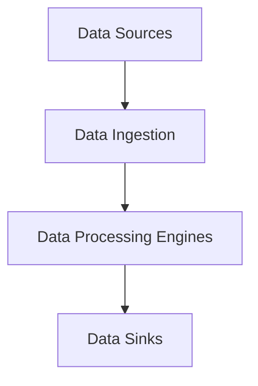
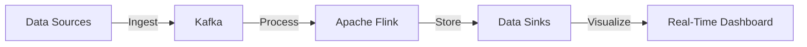

## 8.1.1 What is Streaming?

In the realm of computing, streaming refers to the continuous flow and processing of data in real-time or near-real-time. Unlike traditional batch processing, where data is collected, stored, and processed at intervals, streaming allows for immediate processing as data arrives. This capability is crucial for applications requiring low latency and real-time insights.

### Defining Streaming in Computing

Streaming is a paradigm that enables the processing of data as it is generated, allowing systems to react to new information almost instantaneously. This approach is particularly beneficial for scenarios where timely data processing is critical, such as monitoring financial transactions, tracking user interactions, or analyzing sensor data in IoT systems.

In a streaming architecture, data flows continuously from sources to processing engines and finally to data sinks, where it can be stored or further analyzed. This flow is unbounded, meaning that the data stream is ongoing and does not have a predefined end.

### Distinguishing Streaming from Batch Processing

The primary distinction between streaming and batch processing lies in the timing and manner of data processing:

- **Batch Processing:** Involves collecting data over a period, storing it, and then processing it in bulk. This method is suitable for applications where real-time processing is not essential, and latency can be tolerated.

- **Streaming Processing:** Data is processed as soon as it is produced, enabling real-time analytics and decision-making. This approach is ideal for applications where immediate action is required based on the latest data.

| Feature               | Batch Processing                  | Streaming Processing               |
|-----------------------|-----------------------------------|------------------------------------|
| **Data Handling**     | Processes data in bulk            | Processes data continuously        |
| **Latency**           | Higher latency due to batch size  | Low latency, real-time processing  |
| **Use Cases**         | Historical data analysis          | Real-time monitoring and alerts    |
| **Complexity**        | Simpler to implement              | More complex, requires real-time infrastructure |

### Components of a Streaming System

A typical streaming architecture consists of several key components:

1. **Data Sources:** These are the origins of the data, such as sensors, user interactions, or log files. Data sources continuously generate data that needs to be processed.

2. **Data Ingestion:** This component is responsible for capturing and importing data from various sources into the streaming system. Tools like Apache Kafka or Amazon Kinesis are often used for this purpose.

3. **Data Processing Engines:** These engines process the incoming data in real-time. They apply transformations, aggregations, and analytics to extract meaningful insights. Apache Flink and Apache Spark Streaming are popular choices for processing engines.

4. **Data Sinks:** After processing, data is sent to sinks for storage or further analysis. This could be databases, data warehouses, or real-time dashboards.

### Data Flow in Streaming Systems

In a streaming system, data flows continuously from generation to consumption. Here's a simplified flow diagram:

- **Data Sources** generate data that is immediately ingested into the system.
- **Data Ingestion** captures this data and feeds it into processing engines.
- **Data Processing Engines** apply real-time analytics and transformations.
- **Data Sinks** store the processed data or present it for real-time decision-making.

### Types of Streaming Data

Streaming data can come in various forms, including:

- **Event Streams:** Continuous streams of events, such as user clicks or transactions.
- **Sensor Data:** Real-time data from IoT devices, such as temperature or motion sensors.
- **Log Data:** System logs that provide insights into application performance and issues.
- **Real-Time User Interactions:** Data from user activities on websites or applications.

### Use Cases of Streaming

Streaming is leveraged across numerous industries for various applications:

- **Financial Trading Systems:** Real-time processing of market data to execute trades with minimal latency.
- **Social Media Feeds:** Continuous updates of user-generated content and interactions.
- **Real-Time Analytics:** Monitoring and analyzing data as it arrives to make immediate business decisions.
- **IoT Applications:** Processing sensor data in real-time for applications like smart cities or industrial automation.

### Historical Evolution of Streaming

The concept of streaming has evolved significantly over the years. Initially, messaging systems like JMS (Java Message Service) and AMQP (Advanced Message Queuing Protocol) provided basic capabilities for real-time data flow. However, as the demand for real-time processing grew, more sophisticated platforms emerged.

Modern streaming platforms like Apache Kafka, Apache Flink, and Apache Spark Streaming have revolutionized the way data is processed, offering robust, scalable, and fault-tolerant solutions for handling vast amounts of streaming data.

### Visual Representation

To better understand the architecture and data flow of a streaming system, consider the following diagram:

This diagram illustrates a typical streaming architecture where data flows from sources through Kafka for ingestion, is processed by Apache Flink, stored in data sinks, and finally visualized on a real-time dashboard.

### Conclusion

Streaming is a powerful paradigm that enables real-time data processing, offering significant advantages for applications requiring immediate insights and actions. By understanding the components, data flow, and use cases of streaming systems, developers can design architectures that effectively leverage this technology.

For further exploration, consider delving into the official documentation of tools like Apache Kafka and Apache Flink, or exploring online courses that cover real-time data processing and streaming architectures.

## Quiz Time!



### What is the primary advantage of streaming over batch processing?

- [x] Real-time data processing
- [ ] Simpler implementation
- [ ] Lower cost
- [ ] Higher data accuracy

> **Explanation:** Streaming allows for real-time data processing, enabling immediate insights and actions, unlike batch processing which processes data at intervals.

### Which component in a streaming system is responsible for capturing and importing data from various sources?

- [ ] Data Sources
- [x] Data Ingestion
- [ ] Data Processing Engines
- [ ] Data Sinks

> **Explanation:** Data Ingestion is responsible for capturing and importing data from various sources into the streaming system.

### What type of data is typically processed in streaming systems?

- [x] Event Streams
- [x] Sensor Data
- [x] Log Data
- [ ] Archived Data

> **Explanation:** Streaming systems process real-time data such as event streams, sensor data, and log data, not archived data.

### Which of the following is a popular tool for data ingestion in streaming systems?

- [x] Apache Kafka
- [ ] MySQL
- [ ] MongoDB
- [ ] Redis

> **Explanation:** Apache Kafka is a popular tool for data ingestion in streaming systems, known for its scalability and fault tolerance.

### What is the role of data sinks in a streaming architecture?

- [ ] Generate data
- [ ] Ingest data
- [ ] Process data
- [x] Store or present processed data

> **Explanation:** Data sinks store or present processed data for further analysis or decision-making.

### Which of the following is NOT a use case for streaming?

- [ ] Financial Trading Systems
- [ ] Social Media Feeds
- [ ] Real-Time Analytics
- [x] Historical Data Analysis

> **Explanation:** Streaming is used for real-time applications, while historical data analysis is typically handled by batch processing.

### What is a key characteristic of streaming data?

- [x] Continuous and unbounded
- [ ] Static and finite
- [ ] Periodically updated
- [ ] Archived and stored

> **Explanation:** Streaming data is continuous and unbounded, flowing in real-time without a predefined end.

### Which of the following tools is known for real-time data processing in streaming systems?

- [ ] Apache Hadoop
- [x] Apache Flink
- [ ] PostgreSQL
- [ ] Elasticsearch

> **Explanation:** Apache Flink is known for real-time data processing in streaming systems, offering low-latency processing capabilities.

### What distinguishes streaming from traditional batch processing?

- [x] Real-time processing
- [ ] Higher latency
- [ ] Bulk data handling
- [ ] Simpler implementation

> **Explanation:** Streaming is distinguished by its real-time processing capabilities, unlike batch processing which handles data in bulk with higher latency.

### True or False: Streaming systems are suitable for applications requiring immediate action based on the latest data.

- [x] True
- [ ] False

> **Explanation:** Streaming systems are indeed suitable for applications requiring immediate action based on the latest data, due to their real-time processing capabilities.


