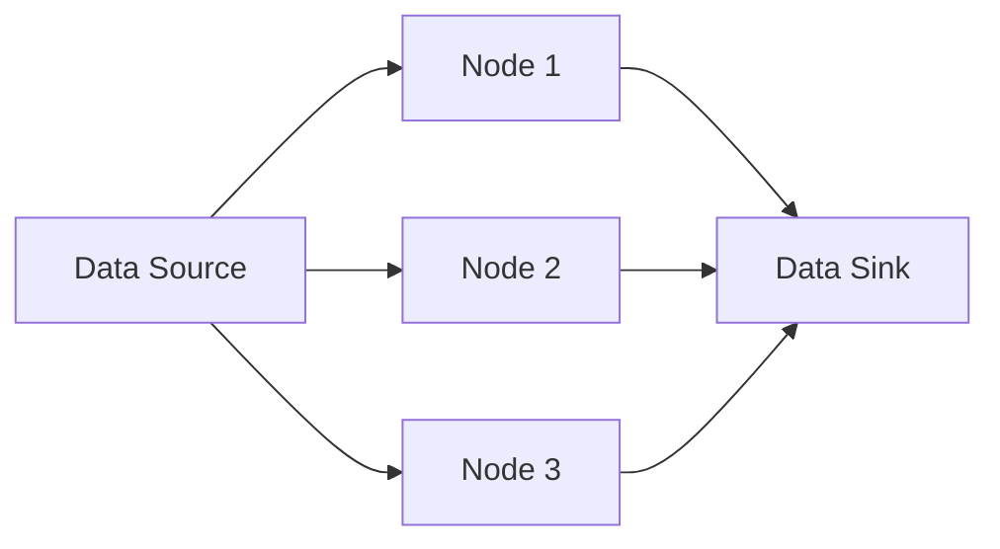

## 8.1.2 Benefits of Streaming Architectures

Streaming architectures have revolutionized the way we process and analyze data, offering numerous advantages over traditional batch processing systems. In this section, we will explore the key benefits of streaming architectures, focusing on their ability to provide real-time data processing, low latency, scalability, continuous data flow, fault tolerance, flexibility in data handling, seamless integration with other systems, and enhanced user experiences.

### Real-Time Data Processing

One of the most significant benefits of streaming architectures is their ability to process data in real-time. Unlike batch processing, which collects data over a period and processes it in bulk, streaming systems analyze data as it arrives. This capability is crucial for applications that require immediate insights and actions, such as fraud detection, where identifying suspicious activities instantly can prevent significant financial losses.

Consider a financial trading platform that uses a streaming architecture to monitor stock prices and execute trades. By processing data in real-time, the platform can react to market changes instantly, giving traders a competitive edge.

Here's a simple Java example using Apache Kafka and Kafka Streams to demonstrate real-time data processing:

```java
import org.apache.kafka.streams.KafkaStreams;
import org.apache.kafka.streams.StreamsBuilder;
import org.apache.kafka.streams.kstream.KStream;

public class RealTimeProcessingExample {
    public static void main(String[] args) {
        StreamsBuilder builder = new StreamsBuilder();
        KStream<String, String> sourceStream = builder.stream("input-topic");

        KStream<String, String> processedStream = sourceStream.mapValues(value -> {
            // Process the incoming data
            return value.toUpperCase(); // Example transformation
        });

        processedStream.to("output-topic");

        KafkaStreams streams = new KafkaStreams(builder.build(), new Properties());
        streams.start();
    }
}
```

In this example, data from the "input-topic" is processed in real-time, transforming each message to uppercase before sending it to the "output-topic".

### Low Latency

Streaming architectures are designed to deliver low-latency responses, making them ideal for applications that require instant feedback. Low latency is crucial in scenarios like live dashboards, where users expect immediate updates, or in online gaming, where delays can significantly impact the user experience.

The low-latency nature of streaming systems is achieved through efficient data processing pipelines and optimized network communication. By minimizing the time between data arrival and processing, streaming architectures ensure that applications remain responsive and agile.

### Scalability

Scalability is another hallmark of streaming architectures. These systems are built to handle vast amounts of data by distributing processing tasks across multiple nodes. This distributed nature allows streaming architectures to scale horizontally, adding more nodes to accommodate increased data volumes without compromising performance.

For instance, a social media platform processing millions of user interactions per second can leverage a streaming architecture to distribute the load across a cluster of servers, ensuring seamless scalability.

Here's a diagram illustrating the scalability of a streaming architecture:



### Continuous Data Flow

Streaming architectures maintain a continuous flow of data, eliminating the delays associated with batch processing. This continuous data flow enables timely decision-making, as data is processed and analyzed as soon as it becomes available.

In industries like healthcare, where timely data can be critical, streaming architectures provide the ability to monitor patient vitals in real-time, alerting medical staff to any anomalies immediately.

### Fault Tolerance and Resilience

Modern streaming platforms are designed with fault tolerance and resilience in mind. Features like data replication, partitioning, and automatic failover ensure high availability and reliability. If a node fails, the system can automatically redirect data processing to another node, minimizing downtime and data loss.

Apache Kafka, for example, offers built-in replication and partitioning, allowing data to be distributed across multiple brokers for redundancy and fault tolerance.

### Flexibility in Data Handling

Streaming architectures offer flexibility in handling diverse data types and formats. Whether dealing with structured data from databases or unstructured data from social media feeds, streaming systems can process and analyze a wide range of data streams.

This flexibility is particularly beneficial in environments where data sources are varied and constantly evolving, allowing organizations to adapt quickly to new data formats and sources.

### Integration with Other Systems

Streaming systems are designed to integrate seamlessly with various data sources and sinks, enabling the creation of real-time data pipelines. This integration capability allows organizations to connect streaming architectures with existing systems, such as databases, data lakes, and machine learning models, facilitating real-time data processing and analytics.

For example, a retail company can integrate its streaming architecture with a recommendation engine to provide personalized product suggestions to customers in real-time.

### Enhanced User Experiences

Finally, streaming architectures contribute to enhanced user experiences by enabling dynamic and responsive applications. Whether it's providing personalized recommendations, live updates, or real-time analytics, streaming systems ensure that users receive the most relevant and up-to-date information.

In conclusion, streaming architectures offer a multitude of benefits, from real-time data processing and low latency to scalability and enhanced user experiences. By leveraging these advantages, organizations can build robust, responsive, and scalable systems that meet the demands of today's data-driven world.

## Quiz Time!



### What is a key benefit of real-time data processing in streaming architectures?

- [x] Immediate insights and actions
- [ ] Reduced data storage costs
- [ ] Simplified data models
- [ ] Increased data redundancy

> **Explanation:** Real-time data processing allows for immediate insights and actions, which is crucial for applications like fraud detection and live dashboards.

### How do streaming architectures achieve low latency?

- [x] Efficient data processing pipelines
- [ ] Increased data storage
- [ ] Complex data models
- [ ] Manual data processing

> **Explanation:** Streaming architectures achieve low latency through efficient data processing pipelines and optimized network communication.

### What enables the scalability of streaming architectures?

- [x] Distributed processing across multiple nodes
- [ ] Centralized data storage
- [ ] Manual scaling processes
- [ ] Fixed hardware resources

> **Explanation:** Streaming architectures are inherently scalable by distributing processing tasks across multiple nodes, allowing for horizontal scaling.

### What is the advantage of continuous data flow in streaming architectures?

- [x] Timely decision-making
- [ ] Increased data redundancy
- [ ] Simplified data models
- [ ] Reduced data storage costs

> **Explanation:** Continuous data flow eliminates delays associated with batch processing, enabling timely decision-making.

### How do modern streaming platforms ensure fault tolerance?

- [x] Data replication and automatic failover
- [ ] Manual data backups
- [ ] Centralized processing
- [ ] Fixed hardware resources

> **Explanation:** Modern streaming platforms ensure fault tolerance through features like data replication and automatic failover.

### What flexibility do streaming architectures offer in data handling?

- [x] Handling diverse data types and formats
- [ ] Fixed data models
- [ ] Manual data processing
- [ ] Centralized data storage

> **Explanation:** Streaming architectures offer flexibility in handling diverse data types and formats, supporting both structured and unstructured data streams.

### How do streaming systems integrate with other systems?

- [x] Seamless data pipelines
- [ ] Manual data transfers
- [ ] Centralized processing
- [ ] Fixed hardware resources

> **Explanation:** Streaming systems integrate with other systems through seamless data pipelines, enabling real-time data processing and analytics.

### What user experience benefit do streaming architectures provide?

- [x] Dynamic and responsive applications
- [ ] Increased data storage
- [ ] Simplified data models
- [ ] Manual data processing

> **Explanation:** Streaming architectures provide dynamic and responsive applications, enhancing user experiences with real-time updates and personalized recommendations.

### Which of the following is NOT a benefit of streaming architectures?

- [ ] Real-time data processing
- [ ] Low latency
- [ ] Scalability
- [x] Increased data redundancy

> **Explanation:** While streaming architectures offer real-time data processing, low latency, and scalability, increased data redundancy is not a direct benefit.

### True or False: Streaming architectures are only suitable for structured data.

- [ ] True
- [x] False

> **Explanation:** Streaming architectures are flexible and can handle both structured and unstructured data streams, making them suitable for a wide range of applications.


