## 8.1.3 Key Concepts and Terminology in Streaming Architectures

As we delve into the world of streaming architectures, it's crucial to understand the foundational concepts and terminology that underpin these systems. Streaming architectures are designed to handle continuous flows of data, enabling real-time processing and analysis. This section will explore key concepts such as data streams, stream processing, windowing, and more, providing a comprehensive understanding of how these elements work together to form robust streaming systems.

### Data Streams

**Data Streams** are sequences of data elements made available over time. They form the backbone of streaming architectures, allowing data to be processed as it arrives rather than waiting for a complete dataset. This continuous flow of data is essential for real-time applications, where timely insights and actions are critical.

In Java, data streams can be represented using various libraries and frameworks, such as Apache Kafka. Here's a simple example of a Kafka producer in Java that sends messages to a data stream:

```java
import org.apache.kafka.clients.producer.KafkaProducer;
import org.apache.kafka.clients.producer.ProducerRecord;
import java.util.Properties;

public class SimpleKafkaProducer {
    public static void main(String[] args) {
        Properties props = new Properties();
        props.put("bootstrap.servers", "localhost:9092");
        props.put("key.serializer", "org.apache.kafka.common.serialization.StringSerializer");
        props.put("value.serializer", "org.apache.kafka.common.serialization.StringSerializer");

        KafkaProducer<String, String> producer = new KafkaProducer<>(props);
        for (int i = 0; i < 10; i++) {
            producer.send(new ProducerRecord<>("my-topic", Integer.toString(i), "Message " + i));
        }
        producer.close();
    }
}
```

### Stream Processing

**Stream Processing** involves continuous computation on data streams, enabling real-time analysis and transformation of data as it flows through the system. This approach contrasts with batch processing, where data is collected over time and processed in bulk.

Stream processing frameworks like Apache Flink and Kafka Streams provide powerful tools for building real-time applications. These frameworks allow developers to define processing logic that operates on each data element as it arrives, facilitating immediate insights and actions.

Here's an example of a simple stream processing application using Kafka Streams in Java:

```java
import org.apache.kafka.streams.KafkaStreams;
import org.apache.kafka.streams.StreamsBuilder;
import org.apache.kafka.streams.kstream.KStream;
import org.apache.kafka.streams.kstream.KTable;
import org.apache.kafka.streams.kstream.Materialized;

public class WordCountApplication {
    public static void main(String[] args) {
        StreamsBuilder builder = new StreamsBuilder();
        KStream<String, String> textLines = builder.stream("text-input");
        KTable<String, Long> wordCounts = textLines
            .flatMapValues(textLine -> Arrays.asList(textLine.toLowerCase().split("\\W+")))
            .groupBy((key, word) -> word)
            .count(Materialized.as("counts-store"));

        wordCounts.toStream().to("word-count-output");

        KafkaStreams streams = new KafkaStreams(builder.build(), new Properties());
        streams.start();
    }
}
```

### Windowing

**Windowing** is a technique used to group data in streams into manageable chunks based on time or other criteria. This allows for efficient processing and aggregation of data over specific intervals, making it possible to compute metrics like averages, sums, or counts within a defined window.

There are several types of windows, including:

- **Tumbling Windows:** Fixed-size, non-overlapping windows.
- **Sliding Windows:** Fixed-size, overlapping windows.
- **Session Windows:** Dynamic windows based on periods of activity.

Here's a visual representation of tumbling and sliding windows:

```mermaid
gantt
    dateFormat  HH:mm
    axisFormat  %H:%M
    section Tumbling Window
    Window 1 :active, 00:00, 00:05
    Window 2 :active, 00:05, 00:10
    Window 3 :active, 00:10, 00:15
    section Sliding Window
    Window 1 :active, 00:00, 00:05
    Window 2 :active, 00:02, 00:07
    Window 3 :active, 00:04, 00:09
```



### Event Time vs. Processing Time

In streaming systems, it's essential to distinguish between **Event Time** and **Processing Time**:

- **Event Time** refers to the timestamp when the data was generated. It is crucial for applications where the timing of events is significant, such as financial transactions or sensor readings.
- **Processing Time** is the timestamp when the data is processed by the system. It can vary based on system load and other factors.

Choosing between event time and processing time impacts the consistency and accuracy of the processed data. Many stream processing frameworks offer mechanisms to handle both types of time, allowing developers to choose the most appropriate one for their use case.

### Stateful vs. Stateless Processing

**Stateful Processing** involves maintaining state information across events, allowing for complex computations that depend on previous data. This is useful for applications like session tracking or running totals.

**Stateless Processing**, on the other hand, treats each event independently, without maintaining any state between events. This approach is simpler and more scalable but may not be suitable for all use cases.

Here's an example of stateful processing using Apache Flink:

```java
import org.apache.flink.api.common.functions.RichFlatMapFunction;
import org.apache.flink.api.common.state.ValueState;
import org.apache.flink.api.common.state.ValueStateDescriptor;
import org.apache.flink.configuration.Configuration;
import org.apache.flink.streaming.api.environment.StreamExecutionEnvironment;
import org.apache.flink.util.Collector;

public class StatefulProcessingExample {
    public static void main(String[] args) throws Exception {
        StreamExecutionEnvironment env = StreamExecutionEnvironment.getExecutionEnvironment();
        env.fromElements(1, 2, 3, 4, 5)
            .keyBy(value -> value % 2)
            .flatMap(new RichFlatMapFunction<Integer, String>() {
                private transient ValueState<Integer> sum;

                @Override
                public void open(Configuration parameters) {
                    ValueStateDescriptor<Integer> descriptor = new ValueStateDescriptor<>("sum", Integer.class, 0);
                    sum = getRuntimeContext().getState(descriptor);
                }

                @Override
                public void flatMap(Integer value, Collector<String> out) throws Exception {
                    Integer currentSum = sum.value() + value;
                    sum.update(currentSum);
                    out.collect("Key: " + (value % 2) + ", Sum: " + currentSum);
                }
            }).print();

        env.execute("Stateful Processing Example");
    }
}
```

### Partitioning and Scalability

**Partitioning** is a technique used to divide data streams into smaller, parallelizable units, enabling distributed processing across multiple nodes. This enhances the scalability and throughput of streaming systems, allowing them to handle large volumes of data efficiently.

In Kafka, partitioning is achieved by distributing messages across different partitions within a topic. Each partition can be processed independently, enabling parallel processing.

### Backpressure

**Backpressure** is a mechanism to manage data flow when consumers cannot keep up with the rate of data production. It prevents system overloads by slowing down the data producers or buffering data until the consumers can catch up.

Backpressure is crucial for maintaining system stability and ensuring that data is processed reliably without loss or excessive delay.

### Latency and Throughput

**Latency** refers to the time delay in processing data, while **Throughput** is the amount of data processed in a given time. These two metrics often have a trade-off relationship, where optimizing for one can impact the other.

In streaming systems, achieving low latency is essential for real-time applications, while high throughput is necessary for processing large volumes of data efficiently. Balancing these two metrics is a key challenge in designing streaming architectures.

### Conclusion

Understanding these key concepts and terminology is essential for designing and implementing effective streaming architectures. By leveraging data streams, stream processing, windowing, and other techniques, developers can build systems that process data in real-time, providing timely insights and actions.

### Further Reading

- **Apache Kafka Documentation:** [Kafka Documentation](https://kafka.apache.org/documentation/)
- **Apache Flink Documentation:** [Flink Documentation](https://flink.apache.org/documentation.html)
- **Kafka Streams Documentation:** [Kafka Streams](https://kafka.apache.org/documentation/streams/)

## Quiz Time!



### What is a data stream?

- [x] A sequence of data elements made available over time
- [ ] A batch of data processed at once
- [ ] A static dataset stored in a database
- [ ] A file containing data records

> **Explanation:** A data stream is a sequence of data elements made available over time, forming the backbone of streaming architectures.

### What is stream processing?

- [x] Continuous computation on data streams
- [ ] Batch processing of data
- [ ] Storing data in a database
- [ ] Visualizing data in real-time

> **Explanation:** Stream processing involves continuous computation on data streams, enabling real-time analysis and transformation of data as it flows.

### What is windowing in stream processing?

- [x] Grouping data in streams into manageable chunks based on time or other criteria
- [ ] Displaying data in a graphical user interface
- [ ] Storing data in a database
- [ ] Encrypting data for security

> **Explanation:** Windowing is the technique of grouping data in streams into manageable chunks based on time or other criteria, facilitating efficient processing and aggregation.

### What is the difference between event time and processing time?

- [x] Event time is when data is generated; processing time is when data is processed
- [ ] Event time is when data is processed; processing time is when data is generated
- [ ] Event time and processing time are the same
- [ ] Event time is when data is stored; processing time is when data is retrieved

> **Explanation:** Event time refers to the timestamp when data is generated, while processing time is the timestamp when data is processed by the system.

### What is stateful processing?

- [x] Maintaining state information across events
- [ ] Processing each event independently
- [ ] Storing data in a database
- [ ] Visualizing data in real-time

> **Explanation:** Stateful processing involves maintaining state information across events, allowing for complex computations that depend on previous data.

### What is partitioning in streaming systems?

- [x] Dividing data streams into smaller, parallelizable units
- [ ] Storing data in a single database
- [ ] Encrypting data for security
- [ ] Visualizing data in real-time

> **Explanation:** Partitioning is a technique used to divide data streams into smaller, parallelizable units, enabling distributed processing across multiple nodes.

### What is backpressure in streaming systems?

- [x] A mechanism to manage data flow when consumers cannot keep up with producers
- [ ] A method for encrypting data
- [ ] A technique for visualizing data
- [ ] A process for storing data in a database

> **Explanation:** Backpressure is a mechanism to handle data flow when consumers cannot keep up with the rate of data production, preventing system overloads.

### What is latency in streaming systems?

- [x] The time delay in processing data
- [ ] The amount of data processed in a given time
- [ ] The speed at which data is transmitted
- [ ] The size of the data being processed

> **Explanation:** Latency refers to the time delay in processing data, which is crucial for real-time applications.

### What is throughput in streaming systems?

- [x] The amount of data processed in a given time
- [ ] The time delay in processing data
- [ ] The speed at which data is transmitted
- [ ] The size of the data being processed

> **Explanation:** Throughput is the amount of data processed in a given time, important for handling large volumes of data efficiently.

### True or False: Stateless processing maintains state information across events.

- [ ] True
- [x] False

> **Explanation:** Stateless processing treats each event independently, without maintaining any state between events.


