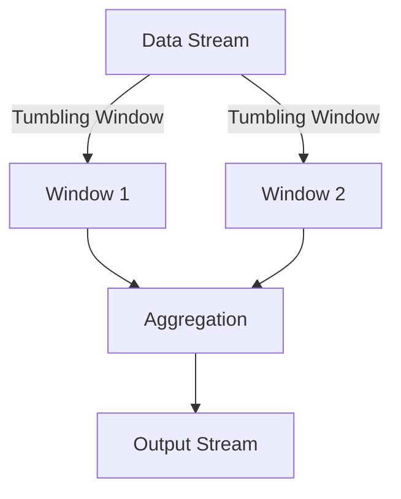

## 8.3.2 Windowing and Aggregations

In the realm of stream processing, windowing and aggregations are pivotal techniques that allow us to derive meaningful insights from continuous data streams. This section delves into the concept of windowing, explores various types of windows, and demonstrates how to implement windowed aggregations effectively, using Apache Flink as a practical example.

### Understanding Windowing in Stream Processing

Windowing is a technique used to divide a continuous stream of data into finite, manageable chunks called windows. These windows facilitate the aggregation of data over specific intervals, making it possible to perform operations like counting, summing, or averaging on a stream of events. By breaking down the stream into windows, we can analyze data in real-time and derive actionable insights.

### Types of Windows

#### Tumbling Windows

Tumbling windows are fixed-size, non-overlapping windows that process data in distinct, consecutive intervals. Each window is independent and does not share data with other windows. This type of window is ideal for scenarios where data needs to be aggregated over consistent time periods, such as hourly sales reports.

**Example:**

Consider a tumbling window of 5 minutes. Events occurring between 00:00 and 00:05 are grouped together, and the window closes at 00:05, after which a new window starts for the next 5-minute interval.

```java
DataStream<Event> input = ...;
DataStream<AggregateResult> result = input
    .keyBy(event -> event.getKey())
    .window(TumblingEventTimeWindows.of(Time.minutes(5)))
    .reduce(new AggregateFunction());
```

#### Sliding Windows

Sliding windows overlap and move forward by a specified interval, allowing for continuous data analysis. They are defined by a window size and a slide interval, which determines how often a new window starts. Sliding windows are useful for scenarios where overlapping data needs to be analyzed, such as calculating a moving average.

**Example:**

A sliding window with a size of 10 minutes and a slide interval of 5 minutes will create windows that overlap, such as 00:00-00:10, 00:05-00:15, and so on.

```java
DataStream<Event> input = ...;
DataStream<AggregateResult> result = input
    .keyBy(event -> event.getKey())
    .window(SlidingEventTimeWindows.of(Time.minutes(10), Time.minutes(5)))
    .reduce(new AggregateFunction());
```

#### Session Windows

Session windows are based on periods of activity separated by inactivity gaps. They are particularly useful for analyzing user sessions or transactions, where the window closes after a specified period of inactivity.

**Example:**

If a session window has a gap duration of 2 minutes, a new window will start when events are received, and it will close if no events are received for 2 minutes.

```java
DataStream<Event> input = ...;
DataStream<AggregateResult> result = input
    .keyBy(event -> event.getKey())
    .window(ProcessingTimeSessionWindows.withGap(Time.minutes(2)))
    .reduce(new AggregateFunction());
```

#### Global Windows

Global windows encompass all events and are often used in conjunction with triggers to define custom window boundaries. They are suitable for scenarios where the windowing logic is complex and cannot be defined by simple time or count-based windows.

**Example:**

Global windows can be used to aggregate data until a specific condition is met, such as a threshold value being reached.

```java
DataStream<Event> input = ...;
DataStream<AggregateResult> result = input
    .keyBy(event -> event.getKey())
    .window(GlobalWindows.create())
    .trigger(new CustomTrigger())
    .reduce(new AggregateFunction());
```

### Implementing Windowed Aggregations

#### Choosing the Right Window Type

Selecting the appropriate window type is crucial and depends on the specific data analysis requirements and event characteristics. Consider the following guidelines:

- **Tumbling Windows:** Use for non-overlapping, fixed-interval aggregations.
- **Sliding Windows:** Use for overlapping data analysis with a need for continuous updates.
- **Session Windows:** Use for user activity or transactional data with variable lengths.
- **Global Windows:** Use for custom aggregation logic or when window boundaries are not predefined.

#### Defining Window Triggers

Triggers determine when to emit the results of a windowed aggregation. They can be time-based, count-based, or custom triggers. For example, a time-based trigger might emit results every minute, while a count-based trigger might emit results after every 100 events.

```java
DataStream<Event> input = ...;
DataStream<AggregateResult> result = input
    .keyBy(event -> event.getKey())
    .window(TumblingEventTimeWindows.of(Time.minutes(5)))
    .trigger(CountTrigger.of(100))
    .reduce(new AggregateFunction());
```

#### Handling Late Arriving Data

Late-arriving data can skew results if not handled properly. Strategies such as using grace periods or watermarking can help manage late events and ensure accurate aggregations.

- **Watermarking:** Assigns a timestamp to events, allowing the system to handle late data by defining a threshold for lateness.
- **Grace Periods:** Allow windows to remain open for a specified duration after their normal closing time to accommodate late events.

```java
env.setStreamTimeCharacteristic(TimeCharacteristic.EventTime);
DataStream<Event> input = ...;
DataStream<AggregateResult> result = input
    .assignTimestampsAndWatermarks(new BoundedOutOfOrdernessTimestampExtractor<Event>(Time.seconds(10)) {
        @Override
        public long extractTimestamp(Event element) {
            return element.getTimestamp();
        }
    })
    .keyBy(event -> event.getKey())
    .window(TumblingEventTimeWindows.of(Time.minutes(5)))
    .allowedLateness(Time.minutes(1))
    .reduce(new AggregateFunction());
```

#### Aggregation Operations

Common aggregation operations within windows include count, sum, average, min, max, and more complex computations like joins and pattern matching. These operations allow for the extraction of meaningful insights from the data.

```java
DataStream<Event> input = ...;
DataStream<AggregateResult> result = input
    .keyBy(event -> event.getKey())
    .window(TumblingEventTimeWindows.of(Time.minutes(5)))
    .aggregate(new AggregateFunction<Event, AggregateResult, AggregateResult>() {
        @Override
        public AggregateResult add(Event value, AggregateResult accumulator) {
            accumulator.add(value);
            return accumulator;
        }

        @Override
        public AggregateResult getResult(AggregateResult accumulator) {
            return accumulator;
        }

        @Override
        public AggregateResult merge(AggregateResult a, AggregateResult b) {
            return a.merge(b);
        }
    });
```

#### State Management for Windows

Windowing requires maintaining state within the stream processing framework to store and update windowed data efficiently. This state management is crucial for ensuring that aggregations are accurate and up-to-date.

#### Optimizing Window Performance

To optimize windowed aggregations for performance, consider minimizing state store accesses and leveraging efficient data structures. Techniques such as pre-aggregating data or using in-memory caches can significantly enhance performance.

#### Visual Examples

Below is a diagram illustrating how windowing and aggregations operate within a stream processing pipeline:



### Example Implementation in Apache Flink

Let's implement a real-time moving average calculation for sensor data streams using Apache Flink. This example demonstrates how to use sliding windows to compute the average temperature from a stream of sensor readings.

```java
import org.apache.flink.streaming.api.datastream.DataStream;
import org.apache.flink.streaming.api.environment.StreamExecutionEnvironment;
import org.apache.flink.streaming.api.windowing.time.Time;
import org.apache.flink.streaming.api.windowing.assigners.SlidingEventTimeWindows;
import org.apache.flink.streaming.api.windowing.windows.TimeWindow;
import org.apache.flink.streaming.api.functions.windowing.WindowFunction;
import org.apache.flink.util.Collector;

public class MovingAverageExample {
    public static void main(String[] args) throws Exception {
        StreamExecutionEnvironment env = StreamExecutionEnvironment.getExecutionEnvironment();

        DataStream<SensorReading> sensorData = env.addSource(new SensorSource());

        DataStream<Double> averageTemperature = sensorData
            .keyBy(SensorReading::getId)
            .window(SlidingEventTimeWindows.of(Time.minutes(10), Time.minutes(5)))
            .apply(new WindowFunction<SensorReading, Double, String, TimeWindow>() {
                @Override
                public void apply(String key, TimeWindow window, Iterable<SensorReading> input, Collector<Double> out) {
                    double sum = 0;
                    int count = 0;
                    for (SensorReading reading : input) {
                        sum += reading.getTemperature();
                        count++;
                    }
                    out.collect(sum / count);
                }
            });

        averageTemperature.print();

        env.execute("Moving Average Example");
    }
}
```

### Conclusion

Windowing and aggregations are essential techniques in stream processing, enabling the extraction of meaningful insights from continuous data streams. By understanding the different types of windows and their applications, you can choose the right approach for your specific use case. Implementing these techniques in frameworks like Apache Flink allows for efficient and scalable real-time data processing.

### Further Reading and Resources

- [Apache Flink Documentation](https://flink.apache.org/documentation.html)
- [Stream Processing with Apache Flink: Fundamentals, Implementation, and Operation of Streaming Applications](https://www.oreilly.com/library/view/stream-processing-with/9781491974285/)
- [Designing Data-Intensive Applications by Martin Kleppmann](https://dataintensive.net/)

## Quiz Time!



### What is windowing in stream processing?

- [x] A technique to divide a continuous stream of data into finite chunks for aggregation
- [ ] A method to enhance data security in streaming applications
- [ ] A process for compressing data streams
- [ ] A way to visualize data streams in real-time

> **Explanation:** Windowing is used to divide continuous data streams into manageable chunks, facilitating meaningful aggregations.

### Which type of window is fixed-size and non-overlapping?

- [x] Tumbling Windows
- [ ] Sliding Windows
- [ ] Session Windows
- [ ] Global Windows

> **Explanation:** Tumbling windows are fixed-size and non-overlapping, processing data in distinct intervals.

### What is a characteristic of sliding windows?

- [x] They overlap and move forward by a specified interval
- [ ] They are based on periods of inactivity
- [ ] They encompass all events without boundaries
- [ ] They are non-overlapping and fixed-size

> **Explanation:** Sliding windows overlap and move forward by a specified interval, allowing continuous data analysis.

### What defines session windows?

- [x] Periods of activity separated by inactivity gaps
- [ ] Fixed-size, non-overlapping intervals
- [ ] Overlapping intervals with a slide interval
- [ ] Unbounded windows encompassing all events

> **Explanation:** Session windows are based on periods of activity separated by inactivity gaps, useful for analyzing user sessions.

### What is a common use case for global windows?

- [x] Custom aggregation logic with undefined boundaries
- [ ] Fixed-interval data aggregation
- [ ] Overlapping data analysis
- [ ] User session analysis

> **Explanation:** Global windows are used for custom aggregation logic where window boundaries are not predefined.

### How can late-arriving data be managed in windowed aggregations?

- [x] Using grace periods or watermarking
- [ ] By ignoring late data
- [ ] By compressing late data
- [ ] By discarding late data

> **Explanation:** Grace periods and watermarking help manage late-arriving data, ensuring accurate aggregations.

### What is a common aggregation operation in windowed processing?

- [x] Count, sum, average, min, max
- [ ] Data encryption
- [ ] Data compression
- [ ] Data visualization

> **Explanation:** Common aggregation operations include count, sum, average, min, and max, among others.

### What is the purpose of state management in windowing?

- [x] To store and update windowed data efficiently
- [ ] To compress data streams
- [ ] To visualize data streams
- [ ] To secure data streams

> **Explanation:** State management is crucial for storing and updating windowed data efficiently in stream processing.

### Which framework is used in the example implementation for windowed aggregations?

- [x] Apache Flink
- [ ] Apache Kafka
- [ ] Apache Spark
- [ ] Apache Storm

> **Explanation:** The example implementation uses Apache Flink for windowed aggregations.

### True or False: Tumbling windows can overlap.

- [ ] True
- [x] False

> **Explanation:** Tumbling windows are non-overlapping, processing data in distinct intervals.


