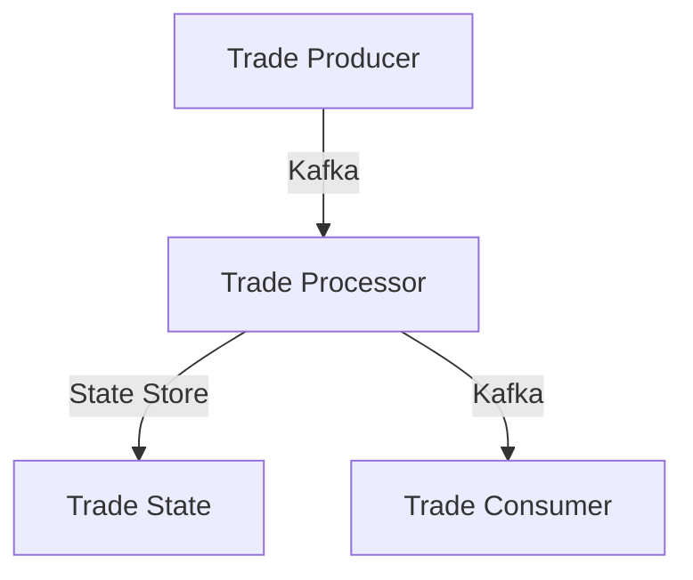

## 8.4.3 Ensuring Consistency and Reliability

In the realm of streaming event-driven architectures (EDA), ensuring consistency and reliability is paramount. As data flows continuously through systems, maintaining a coherent and accurate view of event data across all consumers becomes a complex challenge. This section delves into the intricacies of achieving consistency and reliability in streaming EDA, offering insights, strategies, and practical examples.

### Defining Consistency in Streaming EDA

Consistency in streaming EDA refers to the assurance that all consumers perceive a coherent and accurate view of the event data, irrespective of the order or timing of event processing. This means that despite the inherent asynchrony and distributed nature of streaming systems, the data processed and the state maintained should reflect a consistent and correct state of the world.

### Consistency Challenges in Streaming Systems

Achieving consistency in streaming systems is fraught with challenges:

- **Out-of-Order Event Delivery:** Events may arrive at consumers in a different order than they were produced, leading to potential inconsistencies in state computations.
- **Message Duplication:** Network issues or system retries can result in the same message being delivered multiple times, risking duplicate processing.
- **System Failures:** Failures in processing nodes or network partitions can disrupt the flow of events, leading to incomplete or inconsistent state updates.

### Implementing Exactly-Once Semantics

Exactly-once processing semantics ensure that each event is processed precisely once, without duplication or loss. Streaming frameworks like Apache Flink and Kafka Streams provide robust support for exactly-once semantics through mechanisms such as:

- **Transactional Writes:** Ensuring that state updates and message emissions occur atomically.
- **Idempotent Producers:** Leveraging Kafka's idempotent producer capabilities to prevent duplicate message production.

#### Example: Apache Kafka Streams

```java
Properties props = new Properties();
props.put(StreamsConfig.PROCESSING_GUARANTEE_CONFIG, StreamsConfig.EXACTLY_ONCE_V2);

KafkaStreams streams = new KafkaStreams(topology, props);
streams.start();
```

In this example, Kafka Streams is configured to use exactly-once processing guarantees, ensuring that state updates and message emissions are atomic and consistent.

### Idempotent Processing

Idempotency is crucial for handling duplicate events gracefully. An idempotent operation ensures that applying the same operation multiple times has the same effect as applying it once. This is vital for maintaining consistent state in the face of retries or duplicate messages.

#### Java Example of Idempotent Consumer

```java
public class TradeProcessor {
    private Set<String> processedTradeIds = ConcurrentHashMap.newKeySet();

    public void processTrade(Trade trade) {
        if (processedTradeIds.add(trade.getId())) {
            // Process the trade
            updateTradeState(trade);
        }
    }

    private void updateTradeState(Trade trade) {
        // Update state logic here
    }
}
```

In this example, a `TradeProcessor` ensures that each trade is processed only once by maintaining a set of processed trade IDs.

### State Store Consistency

State stores in streaming systems maintain consistent and durable state information, enabling accurate stateful computations and recovery after failures. These stores are integral to maintaining the consistency of the system's state across restarts and failures.

### Checkpointing and Savepoints

Checkpointing and savepoints are mechanisms used in streaming frameworks to ensure reliable state recovery and consistent processing across system restarts or failures.

- **Checkpointing:** Periodically saves the state of the application to durable storage, allowing recovery to the last checkpoint in case of failure.
- **Savepoints:** Manually triggered snapshots of the application's state, useful for upgrades or migrations.

#### Example: Apache Flink Checkpointing

```java
StreamExecutionEnvironment env = StreamExecutionEnvironment.getExecutionEnvironment();
env.enableCheckpointing(10000); // Checkpoint every 10 seconds
```

Here, Flink is configured to checkpoint the application state every 10 seconds, ensuring that the system can recover to a consistent state after a failure.

### Transactional Messaging

Transactional messaging ensures atomicity in producing and consuming messages, maintaining consistency between event producers and consumers. This is achieved by grouping message sends and state updates into a single transaction.

### Monitoring and Alerting for Consistency

Monitoring consistency metrics and setting up alerting mechanisms are crucial for detecting and responding to consistency breaches promptly. Key metrics include:

- **Lag Metrics:** Measure the delay between event production and consumption.
- **Error Rates:** Track the rate of processing errors or retries.

### Example Implementation: Stock Trade Processing System

Consider a stock trade processing system where consistency and reliability are critical. By leveraging exactly-once semantics, idempotent consumers, and stateful processing, the system can maintain accurate and reliable trade data.

#### System Architecture



In this architecture, trades are produced and consumed via Kafka, with a state store maintaining the current state of trades. The trade processor ensures exactly-once processing and idempotency.

### Best Practices

- **Design for Failure:** Assume failures can occur and implement strategies like retries, compensating transactions, and failover mechanisms.
- **Test Consistency Mechanisms:** Use fault injection and simulated failure scenarios to thoroughly test consistency mechanisms.
- **Implement Strong Monitoring:** Set up comprehensive monitoring of consistency-related metrics to detect and resolve issues proactively.
- **Documentation and Training:** Document consistency strategies and train team members to handle consistency-related challenges effectively.

### Conclusion

Ensuring consistency and reliability in streaming EDA is a multifaceted challenge that requires careful design and implementation. By leveraging exactly-once semantics, idempotent processing, and robust state management, systems can achieve the consistency needed to maintain accurate and reliable data processing. Through diligent monitoring and proactive strategies, these systems can handle the complexities of real-world streaming environments.

## Quiz Time!



### What is consistency in streaming EDA?

- [x] Assurance that all consumers see a coherent and accurate view of the event data
- [ ] Guarantee that events are processed in the order they are received
- [ ] Ensuring that no events are lost during processing
- [ ] Providing high throughput and low latency

> **Explanation:** Consistency in streaming EDA ensures that all consumers perceive a coherent and accurate view of the event data, regardless of the order or timing of event processing.

### Which of the following is a challenge to achieving consistency in streaming systems?

- [x] Out-of-order event delivery
- [ ] High throughput
- [ ] Low latency
- [ ] Efficient resource utilization

> **Explanation:** Out-of-order event delivery is a common challenge in streaming systems that can lead to inconsistencies in state computations.

### How do streaming frameworks like Apache Flink support exactly-once semantics?

- [x] Through transactional writes and idempotent producers
- [ ] By ensuring all events are processed in order
- [ ] By using high-speed networks
- [ ] By reducing the number of events processed

> **Explanation:** Streaming frameworks like Apache Flink support exactly-once semantics through mechanisms such as transactional writes and idempotent producers.

### What is the purpose of idempotent processing in streaming systems?

- [x] To handle duplicate events gracefully
- [ ] To increase processing speed
- [ ] To reduce system complexity
- [ ] To ensure events are processed in order

> **Explanation:** Idempotent processing ensures that duplicate events are handled gracefully, maintaining consistent state despite retries.

### What is checkpointing in streaming frameworks?

- [x] Periodically saving the state of the application to durable storage
- [ ] Ensuring all events are processed in order
- [ ] Reducing the number of events processed
- [ ] Increasing processing speed

> **Explanation:** Checkpointing involves periodically saving the state of the application to durable storage, allowing recovery to the last checkpoint in case of failure.

### What is the role of transactional messaging in streaming systems?

- [x] Ensuring atomicity in producing and consuming messages
- [ ] Increasing processing speed
- [ ] Reducing system complexity
- [ ] Ensuring events are processed in order

> **Explanation:** Transactional messaging ensures atomicity in producing and consuming messages, maintaining consistency between event producers and consumers.

### Which metric is important for monitoring consistency in streaming systems?

- [x] Lag Metrics
- [ ] CPU Usage
- [ ] Memory Consumption
- [ ] Network Bandwidth

> **Explanation:** Lag metrics measure the delay between event production and consumption, which is crucial for monitoring consistency.

### What is a best practice for ensuring consistency in streaming systems?

- [x] Design for failure
- [ ] Increase processing speed
- [ ] Reduce system complexity
- [ ] Ensure all events are processed in order

> **Explanation:** Designing for failure involves implementing strategies like retries and compensating transactions to handle potential failures.

### Why is documentation and training important in ensuring consistency?

- [x] To handle consistency-related challenges effectively
- [ ] To increase processing speed
- [ ] To reduce system complexity
- [ ] To ensure events are processed in order

> **Explanation:** Documentation and training are important for equipping team members to handle consistency-related challenges effectively.

### True or False: Exactly-once semantics guarantee that each event is processed precisely once.

- [x] True
- [ ] False

> **Explanation:** Exactly-once semantics ensure that each event is processed precisely once, without duplication or loss.


