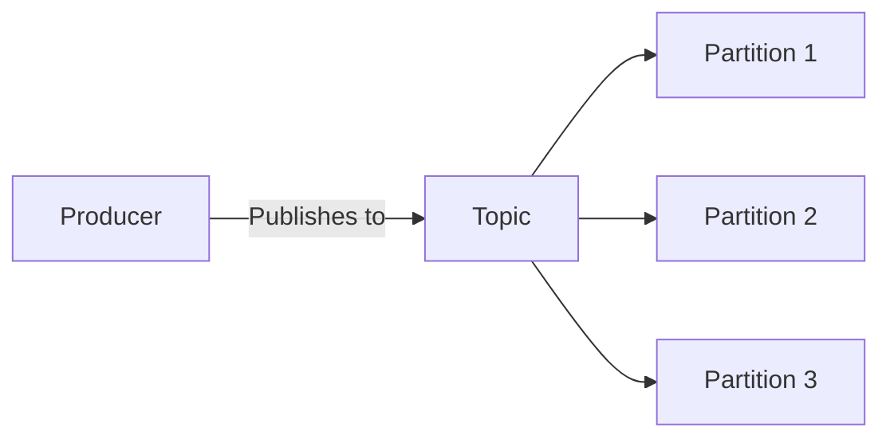
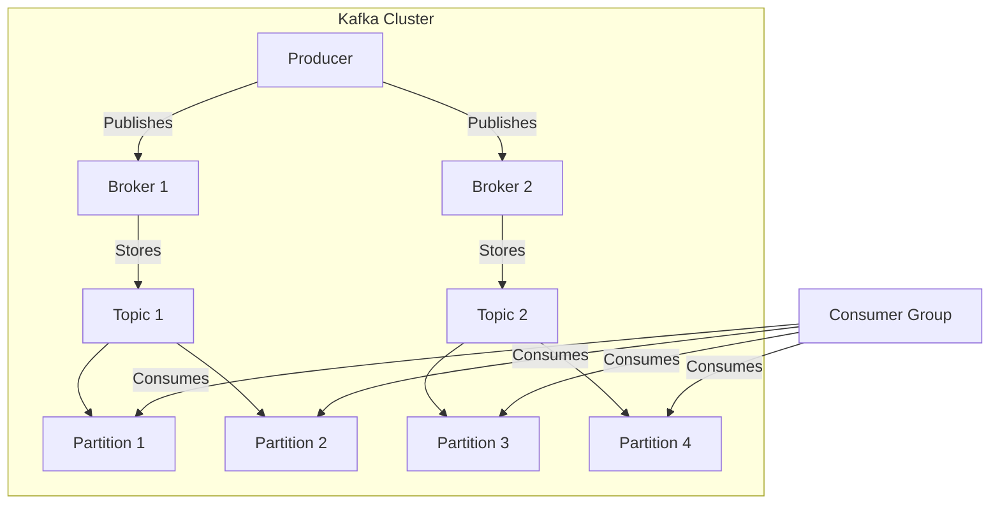

## 9.2.1 Architecture and Components

Apache Kafka is a distributed event streaming platform capable of handling trillions of events a day. It is designed to provide a unified, high-throughput, low-latency platform for handling real-time data feeds. In this section, we will delve into the architecture and components that make Kafka a robust choice for event-driven architectures.

### Core Components Overview

At the heart of Apache Kafka's architecture are several key components that work together to provide a seamless event streaming experience:

- **Producers:** Entities that publish data to Kafka topics.
- **Brokers:** Servers that store and manage messages.
- **Topics:** Categories or feeds to which records are published.
- **Partitions:** Subdivisions within topics for scalability.
- **Consumers:** Entities that read data from topics.
- **Consumer Groups:** Collections of consumers that work together for load balancing.
- **Zookeeper:** A service for coordinating distributed systems, used by Kafka for managing cluster metadata.

Let's explore each of these components in detail.

### Producers

Producers are responsible for publishing messages to Kafka topics. They send data to the Kafka cluster, specifying the target topic and potentially the partition within that topic. Here are some key aspects of producers:

- **Configuration Options:** Producers can be configured to specify the target topic, choose partitioning strategies (e.g., round-robin, hash-based), and select message serialization formats (e.g., Avro, JSON, Protobuf).
- **Partitioning Strategies:** Producers can decide how to distribute messages across partitions. This can be random, round-robin, or based on a key, which ensures that all messages with the same key are sent to the same partition.
- **Message Serialization:** Producers serialize messages before sending them to Kafka. This ensures that the data is in a format that Kafka can store and consumers can later deserialize.

```java
import org.apache.kafka.clients.producer.KafkaProducer;
import org.apache.kafka.clients.producer.ProducerRecord;
import org.apache.kafka.clients.producer.ProducerConfig;
import org.apache.kafka.common.serialization.StringSerializer;

import java.util.Properties;

public class SimpleProducer {
    public static void main(String[] args) {
        Properties props = new Properties();
        props.put(ProducerConfig.BOOTSTRAP_SERVERS_CONFIG, "localhost:9092");
        props.put(ProducerConfig.KEY_SERIALIZER_CLASS_CONFIG, StringSerializer.class.getName());
        props.put(ProducerConfig.VALUE_SERIALIZER_CLASS_CONFIG, StringSerializer.class.getName());

        KafkaProducer<String, String> producer = new KafkaProducer<>(props);
        ProducerRecord<String, String> record = new ProducerRecord<>("my-topic", "key", "value");

        producer.send(record);
        producer.close();
    }
}
```

### Brokers

Kafka brokers are the servers that store and manage the persistence of messages. They handle client requests and facilitate message distribution across the cluster. Each Kafka cluster consists of multiple brokers:

- **Message Storage:** Brokers store messages in a fault-tolerant manner. Each message is assigned an offset, which is a unique identifier within a partition.
- **Handling Requests:** Brokers handle requests from producers to publish messages and from consumers to fetch messages.
- **Cluster Management:** Brokers work together to manage the Kafka cluster, ensuring that data is replicated and balanced across the cluster.

### Topics and Partitions

Topics in Kafka are categories or feeds to which messages are published. Each topic can have multiple partitions, which are the fundamental units of parallelism in Kafka:

- **Topics:** Serve as logical channels for message streams. Each topic is identified by a unique name within the Kafka cluster.
- **Partitions:** Allow Kafka to scale horizontally. Each partition is an ordered, immutable sequence of messages that is continually appended to—a structured commit log.



### Consumers and Consumer Groups

Consumers read messages from topics. They can operate independently or as part of a consumer group:

- **Consumers:** Fetch data from Kafka topics. Each consumer maintains an offset to keep track of which messages have been read.
- **Consumer Groups:** Allow multiple consumers to collaboratively consume messages. Each partition in a topic is consumed by only one consumer in the group, enabling load balancing and fault tolerance.

### Zookeeper Integration

Apache Zookeeper plays a crucial role in managing Kafka’s cluster metadata, leader election, and configuration management. However, Kafka is moving towards removing Zookeeper dependencies with the introduction of KRaft mode:

- **Cluster Metadata Management:** Zookeeper manages metadata about topics, partitions, and brokers.
- **Leader Election:** Ensures that each partition has a leader broker responsible for handling all reads and writes for that partition.
- **Configuration Management:** Stores configuration data for Kafka brokers and topics.

### Replication and Fault Tolerance

Kafka’s replication mechanism ensures that each partition is replicated across multiple brokers, providing data redundancy and resilience against broker failures:

- **Replication Factor:** Determines how many copies of each partition are maintained across the cluster.
- **Leader and Followers:** Each partition has one leader and multiple followers. The leader handles all reads and writes, while followers replicate the data.

### In-memory Caching and Log Compaction

Kafka uses in-memory caching for high-throughput message access and log compaction to retain the latest state of a key:

- **In-memory Caching:** Enhances performance by allowing quick access to recently produced messages.
- **Log Compaction:** Retains the latest update for each key, supporting use cases like stateful stream processing and changelog storage.

### Stream Processing Integration

Kafka Streams and kSQL are Kafka’s native stream processing libraries, enabling real-time data processing and analytics directly within the Kafka ecosystem:

- **Kafka Streams:** A Java library for building real-time applications and microservices.
- **kSQL:** A SQL-like interface for stream processing, allowing users to perform real-time analytics on Kafka data.

### Visual Architecture Diagram

Below is a visual representation of Kafka’s architecture, illustrating how producers, brokers, topics, partitions, and consumers interact within a Kafka cluster:



### Conclusion

Apache Kafka's architecture is designed to provide a robust, scalable, and fault-tolerant platform for event-driven systems. By understanding its core components—producers, brokers, topics, partitions, consumers, and consumer groups—you can effectively leverage Kafka to build powerful event-driven applications. Additionally, Kafka's integration with Zookeeper, replication mechanisms, and stream processing capabilities make it a versatile choice for a wide range of use cases.

## Quiz Time!



### What is the primary role of a Kafka producer?

- [x] To publish messages to Kafka topics
- [ ] To consume messages from Kafka topics
- [ ] To store messages in Kafka brokers
- [ ] To manage Kafka cluster metadata

> **Explanation:** Producers are responsible for publishing messages to Kafka topics.

### What is a Kafka broker?

- [ ] A client that consumes messages
- [x] A server that stores and manages messages
- [ ] A tool for stream processing
- [ ] A configuration management system

> **Explanation:** Kafka brokers are servers that store and manage the persistence of messages.

### How does Kafka ensure data redundancy and resilience?

- [ ] By using consumer groups
- [ ] By using in-memory caching
- [x] By replicating partitions across multiple brokers
- [ ] By using Zookeeper

> **Explanation:** Kafka replicates each partition across multiple brokers to ensure data redundancy and resilience.

### What is the purpose of Kafka's log compaction?

- [ ] To increase message throughput
- [x] To retain the latest state of a key
- [ ] To manage cluster metadata
- [ ] To handle leader election

> **Explanation:** Log compaction retains the latest update for each key, supporting use cases like stateful stream processing.

### Which component is responsible for managing Kafka's cluster metadata?

- [ ] Producers
- [ ] Consumers
- [ ] Brokers
- [x] Zookeeper

> **Explanation:** Zookeeper manages Kafka's cluster metadata, leader election, and configuration management.

### What is a Kafka topic?

- [x] A category or feed to which messages are published
- [ ] A server that stores messages
- [ ] A client that consumes messages
- [ ] A configuration management system

> **Explanation:** Topics are categories or feeds to which records are published in Kafka.

### How do consumer groups enhance Kafka's scalability?

- [ ] By storing messages in memory
- [x] By allowing multiple consumers to collaboratively consume messages
- [ ] By managing cluster metadata
- [ ] By replicating partitions

> **Explanation:** Consumer groups allow multiple consumers to collaboratively consume messages, enhancing scalability and fault tolerance.

### What is the role of Kafka Streams?

- [ ] To manage Kafka cluster metadata
- [ ] To publish messages to Kafka topics
- [x] To enable real-time data processing and analytics
- [ ] To store messages in Kafka brokers

> **Explanation:** Kafka Streams is a Java library for building real-time applications and microservices.

### What does the replication factor in Kafka determine?

- [ ] The number of consumers in a group
- [x] The number of copies of each partition maintained across the cluster
- [ ] The number of brokers in a cluster
- [ ] The number of messages in a topic

> **Explanation:** The replication factor determines how many copies of each partition are maintained across the cluster.

### True or False: Kafka is moving towards removing Zookeeper dependencies with the introduction of KRaft mode.

- [x] True
- [ ] False

> **Explanation:** Kafka is indeed moving towards removing Zookeeper dependencies with the introduction of KRaft mode.


