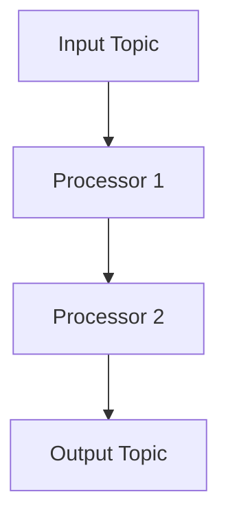
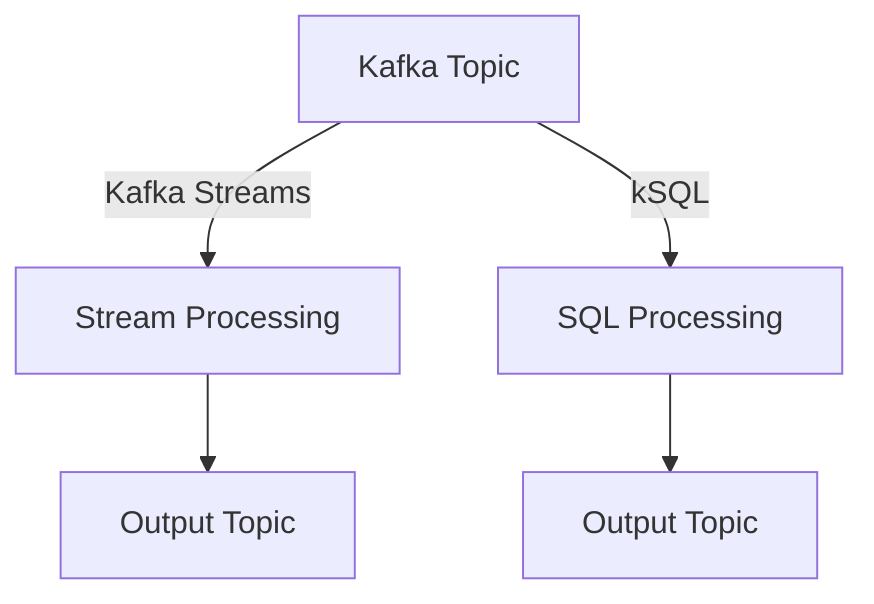

## 9.2.2 Kafka Streams and kSQL

In the realm of event-driven architectures, Apache Kafka stands out as a powerful platform for handling real-time data streams. Two of its most compelling components for stream processing are Kafka Streams and kSQL (now known as ksqlDB). These tools enable developers to build robust, scalable, and fault-tolerant applications that process data in real-time. In this section, we will delve into the capabilities of Kafka Streams and kSQL, providing insights into their features, implementation, and best practices.

### Introduction to Kafka Streams

#### Define Kafka Streams

Kafka Streams is a lightweight, client-side library designed for building scalable and fault-tolerant stream processing applications. It integrates seamlessly with Apache Kafka, allowing developers to process data in real-time as it flows through Kafka topics. Kafka Streams abstracts the complexities of distributed stream processing, providing a simple yet powerful API for defining data processing pipelines.

#### Key Features

Kafka Streams offers several key features that make it an attractive choice for stream processing:

- **Stateful Processing:** Kafka Streams supports stateful operations such as aggregations, joins, and windowed computations. It maintains state using state stores, which are backed by Kafka topics for durability and fault tolerance.
- **Windowed Operations:** It allows for time-based operations, enabling developers to perform computations over sliding or tumbling windows.
- **Fault Tolerance:** By leveraging Kafka’s replication and log-based storage, Kafka Streams ensures fault tolerance and data recovery.
- **Seamless Scalability:** Kafka Streams applications can be scaled horizontally by deploying multiple instances, each processing a portion of the data.

#### Stream Processing Topology

In Kafka Streams, a stream processing topology is defined using a Domain Specific Language (DSL). This topology consists of sources (input topics), processors (transformations), and sinks (output topics). The following diagram illustrates a simple Kafka Streams topology:



This topology represents a data flow where messages from an input topic are processed through a series of transformations before being written to an output topic.

#### State Stores

State stores are a crucial component of Kafka Streams, enabling stateful operations. They provide a mechanism for storing and retrieving state information during stream processing. State stores are backed by Kafka topics, ensuring that state is durable and can be recovered in case of failures.

#### Interactive Queries

Kafka Streams supports interactive queries, allowing applications to expose state information for real-time querying. This feature enables developers to build applications that not only process streams but also provide insights into the processed data.

#### Example Implementation

Let's look at a simple example of a Kafka Streams application that reads from an input topic, filters messages based on a condition, and writes the results to an output topic.

```java
import org.apache.kafka.common.serialization.Serdes;
import org.apache.kafka.streams.KafkaStreams;
import org.apache.kafka.streams.StreamsBuilder;
import org.apache.kafka.streams.StreamsConfig;
import org.apache.kafka.streams.kstream.KStream;

import java.util.Properties;

public class SimpleKafkaStreamsApp {
    public static void main(String[] args) {
        Properties props = new Properties();
        props.put(StreamsConfig.APPLICATION_ID_CONFIG, "streams-app");
        props.put(StreamsConfig.BOOTSTRAP_SERVERS_CONFIG, "localhost:9092");
        props.put(StreamsConfig.DEFAULT_KEY_SERDE_CLASS_CONFIG, Serdes.String().getClass());
        props.put(StreamsConfig.DEFAULT_VALUE_SERDE_CLASS_CONFIG, Serdes.String().getClass());

        StreamsBuilder builder = new StreamsBuilder();
        KStream<String, String> sourceStream = builder.stream("input-topic");

        KStream<String, String> filteredStream = sourceStream.filter(
            (key, value) -> value.contains("important")
        );

        filteredStream.to("output-topic");

        KafkaStreams streams = new KafkaStreams(builder.build(), props);
        streams.start();

        Runtime.getRuntime().addShutdownHook(new Thread(streams::close));
    }
}
```

In this example, the application reads messages from `input-topic`, filters messages containing the word "important", and writes the filtered messages to `output-topic`.

#### Deployment Considerations

When deploying Kafka Streams applications, consider the following best practices:

- **Instance Parallelism:** Configure the number of instances based on the expected data volume and processing requirements. More instances can improve throughput and fault tolerance.
- **State Store Management:** Ensure that state stores are properly configured and monitored to handle the expected state size and access patterns.
- **Stream Rebalancing:** Be aware of how Kafka Streams handles rebalancing when instances are added or removed, as this can impact processing performance.

#### Monitoring and Debugging

Monitoring Kafka Streams applications is crucial for ensuring performance and reliability. Use JMX metrics to track application health and performance. Integrate with monitoring tools like Prometheus and Grafana for real-time insights and alerting.

### Introduction to kSQL

#### Define kSQL

kSQL, now known as ksqlDB, is a streaming SQL engine for Apache Kafka that enables real-time data processing using SQL-like queries. It provides a powerful and intuitive way to perform stream processing without writing complex code.

#### Key Features

kSQL offers several features that make it a compelling choice for stream processing:

- **SQL-Like Queries:** Use familiar SQL syntax to define data transformations and processing logic.
- **Real-Time Transformations:** Perform real-time transformations, aggregations, and joins on streaming data.
- **Interactive Query Capabilities:** Enable interactive queries for real-time insights into streaming data.

#### Declarative Query Language

kSQL provides a declarative approach to stream processing, allowing users to define data transformations using SQL-like syntax. This makes it accessible to a wide range of users, including those without extensive programming experience.

#### Creating Streams and Tables

In kSQL, streams represent continuous flows of immutable events, while tables represent stateful, changelog-based datasets. Streams are suitable for processing event data, while tables are used for maintaining state and performing aggregations.

#### Integration with Kafka Topics

kSQL interacts with Kafka topics by creating logical abstractions (streams and tables) that map directly to underlying Kafka topics. This integration enables seamless data ingestion and output.

#### Example Query

Here is an example of a kSQL query that creates a stream from a Kafka topic, filters events, and outputs the results to another topic:

```sql
CREATE STREAM important_events AS
SELECT *
FROM input_topic
WHERE value LIKE '%important%';
```

This query creates a new stream `important_events` that contains only the events from `input_topic` where the value includes the word "important".

#### Deployment and Management

kSQL can be deployed in various configurations, including standalone, distributed, and managed service deployments. Consider the following best practices:

- **Scaling:** Scale kSQL clusters based on data volume and query complexity.
- **Management:** Use tools like Confluent Control Center for managing and monitoring kSQL deployments.

#### Monitoring and Optimization

Monitor kSQL performance using built-in tools and integrations. Optimize query execution by analyzing query plans and adjusting configurations as needed. Troubleshoot common issues by examining logs and metrics.

### Comparative Overview

#### Kafka Streams vs. kSQL

Kafka Streams and kSQL offer different approaches to stream processing:

- **Kafka Streams:** Provides a programmatic approach, suitable for complex stateful aggregations and custom application logic. Ideal for developers comfortable with Java programming.
- **kSQL:** Offers a declarative SQL-based approach, suitable for rapid prototyping, real-time data dashboards, and simple transformations. Accessible to users familiar with SQL.

#### Use Case Examples

- **Kafka Streams:** Use for applications requiring complex transformations, stateful processing, and custom logic.
- **kSQL:** Use for applications needing quick setup, real-time analytics, and straightforward transformations.

#### Integration Capabilities

Both Kafka Streams and kSQL integrate seamlessly with other Kafka components, enabling comprehensive stream processing and analytics within the Kafka ecosystem.

### Visual Diagrams

The following diagram illustrates the workflow and architecture of Kafka Streams and kSQL applications:



This diagram shows how Kafka Streams and kSQL interact with Kafka topics to perform real-time data processing.

### Conclusion

Kafka Streams and kSQL are powerful tools for building event-driven architectures that require real-time data processing. By understanding their features, implementation, and best practices, developers can choose the right tool for their specific use case, whether it involves complex stream processing or rapid prototyping with SQL.

## Quiz Time!



### What is Kafka Streams?

- [x] A lightweight, client library for building scalable and fault-tolerant stream processing applications.
- [ ] A server-side component of Apache Kafka for managing topics.
- [ ] A database management system for storing Kafka data.
- [ ] A messaging protocol used by Kafka for communication.

> **Explanation:** Kafka Streams is a client library designed for building stream processing applications that work with Apache Kafka.

### Which feature of Kafka Streams allows for stateful operations?

- [x] State Stores
- [ ] Kafka Connect
- [ ] Topic Partitions
- [ ] Consumer Groups

> **Explanation:** State stores in Kafka Streams enable stateful operations like aggregations and joins.

### What is the primary language used for defining Kafka Streams topologies?

- [x] Java
- [ ] Python
- [ ] SQL
- [ ] JavaScript

> **Explanation:** Kafka Streams topologies are typically defined using Java, leveraging its DSL for stream processing.

### What is kSQL?

- [x] A streaming SQL engine for Apache Kafka that enables real-time data processing using SQL-like queries.
- [ ] A configuration tool for Apache Kafka.
- [ ] A database system for storing Kafka messages.
- [ ] A protocol for securing Kafka communications.

> **Explanation:** kSQL is a streaming SQL engine that allows users to process Kafka streams using SQL-like queries.

### In kSQL, what does a stream represent?

- [x] A continuous flow of immutable events.
- [ ] A static dataset stored in Kafka.
- [ ] A configuration file for Kafka topics.
- [ ] A batch processing job in Kafka.

> **Explanation:** In kSQL, a stream represents a continuous flow of immutable events from Kafka topics.

### Which deployment option is NOT available for kSQL?

- [ ] Standalone
- [ ] Distributed
- [ ] Managed Service
- [x] Embedded in Kafka Broker

> **Explanation:** kSQL is not embedded in Kafka brokers; it can be deployed standalone, distributed, or as a managed service.

### What is a key advantage of using kSQL over Kafka Streams?

- [x] Rapid prototyping with SQL-like syntax.
- [ ] Ability to write custom Java code.
- [ ] Built-in support for machine learning models.
- [ ] Direct integration with Hadoop.

> **Explanation:** kSQL allows for rapid prototyping using SQL-like syntax, making it accessible for users familiar with SQL.

### How does Kafka Streams achieve fault tolerance?

- [x] By leveraging Kafka’s replication and log-based storage.
- [ ] By using a centralized database for state management.
- [ ] By running on a single node with backup.
- [ ] By using external caching systems.

> **Explanation:** Kafka Streams achieves fault tolerance through Kafka’s replication and log-based storage.

### What is the purpose of interactive queries in Kafka Streams?

- [x] To allow real-time querying of state information.
- [ ] To configure Kafka brokers dynamically.
- [ ] To manage Kafka topic partitions.
- [ ] To send alerts for Kafka topic changes.

> **Explanation:** Interactive queries in Kafka Streams allow applications to expose state information for real-time querying.

### True or False: Kafka Streams and kSQL can both be used for real-time data processing in Apache Kafka.

- [x] True
- [ ] False

> **Explanation:** Both Kafka Streams and kSQL are designed for real-time data processing within the Apache Kafka ecosystem.


