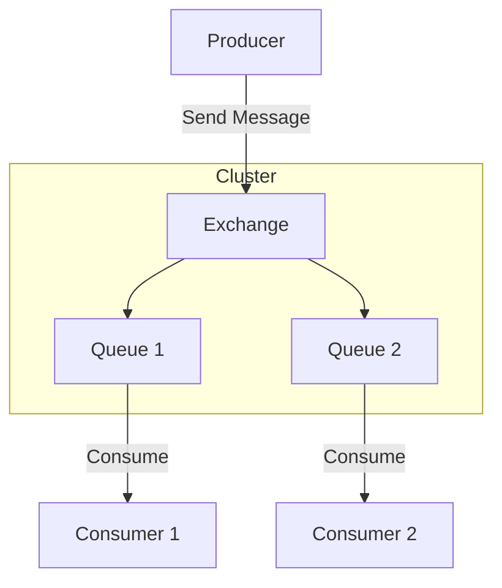

## 9.3.1 Core Features

RabbitMQ is a robust, open-source message broker that facilitates communication between distributed systems through message queuing. It is widely used in event-driven architectures for its reliability, flexibility, and support for various messaging patterns. In this section, we will explore the core features of RabbitMQ, providing insights into its capabilities and practical applications.

### Message Queuing

At the heart of RabbitMQ is its message queuing system, which allows producers to send messages to queues and consumers to receive them asynchronously. This decoupling of producers and consumers enables systems to handle varying loads and ensures that messages are processed even if the consumer is temporarily unavailable.

**Java Example: Sending and Receiving Messages**

```java
import com.rabbitmq.client.*;

public class RabbitMQExample {
    private final static String QUEUE_NAME = "hello";

    public static void main(String[] argv) throws Exception {
        ConnectionFactory factory = new ConnectionFactory();
        factory.setHost("localhost");
        try (Connection connection = factory.newConnection();
             Channel channel = connection.createChannel()) {
            channel.queueDeclare(QUEUE_NAME, false, false, false, null);
            String message = "Hello World!";
            channel.basicPublish("", QUEUE_NAME, null, message.getBytes());
            System.out.println(" [x] Sent '" + message + "'");

            DeliverCallback deliverCallback = (consumerTag, delivery) -> {
                String receivedMessage = new String(delivery.getBody(), "UTF-8");
                System.out.println(" [x] Received '" + receivedMessage + "'");
            };
            channel.basicConsume(QUEUE_NAME, true, deliverCallback, consumerTag -> { });
        }
    }
}
```

### Exchange Types

RabbitMQ uses exchanges to route messages to one or more queues. There are several types of exchanges, each supporting different routing mechanisms:

- **Direct Exchange:** Routes messages with a specific routing key to the queues that are bound with the same key.
- **Fanout Exchange:** Broadcasts messages to all queues bound to it, ignoring routing keys.
- **Topic Exchange:** Routes messages to queues based on wildcard matches between the routing key and the routing pattern specified in the binding.
- **Headers Exchange:** Uses message header attributes for routing, allowing complex routing logic based on multiple criteria.

**Example: Direct Exchange with Routing Key**

```java
channel.exchangeDeclare("direct_logs", "direct");
String severity = "info";
String message = "Log message";
channel.basicPublish("direct_logs", severity, null, message.getBytes());
```

### Routing Keys and Binding

Routing keys and bindings are essential for directing messages from exchanges to queues. A routing key is a message attribute, while a binding is a link between an exchange and a queue with a specific routing key pattern.

**Example: Binding a Queue to an Exchange**

```java
channel.queueBind("queue_name", "exchange_name", "routing_key");
```

### Message Acknowledgments

RabbitMQ provides a robust acknowledgment system to ensure messages are reliably processed. Consumers can acknowledge messages after processing, allowing RabbitMQ to remove them from the queue. If a consumer fails to acknowledge a message, RabbitMQ can re-deliver it to another consumer.

**Example: Message Acknowledgment**

```java
boolean autoAck = false;
channel.basicConsume(QUEUE_NAME, autoAck, (consumerTag, delivery) -> {
    String message = new String(delivery.getBody(), "UTF-8");
    System.out.println(" [x] Received '" + message + "'");
    channel.basicAck(delivery.getEnvelope().getDeliveryTag(), false);
}, consumerTag -> { });
```

### Durable Queues and Persistent Messages

RabbitMQ supports durable queues and persistent messages to ensure data persistence across broker restarts. Durable queues survive broker restarts, while persistent messages are stored on disk.

**Example: Declaring a Durable Queue**

```java
channel.queueDeclare(QUEUE_NAME, true, false, false, null);
```

### Clustering and High Availability

RabbitMQ's clustering capabilities allow multiple broker nodes to work together, providing high availability and load balancing. Clustering ensures that if one node fails, others can take over, minimizing downtime.

**Diagram: RabbitMQ Cluster Architecture**



### Virtual Hosts and Permissions

RabbitMQ uses virtual hosts to create isolated environments within a single instance. Each virtual host can have its own queues, exchanges, and bindings. Permissions and user roles manage access, ensuring secure and organized message handling.

**Example: Creating a Virtual Host**

```bash
rabbitmqctl add_vhost /my_vhost
rabbitmqctl set_permissions -p /my_vhost my_user ".*" ".*" ".*"
```

### API and Protocol Support

RabbitMQ supports multiple messaging protocols, including AMQP, MQTT, and STOMP, and offers various client libraries for different programming languages. This broad compatibility makes RabbitMQ suitable for diverse applications and environments.

### Management and Monitoring Tools

RabbitMQ's management plugin provides a web-based UI for monitoring queues, exchanges, and connections. It also allows for managing broker configurations, making it easier to oversee and maintain RabbitMQ deployments.

**Screenshot: RabbitMQ Management UI**


### Best Practices and Common Pitfalls

- **Best Practices:**
  - Use durable queues and persistent messages for critical data.
  - Implement proper message acknowledgment to avoid message loss.
  - Regularly monitor and manage RabbitMQ using the management plugin.

- **Common Pitfalls:**
  - Overlooking the need for clustering in high-availability scenarios.
  - Failing to configure proper permissions and virtual hosts, leading to security vulnerabilities.

### Conclusion

RabbitMQ's core features make it a powerful tool for building reliable and scalable event-driven systems. By understanding and leveraging these features, developers can create robust applications that efficiently handle messaging across distributed systems.

## Quiz Time!



### What is the primary function of RabbitMQ's message queuing system?

- [x] To decouple producers and consumers, allowing asynchronous message processing
- [ ] To synchronize data between databases
- [ ] To provide real-time analytics
- [ ] To encrypt messages for security

> **Explanation:** RabbitMQ's message queuing system decouples producers and consumers, enabling asynchronous message processing and handling varying loads.

### Which RabbitMQ exchange type broadcasts messages to all bound queues?

- [ ] Direct Exchange
- [x] Fanout Exchange
- [ ] Topic Exchange
- [ ] Headers Exchange

> **Explanation:** A Fanout Exchange broadcasts messages to all queues bound to it, ignoring routing keys.

### How does RabbitMQ ensure messages are reliably processed by consumers?

- [ ] By encrypting messages
- [x] Through message acknowledgments
- [ ] By using virtual hosts
- [ ] By clustering nodes

> **Explanation:** RabbitMQ uses message acknowledgments to ensure messages are reliably processed and not lost in case of consumer failures.

### What is the purpose of durable queues in RabbitMQ?

- [ ] To encrypt messages
- [x] To survive broker restarts
- [ ] To provide real-time analytics
- [ ] To synchronize data between databases

> **Explanation:** Durable queues in RabbitMQ survive broker restarts, ensuring message persistence.

### Which protocol is NOT supported by RabbitMQ?

- [ ] AMQP
- [ ] MQTT
- [ ] STOMP
- [x] HTTP

> **Explanation:** RabbitMQ supports AMQP, MQTT, and STOMP, but not HTTP as a messaging protocol.

### What is the role of virtual hosts in RabbitMQ?

- [ ] To encrypt messages
- [ ] To provide real-time analytics
- [x] To create isolated environments within a single instance
- [ ] To synchronize data between databases

> **Explanation:** Virtual hosts in RabbitMQ create isolated environments within a single instance, each with its own queues, exchanges, and bindings.

### Which RabbitMQ feature allows multiple broker nodes to work together?

- [ ] Virtual Hosts
- [ ] Message Acknowledgments
- [x] Clustering
- [ ] Durable Queues

> **Explanation:** Clustering allows multiple RabbitMQ broker nodes to work together, providing high availability and load balancing.

### What is a common pitfall when using RabbitMQ?

- [ ] Using durable queues for critical data
- [x] Overlooking the need for clustering in high-availability scenarios
- [ ] Implementing message acknowledgments
- [ ] Regularly monitoring RabbitMQ

> **Explanation:** A common pitfall is overlooking the need for clustering in high-availability scenarios, which can lead to downtime if a node fails.

### Which exchange type uses message header attributes for routing?

- [ ] Direct Exchange
- [ ] Fanout Exchange
- [ ] Topic Exchange
- [x] Headers Exchange

> **Explanation:** Headers Exchange uses message header attributes for routing, allowing complex routing logic based on multiple criteria.

### RabbitMQ supports multiple messaging protocols, including AMQP, MQTT, and STOMP.

- [x] True
- [ ] False

> **Explanation:** RabbitMQ supports multiple messaging protocols, including AMQP, MQTT, and STOMP, enabling broad compatibility with different applications and languages.


