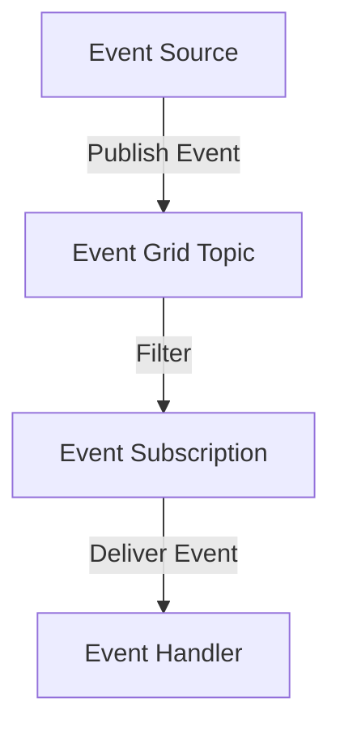

## 9.4.2 Azure Event Grid

Azure Event Grid is a powerful, fully managed event routing service provided by Microsoft Azure. It facilitates the creation of event-driven architectures by seamlessly connecting event sources to event handlers. This service is designed to simplify the development of reactive systems by enabling real-time event distribution across various Azure services and third-party applications.

### Overview of Azure Event Grid

Azure Event Grid acts as a central hub for managing and routing events from multiple sources to various destinations. It is designed to handle millions of events per second, providing a scalable and reliable solution for event-driven applications. By decoupling event producers from event consumers, Azure Event Grid allows developers to build flexible and responsive systems that can react to changes in real-time.

### Event Sources and Handlers

Azure Event Grid supports a wide range of event sources and handlers, making it a versatile choice for building event-driven applications.

#### Built-in Azure Event Sources

Azure Event Grid integrates natively with several Azure services, allowing these services to automatically send events to Event Grid. Some of the key built-in event sources include:

- **Azure Blob Storage:** Automatically triggers events when a blob is created, updated, or deleted.
- **Azure Resource Groups:** Sends events related to resource group changes, such as resource creation or deletion.
- **Azure Functions:** Can be triggered by events from Event Grid, enabling serverless processing of events.

These integrations make it easy to build workflows that respond to changes in Azure resources without the need for custom polling or monitoring solutions.

#### Custom Event Sources

In addition to built-in sources, Azure Event Grid allows developers to create custom event sources. This is achieved by publishing events to Event Grid using HTTP APIs or SDKs. Developers can define custom topics to organize and manage these events, providing a flexible way to integrate external systems and applications into the event-driven architecture.

```java
// Example of publishing a custom event to Azure Event Grid using Java SDK
import com.azure.messaging.eventgrid.EventGridPublisherClientBuilder;
import com.azure.messaging.eventgrid.models.EventGridEvent;

import java.util.Collections;

public class CustomEventPublisher {
    public static void main(String[] args) {
        String endpoint = "<your-event-grid-topic-endpoint>";
        String key = "<your-event-grid-key>";

        EventGridPublisherClientBuilder clientBuilder = new EventGridPublisherClientBuilder()
                .endpoint(endpoint)
                .credential(new AzureKeyCredential(key));

        EventGridEvent event = new EventGridEvent(
                "SampleEventSubject",
                "SampleEventType",
                "1.0",
                Collections.singletonMap("data", "Sample event data")
        );

        clientBuilder.buildClient().sendEvent(event);
        System.out.println("Event published successfully.");
    }
}
```

#### Event Handlers

Azure Event Grid supports a variety of event handlers, enabling diverse event-driven workflows. Some of the supported handlers include:

- **Azure Functions:** Execute serverless code in response to events.
- **Logic Apps:** Automate workflows and integrate with other services.
- **Webhooks:** Deliver events to custom endpoints for further processing.
- **Event Hubs:** Stream events to other systems for analytics or processing.

These handlers allow developers to build complex workflows that react to events in real-time, enhancing the responsiveness and flexibility of their applications.

### Event Topics and Subscriptions

Azure Event Grid uses topics and subscriptions to organize and manage events.

#### Custom Topics

Custom topics are logical endpoints where custom events are published. They provide a way to categorize and manage events, enabling developers to organize their event-driven architecture effectively.

#### System Topics

System topics are automatically created by Azure services and simplify event consumption from native Azure resources. They eliminate the need for manual configuration, allowing developers to focus on building their applications.

#### Subscriptions and Filtering

Event Grid subscriptions allow users to define filters based on event properties. This ensures that only relevant events are delivered to specific handlers, reducing unnecessary processing and improving system efficiency.



#### Dead-lettering and Retry Policies

Azure Event Grid provides robust mechanisms for handling failed event deliveries. Dead-lettering allows events that cannot be delivered to be stored for later inspection, while retry policies ensure that transient failures do not result in lost events. These features enhance the reliability of event-driven systems by ensuring that all events are processed correctly.

### Schema Validation and Enrichment

Azure Event Grid supports schema validation and event enrichment, allowing developers to standardize event formats and add additional context to event payloads. This ensures that events are consistent and contain all necessary information for processing.

### Security Features

Security is a critical aspect of any event-driven architecture. Azure Event Grid provides several features to secure event publishing and handling:

- **Shared Access Signatures (SAS):** Securely authenticate requests to Event Grid.
- **Managed Identities:** Simplify identity management and authentication.
- **Role-Based Access Control (RBAC):** Control access to Event Grid resources based on user roles.

These features ensure that only authorized users and applications can publish and consume events, protecting sensitive data and maintaining system integrity.

### Monitoring and Diagnostics

Azure Event Grid integrates with Azure Monitor to provide comprehensive monitoring and diagnostics capabilities. Developers can track event flows, monitor performance, and troubleshoot issues using built-in diagnostics tools. This visibility is crucial for maintaining the health and performance of event-driven systems.

### Example Implementation

Let's explore a practical example of using Azure Event Grid to automate a workflow. In this scenario, we will trigger an Azure Function whenever a new file is uploaded to Azure Blob Storage. The function will generate a thumbnail of the image and store it in a separate container.

#### Step-by-Step Implementation

1. **Create an Azure Blob Storage Account:**
   - Set up a storage account and create a container for uploading images.

2. **Set Up Azure Event Grid:**
   - Configure Event Grid to listen for blob creation events in the storage account.

3. **Create an Azure Function:**
   - Develop a function that processes the uploaded image and generates a thumbnail.

```java
// Azure Function to generate a thumbnail
@FunctionName("GenerateThumbnail")
public void run(
    @EventGridTrigger(name = "event") String event,
    @BlobOutput(name = "thumbnail", path = "thumbnails/{name}.jpg", connection = "AzureWebJobsStorage") OutputBinding<byte[]> thumbnailOutput,
    final ExecutionContext context) {

    // Parse the event data
    BlobCreatedEventData eventData = parseEvent(event);

    // Download the image from Blob Storage
    byte[] imageBytes = downloadImage(eventData.getUrl());

    // Generate a thumbnail
    byte[] thumbnailBytes = generateThumbnail(imageBytes);

    // Output the thumbnail to the specified path
    thumbnailOutput.setValue(thumbnailBytes);

    context.getLogger().info("Thumbnail generated and stored successfully.");
}
```

4. **Deploy and Test:**
   - Deploy the function and upload an image to the Blob Storage container. Verify that the function is triggered and the thumbnail is generated.

### Conclusion

Azure Event Grid is a versatile and powerful service for building event-driven architectures in the cloud. Its ability to integrate with a wide range of Azure services and custom applications makes it an ideal choice for developers looking to build responsive and scalable systems. By leveraging Azure Event Grid, developers can create workflows that react to changes in real-time, enhancing the agility and efficiency of their applications.

## Quiz Time!



### What is Azure Event Grid?

- [x] A fully managed event routing service in Azure
- [ ] A database management system
- [ ] A virtual machine hosting service
- [ ] A cloud storage solution

> **Explanation:** Azure Event Grid is a fully managed event routing service that connects event sources to event handlers, enabling event-driven architectures.

### Which of the following is a built-in Azure event source for Event Grid?

- [x] Azure Blob Storage
- [ ] Azure SQL Database
- [ ] Azure Virtual Machines
- [ ] Azure Key Vault

> **Explanation:** Azure Blob Storage is a built-in event source for Azure Event Grid, automatically sending events when blobs are created, updated, or deleted.

### How can custom events be published to Azure Event Grid?

- [x] Using HTTP APIs or SDKs
- [ ] By sending emails
- [ ] Through FTP uploads
- [ ] By creating virtual machines

> **Explanation:** Custom events can be published to Azure Event Grid using HTTP APIs or SDKs, allowing developers to integrate external systems.

### What is the purpose of event subscriptions in Azure Event Grid?

- [x] To define filters and ensure only relevant events are delivered
- [ ] To store events permanently
- [ ] To encrypt event data
- [ ] To create virtual networks

> **Explanation:** Event subscriptions allow users to define filters based on event properties, ensuring that only relevant events are delivered to specific handlers.

### What feature does Azure Event Grid provide to handle failed event deliveries?

- [x] Dead-lettering and retry policies
- [ ] Automatic deletion
- [ ] Data encryption
- [ ] Load balancing

> **Explanation:** Azure Event Grid provides dead-lettering and retry policies to handle failed event deliveries, ensuring reliable event handling.

### Which of the following is a security feature of Azure Event Grid?

- [x] Shared Access Signatures (SAS)
- [ ] Virtual Private Networks (VPN)
- [ ] Firewalls
- [ ] Antivirus software

> **Explanation:** Shared Access Signatures (SAS) are a security feature in Azure Event Grid for authenticating requests.

### What is the role of schema validation in Azure Event Grid?

- [x] To ensure events have a standardized format
- [ ] To encrypt event data
- [ ] To store events permanently
- [ ] To create virtual networks

> **Explanation:** Schema validation ensures that events have a standardized format, allowing for consistent processing.

### How does Azure Event Grid integrate with Azure Monitor?

- [x] For monitoring event flows and performance
- [ ] For data encryption
- [ ] For creating virtual machines
- [ ] For managing databases

> **Explanation:** Azure Event Grid integrates with Azure Monitor to provide monitoring of event flows and performance.

### What is a practical use case for Azure Event Grid?

- [x] Triggering an Azure Function when a file is uploaded to Blob Storage
- [ ] Hosting a website
- [ ] Running a virtual machine
- [ ] Storing large datasets

> **Explanation:** A practical use case for Azure Event Grid is triggering an Azure Function when a file is uploaded to Blob Storage, automating workflows.

### True or False: Azure Event Grid can only be used with Azure services.

- [ ] True
- [x] False

> **Explanation:** Azure Event Grid can be used with both Azure services and custom applications, allowing for flexible event-driven architectures.


