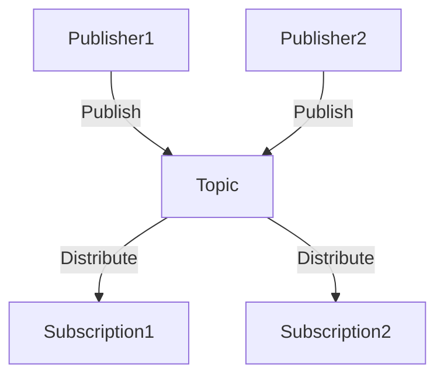

## 9.4.3 Google Cloud Pub/Sub

Google Cloud Pub/Sub is a powerful, fully managed messaging service designed to facilitate reliable, asynchronous communication between independent applications and services. As a cornerstone of event-driven architectures, Pub/Sub enables developers to build scalable systems that can handle high volumes of messages with low latency. In this section, we will explore the core concepts of Google Cloud Pub/Sub, including topics, subscriptions, message flow, delivery, and security, along with a practical implementation example.

### Overview of Google Cloud Pub/Sub

Google Cloud Pub/Sub is designed to provide a robust messaging infrastructure that supports the decoupling of application components. By allowing services to communicate asynchronously, Pub/Sub enables systems to scale independently and handle varying loads efficiently. The service is fully managed, meaning that Google handles the underlying infrastructure, allowing developers to focus on building their applications without worrying about scaling or maintaining messaging servers.

### Topics and Subscriptions

#### Defining Topics

In Google Cloud Pub/Sub, a **topic** is a named resource to which messages are published. Topics act as channels for message distribution, allowing multiple publishers to send messages to a single topic. Once a message is published to a topic, it becomes available for delivery to all associated subscriptions.



#### Subscriptions

A **subscription** is a configuration that specifies how messages from a topic are delivered to subscriber applications. Pub/Sub supports two delivery models:

- **Pull Delivery:** Subscribers explicitly pull messages from the subscription.
- **Push Delivery:** Pub/Sub pushes messages to a configured endpoint.

Each subscription receives a copy of every message published to the topic, allowing multiple subscribers to process the same data independently.

### Message Flow and Delivery

#### Publishing Messages

Messages can be published to Pub/Sub topics using various methods, including the Google Cloud Console, `gcloud` CLI, or client libraries available in multiple programming languages such as Java, Python, and Node.js.

**Java Example:**

```java
import com.google.cloud.pubsub.v1.Publisher;
import com.google.pubsub.v1.ProjectTopicName;
import com.google.protobuf.ByteString;
import com.google.pubsub.v1.PubsubMessage;

public class PubSubPublisher {
    public static void main(String... args) throws Exception {
        String projectId = "your-project-id";
        String topicId = "your-topic-id";
        ProjectTopicName topicName = ProjectTopicName.of(projectId, topicId);

        Publisher publisher = null;
        try {
            publisher = Publisher.newBuilder(topicName).build();
            String message = "Hello, Pub/Sub!";
            ByteString data = ByteString.copyFromUtf8(message);
            PubsubMessage pubsubMessage = PubsubMessage.newBuilder().setData(data).build();

            publisher.publish(pubsubMessage);
            System.out.println("Message published.");
        } finally {
            if (publisher != null) {
                publisher.shutdown();
            }
        }
    }
}
```

#### Consuming Messages

Subscribers can receive messages by either pulling them from subscriptions or configuring push endpoints. In pull delivery, the subscriber application periodically requests messages from the subscription.

**Java Example (Pull Subscriber):**

```java
import com.google.cloud.pubsub.v1.Subscriber;
import com.google.pubsub.v1.ProjectSubscriptionName;
import com.google.pubsub.v1.PubsubMessage;
import com.google.pubsub.v1.AckReplyConsumer;
import com.google.cloud.pubsub.v1.MessageReceiver;

public class PubSubSubscriber {
    public static void main(String... args) {
        String projectId = "your-project-id";
        String subscriptionId = "your-subscription-id";
        ProjectSubscriptionName subscriptionName = ProjectSubscriptionName.of(projectId, subscriptionId);

        MessageReceiver receiver = (PubsubMessage message, AckReplyConsumer consumer) -> {
            System.out.println("Received message: " + message.getData().toStringUtf8());
            consumer.ack();
        };

        Subscriber subscriber = null;
        try {
            subscriber = Subscriber.newBuilder(subscriptionName, receiver).build();
            subscriber.startAsync().awaitRunning();
            System.out.println("Listening for messages on " + subscriptionName.toString());
            subscriber.awaitTerminated();
        } finally {
            if (subscriber != null) {
                subscriber.stopAsync();
            }
        }
    }
}
```

#### Acknowledgments

Acknowledging messages is crucial in Pub/Sub to inform the service that a message has been successfully received and processed. Without acknowledgment, Pub/Sub will attempt to redeliver the message, ensuring reliability.

### Message Ordering and Exactly-Once Delivery

#### Ordered Delivery

Google Cloud Pub/Sub allows for ordered delivery of messages. By enabling message ordering, subscribers receive messages in the exact order they were published. This is particularly useful in scenarios where the sequence of events is critical.

#### Exactly-Once Delivery

Pub/Sub provides exactly-once delivery semantics, ensuring that each message is delivered and processed only once. This is achieved through a combination of message deduplication and acknowledgment tracking.

### Scaling and Performance

#### Auto-Scaling

Pub/Sub automatically scales to handle varying message volumes, ensuring high throughput and low latency. This auto-scaling capability allows developers to focus on application logic rather than infrastructure management.

#### Partitioning and Sharding

Internally, Pub/Sub manages message partitioning to distribute load across multiple instances. This enhances performance by allowing parallel processing of messages.

### Security and Access Control

#### Authentication and Authorization

Security in Pub/Sub is managed through Google Cloud's Identity and Access Management (IAM). IAM roles and permissions ensure that only authorized applications can publish or subscribe to topics.

#### Encryption

Pub/Sub supports encryption of messages both at rest and in transit, protecting sensitive data from unauthorized access. This ensures compliance with data protection regulations.

#### VPC Service Controls

VPC Service Controls provide an additional layer of security by defining boundaries around Pub/Sub resources, preventing unauthorized access from outside the defined perimeter.

### Monitoring and Logging

#### Integration with Cloud Monitoring

Google Cloud's Monitoring tools allow you to track Pub/Sub metrics such as message throughput, latency, and subscription health. This integration helps in maintaining system performance and identifying potential issues.

#### Logging with Cloud Logging

Cloud Logging can be enabled to record detailed logs of Pub/Sub activities. These logs are invaluable for auditing and troubleshooting, providing insights into message flow and processing.

### Example Implementation

Let's consider a practical example where IoT devices publish sensor data to a Pub/Sub topic, and a Dataflow job subscribes to the topic to perform real-time data processing and analytics.

**Step-by-Step Implementation:**

1. **Create a Topic:**
   - Use the Google Cloud Console or `gcloud` CLI to create a new topic for sensor data.

2. **Publish Sensor Data:**
   - IoT devices use client libraries to publish JSON-encoded sensor data to the topic.

3. **Create a Subscription:**
   - Set up a subscription for the Dataflow job to pull messages from the topic.

4. **Dataflow Job:**
   - Implement a Dataflow pipeline that reads messages from the subscription, processes the data (e.g., filtering, aggregation), and writes the results to a BigQuery dataset for analysis.

5. **Monitor and Log:**
   - Use Cloud Monitoring and Logging to track the performance and health of the Pub/Sub and Dataflow components.

This workflow demonstrates the seamless integration of Pub/Sub with other Google Cloud services, showcasing its capability to handle real-time data processing in an event-driven architecture.

### Conclusion

Google Cloud Pub/Sub is a versatile and robust messaging service that plays a critical role in building scalable, event-driven systems. Its features, such as auto-scaling, ordered delivery, and security controls, make it an ideal choice for modern applications that require reliable and asynchronous communication. By leveraging Pub/Sub, developers can focus on delivering business value while relying on Google's infrastructure to handle the complexities of messaging.

## Quiz Time!



### What is a topic in Google Cloud Pub/Sub?

- [x] A named resource to which messages are published.
- [ ] A configuration for delivering messages to subscribers.
- [ ] A tool for monitoring message throughput.
- [ ] A security feature for encrypting messages.

> **Explanation:** A topic in Google Cloud Pub/Sub is a named resource that acts as a channel for distributing messages to subscribers.

### How can messages be delivered to subscribers in Pub/Sub?

- [x] Pull delivery
- [x] Push delivery
- [ ] Direct delivery
- [ ] Batch delivery

> **Explanation:** Pub/Sub supports both pull and push delivery models for delivering messages to subscribers.

### What is the purpose of acknowledging messages in Pub/Sub?

- [x] To inform Pub/Sub that a message has been successfully received and processed.
- [ ] To encrypt the message content.
- [ ] To create a new topic.
- [ ] To log the message for auditing.

> **Explanation:** Acknowledging messages prevents Pub/Sub from redelivering them, ensuring they are processed only once.

### How does Pub/Sub ensure message ordering?

- [x] By enabling message ordering within a topic.
- [ ] By using IAM roles.
- [ ] By encrypting messages.
- [ ] By using VPC Service Controls.

> **Explanation:** Message ordering can be enabled in Pub/Sub to ensure messages are delivered to subscribers in the order they were published.

### What is the role of IAM in Pub/Sub?

- [x] To manage authentication and authorization.
- [ ] To encrypt messages.
- [ ] To monitor message throughput.
- [ ] To create new topics.

> **Explanation:** IAM roles and permissions are used to manage authentication and authorization in Pub/Sub, ensuring secure access to topics and subscriptions.

### How does Pub/Sub handle varying message volumes?

- [x] Through auto-scaling capabilities.
- [ ] By using VPC Service Controls.
- [ ] By encrypting messages.
- [ ] By logging message activities.

> **Explanation:** Pub/Sub automatically scales to handle varying message volumes, ensuring high throughput and low latency.

### What is the benefit of using VPC Service Controls with Pub/Sub?

- [x] To define security boundaries around Pub/Sub resources.
- [ ] To encrypt messages.
- [ ] To monitor message throughput.
- [ ] To create new topics.

> **Explanation:** VPC Service Controls enhance security by defining boundaries around Pub/Sub resources, preventing unauthorized access.

### Which Google Cloud service can be used to track Pub/Sub metrics?

- [x] Cloud Monitoring
- [ ] Cloud Logging
- [ ] Cloud IAM
- [ ] Cloud Storage

> **Explanation:** Cloud Monitoring is used to track metrics such as message throughput and latency in Pub/Sub.

### What is the purpose of Cloud Logging in Pub/Sub?

- [x] To record detailed logs of Pub/Sub activities.
- [ ] To encrypt messages.
- [ ] To create new topics.
- [ ] To manage IAM roles.

> **Explanation:** Cloud Logging provides detailed logs of Pub/Sub activities, facilitating auditing and troubleshooting.

### Google Cloud Pub/Sub supports exactly-once delivery semantics.

- [x] True
- [ ] False

> **Explanation:** Pub/Sub provides exactly-once delivery semantics, ensuring each message is delivered and processed only once.


