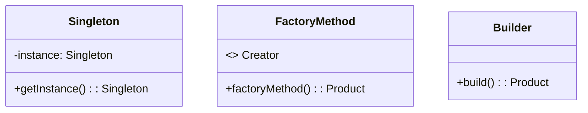
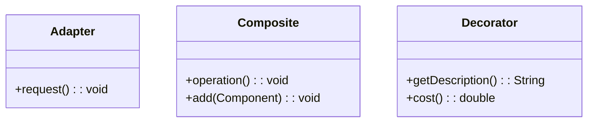
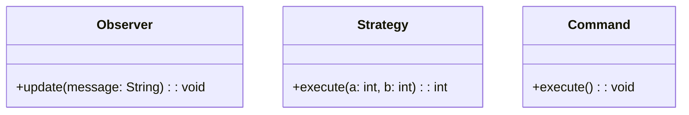

## 1.1.4 Categories of Design Patterns

Design patterns are a crucial aspect of software development, providing proven solutions to common design problems. They are categorized into three main types: Creational, Structural, and Behavioral patterns. Each category addresses specific aspects of software design, offering distinct advantages and use cases. Understanding these categories is essential for selecting the right pattern for a given problem, enhancing code flexibility, reusability, and maintainability.

### Creational Patterns

Creational patterns focus on the mechanisms of object creation. They abstract the instantiation process, making the system independent of how its objects are created, composed, and represented. This category of patterns increases flexibility and reuse by decoupling the client code from the concrete classes it instantiates.

#### Key Creational Patterns

1. **Singleton Pattern**: Ensures a class has only one instance and provides a global point of access to it. This pattern is useful in scenarios where a single instance is required, such as in logging, configuration settings, or thread pools.

   ```java
   public class Singleton {
       private static Singleton instance;
       
       private Singleton() {}
       
       public static Singleton getInstance() {
           if (instance == null) {
               instance = new Singleton();
           }
           return instance;
       }
   }
   ```

2. **Factory Method Pattern**: Defines an interface for creating an object but lets subclasses alter the type of objects that will be created. This pattern promotes loose coupling by eliminating the need to bind application-specific classes into the code.

   ```java
   interface Product {
       void use();
   }

   class ConcreteProduct implements Product {
       public void use() {
           System.out.println("Using ConcreteProduct");
       }
   }

   abstract class Creator {
       public abstract Product factoryMethod();
   }

   class ConcreteCreator extends Creator {
       public Product factoryMethod() {
           return new ConcreteProduct();
       }
   }
   ```

3. **Builder Pattern**: Separates the construction of a complex object from its representation, allowing the same construction process to create different representations. This pattern is particularly useful for creating objects with numerous optional parameters.

   ```java
   public class House {
       private String foundation;
       private String structure;
       private String roof;
       
       public static class Builder {
           private String foundation;
           private String structure;
           private String roof;
           
           public Builder foundation(String foundation) {
               this.foundation = foundation;
               return this;
           }
           
           public Builder structure(String structure) {
               this.structure = structure;
               return this;
           }
           
           public Builder roof(String roof) {
               this.roof = roof;
               return this;
           }
           
           public House build() {
               House house = new House();
               house.foundation = this.foundation;
               house.structure = this.structure;
               house.roof = this.roof;
               return house;
           }
       }
   }
   ```

### Structural Patterns

Structural patterns deal with object composition and relationships. They help form large object structures by defining ways to compose objects to obtain new functionality. These patterns facilitate the design of flexible and efficient class structures.

#### Key Structural Patterns

1. **Adapter Pattern**: Allows incompatible interfaces to work together. It acts as a bridge between two incompatible interfaces by wrapping an existing class with a new interface.

   ```java
   interface Target {
       void request();
   }

   class Adaptee {
       void specificRequest() {
           System.out.println("Specific request");
       }
   }

   class Adapter implements Target {
       private Adaptee adaptee;
       
       public Adapter(Adaptee adaptee) {
           this.adaptee = adaptee;
       }
       
       public void request() {
           adaptee.specificRequest();
       }
   }
   ```

2. **Composite Pattern**: Composes objects into tree structures to represent part-whole hierarchies. This pattern allows clients to treat individual objects and compositions of objects uniformly.

   ```java
   interface Component {
       void operation();
   }

   class Leaf implements Component {
       public void operation() {
           System.out.println("Leaf operation");
       }
   }

   class Composite implements Component {
       private List<Component> children = new ArrayList<>();
       
       public void add(Component component) {
           children.add(component);
       }
       
       public void operation() {
           for (Component child : children) {
               child.operation();
           }
       }
   }
   ```

3. **Decorator Pattern**: Adds responsibilities to objects dynamically. This pattern provides a flexible alternative to subclassing for extending functionality.

   ```java
   interface Coffee {
       String getDescription();
       double cost();
   }

   class SimpleCoffee implements Coffee {
       public String getDescription() {
           return "Simple coffee";
       }
       
       public double cost() {
           return 1.0;
       }
   }

   class MilkDecorator implements Coffee {
       private Coffee coffee;
       
       public MilkDecorator(Coffee coffee) {
           this.coffee = coffee;
       }
       
       public String getDescription() {
           return coffee.getDescription() + ", milk";
       }
       
       public double cost() {
           return coffee.cost() + 0.5;
       }
   }
   ```

### Behavioral Patterns

Behavioral patterns are concerned with object interaction and responsibility. They define how objects communicate with each other, encapsulating the way objects interact and communicate.

#### Key Behavioral Patterns

1. **Observer Pattern**: Defines a one-to-many dependency between objects so that when one object changes state, all its dependents are notified and updated automatically. This pattern is commonly used in event handling systems.

   ```java
   interface Observer {
       void update(String message);
   }

   class ConcreteObserver implements Observer {
       public void update(String message) {
           System.out.println("Received update: " + message);
       }
   }

   class Subject {
       private List<Observer> observers = new ArrayList<>();
       
       public void addObserver(Observer observer) {
           observers.add(observer);
       }
       
       public void notifyObservers(String message) {
           for (Observer observer : observers) {
               observer.update(message);
           }
       }
   }
   ```

2. **Strategy Pattern**: Defines a family of algorithms, encapsulates each one, and makes them interchangeable. This pattern lets the algorithm vary independently from clients that use it.

   ```java
   interface Strategy {
       int execute(int a, int b);
   }

   class AddStrategy implements Strategy {
       public int execute(int a, int b) {
           return a + b;
       }
   }

   class Context {
       private Strategy strategy;
       
       public Context(Strategy strategy) {
           this.strategy = strategy;
       }
       
       public int executeStrategy(int a, int b) {
           return strategy.execute(a, b);
       }
   }
   ```

3. **Command Pattern**: Encapsulates a request as an object, thereby allowing for parameterization of clients with queues, requests, and operations. This pattern is useful for implementing undo/redo functionality.

   ```java
   interface Command {
       void execute();
   }

   class LightOnCommand implements Command {
       private Light light;
       
       public LightOnCommand(Light light) {
           this.light = light;
       }
       
       public void execute() {
           light.on();
       }
   }

   class RemoteControl {
       private Command command;
       
       public void setCommand(Command command) {
           this.command = command;
       }
       
       public void pressButton() {
           command.execute();
       }
   }
   ```

### Choosing the Right Pattern

Selecting the appropriate design pattern is crucial for solving specific problems effectively. The choice depends on the problem context, the desired flexibility, and the system's requirements. Patterns from different categories can be combined to address complex design challenges. For instance, a system might use a combination of Factory Method for object creation and Observer for event handling.

### Illustrative Diagrams

To better understand these categories, consider the following diagrams:

#### Creational Patterns Diagram


#### Structural Patterns Diagram


#### Behavioral Patterns Diagram


### Common Use Cases and Overlaps

- **Creational Patterns**: Ideal for systems that require dynamic object creation and management, such as plugin architectures or configuration management.
- **Structural Patterns**: Useful in GUI frameworks, file systems, and any application requiring complex object structures.
- **Behavioral Patterns**: Essential for implementing workflows, state machines, and communication protocols.

While these categories are distinct, there can be overlaps. For example, a pattern like the Composite can be seen as both structural and behavioral depending on its use case. Understanding these categories aids in pattern selection by providing a framework to analyze design problems and apply suitable solutions.

### Conclusion

By categorizing design patterns into Creational, Structural, and Behavioral, developers can better understand and apply these patterns to enhance their software design. Each category addresses specific design challenges, offering unique benefits and use cases. By mastering these patterns, developers can create robust, flexible, and maintainable Java applications.

## Quiz Time!



### Which category of design patterns focuses on object creation mechanisms?

- [x] Creational Patterns
- [ ] Structural Patterns
- [ ] Behavioral Patterns
- [ ] None of the above

> **Explanation:** Creational patterns focus on object creation mechanisms, making the system independent of how objects are created and represented.


### What is the primary purpose of Structural Patterns?

- [ ] To define algorithms
- [x] To deal with object composition and relationships
- [ ] To manage object state
- [ ] To encapsulate requests

> **Explanation:** Structural patterns deal with object composition and relationships, helping form large object structures.


### Which pattern is an example of a Behavioral Pattern?

- [ ] Singleton
- [ ] Adapter
- [x] Observer
- [ ] Builder

> **Explanation:** The Observer pattern is a Behavioral pattern concerned with object interaction and communication.


### How do Creational Patterns increase flexibility?

- [ ] By defining algorithms
- [x] By abstracting the instantiation process
- [ ] By simplifying complex subsystems
- [ ] By encapsulating requests

> **Explanation:** Creational patterns increase flexibility by abstracting the instantiation process, allowing systems to be independent of how objects are created.


### Which pattern is used to allow incompatible interfaces to work together?

- [ ] Singleton
- [x] Adapter
- [ ] Observer
- [ ] Strategy

> **Explanation:** The Adapter pattern allows incompatible interfaces to work together by acting as a bridge between them.


### What is a common use case for the Builder Pattern?

- [x] Creating objects with numerous optional parameters
- [ ] Simplifying complex subsystems
- [ ] Managing object state
- [ ] Encapsulating requests

> **Explanation:** The Builder pattern is commonly used for creating objects with numerous optional parameters, separating construction from representation.


### Which pattern encapsulates a request as an object?

- [ ] Strategy
- [ ] Observer
- [x] Command
- [ ] Composite

> **Explanation:** The Command pattern encapsulates a request as an object, allowing for parameterization of clients with queues, requests, and operations.


### How can patterns from different categories be used together?

- [x] By combining them to address complex design challenges
- [ ] By using them in isolation
- [ ] By avoiding overlaps
- [ ] By replacing one with another

> **Explanation:** Patterns from different categories can be combined to address complex design challenges, leveraging their strengths.


### What is a key benefit of understanding design pattern categories?

- [ ] It limits the use of patterns
- [ ] It complicates the design process
- [x] It aids in pattern selection
- [ ] It discourages pattern use

> **Explanation:** Understanding design pattern categories aids in pattern selection by providing a framework to analyze design problems and apply suitable solutions.


### True or False: The Composite pattern is strictly a Structural pattern.

- [ ] True
- [x] False

> **Explanation:** The Composite pattern can be seen as both structural and behavioral depending on its use case, showing potential overlap between categories.


