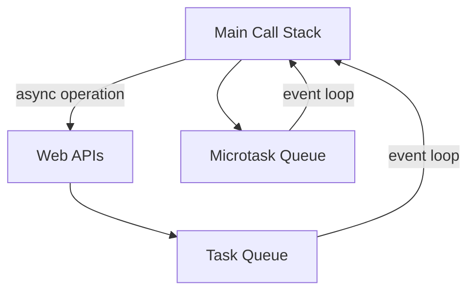

## 1.2.3 Asynchronous Programming with Promises

Asynchronous programming is a cornerstone of modern JavaScript and TypeScript development, enabling the creation of responsive and efficient applications. At its core, asynchronous programming allows operations that would otherwise block the main execution thread to be performed concurrently, enhancing user experience and system performance. In this section, we delve into the world of Promises, a powerful abstraction for managing asynchronous tasks, offering a more robust alternative to traditional callback-based approaches.

### The Importance of Asynchronous Programming

JavaScript is inherently single-threaded, meaning it executes code sequentially on a single call stack. This model, while simple and effective for many tasks, poses challenges when dealing with operations that take time to complete, such as network requests, file I/O, or long-running computations. If these operations were to block the main thread, they would render the application unresponsive, leading to a poor user experience.

Asynchronous programming solves this problem by allowing these tasks to run independently, freeing the main thread to continue executing other code. This non-blocking behavior is crucial for building responsive web applications, where user interactions should remain smooth and uninterrupted regardless of background operations.

### Introducing Promises

Promises are a modern solution to the complexities of asynchronous programming, providing a cleaner and more manageable way to handle asynchronous operations compared to callbacks. A Promise is an object that represents a value that may be available now, or in the future, or never. It embodies the eventual completion (or failure) of an asynchronous operation and its resulting value.

#### States of a Promise

A Promise can be in one of three states:

- **Pending**: The initial state, neither fulfilled nor rejected. The operation is still ongoing.
- **Fulfilled**: The operation completed successfully, and the Promise has a resulting value.
- **Rejected**: The operation failed, and the Promise has a reason for the failure.

These states ensure that a Promise can only be settled once, either fulfilled with a value or rejected with a reason, providing a predictable and reliable mechanism for handling asynchronous results.

### Creating and Using Promises

Creating a Promise involves defining an asynchronous operation and specifying what should happen upon its completion. Here's a simple example of a Promise that simulates a network request:

```javascript
const fetchData = new Promise((resolve, reject) => {
  setTimeout(() => {
    const data = { id: 1, name: 'John Doe' };
    resolve(data); // Operation successful, resolve with data
  }, 2000);
});

fetchData.then(data => {
  console.log('Data received:', data);
}).catch(error => {
  console.error('Error:', error);
});
```

In this example, `fetchData` is a Promise that resolves after a 2-second delay, simulating a network request. The `then()` method is used to handle the successful resolution of the Promise, while `catch()` is used for error handling.

### Chaining Promises with `then()` and Handling Errors with `catch()`

One of the most powerful features of Promises is their ability to chain operations. This is achieved using the `then()` method, which returns a new Promise, allowing for sequential execution of asynchronous tasks.

```javascript
fetchData
  .then(data => {
    console.log('Data received:', data);
    return data.id;
  })
  .then(id => {
    console.log('Fetching details for ID:', id);
    return fetchDetails(id);
  })
  .then(details => {
    console.log('Details:', details);
  })
  .catch(error => {
    console.error('Error:', error);
  });
```

In this chain, each `then()` method receives the resolved value of the previous Promise, enabling a sequence of dependent asynchronous operations. The `catch()` method at the end of the chain handles any errors that occur in any of the preceding Promises.

#### Error Handling Best Practices

Handling errors gracefully is crucial in asynchronous programming. Here are some best practices:

- Always include a `catch()` block to handle potential errors.
- Use informative error messages to aid debugging and user feedback.
- Consider using `finally()` to execute code regardless of the Promise's outcome, such as cleaning up resources.

### Managing Multiple Promises with `Promise.all()` and `Promise.race()`

JavaScript provides utility methods like `Promise.all()` and `Promise.race()` for managing multiple Promises concurrently.

- **`Promise.all()`**: Waits for all Promises to resolve and returns an array of their results. If any Promise is rejected, it immediately rejects with the reason of the first rejected Promise.

```javascript
const promise1 = Promise.resolve(3);
const promise2 = 42;
const promise3 = new Promise((resolve, reject) => {
  setTimeout(resolve, 100, 'foo');
});

Promise.all([promise1, promise2, promise3]).then(values => {
  console.log(values); // [3, 42, "foo"]
});
```

- **`Promise.race()`**: Resolves or rejects as soon as one of the Promises resolves or rejects, with the value or reason from that Promise.

```javascript
const promise1 = new Promise((resolve, reject) => {
  setTimeout(resolve, 500, 'one');
});
const promise2 = new Promise((resolve, reject) => {
  setTimeout(resolve, 100, 'two');
});

Promise.race([promise1, promise2]).then(value => {
  console.log(value); // "two"
});
```

### Common Pitfalls and How to Avoid Them

Working with Promises can introduce certain pitfalls. Here are some common issues and strategies to avoid them:

- **Forgetting to return a Promise**: Ensure that functions within `then()` return a Promise if they perform asynchronous tasks.
- **Nested Promises**: Avoid nesting Promises unnecessarily. Use chaining to keep code flat and readable.
- **Unhandled Rejections**: Always handle errors using `catch()` to prevent unhandled Promise rejections.

### Understanding the Event Loop and Promises

The event loop is a fundamental concept in JavaScript's concurrency model, managing the execution of code, collecting and processing events, and executing queued sub-tasks. Promises fit into this model by using the microtask queue, which has higher priority than the macrotask queue (used by `setTimeout`, `setInterval`, etc.).



In this diagram, asynchronous operations are processed by Web APIs and their callbacks are queued in the task queue. Promises, however, use the microtask queue, allowing them to be processed sooner than regular tasks.

### Integrating Promises with Legacy Callback Code

Legacy code often uses callbacks for asynchronous operations. Promises can be integrated with such code using utility functions like `util.promisify()` in Node.js or manually wrapping callback functions.

```javascript
const fs = require('fs');
const util = require('util');
const readFile = util.promisify(fs.readFile);

readFile('example.txt', 'utf8')
  .then(data => {
    console.log(data);
  })
  .catch(error => {
    console.error('Error reading file:', error);
  });
```

### Debugging Asynchronous Code with Promises

Debugging asynchronous code can be challenging. Here are some tips:

- Use browser developer tools or Node.js debugging tools to set breakpoints and inspect asynchronous operations.
- Utilize logging to track the flow of asynchronous code and identify where errors occur.
- Leverage tools like `async_hooks` in Node.js for tracking asynchronous resources.

### Best Practices for Writing Clean Asynchronous Code

- **Use Descriptive Variable Names**: Clearly indicate the purpose of each Promise and its expected outcome.
- **Keep Chains Short**: Break long Promise chains into smaller functions for readability and maintainability.
- **Document Asynchronous Logic**: Use comments to explain complex asynchronous flows and decisions.

### Promises as a Foundation for Modern Async Patterns

Promises are foundational to modern JavaScript async patterns, including `async/await`, which simplifies asynchronous code by allowing it to be written in a synchronous style. Understanding Promises is crucial for leveraging these advanced patterns effectively.

### Practical Exercises

1. **Exercise 1**: Create a Promise-based function that simulates fetching user data and logs it to the console. Extend it to fetch user details based on the user ID.

2. **Exercise 2**: Use `Promise.all()` to fetch data from multiple endpoints concurrently and log the combined results.

3. **Exercise 3**: Convert a callback-based function to use Promises and handle errors gracefully.

### Conclusion

Promises are a powerful tool for managing asynchronous operations in JavaScript and TypeScript, offering a more structured and readable approach compared to callbacks. By understanding and applying Promises effectively, developers can build responsive and efficient applications, laying the groundwork for more advanced asynchronous patterns.

## Quiz Time!



### What is the main advantage of using Promises over traditional callbacks in JavaScript?

- [x] Promises provide a cleaner and more manageable way to handle asynchronous operations.
- [ ] Promises are faster than callbacks.
- [ ] Promises are easier to debug than synchronous code.
- [ ] Promises eliminate all asynchronous bugs.

> **Explanation:** Promises offer a structured approach to handling asynchronous operations, making the code more readable and maintainable compared to nested callbacks.

### Which of the following is NOT a state of a Promise?

- [ ] Pending
- [ ] Fulfilled
- [ ] Rejected
- [x] Completed

> **Explanation:** A Promise can be in one of three states: pending, fulfilled, or rejected. "Completed" is not a recognized state.

### How can you handle errors in a Promise chain?

- [ ] Using the `then()` method
- [x] Using the `catch()` method
- [ ] Using the `finally()` method
- [ ] By ignoring them

> **Explanation:** The `catch()` method is specifically designed to handle errors that occur in a Promise chain.

### What does `Promise.all()` do?

- [x] It waits for all Promises to resolve and returns an array of their results.
- [ ] It resolves as soon as the first Promise resolves.
- [ ] It rejects as soon as the first Promise rejects.
- [ ] It executes Promises sequentially.

> **Explanation:** `Promise.all()` waits for all Promises to resolve and returns an array of their results. If any Promise is rejected, it will reject with the reason of the first rejected Promise.

### What happens if a Promise is rejected and there is no `catch()` block?

- [x] It results in an unhandled Promise rejection.
- [ ] The Promise will automatically resolve.
- [ ] The rejection is silently ignored.
- [ ] The rejection is logged to the console.

> **Explanation:** Without a `catch()` block, a rejected Promise leads to an unhandled Promise rejection, which can cause issues in the application.

### Which queue do Promises use in the event loop?

- [ ] Task Queue
- [x] Microtask Queue
- [ ] Callback Queue
- [ ] Main Queue

> **Explanation:** Promises use the microtask queue, which has a higher priority than the task queue.

### How can you convert a callback-based function to use Promises?

- [ ] By using `Promise.resolve()`
- [ ] By using `Promise.reject()`
- [x] By wrapping the function in a new Promise
- [ ] By using `Promise.all()`

> **Explanation:** You can convert a callback-based function to use Promises by wrapping it in a new Promise and resolving or rejecting based on the callback's outcome.

### What is a common pitfall when working with Promises?

- [x] Forgetting to return a Promise in a `then()` method
- [ ] Using `then()` for error handling
- [ ] Using `Promise.all()` for multiple Promises
- [ ] Handling errors with `catch()`

> **Explanation:** A common pitfall is forgetting to return a Promise within a `then()` method, which can break the chain and lead to unexpected results.

### What is the purpose of the `finally()` method in a Promise?

- [ ] To handle successful resolutions
- [ ] To handle rejections
- [x] To execute code regardless of the Promise's outcome
- [ ] To convert a Promise into a callback

> **Explanation:** The `finally()` method is used to execute code regardless of whether the Promise is fulfilled or rejected, often for cleanup tasks.

### True or False: Promises are a foundational concept for modern async patterns in JavaScript.

- [x] True
- [ ] False

> **Explanation:** True. Promises are foundational for modern async patterns, including `async/await`, which builds upon Promises to simplify asynchronous code.


