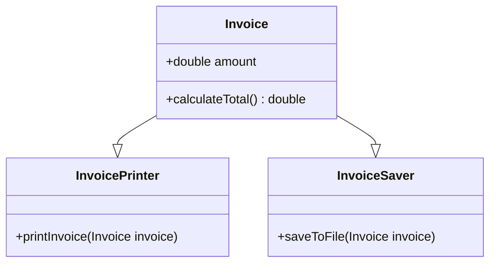

---

linkTitle: "1.2.5.1 Single Responsibility Principle"
title: "Single Responsibility Principle: Enhancing Java Code with SRP"
description: "Explore the Single Responsibility Principle (SRP) in Java, its importance in object-oriented design, and how it promotes maintainability and scalability in software development."
categories:
- Java
- Object-Oriented Design
- Software Engineering
tags:
- Single Responsibility Principle
- SOLID Principles
- Java Design Patterns
- Code Maintainability
- Software Architecture
date: 2024-10-25
type: docs
nav_weight: 125100
---

## 1.2.5.1 Single Responsibility Principle

The Single Responsibility Principle (SRP) is a fundamental concept in software engineering, particularly within the realm of object-oriented programming. It is the first of the SOLID principles, which are guidelines designed to improve software design and maintainability. SRP states that a class should have only one reason to change, meaning it should have only one job or responsibility. This principle is crucial for creating robust, maintainable, and scalable applications.

### Understanding the Single Responsibility Principle

At its core, SRP advocates for high cohesion within classes. Cohesion refers to how closely related and focused the responsibilities of a class are. A class with high cohesion has a single, well-defined purpose, making it easier to understand, test, and maintain.

#### Example of SRP Adherence

Consider a simple example of a class that adheres to SRP:

```java
public class Invoice {
    private double amount;

    public Invoice(double amount) {
        this.amount = amount;
    }

    public double calculateTotal() {
        // Logic to calculate total amount
        return amount * 1.2; // Assuming a fixed tax rate
    }
}
```

In this example, the `Invoice` class has a single responsibility: managing invoice-related data and calculations. It does not handle printing or saving invoices, which would be separate concerns.

#### Violations of SRP and Their Consequences

A violation of SRP occurs when a class takes on multiple responsibilities. Consider the following example:

```java
public class InvoiceManager {
    private double amount;

    public InvoiceManager(double amount) {
        this.amount = amount;
    }

    public double calculateTotal() {
        return amount * 1.2;
    }

    public void printInvoice() {
        // Logic to print the invoice
    }

    public void saveToFile() {
        // Logic to save the invoice to a file
    }
}
```

Here, the `InvoiceManager` class handles calculations, printing, and file operations, violating SRP. This leads to several issues:

- **Increased Complexity:** The class becomes harder to understand and maintain.
- **Difficult Testing:** Testing becomes more complicated as changes in one responsibility can affect others.
- **Higher Risk of Bugs:** Changes in one area can inadvertently introduce bugs in another.

### Benefits of SRP

#### Maintainability

SRP significantly enhances maintainability. By ensuring each class has a single responsibility, changes are localized, reducing the risk of unintended side effects. This makes the codebase easier to navigate and modify.

#### Simplified Debugging and Testing

With SRP, debugging and testing become more straightforward. Since each class is focused on a single task, identifying and fixing bugs is easier. Unit tests can be more targeted, improving test coverage and reliability.

#### Refactoring Techniques

Refactoring classes to adhere to SRP involves identifying multiple responsibilities and separating them into distinct classes. This can be achieved through techniques such as:

- **Extract Class:** Move related methods and data into a new class.
- **Delegate Responsibilities:** Use composition to delegate tasks to helper classes.

#### Real-World Analogies

Consider a restaurant kitchen as an analogy. Each chef specializes in a specific task—one prepares salads, another cooks main dishes, and a third handles desserts. This specialization ensures efficiency and quality, similar to how SRP ensures high-quality, maintainable code.

### Impact on Code Scalability

SRP positively impacts code scalability. As applications grow, adhering to SRP ensures that classes remain manageable. New features can be added with minimal disruption to existing code, facilitating easier scaling.

### Common Challenges in Applying SRP

Applying SRP can be challenging, particularly in legacy codebases where responsibilities are tightly coupled. Developers may struggle to identify distinct responsibilities or face resistance to refactoring. Overcoming these challenges requires a commitment to continuous improvement and refactoring.

### Importance in Large Codebases

In large codebases, SRP is even more critical. It prevents classes from becoming monolithic and unmanageable, promoting a modular architecture that supports team collaboration and parallel development.

### SRP in the Context of Design Patterns

SRP is often used in conjunction with design patterns such as the Facade pattern. The Facade pattern provides a simplified interface to a complex subsystem, adhering to SRP by ensuring that the facade itself has a single responsibility: to offer a unified interface.



In this diagram, `Invoice`, `InvoicePrinter`, and `InvoiceSaver` each have a single responsibility, demonstrating adherence to SRP.

### Conclusion

The Single Responsibility Principle is a cornerstone of robust software design. By ensuring that each class has a single reason to change, developers can create code that is easier to maintain, test, and scale. While challenges exist, the benefits of SRP in terms of maintainability, scalability, and quality make it an essential principle for any Java developer to master.

## Quiz Time!



### Which of the following best describes the Single Responsibility Principle (SRP)?

- [x] A class should have only one reason to change.
- [ ] A class should handle multiple responsibilities.
- [ ] A class should be as large as possible.
- [ ] A class should not be tested.

> **Explanation:** SRP states that a class should have only one reason to change, meaning it should have only one responsibility.

### What is a consequence of violating SRP?

- [x] Increased complexity and harder maintenance.
- [ ] Easier testing and debugging.
- [ ] Better performance.
- [ ] Reduced risk of bugs.

> **Explanation:** Violating SRP leads to increased complexity, making the code harder to maintain and more prone to bugs.

### How does SRP improve maintainability?

- [x] By localizing changes to a single responsibility.
- [ ] By combining multiple responsibilities into one class.
- [ ] By making classes larger.
- [ ] By reducing the number of classes.

> **Explanation:** SRP improves maintainability by ensuring that changes are localized to a single responsibility, reducing the risk of side effects.

### What is a technique for refactoring a class to adhere to SRP?

- [x] Extract Class
- [ ] Inline Method
- [ ] Increase Coupling
- [ ] Remove Comments

> **Explanation:** Extract Class is a refactoring technique used to separate responsibilities into distinct classes.

### Which design pattern often uses SRP to provide a simplified interface?

- [x] Facade Pattern
- [ ] Singleton Pattern
- [ ] Observer Pattern
- [ ] Strategy Pattern

> **Explanation:** The Facade pattern uses SRP to provide a simplified interface to a complex subsystem.

### What is an analogy for SRP in a real-world setting?

- [x] A chef specializing in a specific task in a kitchen.
- [ ] A single person doing all tasks in a restaurant.
- [ ] A team of people doing the same task.
- [ ] A manager overseeing multiple departments.

> **Explanation:** SRP is like a chef specializing in a specific task, ensuring efficiency and quality.

### What is a challenge in applying SRP?

- [x] Identifying distinct responsibilities in tightly coupled code.
- [ ] Making classes larger.
- [ ] Reducing the number of classes.
- [ ] Avoiding refactoring.

> **Explanation:** A common challenge in applying SRP is identifying distinct responsibilities in tightly coupled code.

### How does SRP affect code scalability?

- [x] It ensures classes remain manageable as applications grow.
- [ ] It makes scaling more difficult.
- [ ] It reduces the need for additional classes.
- [ ] It has no impact on scalability.

> **Explanation:** SRP ensures that classes remain manageable as applications grow, facilitating easier scaling.

### Why is SRP important in large codebases?

- [x] It prevents classes from becoming monolithic and unmanageable.
- [ ] It encourages combining multiple responsibilities.
- [ ] It simplifies code by reducing the number of classes.
- [ ] It has no effect on large codebases.

> **Explanation:** SRP is important in large codebases because it prevents classes from becoming monolithic and unmanageable.

### True or False: SRP states that a class should have multiple reasons to change.

- [ ] True
- [x] False

> **Explanation:** False. SRP states that a class should have only one reason to change.


