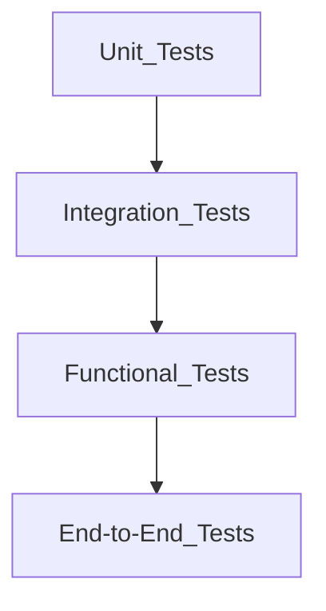

## 11.1.2 Overview of Testing Types and Techniques

In the ever-evolving landscape of software development, testing plays a crucial role in ensuring the reliability, functionality, and performance of applications. This section delves into the various types of testing used in modern JavaScript and TypeScript development, exploring their purposes, methodologies, and best practices. By understanding these testing types and techniques, developers can create robust and maintainable software systems.

### Types of Tests

Testing types can be broadly categorized into several types, each serving a specific purpose and scope within the software development lifecycle. Understanding these distinctions is essential for applying the right tests in the right contexts.

#### Unit Tests

**Purpose and Scope:**  
Unit tests focus on testing individual components or functions in isolation. The primary goal is to verify that each part of the application behaves as expected under various conditions. Unit tests are typically written by developers and are the first line of defense against bugs.

**When to Apply:**  
Apply unit tests during development to ensure that each function or method performs correctly. They are particularly useful for critical code components that form the foundation of your application.

**Example:**  
Consider a simple JavaScript function that calculates the sum of two numbers:

```javascript
// sum.js
function sum(a, b) {
  return a + b;
}

// sum.test.js
const assert = require('assert');
const sum = require('./sum');

describe('sum', function() {
  it('should return the sum of two numbers', function() {
    assert.strictEqual(sum(1, 2), 3);
  });

  it('should return a number', function() {
    assert.strictEqual(typeof sum(1, 2), 'number');
  });
});
```

In this example, the unit tests verify the behavior of the `sum` function, ensuring it returns the correct result and data type.

#### Integration Tests

**Purpose and Scope:**  
Integration tests evaluate the interaction between different modules or services within the application. The goal is to ensure that combined components work together as intended.

**When to Apply:**  
Use integration tests after unit testing to verify the interactions between components, especially when integrating third-party services or APIs.

**Example:**  
Suppose you have a TypeScript application with a service that fetches user data from an API:

```typescript
// userService.ts
import axios from 'axios';

export async function fetchUserData(userId: string) {
  const response = await axios.get(`/api/users/${userId}`);
  return response.data;
}

// userService.test.ts
import { fetchUserData } from './userService';
import axios from 'axios';

jest.mock('axios');

describe('fetchUserData', () => {
  it('should fetch user data from API', async () => {
    const userData = { id: '1', name: 'John Doe' };
    axios.get.mockResolvedValue({ data: userData });

    const data = await fetchUserData('1');
    expect(data).toEqual(userData);
  });
});
```

Here, the integration test checks the interaction between the `fetchUserData` function and the mocked API service.

#### Functional Tests

**Purpose and Scope:**  
Functional tests validate the functionality of the application against the specified requirements. They focus on what the system does rather than how it does it.

**When to Apply:**  
Conduct functional tests after completing unit and integration tests to ensure the application meets business requirements.

**Example:**  
A functional test for a login feature might look like this:

```javascript
// login.test.js
const { login } = require('./authService');

describe('login', () => {
  it('should log in a user with valid credentials', async () => {
    const result = await login('user@example.com', 'password123');
    expect(result).toHaveProperty('token');
  });

  it('should fail with invalid credentials', async () => {
    await expect(login('user@example.com', 'wrongpassword')).rejects.toThrow('Invalid credentials');
  });
});
```

These tests ensure that the login functionality works correctly for both valid and invalid scenarios.

#### End-to-End Tests

**Purpose and Scope:**  
End-to-end (E2E) tests simulate real user scenarios to test the application from start to finish. They verify that the entire system works together, including the user interface, backend services, and databases.

**When to Apply:**  
Perform E2E tests before releasing the application to production to ensure a seamless user experience.

**Example:**  
Using a tool like Cypress, an E2E test for a web application might look like this:

```javascript
// e2e/login.spec.js
describe('Login Page', () => {
  it('should allow a user to log in', () => {
    cy.visit('/login');
    cy.get('input[name=email]').type('user@example.com');
    cy.get('input[name=password]').type('password123');
    cy.get('button[type=submit]').click();
    cy.url().should('include', '/dashboard');
  });
});
```

This test simulates a user logging into the application and verifies that they are redirected to the dashboard upon successful login.

#### Regression Tests

**Purpose and Scope:**  
Regression tests ensure that recent changes to the codebase do not adversely affect existing functionality. They are crucial for maintaining software stability over time.

**When to Apply:**  
Run regression tests after any code changes, especially before releases, to catch unintended side effects.

**Example:**  
Regression tests can be automated using tools like Selenium or Puppeteer to verify that critical workflows remain intact.

### Testing Techniques

Testing techniques determine how tests are designed and executed. Different techniques provide varying levels of insight into the application's behavior.

#### Black-Box Testing

**Definition:**  
Black-box testing involves testing the application without knowledge of its internal workings. Testers focus on inputs and expected outputs, making it ideal for functional testing.

**Example:**  
A black-box test for a calculator application might involve providing inputs and verifying the outputs without considering how the calculations are performed internally.

#### White-Box Testing

**Definition:**  
White-box testing requires knowledge of the application's internal structure. Testers design tests based on the code logic, making it suitable for unit testing.

**Example:**  
White-box testing a sorting algorithm involves verifying that each part of the algorithm (e.g., loops, conditionals) works as expected.

#### Gray-Box Testing

**Definition:**  
Gray-box testing combines elements of both black-box and white-box testing. Testers have partial knowledge of the internal workings, allowing for more informed test design.

**Example:**  
Gray-box testing might involve testing a web application's API with knowledge of the database schema to ensure data integrity.

### Test Planning and Designing Effective Test Cases

Effective test planning and case design are crucial for covering various scenarios and ensuring comprehensive testing.

#### Test Planning

**Steps for Effective Test Planning:**

- **Define Objectives:** Clearly outline what you aim to achieve with testing.
- **Identify Test Scope:** Determine which parts of the application will be tested.
- **Allocate Resources:** Assign team members and tools for testing tasks.
- **Set Timelines:** Establish deadlines for test execution and reporting.

#### Designing Test Cases

**Key Considerations:**

- **Coverage:** Ensure test cases cover all critical paths and edge cases.
- **Clarity:** Write clear and concise test steps and expected outcomes.
- **Reusability:** Design test cases that can be reused across different scenarios.
- **Maintainability:** Keep test cases up-to-date with code changes.

### The Test Pyramid

The test pyramid is a concept that helps allocate testing efforts appropriately across different testing types.



**Explanation:**

- **Unit Tests:** Form the base of the pyramid, representing the largest number of tests. They are fast and inexpensive.
- **Integration Tests:** Fewer in number, focusing on component interactions.
- **Functional Tests:** Validate the system's functionality against requirements.
- **End-to-End Tests:** Fewest in number due to their complexity and cost.

### Importance of Unit Tests for Critical Code Components

Unit tests are vital for ensuring the reliability of critical code components. They provide immediate feedback during development, allowing for quick identification and resolution of issues.

**Best Practices:**

- **Isolate Tests:** Ensure unit tests are independent and do not rely on external systems.
- **Mock Dependencies:** Use mocking to simulate external dependencies and focus on the unit under test.
- **Automate Execution:** Integrate unit tests into the build process for continuous feedback.

### Code Reviews and Static Code Analysis

Code reviews and static code analysis are complementary quality assurance practices that enhance testing efforts.

#### Code Reviews

**Purpose:**  
Code reviews involve peer examination of code changes to identify potential issues and improve code quality.

**Benefits:**

- **Knowledge Sharing:** Promotes team collaboration and knowledge transfer.
- **Error Detection:** Catches issues that automated tests might miss.
- **Consistency:** Ensures adherence to coding standards.

#### Static Code Analysis

**Purpose:**  
Static code analysis involves using tools to analyze code for potential errors and code smells without executing it.

**Tools:**  
Popular tools include ESLint for JavaScript and TSLint for TypeScript.

**Benefits:**

- **Early Detection:** Identifies issues early in the development process.
- **Code Quality:** Enforces coding standards and best practices.
- **Security:** Detects potential security vulnerabilities.

### Balancing Automated and Manual Testing

Balancing automated and manual testing is crucial for effective quality assurance.

**Automated Testing:**

- **Efficiency:** Automates repetitive tasks, saving time and resources.
- **Consistency:** Ensures consistent test execution across environments.
- **Scalability:** Supports large-scale testing efforts.

**Manual Testing:**

- **Exploratory Testing:** Allows testers to explore the application and identify issues not covered by automated tests.
- **Usability Testing:** Evaluates the user experience and interface design.
- **Ad-hoc Testing:** Provides flexibility to test new features quickly.

### Incorporating Testing into the Development Workflow

Integrating testing seamlessly into the development workflow enhances productivity and quality.

**Strategies:**

- **Continuous Integration:** Automate test execution as part of the CI/CD pipeline.
- **Test-Driven Development (TDD):** Write tests before code to guide development.
- **Behavior-Driven Development (BDD):** Use BDD frameworks to align tests with business requirements.

### Avoiding Common Testing Pitfalls

Avoiding common testing pitfalls ensures effective testing and reduces maintenance overhead.

**Pitfalls to Avoid:**

- **Over-reliance on a Single Test Type:** Diversify testing efforts across different types.
- **Neglecting Test Maintenance:** Regularly update tests to reflect code changes.
- **Ignoring Test Failures:** Investigate and address test failures promptly.

### Collaboration and Knowledge Sharing

Encouraging collaboration among team members fosters a shared responsibility for testing and quality assurance.

**Collaboration Strategies:**

- **Pair Testing:** Pair testers and developers to enhance test coverage.
- **Knowledge Sharing Sessions:** Conduct sessions to share testing insights and techniques.
- **Cross-Functional Teams:** Form teams with diverse skills to cover all aspects of testing.

### Prioritizing Testing Efforts

Prioritizing testing efforts ensures that high-risk and user-facing features receive adequate attention.

**Prioritization Strategies:**

- **Risk Assessment:** Identify high-risk areas based on complexity, criticality, and usage.
- **User Impact:** Focus on features that directly affect the user experience.
- **Regression Testing:** Prioritize regression tests for areas with frequent changes.

### Maintaining and Updating Tests

Maintaining and updating tests as the codebase evolves is essential for long-term software quality.

**Maintenance Tips:**

- **Refactor Tests:** Regularly refactor tests to improve readability and maintainability.
- **Version Control:** Use version control to track test changes and collaborate effectively.
- **Automate Test Updates:** Automate updates to test data and configurations where possible.

### Documentation in Testing

Documentation is a critical aspect of testing, providing a record of test plans, cases, and results.

**Documentation Practices:**

- **Test Plans:** Outline testing objectives, scope, and strategies.
- **Test Cases:** Document detailed test steps and expected outcomes.
- **Test Reports:** Provide insights into test execution and results.

### Conclusion

Testing is an integral part of modern software development, ensuring the reliability and quality of applications. By understanding and applying different testing types and techniques, developers can create robust and maintainable systems. Collaboration, prioritization, and continuous improvement are key to effective testing and quality assurance.

## Quiz Time!



### Which type of test focuses on individual components or functions in isolation?

- [x] Unit Test
- [ ] Integration Test
- [ ] Functional Test
- [ ] End-to-End Test

> **Explanation:** Unit tests focus on testing individual components or functions in isolation to verify their behavior.

### What is the primary goal of integration tests?

- [ ] To test the entire system from start to finish
- [x] To evaluate the interaction between different modules or services
- [ ] To verify the application's functionality against requirements
- [ ] To ensure recent changes do not affect existing functionality

> **Explanation:** Integration tests evaluate the interaction between different modules or services within the application.

### Which testing technique involves testing the application without knowledge of its internal workings?

- [x] Black-Box Testing
- [ ] White-Box Testing
- [ ] Gray-Box Testing
- [ ] Unit Testing

> **Explanation:** Black-box testing involves testing the application without knowledge of its internal workings, focusing on inputs and expected outputs.

### What is the test pyramid concept used for?

- [ ] To determine the number of developers needed for testing
- [x] To allocate testing efforts appropriately across different testing types
- [ ] To prioritize manual testing over automated testing
- [ ] To establish coding standards for testing

> **Explanation:** The test pyramid helps allocate testing efforts appropriately across different testing types, emphasizing more unit tests and fewer end-to-end tests.

### Which of the following is a benefit of static code analysis?

- [ ] It allows for exploratory testing
- [x] It identifies potential errors and code smells without executing the code
- [ ] It verifies the user experience and interface design
- [ ] It automates repetitive testing tasks

> **Explanation:** Static code analysis identifies potential errors and code smells without executing the code, helping enforce coding standards.

### What is a common pitfall to avoid in testing?

- [ ] Using automated testing tools
- [x] Over-reliance on a single type of test
- [ ] Conducting code reviews
- [ ] Writing clear and concise test cases

> **Explanation:** Over-reliance on a single type of test can lead to inadequate coverage. It's important to diversify testing efforts.

### Which testing type is best suited for verifying the entire system works together, including the UI and backend services?

- [ ] Unit Test
- [ ] Integration Test
- [ ] Functional Test
- [x] End-to-End Test

> **Explanation:** End-to-end tests simulate real user scenarios to test the entire system, including the UI and backend services.

### What is an advantage of automated testing?

- [x] It ensures consistent test execution across environments
- [ ] It allows for ad-hoc testing
- [ ] It focuses on the user experience
- [ ] It requires no maintenance

> **Explanation:** Automated testing ensures consistent test execution across environments, making it efficient and scalable.

### Which strategy involves writing tests before code to guide development?

- [ ] Behavior-Driven Development (BDD)
- [x] Test-Driven Development (TDD)
- [ ] Continuous Integration (CI)
- [ ] Exploratory Testing

> **Explanation:** Test-Driven Development (TDD) involves writing tests before code to guide development and ensure functionality.

### True or False: Documentation is not important in testing as long as the tests are automated.

- [ ] True
- [x] False

> **Explanation:** Documentation is important in testing to provide a record of test plans, cases, and results, ensuring clarity and maintainability.


