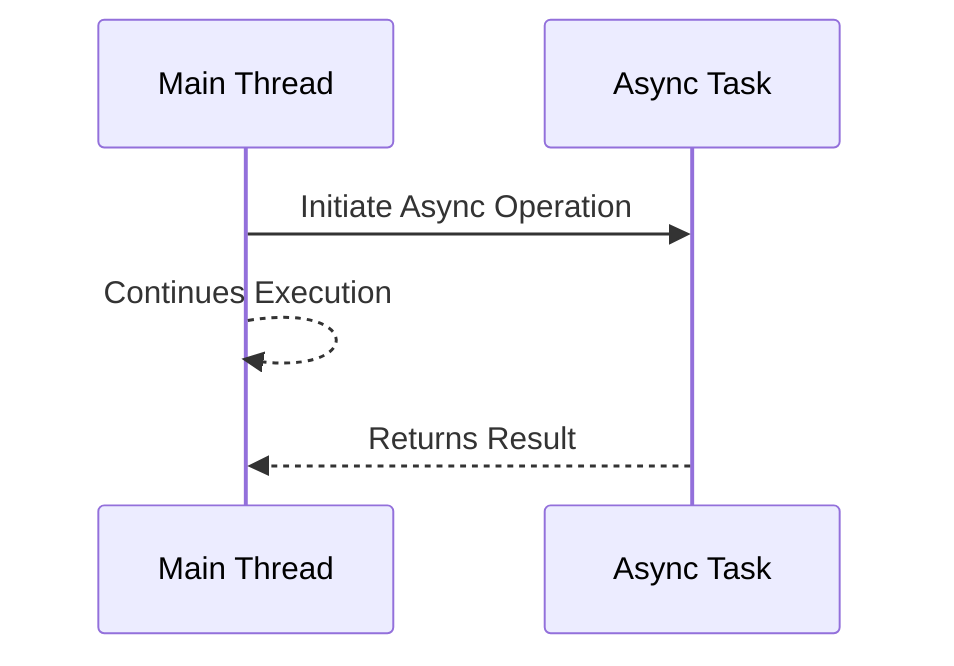

## 12.2.2 Asynchronous Programming and Non-Blocking Patterns

Asynchronous programming is a cornerstone of modern JavaScript and TypeScript development, enabling applications to handle multiple tasks concurrently without blocking the main execution thread. This approach is crucial for creating responsive, high-performance applications, particularly in environments where I/O-bound operations, such as network requests and file system interactions, are prevalent. In this section, we will delve into the principles and practices of asynchronous programming, exploring how it enhances performance and provides a seamless user experience.

### Understanding Asynchronous Programming

In traditional synchronous programming, operations are executed sequentially, meaning each task must complete before the next one begins. This can lead to blocking, where a time-consuming task prevents the execution of subsequent tasks, degrading the application's responsiveness. Asynchronous programming, on the other hand, allows tasks to be initiated and completed independently, enabling the application to remain responsive even when handling intensive operations.

#### Key Concepts: Async/Await, Promises, and Callbacks

- **Callbacks**: The simplest form of asynchronous programming, where a function is passed as an argument to another function and is executed once a task completes. While effective, callbacks can lead to complex and hard-to-maintain code, often referred to as "callback hell."

- **Promises**: A more modern approach, Promises represent a value that may be available now, or in the future, or never. They provide a cleaner, more manageable way to handle asynchronous operations, allowing chaining and error handling through `.then()` and `.catch()` methods.

- **Async/Await**: Introduced in ECMAScript 2017, async/await syntax simplifies working with Promises, enabling developers to write asynchronous code that appears synchronous. It enhances readability and maintainability, making it the preferred choice for handling asynchronous tasks in modern JavaScript and TypeScript.

### Identifying I/O-bound and CPU-bound Tasks

In optimizing performance, it's crucial to distinguish between I/O-bound and CPU-bound tasks:

- **I/O-bound tasks**: These involve waiting for input/output operations, such as network requests, file system access, or database queries. Asynchronous programming excels in managing these tasks, allowing the application to continue executing other operations while waiting for the I/O operation to complete.

- **CPU-bound tasks**: These involve intensive computation that can monopolize the CPU. While JavaScript is single-threaded, techniques such as Web Workers or worker threads can be employed to offload these tasks, preventing them from blocking the main thread.

### The Event Loop: Heart of JavaScript Concurrency

The event loop is a fundamental concept in JavaScript's concurrency model, enabling the execution of asynchronous code. It continuously checks the call stack and the task queue, executing tasks in the call stack and moving tasks from the queue to the stack when the stack is empty.



In this diagram, the main thread initiates an asynchronous operation and continues executing other tasks. Once the async task completes, it returns the result to the main thread.

### Converting Blocking Code to Non-Blocking

Consider a scenario where you need to perform a network request and process the result:

**Blocking Code:**

```javascript
function fetchData() {
  const response = fetch('https://api.example.com/data'); // Blocking
  const data = response.json();
  console.log(data);
}
```

**Non-Blocking Code Using Async/Await:**

```javascript
async function fetchData() {
  try {
    const response = await fetch('https://api.example.com/data'); // Non-blocking
    const data = await response.json();
    console.log(data);
  } catch (error) {
    console.error('Error fetching data:', error);
  }
}
```

By using `await`, the code becomes non-blocking, allowing other operations to proceed while waiting for the network request to complete.

### Parallel Processing with Web Workers

JavaScript's single-threaded nature can be a limitation for CPU-bound tasks. Web Workers provide a solution by enabling parallel execution of JavaScript code in separate threads, offloading heavy computations and keeping the main thread responsive.

**Using Web Workers:**

```javascript
// main.js
const worker = new Worker('worker.js');

worker.onmessage = function(event) {
  console.log('Result from worker:', event.data);
};

worker.postMessage('Start computation');
```

```javascript
// worker.js
onmessage = function(event) {
  const result = performHeavyComputation();
  postMessage(result);
};

function performHeavyComputation() {
  // Intensive computation logic
  return 'Computation result';
}
```

### Best Practices for Managing Concurrency

- **Avoid Race Conditions**: Ensure that shared resources are accessed safely by using locks or atomic operations where necessary.

- **Use Batching**: Group multiple asynchronous operations together to reduce overhead and improve efficiency.

- **Implement Throttling and Debouncing**: Control the frequency of events, such as user inputs or API calls, to prevent overwhelming the system.

### Error Handling in Asynchronous Code

Handling errors in asynchronous code is crucial to prevent unhandled rejections and ensure application stability. Use `.catch()` with Promises and try/catch blocks with async/await to manage errors effectively.

**Example:**

```javascript
async function fetchData() {
  try {
    const response = await fetch('https://api.example.com/data');
    if (!response.ok) throw new Error('Network response was not ok');
    const data = await response.json();
    console.log(data);
  } catch (error) {
    console.error('Error fetching data:', error);
  }
}
```

### Optimizing Network Requests

Optimize network requests by leveraging techniques such as HTTP/2 multiplexing, which allows multiple requests to be sent over a single connection, reducing latency and improving performance.

### Leveraging Frameworks and Libraries

Frameworks and libraries like React, Angular, and RxJS offer built-in support for asynchronous patterns, providing tools and abstractions to simplify the management of asynchronous tasks.

### Profiling and Monitoring Asynchronous Code

Regularly profile and monitor your asynchronous code to identify bottlenecks and optimize performance. Tools like Chrome DevTools and Node.js Profiler can help you analyze execution times and resource usage.

### Conclusion

Asynchronous programming and non-blocking patterns are essential for building high-performance, responsive applications in JavaScript and TypeScript. By understanding and applying these techniques, you can optimize your code to handle multiple tasks efficiently, providing a seamless user experience.

## Quiz Time!



### Which of the following is NOT a benefit of asynchronous programming?

- [ ] Improved application responsiveness
- [ ] Enhanced performance for I/O-bound tasks
- [x] Simplified error handling
- [ ] Ability to perform non-blocking operations

> **Explanation:** Asynchronous programming can complicate error handling due to the nature of asynchronous code execution.

### What is the primary role of the event loop in JavaScript?

- [x] To manage the execution of asynchronous tasks
- [ ] To initialize global variables
- [ ] To compile JavaScript code
- [ ] To handle network requests

> **Explanation:** The event loop manages asynchronous tasks, allowing JavaScript to handle concurrency.

### How does async/await improve code readability compared to Promises?

- [x] By allowing asynchronous code to be written in a synchronous style
- [ ] By eliminating the need for error handling
- [ ] By automatically optimizing performance
- [ ] By reducing the number of lines of code

> **Explanation:** Async/await allows developers to write asynchronous code in a way that looks synchronous, improving readability.

### Which technique is used to control the frequency of event execution?

- [ ] Batching
- [x] Throttling
- [ ] Caching
- [ ] Multiplexing

> **Explanation:** Throttling is used to control the rate at which events are handled, preventing performance issues.

### What is a common use case for Web Workers in JavaScript?

- [ ] Managing network requests
- [x] Performing CPU-intensive computations
- [ ] Handling DOM manipulations
- [ ] Managing user input events

> **Explanation:** Web Workers are used to offload CPU-intensive tasks to separate threads, keeping the main thread responsive.

### Which method is used to handle errors in async/await?

- [ ] .then()
- [x] try/catch
- [ ] .finally()
- [ ] .catch()

> **Explanation:** Errors in async/await are handled using try/catch blocks.

### What is a race condition?

- [x] A situation where multiple processes access shared resources concurrently, leading to unexpected results
- [ ] A technique to optimize network requests
- [ ] A method for handling asynchronous tasks
- [ ] A type of error in synchronous programming

> **Explanation:** Race conditions occur when multiple processes access shared resources concurrently without proper synchronization.

### How can HTTP/2 multiplexing improve network performance?

- [x] By allowing multiple requests to be sent over a single connection
- [ ] By caching responses on the client side
- [ ] By reducing the size of request payloads
- [ ] By encrypting network traffic

> **Explanation:** HTTP/2 multiplexing allows multiple requests to be sent over a single connection, reducing latency.

### What is the purpose of debouncing?

- [ ] To batch multiple operations together
- [x] To delay the execution of a function until a specified time has passed since the last call
- [ ] To optimize CPU-bound tasks
- [ ] To handle errors in asynchronous code

> **Explanation:** Debouncing delays the execution of a function until a specified time has passed since the last call, useful for handling rapid events like keystrokes.

### True or False: Asynchronous programming is only beneficial for I/O-bound tasks.

- [ ] True
- [x] False

> **Explanation:** While asynchronous programming is especially beneficial for I/O-bound tasks, it can also help manage CPU-bound tasks when combined with techniques like Web Workers.


