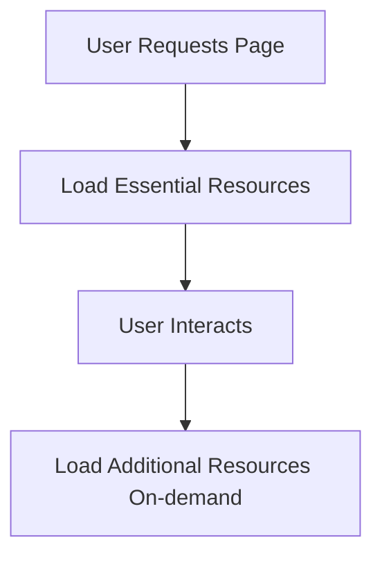

## 12.3.1 Lazy Loading and Code Splitting

In today's fast-paced digital world, users expect web applications to load quickly and respond instantly. As applications grow in complexity, managing performance becomes crucial. Two powerful techniques to address this challenge are lazy loading and code splitting. These techniques help optimize web applications by loading resources only when necessary, thereby reducing initial load times and enhancing the user experience. In this section, we'll delve into the intricacies of lazy loading and code splitting, exploring their benefits, implementation strategies, and best practices.

### Understanding Lazy Loading

Lazy loading is a design pattern that defers the loading of resources until they are actually needed. This approach can significantly reduce the initial load time of a web application by only loading essential resources upfront. Non-essential resources, such as images, scripts, or components, are loaded asynchronously when the user interacts with the application or navigates to different parts of it.

#### Key Benefits of Lazy Loading

- **Reduced Initial Load Time**: By loading only essential resources initially, lazy loading minimizes the time required for the application to become interactive.
- **Improved Perceived Performance**: Users perceive the application as faster because they can start interacting with it sooner, even if not all resources are fully loaded.
- **Optimized Resource Utilization**: Resources are loaded only when needed, reducing unnecessary data transfer and bandwidth usage.

### Implementing Lazy Loading in JavaScript

JavaScript provides several ways to implement lazy loading, with dynamic imports being one of the most effective methods. Dynamic imports allow you to load JavaScript modules on-demand, rather than including them in the initial bundle.

#### Dynamic Imports Example

Here's a simple example of how to use dynamic imports in a JavaScript application:

```javascript
// Assume we have a module named 'heavyComponent.js'
function loadHeavyComponent() {
  import('./heavyComponent.js')
    .then(module => {
      const HeavyComponent = module.default;
      // Use the loaded component
      const component = new HeavyComponent();
      component.render();
    })
    .catch(error => {
      console.error('Error loading the component:', error);
    });
}

// Trigger loading on user interaction
document.getElementById('loadButton').addEventListener('click', loadHeavyComponent);
```

In this example, `heavyComponent.js` is loaded only when the user clicks a button, deferring its loading until it is actually needed.

### Code Splitting: Dividing and Conquering

Code splitting is a technique that breaks down a large application bundle into smaller, more manageable chunks. This allows parts of the application to be loaded independently, improving both load times and performance.

#### How Code Splitting Works

Code splitting can be achieved through various methods, such as:

- **Entry Points**: Splitting based on different entry points in the application, allowing different parts of the application to be loaded separately.
- **Dynamic Imports**: As shown earlier, dynamic imports can be used to load modules on-demand.
- **Vendor Splitting**: Separating third-party libraries from the application code to manage dependencies more effectively.

### Leveraging Webpack for Code Splitting

Webpack is a popular module bundler that provides robust support for code splitting. It allows developers to configure how and when different parts of the application should be split and loaded.

#### Webpack Configuration Example

Here's a basic example of how to configure Webpack for code splitting:

```javascript
// webpack.config.js
module.exports = {
  entry: {
    main: './src/index.js',
    vendor: ['react', 'react-dom']
  },
  output: {
    filename: '[name].[contenthash].js',
    path: __dirname + '/dist'
  },
  optimization: {
    splitChunks: {
      chunks: 'all',
      cacheGroups: {
        vendor: {
          test: /[\\/]node_modules[\\/]/,
          name: 'vendors',
          chunks: 'all'
        }
      }
    }
  }
};
```

In this configuration, Webpack splits the code into separate chunks for the main application code and vendor libraries, optimizing asset delivery.

### Benefits of Code Splitting

- **Improved Load Times**: By loading only the necessary code for the current view, code splitting reduces the amount of code that needs to be downloaded upfront.
- **Better Caching**: Smaller chunks mean that only the changed parts of the application need to be downloaded when updates occur.
- **Enhanced User Experience**: Users experience faster load times and smoother interactions.

### Identifying Candidates for Lazy Loading

Not all components or modules are suitable for lazy loading. It's essential to identify those that can benefit from deferred loading without impacting user experience negatively.

#### Suitable Candidates

- **Large Libraries**: Libraries that are not needed immediately, such as charting libraries or rich text editors.
- **Images and Media**: Content that can be loaded as the user scrolls or interacts with the page.
- **Non-Critical UI Components**: Components that are not visible on the initial screen but are accessed through user interactions.

### Lazy Loading Flow Diagram

To better understand the lazy loading process, consider the following flow diagram:



This diagram illustrates how resources are loaded only when needed, optimizing both performance and resource utilization.

### Preloading Strategies

While lazy loading focuses on deferring resource loading, preloading anticipates user actions and loads resources in advance. This can be beneficial for improving perceived performance.

#### Preloading Techniques

- **Link Preload**: Use `<link rel="preload">` to hint the browser to load resources in advance.
- **Intersection Observer**: Preload images or components as they come into the viewport.
- **Predictive Fetching**: Use analytics to predict user behavior and preload likely resources.

### Managing Dependencies and Transitions

When implementing lazy loading, managing dependencies and ensuring smooth transitions are crucial to maintaining a seamless user experience.

#### Tips for Managing Dependencies

- **Dependency Graphs**: Use tools to visualize dependencies and identify potential issues.
- **Fallbacks**: Provide fallbacks for essential resources to ensure functionality even if lazy loading fails.
- **Loading Indicators**: Use spinners or skeleton screens to indicate loading progress and enhance user experience.

### SEO Considerations

Lazy loading can impact SEO, as search engines may not execute JavaScript or wait for resources to load. To mitigate this, consider the following strategies:

- **Server-Side Rendering (SSR)**: Pre-render pages on the server to ensure search engines can index content.
- **Hybrid Rendering**: Combine SSR with client-side rendering for optimal performance and SEO.
- **Structured Data**: Use structured data to help search engines understand the content of your pages.

### Enhancing User Experience

Using placeholders or skeleton screens can significantly improve user experience during lazy loading by providing visual feedback.

#### Implementing Placeholders

- **Skeleton Screens**: Use lightweight placeholders that mimic the structure of the content being loaded.
- **Progress Indicators**: Display loading bars or spinners to show progress.

### Error Handling and Monitoring

Robust error handling is crucial for managing issues that may arise during asynchronous loading.

#### Error Handling Strategies

- **Graceful Fallbacks**: Provide alternative content or messages if loading fails.
- **Retry Logic**: Implement retry mechanisms for transient network errors.
- **Logging and Monitoring**: Use tools to monitor loading performance and errors.

### Testing and Debugging

Testing lazy loading implementations across different devices and network conditions is essential to ensure consistent performance.

#### Testing Tips

- **Simulate Slow Networks**: Use browser developer tools to test under various network conditions.
- **Cross-Device Testing**: Ensure functionality on different devices and screen sizes.
- **Automated Testing**: Use automated tests to validate lazy loading logic and performance.

### Balancing Load Times and Functionality

Striking the right balance between load times and functionality availability is crucial for optimal performance.

#### Best Practices

- **Prioritize Critical Resources**: Load essential resources first to ensure core functionality is available.
- **Monitor Performance**: Continuously monitor and optimize load times based on user behavior and feedback.
- **Iterative Improvements**: Regularly review and refine lazy loading strategies to align with evolving application needs.

### Conclusion

Lazy loading and code splitting are powerful techniques for optimizing web application performance. By strategically deferring resource loading and dividing code into manageable chunks, developers can enhance user experience, reduce load times, and optimize resource utilization. Implementing these techniques requires careful planning and testing, but the benefits in terms of performance and user satisfaction are well worth the effort.

## Quiz Time!



### What is lazy loading?

- [x] A technique to load resources only when needed
- [ ] A method to load all resources at once
- [ ] A way to preload all resources
- [ ] A technique to load resources in a random order

> **Explanation:** Lazy loading defers the loading of resources until they are actually needed, optimizing performance by reducing initial load times.

### Which JavaScript feature is commonly used for lazy loading?

- [x] Dynamic imports
- [ ] Static imports
- [ ] Promises
- [ ] Callbacks

> **Explanation:** Dynamic imports allow JavaScript modules to be loaded on-demand, making them ideal for implementing lazy loading.

### What is code splitting?

- [x] Dividing code into smaller chunks for on-demand loading
- [ ] Combining all code into a single file
- [ ] Loading all code at once
- [ ] Removing unused code

> **Explanation:** Code splitting divides code into smaller, manageable chunks that can be loaded independently, improving load times and performance.

### How does Webpack facilitate code splitting?

- [x] By configuring entry points and optimization settings
- [ ] By combining all code into one file
- [ ] By removing comments from the code
- [ ] By minifying all code

> **Explanation:** Webpack allows developers to configure how code should be split and loaded through entry points and optimization settings, facilitating efficient code splitting.

### What is the primary benefit of lazy loading?

- [x] Reduced initial load time
- [ ] Increased bandwidth usage
- [ ] Slower user interactions
- [ ] Increased resource consumption

> **Explanation:** Lazy loading reduces the initial load time by loading only essential resources upfront, enhancing user experience.

### What is a suitable candidate for lazy loading?

- [x] Large libraries not needed initially
- [ ] Essential UI components
- [ ] Core application logic
- [ ] Basic HTML and CSS files

> **Explanation:** Large libraries or components that are not immediately needed can be deferred for lazy loading, optimizing initial load times.

### How can lazy loading impact SEO?

- [x] By potentially affecting search engine indexing
- [ ] By improving search engine rankings
- [ ] By reducing page content
- [ ] By increasing page load times

> **Explanation:** Lazy loading can impact SEO if search engines do not execute JavaScript or wait for resources to load, potentially affecting indexing.

### Which HTML tag can be used for preloading resources?

- [x] `<link rel="preload">`
- [ ] `<script>`
- [ ] ``
- [ ] `<style>`

> **Explanation:** The `<link rel="preload">` tag hints the browser to load resources in advance, aiding in preloading strategies.

### What is a common strategy to enhance user experience during lazy loading?

- [x] Using placeholders or skeleton screens
- [ ] Hiding all content until fully loaded
- [ ] Displaying error messages
- [ ] Removing loading indicators

> **Explanation:** Placeholders or skeleton screens provide visual feedback during lazy loading, improving user experience by indicating loading progress.

### True or False: Lazy loading and code splitting are unrelated techniques.

- [ ] True
- [x] False

> **Explanation:** Lazy loading and code splitting are related techniques that work together to optimize web application performance by managing resource loading.


