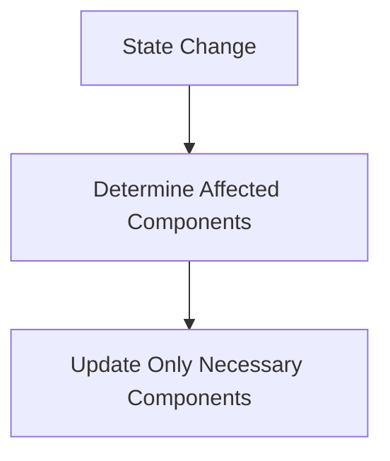

## 12.3.3 Optimizing Rendering and Reconciliation

In the realm of UI development, rendering performance is paramount to creating responsive and efficient applications. As users interact with your application, the UI must update swiftly to maintain a seamless experience. This section delves into the intricacies of optimizing rendering and reconciliation in JavaScript and TypeScript, offering insights into best practices and advanced techniques.

### Understanding Rendering Performance

Rendering performance directly impacts the responsiveness of UI applications. When a user interacts with an application, such as clicking a button or entering text, the UI must update to reflect these changes. Slow rendering can lead to a laggy experience, frustrating users and diminishing the application's perceived quality.

#### Factors Affecting Rendering Performance

- **DOM Manipulations:** Direct manipulations of the DOM can be costly. Each change triggers a re-calculation of styles and layout, leading to potential reflows and repaints.
- **JavaScript Execution:** Heavy JavaScript operations during rendering can block the main thread, causing delays in UI updates.
- **CSS Calculations:** Complex CSS rules and animations can also impact rendering performance, especially if they trigger layout recalculations.

### The Role of the Virtual DOM

Frameworks like React introduced the concept of the Virtual DOM to mitigate rendering performance issues. The Virtual DOM is an abstraction of the actual DOM, allowing for efficient updates by minimizing direct DOM manipulations.

#### How the Virtual DOM Works

1. **State Changes:** When the application state changes, a new Virtual DOM tree is created.
2. **Diffing Algorithm:** The framework compares the new Virtual DOM with the previous one, identifying changes.
3. **Batch Updates:** Only the necessary changes are applied to the actual DOM, reducing the overhead of direct manipulations.

### Minimizing Unnecessary Re-renders

Unnecessary re-renders can degrade performance. To optimize, developers can employ techniques like `shouldComponentUpdate` in React or memoization strategies.

#### Using `shouldComponentUpdate`

In React, the `shouldComponentUpdate` lifecycle method allows developers to control component updates. By returning `false` when updates are unnecessary, performance can be improved.

```javascript
class MyComponent extends React.Component {
  shouldComponentUpdate(nextProps, nextState) {
    return nextProps.someValue !== this.props.someValue;
  }
}
```

#### Memoization Techniques

Memoization involves caching results of expensive function calls and returning the cached result when the same inputs occur again. Libraries like `memoize-one` can be used to achieve this.

```javascript
import memoizeOne from 'memoize-one';

const computeExpensiveValue = memoizeOne((input) => {
  // Expensive computation
  return result;
});
```

### Optimizing Reconciliation Algorithms

Reconciliation is the process of updating the UI to match the new state. Optimizing reconciliation algorithms involves ensuring that only necessary components are updated.

#### Strategies for Efficient Reconciliation

- **Component Keys:** Use stable and unique keys for list items to help the reconciliation algorithm efficiently identify changes.
- **Pure Components:** Utilize pure components that only re-render when their props or state change.

### Effective State Management

Managing state effectively is crucial to minimizing rendering overhead. Unnecessary state changes can lead to excessive re-renders.

#### Tips for State Management

- **Local vs. Global State:** Use local state for component-specific data and global state for shared data.
- **State Normalization:** Normalize state to reduce redundancy and improve update efficiency.
- **Avoid Deep Nesting:** Deeply nested state objects can complicate updates and lead to performance issues.

### Handling Large Data Lists with Windowing

Rendering large data lists can be challenging. Techniques like windowing or virtualization can help manage performance.

#### Implementing Windowing

Libraries like `react-window` or `react-virtualized` can be used to render only the visible portion of a list, reducing the rendering workload.

```javascript
import { FixedSizeList as List } from 'react-window';

const MyList = ({ items }) => (
  <List
    height={150}
    itemCount={items.length}
    itemSize={35}
    width={300}
  >
    {({ index, style }) => (
      <div style={style}>
        {items[index]}
      </div>
    )}
  </List>
);
```

### Component Rendering Optimization Diagram

To visualize component rendering optimization, consider the following diagram:



### Impact of CSS and Layout Calculations

CSS and layout calculations can significantly affect rendering performance. Complex layouts and animations can lead to frequent reflows and repaints.

#### Tips for Optimizing CSS

- **Minimize Layout Thrashing:** Avoid frequent changes that trigger layout recalculations.
- **Use Hardware Acceleration:** Leverage CSS properties like `transform` and `opacity` for smoother animations.
- **Optimize Selectors:** Use simpler selectors to reduce the cost of style recalculations.

### Batching Updates and Deferring Non-Critical Tasks

Batching updates and deferring non-critical tasks can enhance rendering performance by reducing the number of operations performed in a single frame.

#### Batching Updates

Batching involves grouping multiple updates into a single operation, reducing the overhead of individual updates.

#### Deferring Non-Critical Tasks

Use techniques like `requestIdleCallback` to defer non-critical tasks until the browser is idle.

```javascript
requestIdleCallback(() => {
  // Perform non-critical task
});
```

### Measuring Rendering Performance

Using Performance APIs and tools like React Profiler can help measure rendering times and identify bottlenecks.

#### Using Performance APIs

The Performance API provides methods to measure and analyze rendering performance.

```javascript
performance.mark('start');
// Code to measure
performance.mark('end');
performance.measure('My Measurement', 'start', 'end');
```

#### React Profiler

React Profiler allows developers to visualize component rendering times and identify performance issues.

### Optimizing Animations and Transitions

Animations and transitions can impact rendering performance. Optimizing these elements ensures smoother UI interactions.

#### Best Practices for Animations

- **Use CSS Transitions:** Prefer CSS transitions over JavaScript animations for better performance.
- **Leverage RequestAnimationFrame:** Use `requestAnimationFrame` for smooth animations.

### Accessibility Considerations

When optimizing rendering, it's essential to consider accessibility. Ensure that optimizations do not hinder assistive technologies or impair user experience.

### Continuous Testing and Optimization

Rendering performance should be continuously tested and optimized as the application evolves. Regular profiling and testing help maintain responsiveness.

#### Encouraging Continuous Optimization

- **Automated Tests:** Incorporate performance tests into CI/CD pipelines.
- **User Feedback:** Gather user feedback to identify performance pain points.

### Conclusion

Optimizing rendering and reconciliation is crucial for building responsive and efficient UI applications. By leveraging techniques like the Virtual DOM, effective state management, and performance measurement tools, developers can enhance the user experience and maintain high application performance.

---

## Quiz Time!



### What is the primary goal of optimizing rendering performance in UI applications?

- [x] To ensure a responsive and efficient user interface
- [ ] To increase the complexity of the codebase
- [ ] To reduce the number of features in the application
- [ ] To make the application less interactive

> **Explanation:** The primary goal of optimizing rendering performance is to ensure a responsive and efficient user interface, providing a seamless experience for users.

### How does the Virtual DOM help optimize rendering performance?

- [x] By minimizing direct DOM manipulations
- [ ] By increasing the number of DOM updates
- [ ] By making the DOM more complex
- [ ] By eliminating the need for state management

> **Explanation:** The Virtual DOM helps optimize rendering performance by minimizing direct DOM manipulations, reducing the overhead of updates.

### Which lifecycle method in React can be used to prevent unnecessary re-renders?

- [x] shouldComponentUpdate
- [ ] componentDidMount
- [ ] componentWillUnmount
- [ ] render

> **Explanation:** The `shouldComponentUpdate` lifecycle method in React can be used to prevent unnecessary re-renders by returning `false` when updates are not needed.

### What is memoization in the context of rendering optimization?

- [x] Caching results of expensive function calls
- [ ] Increasing the number of function calls
- [ ] Making functions more complex
- [ ] Eliminating function calls

> **Explanation:** Memoization involves caching the results of expensive function calls and returning the cached result when the same inputs occur again, improving performance.

### What is the purpose of using windowing or virtualization for large data lists?

- [x] To render only the visible portion of the list
- [ ] To render the entire list at once
- [ ] To increase the size of the list
- [ ] To make the list more complex

> **Explanation:** Windowing or virtualization is used to render only the visible portion of a large data list, reducing the rendering workload and improving performance.

### How can CSS animations impact rendering performance?

- [x] By triggering layout recalculations
- [ ] By reducing the number of DOM elements
- [ ] By simplifying the CSS rules
- [ ] By eliminating the need for JavaScript

> **Explanation:** CSS animations can impact rendering performance by triggering layout recalculations, which can lead to frequent reflows and repaints.

### What technique can be used to defer non-critical rendering tasks?

- [x] requestIdleCallback
- [ ] setTimeout
- [ ] setInterval
- [ ] alert

> **Explanation:** `requestIdleCallback` can be used to defer non-critical rendering tasks until the browser is idle, optimizing performance.

### Which tool can be used to measure component rendering times in React?

- [x] React Profiler
- [ ] Redux DevTools
- [ ] Chrome DevTools
- [ ] Babel

> **Explanation:** React Profiler is a tool that can be used to measure component rendering times and identify performance issues in React applications.

### What is the impact of batching updates on rendering performance?

- [x] It reduces the overhead of individual updates
- [ ] It increases the number of updates
- [ ] It makes updates more complex
- [ ] It eliminates the need for updates

> **Explanation:** Batching updates reduces the overhead of individual updates by grouping them into a single operation, improving rendering performance.

### True or False: Optimizing rendering performance should only be done once during development.

- [ ] True
- [x] False

> **Explanation:** Optimizing rendering performance should be a continuous process, with regular testing and profiling to maintain responsiveness as the application evolves.


