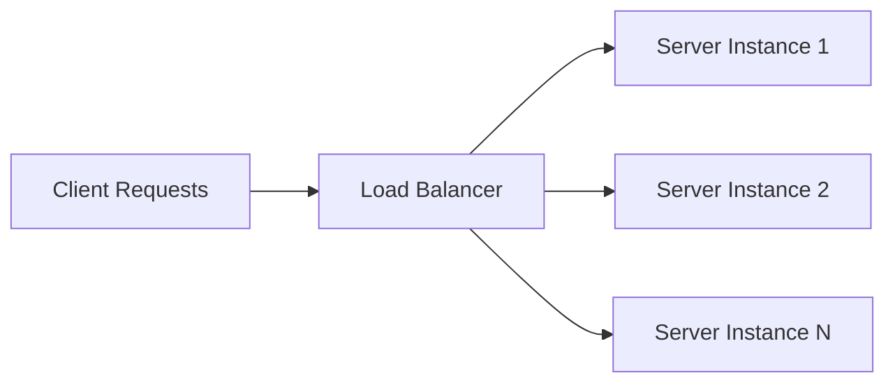

## 12.4.1 Implementing Load Balancing and Horizontal Scaling

In today's fast-paced digital landscape, ensuring that applications can handle increasing loads efficiently is crucial. Load balancing and horizontal scaling are two pivotal strategies that enable applications to manage high traffic volumes and maintain performance. This section delves into the concepts, strategies, and practical implementations of load balancing and horizontal scaling, providing insights and guidance for developers and system architects.

### Understanding Load Balancing

Load balancing is a technique used to distribute network or application traffic across multiple servers. By spreading the workload, load balancing ensures that no single server becomes overwhelmed, which can lead to performance degradation or downtime. The primary goal of load balancing is to enhance the availability and reliability of applications.

#### The Role of Load Balancers

Load balancers act as intermediaries between client requests and server resources. They receive incoming requests and distribute them across a pool of backend servers. This distribution can be based on various algorithms or strategies, each with its own advantages and use cases.

#### Load Balancing Strategies

Different load balancing strategies can be employed depending on the specific requirements of an application. Here are some common strategies:

- **Round-Robin**: This strategy distributes requests sequentially across the available servers. It is simple and effective for environments where all servers have similar capabilities.

- **Least Connections**: This strategy directs traffic to the server with the fewest active connections. It is ideal for applications with varying request processing times.

- **IP Hash**: This strategy uses the client's IP address to determine which server will handle the request. It ensures that a client consistently connects to the same server, which can be useful for session persistence.

- **Random with Two Choices**: A hybrid approach where two servers are randomly selected, and the one with the fewest connections is chosen. This strategy balances load effectively while minimizing the chance of uneven distribution.

### Setting Up Load Balancers

Implementing a load balancer involves configuring software or hardware solutions that can efficiently manage traffic distribution. Popular software solutions include Nginx and HAProxy.

#### Nginx as a Load Balancer

Nginx is a high-performance web server that can also function as a load balancer. It supports various load balancing algorithms and is known for its robustness and scalability.

**Example Configuration:**

```nginx
http {
    upstream backend {
        server server1.example.com;
        server server2.example.com;
        server server3.example.com;
    }

    server {
        listen 80;

        location / {
            proxy_pass http://backend;
        }
    }
}
```

This configuration sets up a simple round-robin load balancer with three backend servers.

#### HAProxy as a Load Balancer

HAProxy is another popular choice for load balancing, known for its high performance and flexibility. It supports a wide range of load balancing algorithms and can handle large volumes of traffic.

**Example Configuration:**

```haproxy
frontend http_front
    bind *:80
    default_backend servers

backend servers
    balance roundrobin
    server server1 server1.example.com:80 check
    server server2 server2.example.com:80 check
    server server3 server3.example.com:80 check
```

This HAProxy configuration sets up a round-robin load balancer with health checks for each server.

### Horizontal Scaling

Horizontal scaling, or scaling out, involves adding more instances of a service to handle increased traffic. Unlike vertical scaling, which involves upgrading the resources of a single server, horizontal scaling adds more servers to the existing pool.

#### Benefits of Horizontal Scaling

- **Scalability**: Easily accommodate increased load by adding more servers.
- **Redundancy**: Reduces the risk of failure by distributing the load across multiple servers.
- **Cost-Effective**: Often more cost-effective than vertical scaling, as commodity hardware can be used.

#### Challenges of Horizontal Scaling

- **Complexity**: Managing multiple servers can increase complexity.
- **Data Consistency**: Ensuring data consistency across distributed servers can be challenging.
- **Network Latency**: Increased network communication can introduce latency.

### Stateless vs. Stateful Architectures

When designing applications for horizontal scaling, understanding the difference between stateless and stateful architectures is crucial.

#### Stateless Architectures

Stateless applications do not store any client session data on the server. Each request from a client is independent, allowing any server to handle any request.

- **Benefits**: Simplifies load balancing and scaling, as any server can handle any request.
- **Challenges**: Requires external storage for session data, such as a database or cache.

#### Stateful Architectures

Stateful applications maintain session data on the server. This can complicate load balancing, as requests must be directed to the server holding the session data.

- **Benefits**: Simplifies session management for certain applications.
- **Challenges**: Increases complexity in load balancing and scaling.

### Load Balancing Architecture

To visualize the load balancing process, consider the following diagram:



This diagram illustrates how client requests are routed through a load balancer and distributed across multiple server instances.

### Session Management and Consistency

In a distributed environment, managing sessions and ensuring consistency is critical. Here are some strategies:

- **Sticky Sessions**: Also known as session persistence, this technique ensures that a client's requests are always directed to the same server. While it simplifies session management, it can lead to uneven load distribution.

- **External Session Stores**: Using external session stores like Redis or Memcached allows for stateless server instances, as session data is stored outside the application servers.

- **Database Consistency**: Implementing eventual consistency models can help manage data consistency across distributed databases, ensuring that all nodes eventually reflect the same data state.

### Health Checks and Failover Mechanisms

To maintain high availability, load balancers should perform regular health checks on backend servers. If a server becomes unresponsive, the load balancer can automatically redirect traffic to healthy servers.

- **Health Checks**: Regularly ping servers to ensure they are operational. Use HTTP, TCP, or custom scripts to verify server health.

- **Failover**: Automatically redirect traffic away from failed servers to maintain service availability.

### Autoscaling and Dynamic Resource Allocation

In cloud environments, autoscaling allows applications to dynamically adjust resources based on traffic demands. This ensures optimal resource usage and cost efficiency.

- **Cloud Services**: Platforms like AWS, Azure, and Google Cloud offer autoscaling features that automatically adjust the number of instances based on predefined metrics.

- **Dynamic Allocation**: Resources are allocated in real-time, ensuring that applications can handle traffic spikes without manual intervention.

### Monitoring System Load and Performance Metrics

Continuous monitoring of system load and performance metrics is essential for maintaining application health and performance. Utilize monitoring tools to track key metrics such as CPU usage, memory consumption, and request latency.

- **Tools**: Use tools like Prometheus, Grafana, or CloudWatch to monitor and visualize system metrics.

- **Alerts**: Set up alerts to notify administrators of potential issues before they impact users.

### Rolling Updates and Zero Downtime Deployments

Deploying updates without downtime is critical for maintaining user satisfaction. Rolling updates allow for seamless deployment by updating a subset of servers at a time.

- **Blue-Green Deployments**: Maintain two identical environments (blue and green) and switch traffic between them during updates.

- **Canary Releases**: Gradually roll out updates to a small subset of users to test changes before a full release.

### Data Synchronization and Eventual Consistency

In distributed systems, data synchronization and consistency are vital. Eventual consistency models allow for temporary data discrepancies, with the assurance that all nodes will eventually reflect the same state.

- **Conflict Resolution**: Implement conflict resolution strategies to handle data discrepancies across nodes.

- **Replication**: Use data replication techniques to ensure data availability and consistency.

### Leveraging Cloud Services for Load Balancing and Scaling

Cloud providers offer a range of services to simplify load balancing and scaling. Here are some examples:

- **AWS Elastic Load Balancer (ELB)**: Provides automatic distribution of incoming traffic across multiple targets.

- **Azure Load Balancer**: Offers high availability and network performance for applications.

- **Google Cloud Load Balancing**: Provides scalable and reliable load balancing for applications hosted on Google Cloud.

### Networking Considerations

Networking plays a crucial role in load balancing and scaling. Consider the following factors:

- **Latency**: Minimize latency by strategically placing servers closer to users.

- **Bandwidth**: Ensure sufficient bandwidth to handle peak traffic loads.

- **Security**: Implement security measures such as firewalls and DDoS protection to safeguard network infrastructure.

### Planning for Scalability

Scalability should be a primary consideration from the early stages of development. Here are some best practices:

- **Design for Scale**: Architect applications to support horizontal scaling and statelessness.

- **Test for Scale**: Regularly test applications under load to identify potential bottlenecks.

- **Plan for Growth**: Anticipate future growth and design systems to accommodate increased demand.

In conclusion, implementing load balancing and horizontal scaling is essential for building resilient and scalable applications. By understanding the strategies and tools available, developers can ensure their applications remain performant and reliable under varying loads.

## Quiz Time!



### What is the primary goal of load balancing?

- [x] To enhance the availability and reliability of applications
- [ ] To increase the number of servers
- [ ] To reduce the cost of hosting
- [ ] To improve the design of the application

> **Explanation:** Load balancing aims to distribute traffic efficiently across multiple servers, enhancing availability and reliability.

### Which load balancing strategy uses the client's IP address to determine server allocation?

- [ ] Round-Robin
- [ ] Least Connections
- [x] IP Hash
- [ ] Random with Two Choices

> **Explanation:** The IP Hash strategy uses the client's IP address to ensure consistent server allocation for requests.

### What is a benefit of horizontal scaling?

- [ ] Reduces the number of servers
- [ ] Simplifies application design
- [x] Increases redundancy
- [ ] Decreases network latency

> **Explanation:** Horizontal scaling increases redundancy by distributing the load across multiple servers.

### What is a challenge of stateful architectures in load balancing?

- [x] Complexity in directing traffic to the correct server
- [ ] Simplified session management
- [ ] Reduced server load
- [ ] Increased scalability

> **Explanation:** Stateful architectures require traffic to be directed to the server holding the session data, increasing complexity.

### What is the purpose of health checks in load balancing?

- [ ] To increase server load
- [x] To ensure servers are operational
- [ ] To reduce network latency
- [ ] To simplify application design

> **Explanation:** Health checks verify that servers are operational and can handle requests.

### Which deployment strategy involves maintaining two identical environments?

- [x] Blue-Green Deployments
- [ ] Canary Releases
- [ ] Rolling Updates
- [ ] Hot Swapping

> **Explanation:** Blue-Green Deployments maintain two environments and switch traffic between them during updates.

### What is a key benefit of using cloud services for load balancing?

- [ ] Increased manual intervention
- [x] Automatic traffic distribution
- [ ] Reduced server redundancy
- [ ] Decreased security

> **Explanation:** Cloud services like AWS ELB automatically distribute incoming traffic, enhancing scalability.

### What is the role of conflict resolution in distributed systems?

- [ ] To increase system complexity
- [x] To handle data discrepancies across nodes
- [ ] To reduce server load
- [ ] To simplify application design

> **Explanation:** Conflict resolution strategies address data discrepancies across distributed nodes.

### What should be considered when planning for scalability?

- [ ] Reducing the number of servers
- [ ] Increasing network latency
- [x] Designing for horizontal scaling
- [ ] Simplifying application architecture

> **Explanation:** Designing for horizontal scaling ensures applications can accommodate increased demand.

### True or False: Autoscaling allows applications to dynamically adjust resources based on traffic demands.

- [x] True
- [ ] False

> **Explanation:** Autoscaling dynamically adjusts resources to ensure optimal performance and cost efficiency.


