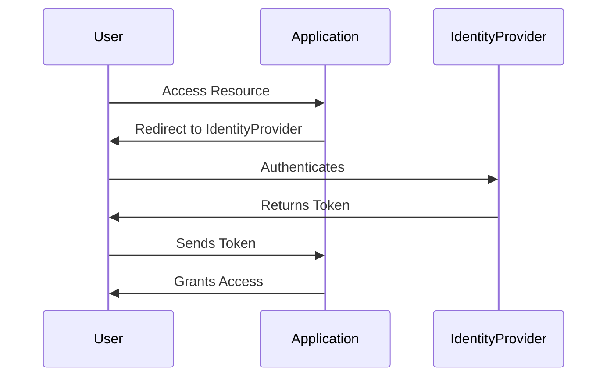

## 13.2.3 Implementing Single Sign-On (SSO) and Identity Federation

In today's interconnected digital landscape, the demand for seamless and secure access to multiple applications and services is paramount. Implementing Single Sign-On (SSO) and Identity Federation is a strategic approach that addresses this need, enhancing user experience while maintaining robust security. This comprehensive guide delves into the concepts, protocols, and practical implementations of SSO and Identity Federation, providing you with the knowledge to integrate these solutions effectively in your applications.

### Understanding Single Sign-On (SSO)

Single Sign-On (SSO) is an authentication process that allows users to access multiple applications with a single set of credentials. This eliminates the need for users to log in separately to each application, streamlining the user experience and reducing password fatigue.

#### How SSO Works

SSO operates on the principle of centralized authentication. When a user logs in to one application, they are automatically authenticated for other connected applications. This is achieved through a trust relationship established between the applications and a central identity provider (IdP).

#### Benefits of SSO

- **Improved User Experience:** Users enjoy seamless access to multiple applications without repeated logins.
- **Centralized Authentication:** Simplifies user management and enhances security by centralizing authentication processes.
- **Reduced IT Costs:** Decreases the burden on IT support by minimizing password reset requests and other login-related issues.

### Protocols and Standards for SSO

Implementing SSO requires adherence to certain protocols and standards that ensure secure and interoperable authentication processes. The most common protocols include:

#### SAML (Security Assertion Markup Language)

SAML is an XML-based standard for exchanging authentication and authorization data between parties, particularly between an identity provider and a service provider. It is widely used in enterprise environments for SSO.

#### OAuth 2.0

OAuth 2.0 is an authorization framework that enables third-party applications to obtain limited access to a user's resources without exposing the user's credentials. It is commonly used for delegated access scenarios.

#### OpenID Connect

OpenID Connect is an identity layer built on top of OAuth 2.0. It allows clients to verify the identity of the user and obtain basic profile information. OpenID Connect is popular for consumer-facing applications due to its simplicity and flexibility.

### Implementing SSO in Applications

To implement SSO, you typically integrate your application with an existing identity provider (IdP) that supports the desired protocol. Here’s a step-by-step guide:

1. **Choose an Identity Provider:** Select an IdP that supports the protocols you need. Popular options include Azure AD, Okta, and Auth0.

2. **Configure the Identity Provider:** Set up your application within the IdP, specifying details such as redirect URIs and scopes.

3. **Implement Authentication Flow:** Integrate the SSO protocol into your application. This usually involves redirecting users to the IdP for authentication and handling the response.

4. **Handle Tokens:** Securely manage tokens issued by the IdP, ensuring they are validated and stored safely.

5. **Test Thoroughly:** Conduct extensive testing to ensure the SSO flow works seamlessly and securely.

#### Example: Integrating with Auth0

Auth0 is a popular identity platform that supports various SSO protocols. Here’s a basic example of integrating SSO using Auth0 in a JavaScript application:

```javascript
import createAuth0Client from '@auth0/auth0-spa-js';

const auth0 = await createAuth0Client({
  domain: 'YOUR_DOMAIN',
  client_id: 'YOUR_CLIENT_ID'
});

// Redirect to Auth0 for login
await auth0.loginWithRedirect({
  redirect_uri: window.location.origin
});

// Handle the callback from Auth0
const handleRedirectCallback = async () => {
  const result = await auth0.handleRedirectCallback();
  console.log('User authenticated:', result);
};

// Get the user's profile
const user = await auth0.getUser();
console.log('User profile:', user);
```

### SSO Flow Diagram

To visualize the SSO process, consider the following sequence diagram:



### Identity Federation

Identity Federation extends the concept of SSO by allowing users to authenticate across organizational boundaries. It involves establishing trust relationships between different identity domains, enabling users from one domain to access resources in another.

#### Implementing Identity Federation

- **Establish Trust Relationships:** Use protocols like SAML or OpenID Connect to establish trust between identity domains.
- **Map User Attributes:** Ensure that user attributes are correctly mapped and synchronized across domains.
- **Handle User Provisioning:** Implement processes for automatic user provisioning and deprovisioning.

### Security Considerations

When implementing SSO and Identity Federation, it’s crucial to address security concerns:

- **Token Handling and Validation:** Ensure tokens are securely stored and validated to prevent unauthorized access.
- **Session Management:** Implement mechanisms to manage session lifecycles and handle logout securely.
- **Error Handling:** Provide fallback mechanisms and clear error messages if SSO fails.

### Best Practices

- **Compliance:** Ensure your SSO implementation complies with data protection regulations such as GDPR.
- **Regular Updates:** Keep libraries and dependencies up to date to mitigate security vulnerabilities.
- **Testing:** Thoroughly test your SSO implementation to ensure reliability and security.

### Challenges and Solutions

- **User Attribute Synchronization:** Implement automated processes to synchronize user attributes across systems.
- **Authorization Management:** Use role-based access control (RBAC) to manage user permissions effectively.

### SSO in Cloud and Microservices Architectures

SSO plays a critical role in cloud and microservices architectures, providing centralized authentication across distributed services. By leveraging SSO, organizations can enhance security and streamline user access in complex environments.

### Conclusion

Implementing Single Sign-On (SSO) and Identity Federation is a powerful strategy for improving user experience and enhancing security in modern applications. By understanding the protocols, integrating with identity providers, and addressing security considerations, you can effectively implement SSO and Identity Federation in your applications. Remember to keep up with best practices and continuously test your implementations to ensure they remain secure and reliable.

## Quiz Time!



### What is the main benefit of Single Sign-On (SSO)?

- [x] Users authenticate once to access multiple systems
- [ ] It provides a backup authentication method
- [ ] It allows multiple users to share the same credentials
- [ ] It replaces all passwords with biometrics

> **Explanation:** SSO allows users to authenticate once and access multiple systems, improving user experience and reducing password fatigue.


### Which protocol is XML-based and commonly used in enterprise environments for SSO?

- [x] SAML
- [ ] OAuth 2.0
- [ ] OpenID Connect
- [ ] JWT

> **Explanation:** SAML (Security Assertion Markup Language) is an XML-based standard widely used for SSO in enterprise environments.


### What is OAuth 2.0 primarily used for?

- [ ] Authentication
- [x] Authorization
- [ ] Encryption
- [ ] Data storage

> **Explanation:** OAuth 2.0 is an authorization framework that allows third-party applications to obtain limited access to a user's resources.


### What does OpenID Connect add to OAuth 2.0?

- [x] An identity layer
- [ ] A new encryption method
- [ ] A data storage mechanism
- [ ] A logging framework

> **Explanation:** OpenID Connect adds an identity layer on top of OAuth 2.0, allowing clients to verify the user's identity.


### Which of the following is a popular identity provider that supports SSO?

- [x] Auth0
- [ ] MySQL
- [ ] Apache
- [ ] Nginx

> **Explanation:** Auth0 is a popular identity provider that supports SSO and various authentication protocols.


### What is a key consideration when handling tokens in SSO?

- [x] Secure storage and validation
- [ ] Encrypting all tokens
- [ ] Using the same token for all users
- [ ] Storing tokens in plain text

> **Explanation:** Tokens should be securely stored and validated to prevent unauthorized access.


### What is Identity Federation?

- [x] Allowing users to authenticate across organizational boundaries
- [ ] A method of encrypting user data
- [ ] A protocol for storing user credentials
- [ ] A type of biometric authentication

> **Explanation:** Identity Federation allows users to authenticate across organizational boundaries, enabling access to resources in different domains.


### How can session lifecycles be managed securely in SSO?

- [x] Implementing session timeouts and secure logout mechanisms
- [ ] Allowing sessions to last indefinitely
- [ ] Using a single session for all users
- [ ] Disabling session tracking

> **Explanation:** Secure session management involves implementing session timeouts and secure logout mechanisms.


### What should be done if SSO fails?

- [x] Provide fallback mechanisms and clear error messages
- [ ] Disable all user access
- [ ] Ignore the issue
- [ ] Automatically reset user passwords

> **Explanation:** If SSO fails, provide fallback mechanisms and clear error messages to guide users.


### True or False: Regularly updating libraries and dependencies is a best practice for SSO security.

- [x] True
- [ ] False

> **Explanation:** Regularly updating libraries and dependencies helps mitigate security vulnerabilities and is a best practice for maintaining SSO security.



