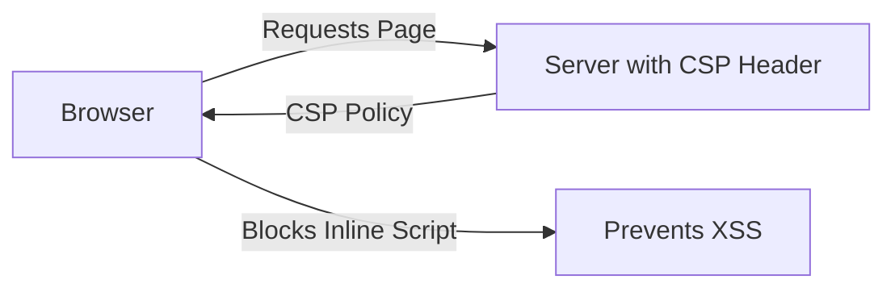

## 13.3.3 Cross-Site Scripting (XSS) Prevention

Cross-Site Scripting (XSS) is a pervasive security vulnerability that allows attackers to inject malicious scripts into web pages viewed by other users. This vulnerability can lead to unauthorized actions on behalf of the user, data theft, and even complete compromise of the affected web application. In this section, we will explore the different types of XSS, how they can be exploited, and provide comprehensive strategies for prevention in JavaScript and TypeScript applications.

### Understanding Cross-Site Scripting (XSS)

XSS attacks occur when an attacker is able to inject malicious scripts into a web application. These scripts are then executed in the context of a user's browser, allowing the attacker to perform actions such as stealing cookies, session tokens, or other sensitive information. The impact of XSS can range from minor nuisances to severe security breaches, making it a critical concern for developers.

#### Types of XSS

There are three primary types of XSS vulnerabilities:

1. **Stored XSS**: This occurs when malicious scripts are permanently stored on a target server, such as in a database, and are served to users without proper sanitization. This type of XSS is particularly dangerous because the script is executed every time the affected page is loaded.

2. **Reflected XSS**: In this type, the malicious script is reflected off a web server, typically via a URL or form submission. The script is not stored on the server but is included in the response to the user, often through query parameters or form inputs.

3. **DOM-based XSS**: This variant occurs when the vulnerability is in the client-side code rather than the server-side. It involves the modification of the DOM environment in the victim's browser to execute malicious scripts.

### Exploitation and Consequences of XSS Vulnerabilities

XSS vulnerabilities can be exploited in various ways, depending on the type and context. Here are some common exploitation scenarios:

- **Cookie Theft**: Attackers can steal cookies containing session identifiers, allowing them to impersonate users.
  
- **Session Hijacking**: By executing scripts that capture session tokens, attackers can hijack user sessions and perform actions on behalf of the user.

- **Defacement**: Attackers can modify the content of a web page to display unwanted or harmful information.

- **Phishing**: XSS can be used to create fake login forms or capture sensitive information from users.

The consequences of XSS attacks can be severe, affecting both users and the reputation of the affected web application. It is crucial for developers to understand these risks and implement effective prevention strategies.

### Preventing XSS: Best Practices and Techniques

#### Output Encoding and Context-Aware Escaping

One of the most effective ways to prevent XSS is through proper output encoding and context-aware escaping. This involves ensuring that any data rendered in a web page is appropriately encoded for the context in which it appears. For example:

- **HTML Context**: Use HTML encoding to prevent tags from being interpreted as code.
- **JavaScript Context**: Use JavaScript encoding to prevent scripts from being executed.
- **URL Context**: Encode URLs to prevent manipulation of query parameters.

Libraries such as `DOMPurify` and `OWASP Java Encoder` can help automate these processes, ensuring that data is safely encoded before being rendered.

#### Using Libraries and Frameworks

Modern frameworks and libraries often include built-in mechanisms to prevent XSS. For example, React automatically escapes data before rendering it in the DOM, reducing the risk of XSS. Similarly, Angular provides a context-aware escaping mechanism through its template syntax. Leveraging these features can significantly reduce the risk of XSS in your applications.

#### Content Security Policy (CSP)

Content Security Policy (CSP) is a powerful security feature that helps prevent XSS by specifying which sources of content are allowed to be loaded and executed. By configuring a robust CSP, you can block the execution of inline scripts and limit the sources from which scripts can be loaded.

The diagram above illustrates how CSP works by instructing the browser to block inline scripts, effectively preventing XSS attacks. Implementing CSP involves setting the `Content-Security-Policy` header with appropriate directives.

#### Sanitizing User Input

Sanitizing user input is another critical step in preventing XSS. This involves removing or escaping potentially harmful characters from user inputs before processing or storing them. Tools like `xss-filters` can assist in this process, providing functions to sanitize inputs based on the context.

#### Avoiding Dangerous APIs

Certain APIs, such as `innerHTML` and `document.write`, can introduce XSS vulnerabilities if not used carefully. Avoid using these APIs to insert untrusted data into the DOM. Instead, use safer alternatives like `textContent` or `createTextNode`.

#### Securing Client-Side Templates

When using client-side templates, ensure that data is properly escaped before rendering. Many templating engines provide built-in escaping mechanisms, but it's important to verify that these are enabled and used correctly.

#### Handling Third-Party Content

Integrating third-party content can introduce XSS risks, especially if the content is not trusted. Use sandboxed iframes or content security policies to isolate third-party content and prevent it from interacting with your application.

#### Using HTTP-only Cookies

HTTP-only cookies are a simple yet effective way to protect session cookies from being accessed by JavaScript, reducing the risk of session hijacking via XSS. Set the `HttpOnly` flag on cookies to prevent them from being accessed by client-side scripts.

### Continuous Security Practices

#### Regular Security Testing

Regular security testing is essential to identify and mitigate XSS vulnerabilities. Automated tools like OWASP ZAP and Burp Suite can help scan your applications for XSS and other security issues. Incorporate these tools into your development pipeline to ensure continuous security monitoring.

#### Continuous Education

XSS techniques and attack vectors are constantly evolving. It's crucial for developers to stay informed about emerging threats and best practices. Participate in security training, attend conferences, and engage with the security community to keep your skills up-to-date.

### Conclusion

Preventing XSS is a shared responsibility between developers and security teams. By implementing the strategies outlined in this section, you can significantly reduce the risk of XSS in your applications. Remember to leverage modern frameworks, apply context-aware escaping, and continuously test and educate yourself on security best practices.

## Quiz Time!



### What is Cross-Site Scripting (XSS)?

- [x] A vulnerability that allows attackers to inject malicious scripts into web pages
- [ ] A method for securely transmitting data between servers
- [ ] A technique for optimizing web page performance
- [ ] A protocol for encrypting web traffic

> **Explanation:** XSS is a vulnerability that allows attackers to inject malicious scripts into web pages viewed by other users, leading to unauthorized actions and data theft.

### Which type of XSS involves scripts being permanently stored on a server?

- [x] Stored XSS
- [ ] Reflected XSS
- [ ] DOM-based XSS
- [ ] None of the above

> **Explanation:** Stored XSS occurs when malicious scripts are permanently stored on a server, such as in a database, and served to users without proper sanitization.

### What is a key method for preventing XSS attacks?

- [x] Output encoding and context-aware escaping
- [ ] Using `innerHTML` for all DOM manipulations
- [ ] Disabling JavaScript in the browser
- [ ] Storing user inputs without validation

> **Explanation:** Output encoding and context-aware escaping ensure that data is safely encoded for the context in which it appears, preventing XSS attacks.

### How does Content Security Policy (CSP) help prevent XSS?

- [x] By blocking the execution of inline scripts and limiting script sources
- [ ] By encrypting all web traffic
- [ ] By disabling cookies
- [ ] By storing scripts on a secure server

> **Explanation:** CSP helps prevent XSS by specifying which sources of content are allowed to be loaded and executed, blocking inline scripts and limiting script sources.

### Which of the following is a dangerous API that can introduce XSS vulnerabilities?

- [x] `innerHTML`
- [ ] `textContent`
- [ ] `createElement`
- [ ] `addEventListener`

> **Explanation:** `innerHTML` can introduce XSS vulnerabilities if not used carefully, as it allows insertion of untrusted data into the DOM.

### What is the purpose of HTTP-only cookies?

- [x] To prevent cookies from being accessed by client-side scripts
- [ ] To enable cross-domain requests
- [ ] To store large amounts of data
- [ ] To encrypt cookie data

> **Explanation:** HTTP-only cookies prevent cookies from being accessed by client-side scripts, reducing the risk of session hijacking via XSS.

### What tool can be used for automated XSS scanning?

- [x] OWASP ZAP
- [ ] React
- [ ] Node.js
- [ ] Babel

> **Explanation:** OWASP ZAP is a tool that can be used for automated XSS scanning and identifying security vulnerabilities in web applications.

### Why is continuous education important in preventing XSS?

- [x] Because XSS techniques and attack vectors are constantly evolving
- [ ] Because JavaScript syntax changes frequently
- [ ] Because web browsers are updated daily
- [ ] Because HTML standards are deprecated

> **Explanation:** Continuous education is important because XSS techniques and attack vectors are constantly evolving, requiring developers to stay informed about emerging threats and best practices.

### Which type of XSS is related to vulnerabilities in client-side code?

- [x] DOM-based XSS
- [ ] Stored XSS
- [ ] Reflected XSS
- [ ] None of the above

> **Explanation:** DOM-based XSS occurs when the vulnerability is in the client-side code, involving the modification of the DOM environment in the victim's browser.

### True or False: Preventing XSS is solely the responsibility of security teams.

- [ ] True
- [x] False

> **Explanation:** Preventing XSS is a shared responsibility between developers and security teams, requiring collaboration and adherence to best practices.


