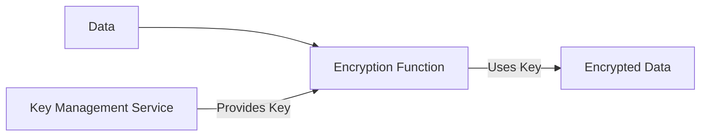

---

linkTitle: "13.4.2 Encryption and Key Management"
title: "Encryption and Key Management: Protecting Data with Encryption and Key Management Strategies"
description: "Explore the critical role of encryption and key management in safeguarding sensitive data in modern applications. Learn about symmetric and asymmetric encryption, secure key storage, and best practices for managing encryption keys."
categories:
- Security
- Data Protection
- Software Design
tags:
- Encryption
- Key Management
- Data Security
- Cryptography
- Secure Communication
date: 2024-10-25
type: docs
nav_weight: 13420

---

## 13.4.2 Encryption and Key Management

In today's digital age, the protection of sensitive data is paramount. Encryption plays a critical role in safeguarding information both at rest and in transit, ensuring that unauthorized parties cannot access or tamper with it. However, encryption is only as strong as the keys used to encrypt and decrypt data, making effective key management equally essential. In this section, we will explore the intricacies of encryption and key management, providing a comprehensive guide to implementing these security measures in modern applications.

### The Role of Encryption in Data Protection

Encryption is the process of converting plain text into an unreadable format, known as ciphertext, using an algorithm and a key. This transformation ensures that even if data is intercepted, it remains unintelligible without the correct decryption key. Encryption serves two primary purposes:

- **Data at Rest**: Protects stored data, such as files on a disk or database records, from unauthorized access.
- **Data in Transit**: Secures data being transmitted over networks, preventing interception and eavesdropping.

By encrypting data both at rest and in transit, organizations can significantly reduce the risk of data breaches and ensure compliance with various data protection regulations.

### Symmetric vs. Asymmetric Encryption

Encryption techniques can be broadly categorized into symmetric and asymmetric encryption, each with its own use cases and benefits.

#### Symmetric Encryption

Symmetric encryption, also known as secret-key encryption, uses the same key for both encryption and decryption. This method is efficient and suitable for encrypting large volumes of data. Common symmetric encryption algorithms include:

- **AES (Advanced Encryption Standard)**: Widely used for its strength and efficiency.
- **DES (Data Encryption Standard)**: An older standard, now largely replaced by AES due to security concerns.
- **3DES (Triple DES)**: An enhancement of DES, providing increased security by applying the DES algorithm three times.

**When to Use Symmetric Encryption:**

- When encrypting large datasets or files.
- In environments where secure key distribution is feasible.

#### Asymmetric Encryption

Asymmetric encryption, or public-key encryption, uses a pair of keys: a public key for encryption and a private key for decryption. This method is more computationally intensive than symmetric encryption but offers enhanced security for key distribution. Common asymmetric algorithms include:

- **RSA (Rivest-Shamir-Adleman)**: Widely used for secure data transmission.
- **ECC (Elliptic Curve Cryptography)**: Offers similar security to RSA but with smaller key sizes, making it more efficient.

**When to Use Asymmetric Encryption:**

- For secure key exchange and digital signatures.
- When establishing secure communication channels (e.g., SSL/TLS).

### Established Encryption Algorithms and Libraries

When implementing encryption, it is crucial to use well-established algorithms and libraries to avoid vulnerabilities associated with custom implementations. Some recommended libraries include:

- **OpenSSL**: A robust library supporting a wide range of cryptographic functions.
- **CryptoJS**: A JavaScript library for standard cryptographic algorithms.
- **Node.js Crypto Module**: Provides cryptographic functionality in Node.js applications.

**Best Practices:**

- Always use the latest version of encryption libraries to benefit from security patches.
- Avoid using deprecated algorithms like MD5 or SHA-1.

### Secure Key Management

Effective key management is critical to the security of encrypted data. Key management involves the generation, storage, distribution, and rotation of encryption keys.

#### Key Storage

Keys should be stored securely to prevent unauthorized access. Options for secure key storage include:

- **Hardware Security Modules (HSMs)**: Physical devices that provide secure key storage and cryptographic operations.
- **Cloud-Based Key Management Services**: Services like AWS KMS, Azure Key Vault, and Google Cloud KMS offer secure key storage and management.

#### Key Rotation

Regular key rotation is essential to minimize the risk of key compromise. Key rotation policies should include:

- **Automated Rotation**: Automatically generating new keys at regular intervals.
- **Revocation Procedures**: Procedures for revoking compromised keys.

### Example: Encrypting Data in Databases

Encrypting sensitive data in databases is a common use case for encryption. Here's a basic example using Node.js and the `crypto` module to encrypt and decrypt data:

```javascript
const crypto = require('crypto');

// Encryption function
function encrypt(text, key) {
  const cipher = crypto.createCipher('aes-256-cbc', key);
  let encrypted = cipher.update(text, 'utf8', 'hex');
  encrypted += cipher.final('hex');
  return encrypted;
}

// Decryption function
function decrypt(encryptedText, key) {
  const decipher = crypto.createDecipher('aes-256-cbc', key);
  let decrypted = decipher.update(encryptedText, 'hex', 'utf8');
  decrypted += decipher.final('utf8');
  return decrypted;
}

// Example usage
const key = 'mysecretkey'; // Securely generate and store this key
const originalData = 'Sensitive data';
const encryptedData = encrypt(originalData, key);
const decryptedData = decrypt(encryptedData, key);

console.log('Original Data:', originalData);
console.log('Encrypted Data:', encryptedData);
console.log('Decrypted Data:', decryptedData);
```

**Note:** In a production environment, never hardcode keys in your source code. Use environment variables or secure key management solutions.

### Encrypting Configuration Files and Environment Variables

Configuration files and environment variables often contain sensitive information such as API keys and database credentials. Encrypting these files ensures that even if they are exposed, the information remains secure.

- **Encrypt Configuration Files**: Use tools like `gpg` or `openssl` to encrypt configuration files.
- **Secure Environment Variables**: Use a secure vault service (e.g., HashiCorp Vault) to manage environment variables.

### Key Management Flow

To illustrate the flow of key management, consider the following diagram:



This diagram shows how a key management service provides keys to the encryption function, which then encrypts the data.

### Secure Key Exchange Mechanisms

In distributed systems, securely exchanging keys is crucial. Common methods include:

- **Diffie-Hellman Key Exchange**: Allows two parties to establish a shared secret over an insecure channel.
- **Public Key Infrastructure (PKI)**: Uses certificates to authenticate and exchange keys securely.

### Avoiding Common Encryption Pitfalls

To ensure effective encryption, avoid these common pitfalls:

- **Using Weak Keys**: Always use keys of sufficient length (e.g., 256-bit for AES).
- **Insecure Modes**: Avoid using insecure modes like ECB; prefer CBC or GCM for block ciphers.
- **Hardcoding Keys**: Never embed keys directly in your source code.

### End-to-End Encryption

End-to-end encryption (E2EE) ensures that only the communicating parties can read the data, with no intermediate parties having access. E2EE is commonly used in messaging applications to protect user privacy.

### Compliance with Legal and Regulatory Requirements

Many industries have specific regulations regarding data encryption. Ensure compliance by:

- **Understanding Applicable Laws**: Familiarize yourself with regulations like GDPR, HIPAA, and PCI-DSS.
- **Documenting Encryption Practices**: Maintain records of encryption algorithms and key management procedures.

### Cryptographic Hashing for Data Integrity

While encryption protects data confidentiality, cryptographic hashing ensures data integrity. Hash functions like SHA-256 generate a unique hash value for data, allowing verification of its integrity.

### Best Practices for Encryption and Key Management

- **Regular Security Assessments**: Conduct regular audits of encryption implementations to identify vulnerabilities.
- **Training and Awareness**: Educate developers and IT staff on best practices for encryption and key management.
- **Continuous Monitoring**: Implement monitoring tools to detect unauthorized access to encryption keys.

### Conclusion

Encryption and key management are foundational elements of a robust security strategy. By understanding the principles of encryption, using established algorithms, and implementing effective key management practices, organizations can protect sensitive data from unauthorized access and comply with legal requirements. Regular security assessments and continuous learning are essential to maintaining a strong security posture in an ever-evolving threat landscape.

---

## Quiz Time!



### What is the primary purpose of encryption?

- [x] To convert plain text into an unreadable format to protect data
- [ ] To increase data storage capacity
- [ ] To compress data for faster transmission
- [ ] To ensure data is always available

> **Explanation:** Encryption converts plain text into ciphertext to protect data from unauthorized access.

### Which encryption method uses a pair of keys for encryption and decryption?

- [ ] Symmetric encryption
- [x] Asymmetric encryption
- [ ] Hashing
- [ ] Compression

> **Explanation:** Asymmetric encryption uses a public key for encryption and a private key for decryption.

### What is a common use case for symmetric encryption?

- [x] Encrypting large datasets or files
- [ ] Secure key exchange
- [ ] Digital signatures
- [ ] Establishing secure communication channels

> **Explanation:** Symmetric encryption is efficient and suitable for encrypting large volumes of data.

### Why should custom encryption implementations be avoided?

- [x] They may introduce vulnerabilities
- [ ] They are too complex to implement
- [ ] They are not compatible with modern systems
- [ ] They are not allowed by law

> **Explanation:** Custom encryption implementations can introduce vulnerabilities due to lack of thorough testing and peer review.

### What is the role of a Hardware Security Module (HSM)?

- [x] To securely store encryption keys and perform cryptographic operations
- [ ] To increase network speed
- [ ] To compress data for storage
- [ ] To provide backup services

> **Explanation:** HSMs provide secure storage and management of encryption keys and perform cryptographic operations.

### Which of the following is a secure mode for block ciphers?

- [x] CBC (Cipher Block Chaining)
- [ ] ECB (Electronic Codebook)
- [ ] ROT13
- [ ] Base64

> **Explanation:** CBC is a secure mode for block ciphers, while ECB is considered insecure.

### What is end-to-end encryption commonly used for?

- [x] Ensuring only communicating parties can read messages
- [ ] Compressing data for faster transmission
- [ ] Increasing data storage capacity
- [ ] Ensuring data availability

> **Explanation:** End-to-end encryption ensures that only the communicating parties can read the data, protecting user privacy.

### Why is key rotation important in key management?

- [x] To minimize the risk of key compromise
- [ ] To increase encryption speed
- [ ] To reduce storage requirements
- [ ] To simplify key management

> **Explanation:** Regular key rotation reduces the risk of key compromise and enhances security.

### What is the purpose of cryptographic hashing?

- [x] To ensure data integrity
- [ ] To encrypt data
- [ ] To compress data
- [ ] To store data efficiently

> **Explanation:** Cryptographic hashing generates a unique hash value for data, allowing verification of its integrity.

### True or False: Hardcoding encryption keys in source code is a secure practice.

- [ ] True
- [x] False

> **Explanation:** Hardcoding encryption keys in source code is insecure and should be avoided to prevent unauthorized access.


