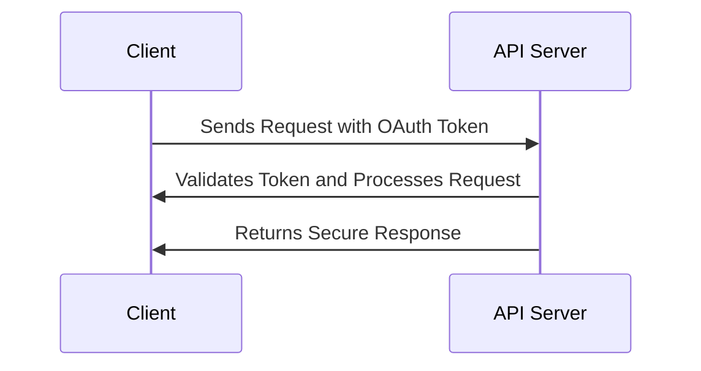

## 13.4.3 Secure APIs and Web Services

In the modern landscape of software development, APIs and web services are the backbone of communication between different systems, applications, and devices. As such, securing these APIs is paramount to protect sensitive data and maintain the integrity and availability of services. This section delves into the best practices and design patterns for securing APIs and web services, ensuring that they are robust against threats and misuse.

### The Importance of Securing APIs and Web Services

APIs are often the gateways to sensitive data and critical functionality. Without proper security measures, they can become vulnerable to attacks such as data breaches, unauthorized access, and service disruptions. Securing APIs involves implementing a comprehensive strategy that encompasses authentication, authorization, encryption, input validation, and monitoring.

### Implementing Authentication and Authorization

Authentication and authorization are fundamental to API security. Authentication verifies the identity of a user or system, while authorization determines what resources or actions are allowed. OAuth 2.0 is a widely adopted standard for implementing secure authentication and authorization in APIs.

#### OAuth 2.0

OAuth 2.0 provides a framework for token-based authentication and authorization, allowing third-party applications to access user data without exposing credentials. It involves several roles:

- **Resource Owner**: The user who authorizes an application to access their data.
- **Client**: The application requesting access to the resource owner's data.
- **Resource Server**: The server hosting the protected resources.
- **Authorization Server**: The server that issues access tokens after successfully authenticating the resource owner.

The OAuth 2.0 flow typically involves the following steps:

1. **Authorization Request**: The client requests authorization from the resource owner.
2. **Authorization Grant**: The resource owner grants authorization, often through a consent screen.
3. **Token Request**: The client requests an access token from the authorization server.
4. **Access Token**: The authorization server issues an access token to the client.
5. **API Request**: The client uses the access token to access the resource server.

#### Example: Implementing OAuth 2.0 in JavaScript

```javascript
const express = require('express');
const axios = require('axios');
const app = express();

// Redirect user to the authorization server
app.get('/auth', (req, res) => {
  const authUrl = 'https://auth.example.com/oauth/authorize';
  const clientId = 'your-client-id';
  const redirectUri = 'http://localhost:3000/callback';
  res.redirect(`${authUrl}?response_type=code&client_id=${clientId}&redirect_uri=${redirectUri}`);
});

// Handle the callback from the authorization server
app.get('/callback', async (req, res) => {
  const code = req.query.code;
  const tokenUrl = 'https://auth.example.com/oauth/token';
  const clientId = 'your-client-id';
  const clientSecret = 'your-client-secret';
  const redirectUri = 'http://localhost:3000/callback';

  try {
    const response = await axios.post(tokenUrl, {
      code,
      client_id: clientId,
      client_secret: clientSecret,
      redirect_uri: redirectUri,
      grant_type: 'authorization_code'
    });

    const accessToken = response.data.access_token;
    res.send(`Access Token: ${accessToken}`);
  } catch (error) {
    res.status(500).send('Error retrieving access token');
  }
});

app.listen(3000, () => {
  console.log('Server running on http://localhost:3000');
});
```

### Using API Keys and Tokens Securely

API keys and tokens are often used to authenticate requests to APIs. However, they must be managed securely to prevent unauthorized access.

- **Keep Keys Secret**: Store API keys and tokens securely, using environment variables or secure vaults.
- **Rotate Keys Regularly**: Regularly rotate API keys to minimize the impact of a potential compromise.
- **Limit Scope and Permissions**: Assign the minimal permissions necessary for the API key to function.
- **Monitor Usage**: Track API key usage to detect any unusual activity that may indicate a security breach.

### Rate Limiting and Input Validation

Rate limiting and input validation are crucial defenses against API abuse, such as Denial-of-Service (DoS) attacks and injection attacks.

#### Rate Limiting

Rate limiting controls the number of requests a client can make to an API within a given timeframe. This helps prevent abuse and ensures fair usage.

- **Implement Rate Limits**: Use middleware or API gateways to enforce rate limits.
- **Provide Feedback**: Inform clients when they exceed rate limits, using appropriate HTTP status codes like `429 Too Many Requests`.

#### Input Validation

Input validation ensures that incoming data is safe and conforms to expected formats.

- **Validate All Inputs**: Validate all incoming data, including query parameters, headers, and request bodies.
- **Use Libraries**: Utilize libraries like `Joi` or `express-validator` to simplify input validation in JavaScript applications.

### Encrypting API Communications with HTTPS and TLS

Encrypting API communications is essential to protect data in transit from eavesdropping and tampering. HTTPS, which uses TLS (Transport Layer Security), is the standard protocol for secure communication over the internet.

- **Enforce HTTPS**: Ensure all API endpoints are accessible only via HTTPS.
- **Use Strong Cipher Suites**: Configure servers to use strong cipher suites and disable outdated protocols like SSLv3.

#### Example: Enforcing HTTPS in an Express.js Application

```javascript
const express = require('express');
const https = require('https');
const fs = require('fs');

const app = express();

// Load SSL certificate and key
const options = {
  key: fs.readFileSync('path/to/private.key'),
  cert: fs.readFileSync('path/to/certificate.crt')
};

// Redirect HTTP to HTTPS
app.use((req, res, next) => {
  if (!req.secure) {
    return res.redirect(`https://${req.headers.host}${req.url}`);
  }
  next();
});

https.createServer(options, app).listen(443, () => {
  console.log('HTTPS server running on port 443');
});
```

### Message Signing and Verification

Message signing and verification ensure the integrity and authenticity of API requests and responses. By signing messages with a private key and verifying them with a public key, you can prevent tampering and ensure that messages originate from a trusted source.

- **Use JSON Web Tokens (JWTs)**: JWTs can be signed and verified, providing a compact and secure way to transmit information between parties.
- **Implement HMAC**: Use HMAC (Hash-based Message Authentication Code) for message integrity checks.

### Secure API Interaction Diagram

Below is a sequence diagram illustrating a secure API interaction using OAuth tokens:



### Implementing CORS Policies

Cross-Origin Resource Sharing (CORS) policies control how resources on your server can be accessed by external domains. Properly configuring CORS is critical to prevent unauthorized cross-origin requests.

- **Define Allowed Origins**: Specify which domains are allowed to access your API.
- **Restrict Methods and Headers**: Limit the HTTP methods and headers that can be used in cross-origin requests.
- **Use Middleware**: Use middleware like `cors` in Express.js to configure CORS policies easily.

### Handling Errors and Exceptions Securely

Handling errors securely is essential to prevent information leakage that could aid attackers.

- **Use Generic Error Messages**: Avoid exposing sensitive information in error messages.
- **Log Errors Internally**: Log detailed error information internally for debugging purposes, but do not expose it to clients.

### Best Practices for Versioning APIs

Versioning APIs allows you to introduce changes without breaking existing clients. It also helps manage deprecations securely.

- **Use URL or Header Versioning**: Include version numbers in the URL path or HTTP headers.
- **Deprecate Gracefully**: Provide a clear deprecation policy and timeline for clients to upgrade to newer versions.

### Monitoring and Logging API Activity

Monitoring and logging API activity are crucial for security analysis and detecting potential threats.

- **Implement Logging**: Log all API requests and responses, including metadata such as timestamps and client IPs.
- **Use Monitoring Tools**: Utilize tools like Prometheus or ELK Stack to monitor API performance and detect anomalies.

### API Gateways and Their Role in Security

API gateways act as intermediaries between clients and your API, enforcing security policies and managing traffic.

- **Centralize Security**: Use API gateways to centralize authentication, authorization, and rate limiting.
- **Enhance Performance**: API gateways can cache responses and optimize request routing.

### Security Testing and Code Reviews

Regular security testing and code reviews are essential to identify and address vulnerabilities in API implementations.

- **Conduct Penetration Testing**: Perform regular penetration tests to identify security weaknesses.
- **Review Code**: Conduct code reviews with a focus on security best practices.

### Importance of Clear and Secure API Documentation

Clear and secure API documentation helps developers understand how to interact with your API securely.

- **Provide Examples**: Include examples of secure API usage in your documentation.
- **Highlight Security Features**: Clearly document authentication, authorization, and encryption mechanisms.

### Securing Public vs. Internal APIs

Public APIs, which are accessible to external clients, require stricter security measures compared to internal or partner APIs.

- **Implement Strong Authentication**: Use strong authentication methods like OAuth 2.0 for public APIs.
- **Restrict Access**: Limit access to internal APIs using network-level controls or VPNs.

### Conclusion

Securing APIs and web services is a complex but essential task in modern software development. By implementing robust authentication and authorization mechanisms, encrypting communications, validating inputs, and monitoring activity, you can protect your APIs from a wide range of threats. Adopting best practices and design patterns for API security will help ensure that your services remain secure, reliable, and performant.

## Quiz Time!



### What is the primary purpose of OAuth 2.0 in API security?

- [x] To provide a framework for token-based authentication and authorization
- [ ] To encrypt data in transit between client and server
- [ ] To validate input data for API requests
- [ ] To monitor API usage and detect anomalies

> **Explanation:** OAuth 2.0 is primarily used for token-based authentication and authorization, allowing secure access to protected resources without exposing user credentials.

### Which of the following is a best practice for managing API keys?

- [x] Rotate keys regularly
- [ ] Store keys in plain text files
- [ ] Share keys publicly for transparency
- [ ] Use the same key for all applications

> **Explanation:** Regularly rotating API keys helps minimize the impact of a potential compromise and ensures better security management.

### What is the role of rate limiting in API security?

- [x] To control the number of requests a client can make within a timeframe
- [ ] To encrypt API communications
- [ ] To validate user input
- [ ] To manage API versioning

> **Explanation:** Rate limiting helps prevent abuse by controlling the number of requests a client can make, ensuring fair usage and protecting against DoS attacks.

### How does HTTPS contribute to API security?

- [x] It encrypts data in transit between client and server
- [ ] It validates user input
- [ ] It provides token-based authentication
- [ ] It logs API activity

> **Explanation:** HTTPS encrypts data in transit, protecting it from eavesdropping and tampering, which is crucial for securing API communications.

### What is a common method for ensuring message integrity in API communications?

- [x] Using JSON Web Tokens (JWTs)
- [ ] Implementing CORS policies
- [x] Using HMAC for message signing
- [ ] Performing rate limiting

> **Explanation:** JSON Web Tokens and HMAC are commonly used to ensure message integrity by signing and verifying messages, preventing tampering.

### Which tool is commonly used for monitoring API performance and detecting anomalies?

- [x] Prometheus
- [ ] OAuth 2.0
- [ ] JWT
- [ ] HMAC

> **Explanation:** Prometheus is a popular monitoring tool used to track API performance and detect anomalies, providing insights into API usage patterns.

### What is the purpose of an API gateway?

- [x] To centralize security policies and manage traffic
- [ ] To encrypt API communications
- [x] To cache responses and optimize request routing
- [ ] To provide token-based authentication

> **Explanation:** API gateways centralize security policies, manage traffic, cache responses, and optimize request routing, enhancing API security and performance.

### How should errors be handled securely in APIs?

- [x] Use generic error messages
- [ ] Expose detailed error information to clients
- [ ] Log errors externally without encryption
- [ ] Ignore errors to avoid information leakage

> **Explanation:** Using generic error messages prevents sensitive information leakage, while detailed error information should be logged internally for debugging.

### What is a key consideration when securing public APIs?

- [x] Implement strong authentication methods
- [ ] Allow unrestricted access for ease of use
- [ ] Use plain HTTP for faster performance
- [ ] Share API keys publicly

> **Explanation:** Public APIs require strong authentication methods to ensure secure access, as they are accessible to external clients.

### True or False: CORS policies are used to encrypt API communications.

- [ ] True
- [x] False

> **Explanation:** CORS policies control cross-origin access to resources, not encryption. HTTPS and TLS are used for encrypting API communications.


