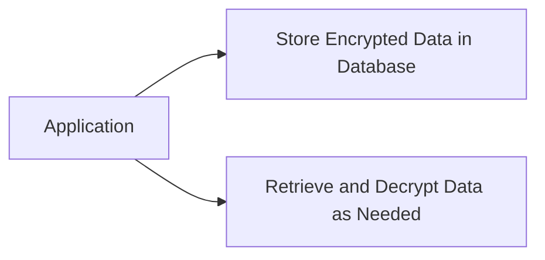

## 13.4.4 Secure Storage and Data Privacy

In today's digital landscape, data is one of the most valuable assets a company can possess. However, with this value comes the responsibility to protect data from unauthorized access and ensure its confidentiality, integrity, and availability. Secure storage and data privacy are critical components of a robust security strategy, especially given the increasing regulatory requirements such as the General Data Protection Regulation (GDPR) and the California Consumer Privacy Act (CCPA). This section explores the strategies and best practices for securing data at rest, ensuring compliance, and protecting sensitive information.

### The Importance of Protecting Data at Rest

Data at rest refers to inactive data that is stored physically in any digital form (e.g., databases, data warehouses, archives). Protecting data at rest is crucial for several reasons:

- **Confidentiality**: Ensures that sensitive information is not accessible to unauthorized users.
- **Integrity**: Protects data from being altered or tampered with by unauthorized entities.
- **Compliance**: Meets legal and regulatory requirements for data protection and privacy.
- **Reputation**: Prevents data breaches that could damage a company's reputation and erode customer trust.

### Strategies for Securing Databases

Securing databases is a multifaceted task that involves implementing several layers of protection:

#### Encryption

Encryption is the process of converting data into a coded format that can only be read by someone with the correct decryption key. It is a fundamental practice for protecting data at rest.

- **Database Encryption**: Encrypt entire databases to protect against unauthorized access. This can be done at the file system level or within the database itself.
- **Field-Level Encryption**: Encrypt specific fields containing sensitive information, such as credit card numbers or social security numbers.

#### Access Controls

Access controls ensure that only authorized users can access or modify data. Implementing strong access controls involves:

- **Role-Based Access Control (RBAC)**: Assign permissions based on user roles to limit access to sensitive data.
- **Least Privilege Principle**: Grant users the minimum level of access necessary to perform their job functions.
- **Multi-Factor Authentication (MFA)**: Require additional verification methods to enhance security.

#### Auditing

Auditing involves tracking and logging access to data to detect and respond to unauthorized access attempts.

- **Database Auditing**: Monitor database activity to detect suspicious behavior.
- **Access Logs**: Maintain logs of who accessed data and when, to facilitate forensic analysis in case of a breach.

### Implementing Row-Level and Column-Level Security

Row-level and column-level security provide granular access control within a database:

- **Row-Level Security**: Restricts access to specific rows in a table based on user identity or role. For example, a sales representative might only access records related to their region.
- **Column-Level Security**: Restricts access to specific columns in a table, allowing users to see only the data they are authorized to view.

### Data Masking and Tokenization

Data masking and tokenization are techniques used to protect sensitive information by obscuring it:

- **Data Masking**: Replaces sensitive data with fictional data that looks real but is not usable. This is useful for non-production environments where real data is not needed.
- **Tokenization**: Replaces sensitive data with unique identifiers (tokens) that can be mapped back to the original data. This is often used for payment card information.

### Data Protection Flow

The following diagram illustrates a typical data protection flow, where an application stores encrypted data in a database and retrieves and decrypts it as needed:

### Compliance with Data Protection Laws

Complying with data protection laws like GDPR and CCPA is essential for avoiding legal penalties and maintaining customer trust:

- **GDPR**: Requires organizations to protect personal data and privacy of EU citizens. Key requirements include data minimization, obtaining consent, and providing data breach notifications.
- **CCPA**: Grants California residents rights over their personal information, including the right to know, delete, and opt-out of the sale of personal data.

### Minimizing Data Collection

Collecting only the data necessary for business operations reduces the risk of data breaches and simplifies compliance efforts:

- **Data Minimization**: Limit the collection of personal data to what is directly relevant and necessary.
- **Purpose Specification**: Clearly define the purpose for which data is collected and ensure it aligns with business needs.

### Securing Backups

Backups are critical for data recovery but must be secured to prevent unauthorized access:

- **Encryption**: Encrypt backup data to protect it from unauthorized access.
- **Access Controls**: Implement strict access controls to ensure that only authorized personnel can access backups.

### Data Retention and Secure Disposal

Proper data retention and disposal policies help manage data lifecycle and protect against unauthorized access:

- **Data Retention**: Define how long data should be retained based on business and legal requirements.
- **Secure Disposal**: Implement secure disposal methods, such as shredding or degaussing, to ensure data cannot be recovered.

### Securing Cloud Storage Services

Cloud storage services offer convenience but require careful management to ensure data security:

- **Encryption**: Use encryption for data stored in the cloud, both at rest and in transit.
- **Access Management**: Implement strong access controls and regularly review permissions to prevent unauthorized access.

### Conducting Data Privacy Impact Assessments

Data Privacy Impact Assessments (DPIAs) help identify and mitigate risks associated with data processing activities:

- **Risk Assessment**: Evaluate the impact of data processing on individuals' privacy and identify potential risks.
- **Mitigation Strategies**: Develop strategies to mitigate identified risks and ensure compliance with data protection laws.

### Anonymization and Pseudonymization

Anonymization and pseudonymization techniques help protect privacy when sharing data:

- **Anonymization**: Irreversibly removes personal identifiers from data, making it impossible to identify individuals.
- **Pseudonymization**: Replaces personal identifiers with pseudonyms, allowing data to be re-identified if necessary.

### Educating Users About Data Privacy

User education is critical for ensuring data privacy and security:

- **Training Programs**: Conduct regular training sessions to educate employees about data privacy practices and policies.
- **Awareness Campaigns**: Raise awareness about the importance of data privacy and the role employees play in protecting it.

### Transparency and Consent

Transparency in data handling practices helps build trust with customers:

- **Privacy Policies**: Clearly communicate how data is collected, used, and protected.
- **Consent Management**: Obtain and manage user consent for data processing activities, ensuring compliance with legal requirements.

### Preparing for Data Breaches

Despite best efforts, data breaches can occur. Being prepared is essential for minimizing their impact:

- **Incident Response Plan**: Develop and regularly update an incident response plan to quickly address data breaches.
- **Breach Notification**: Ensure timely notification to affected individuals and regulatory authorities as required by law.

### Conclusion

Securing data at rest and ensuring data privacy are ongoing challenges that require a comprehensive approach. By implementing strong encryption, access controls, auditing, and compliance measures, organizations can protect sensitive information and build trust with their customers. Additionally, fostering a culture of privacy through user education and transparency is essential for maintaining data security in today's digital world.

## Quiz Time!



### What is the primary purpose of encrypting data at rest?

- [x] To ensure that sensitive information is not accessible to unauthorized users
- [ ] To enhance data processing speed
- [ ] To improve data redundancy
- [ ] To simplify data management

> **Explanation:** Encrypting data at rest ensures that sensitive information is not accessible to unauthorized users, thereby protecting its confidentiality.

### Which technique replaces sensitive data with unique identifiers?

- [ ] Data Masking
- [x] Tokenization
- [ ] Anonymization
- [ ] Pseudonymization

> **Explanation:** Tokenization replaces sensitive data with unique identifiers (tokens) that can be mapped back to the original data.

### What is a key requirement of the GDPR regarding personal data?

- [x] Data minimization
- [ ] Unlimited data retention
- [ ] Unrestricted data sharing
- [ ] Mandatory data sale

> **Explanation:** GDPR requires data minimization, which means collecting only the data that is necessary for a specific purpose.

### What does a Data Privacy Impact Assessment (DPIA) help identify?

- [x] Risks associated with data processing activities
- [ ] New marketing opportunities
- [ ] Employee performance issues
- [ ] Software bugs

> **Explanation:** A DPIA helps identify risks associated with data processing activities and develop strategies to mitigate them.

### Which principle involves granting users the minimum level of access necessary?

- [x] Least Privilege Principle
- [ ] Maximum Access Principle
- [ ] Open Access Principle
- [ ] Unlimited Access Principle

> **Explanation:** The Least Privilege Principle involves granting users the minimum level of access necessary to perform their job functions.

### What is the purpose of data masking?

- [x] To replace sensitive data with fictional data
- [ ] To encrypt data
- [ ] To delete data
- [ ] To compress data

> **Explanation:** Data masking replaces sensitive data with fictional data that looks real but is not usable, often for non-production environments.

### How can organizations prepare for data breaches?

- [x] Develop an incident response plan
- [ ] Ignore potential threats
- [ ] Share all data publicly
- [ ] Disable all security measures

> **Explanation:** Developing an incident response plan helps organizations quickly address data breaches and minimize their impact.

### What does pseudonymization involve?

- [x] Replacing personal identifiers with pseudonyms
- [ ] Permanently deleting data
- [ ] Encrypting data
- [ ] Sharing data without restrictions

> **Explanation:** Pseudonymization involves replacing personal identifiers with pseudonyms, allowing data to be re-identified if necessary.

### Why is user education important for data privacy?

- [x] It ensures employees understand data privacy practices
- [ ] It increases data collection
- [ ] It reduces data storage costs
- [ ] It eliminates the need for encryption

> **Explanation:** User education ensures employees understand data privacy practices and their role in protecting sensitive information.

### True or False: Transparency in data handling practices helps build trust with customers.

- [x] True
- [ ] False

> **Explanation:** Transparency in data handling practices helps build trust with customers by clearly communicating how data is collected, used, and protected.


