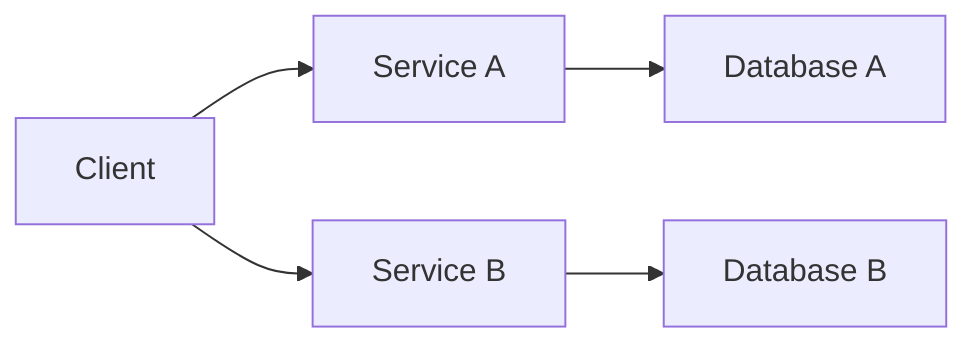

## 14.1.1 Understanding Microservices

Microservices architecture has emerged as a popular approach to building modern software systems. It offers a way to design applications as a collection of loosely coupled services, each responsible for a specific business capability. This architecture contrasts with the traditional monolithic approach, where all components are tightly integrated into a single unit. In this section, we will delve into the intricacies of microservices, exploring their principles, benefits, challenges, and real-world applications.

### Defining Microservices Architecture

Microservices architecture is a design paradigm that structures an application as a collection of small, autonomous services. Each service is independently deployable and focuses on a specific business function. This architecture is characterized by the following features:

- **Decentralization**: Services are developed and managed independently, often by different teams.
- **Autonomy**: Each service can be deployed, updated, and scaled without affecting other services.
- **Focused Scope**: Services are designed around business capabilities and follow the single responsibility principle.
- **Communication**: Services communicate with each other through well-defined APIs, often using lightweight protocols like HTTP/REST or messaging queues.

#### How Microservices Differ from Monolithic Architecture

In a monolithic architecture, all components of an application are packaged together and run as a single unit. While this approach simplifies development and deployment for small applications, it can become a bottleneck as the application grows. Here are some key differences between monolithic and microservices architectures:

- **Scalability**: Monolithic applications are harder to scale because scaling requires replicating the entire application. Microservices allow individual services to be scaled independently based on demand.
- **Flexibility**: A monolithic architecture limits flexibility as all components are tightly coupled. Microservices offer greater flexibility by allowing each service to be developed, deployed, and maintained independently.
- **Deployment**: Deploying a monolithic application often involves downtime and risk, as changes affect the entire system. Microservices enable continuous deployment and delivery, reducing downtime and risk.
- **Technology Stack**: In a monolithic architecture, all components typically use the same technology stack. Microservices allow different services to use different technologies best suited to their requirements.

### Key Principles of Microservices

Microservices architecture is guided by several key principles that ensure its effectiveness and efficiency:

#### Single Responsibility Principle

Each microservice is designed to perform a specific business function or capability. This principle ensures that services are focused, manageable, and easier to understand. By adhering to this principle, teams can develop and maintain services independently, reducing complexity and improving agility.

#### Decentralized Data Management

In a microservices architecture, each service manages its own data, often using its own database. This decentralization allows services to evolve independently and choose the most appropriate data storage technologies. However, it also introduces challenges in ensuring data consistency and integrity across services.

#### Service Autonomy and Independence

Microservices are autonomous, meaning they can be developed, deployed, and scaled independently. This autonomy is crucial for achieving the flexibility and agility that microservices promise. It also allows teams to work on different services simultaneously without interfering with each other.

#### API-Driven Communication

Microservices communicate with each other through well-defined APIs. This approach ensures that services remain decoupled and can evolve independently. APIs also serve as contracts between services, enabling interoperability and integration with external systems.

#### Domain-Driven Design

Domain-driven design (DDD) is often used in microservices architecture to define service boundaries. By modeling services around business domains, organizations can ensure that each service aligns with business goals and processes. DDD helps in identifying the right granularity for services and establishing clear boundaries.

### Benefits of Microservices

Microservices architecture offers several benefits that make it an attractive choice for building modern applications:

#### Scalability

One of the most significant advantages of microservices is scalability. Since each service can be scaled independently, organizations can allocate resources more efficiently based on demand. This capability is particularly beneficial for applications with varying workloads or seasonal spikes in traffic.

#### Flexibility and Technology Diversity

Microservices enable teams to choose the best technologies for each service, allowing for greater innovation and experimentation. This flexibility can lead to better performance, maintainability, and developer satisfaction.

#### Ease of Deployment

Microservices facilitate continuous delivery and deployment by allowing services to be updated independently. This approach reduces downtime and risk, as changes to one service do not affect the entire system. It also enables faster release cycles and more frequent updates.

#### Improved Fault Isolation

In a microservices architecture, failures in one service do not necessarily impact others. This isolation improves the system's resilience and reliability, as issues can be contained and addressed without affecting the entire application.

### Potential Challenges of Microservices

While microservices offer many benefits, they also introduce challenges that organizations must address:

#### Increased Complexity

Managing a large number of services can be complex, particularly in terms of communication, data consistency, and deployment. Organizations must invest in robust infrastructure and tooling to handle this complexity effectively.

#### Communication Overhead

Microservices rely on inter-service communication, which can introduce latency and increase the risk of network failures. Designing efficient communication patterns and ensuring reliable APIs are critical to minimizing these issues.

#### Data Management Challenges

Decentralized data management can lead to challenges in maintaining data consistency and integrity across services. Organizations must implement strategies for data synchronization, transactions, and eventual consistency.

#### Organizational Alignment

Adopting microservices requires changes in organizational structure and culture. Teams must be empowered to work independently and collaborate effectively across services. This alignment is crucial for realizing the full potential of microservices.

### Comparison Between Monolithic and Microservices Architectures

The following table summarizes the key differences between monolithic and microservices architectures:

| Feature                  | Monolithic Architecture          | Microservices Architecture         |
|--------------------------|----------------------------------|------------------------------------|
| Scalability              | Harder to scale                  | Easy to scale individual services  |
| Flexibility              | Limited by tight coupling        | High, due to independent services  |
| Deployment               | Risky and involves downtime      | Continuous and independent         |
| Technology Stack         | Uniform across the application   | Diverse, per service requirements  |
| Fault Isolation          | Limited                           | High, due to service isolation     |
| Complexity               | Lower for small applications     | Higher, requires robust tooling    |

### When to Adopt a Microservices Approach

Deciding to adopt a microservices architecture depends on several factors, including the complexity of the application, organizational readiness, and business goals. Here are some considerations:

- **Complexity and Scale**: Microservices are well-suited for complex, large-scale applications that require flexibility and scalability.
- **Rapid Development and Deployment**: If your organization prioritizes rapid development and deployment, microservices can facilitate continuous delivery and innovation.
- **Technology Diversity**: If your application requires diverse technologies, microservices allow teams to choose the best tools for each service.
- **Organizational Structure**: Organizations with autonomous, cross-functional teams are better positioned to adopt microservices successfully.

### The Role of APIs in Microservices Communication

APIs play a crucial role in microservices architecture by enabling communication between services. They serve as contracts that define how services interact and exchange data. Well-designed APIs ensure that services remain decoupled and can evolve independently. Here are some best practices for API design in microservices:

- **Consistency**: Ensure that APIs are consistent in terms of naming conventions, data formats, and error handling.
- **Versioning**: Implement API versioning to manage changes and ensure backward compatibility.
- **Security**: Secure APIs using authentication, authorization, and encryption to protect data and prevent unauthorized access.
- **Documentation**: Provide comprehensive documentation to facilitate integration and usage by other teams and external partners.

### Importance of Service Boundaries and Domain-Driven Design

Defining clear service boundaries is essential for a successful microservices architecture. Domain-driven design (DDD) provides a framework for identifying and modeling these boundaries based on business domains. By aligning services with business capabilities, organizations can ensure that each service is focused, cohesive, and aligned with business goals. DDD also helps in managing complexity by breaking down the system into manageable, domain-specific components.

### Understanding the Trade-offs Involved in Microservices Adoption

Adopting microservices involves trade-offs that organizations must carefully consider. While microservices offer benefits such as scalability and flexibility, they also introduce complexity and require significant investment in infrastructure and tooling. Organizations must weigh these trade-offs against their business goals and capabilities to determine if microservices are the right fit.

### Autonomy and Independence Among Services

Autonomy and independence are fundamental principles of microservices architecture. Each service is designed to operate independently, allowing teams to develop, deploy, and scale services without affecting others. This autonomy enables faster innovation and reduces dependencies, leading to more agile and resilient systems.

### Facilitating Continuous Delivery and Deployment

Microservices architecture supports continuous delivery and deployment by allowing services to be updated independently. This capability reduces the risk of deployment failures and enables more frequent releases. Organizations can implement automated testing, integration, and deployment pipelines to streamline the delivery process and ensure high-quality releases.

### Real-World Examples of Companies Using Microservices

Several companies have successfully adopted microservices architecture to improve scalability, flexibility, and innovation. Here are a few examples:

- **Netflix**: Netflix transitioned from a monolithic architecture to microservices to handle its massive user base and streaming demands. This shift enabled Netflix to scale efficiently and deploy new features rapidly.
- **Amazon**: Amazon uses microservices to power its e-commerce platform, allowing different teams to innovate and deploy independently. This architecture supports Amazon's vast product catalog and complex logistics operations.
- **Uber**: Uber adopted microservices to manage its growing user base and ride-hailing services. Microservices enable Uber to scale its platform and introduce new features quickly.

### Importance of Organizational Alignment with Microservices Practices

Successful adoption of microservices requires alignment between technical practices and organizational structure. Teams must be empowered to work independently and collaborate effectively across services. This alignment involves fostering a culture of innovation, continuous improvement, and cross-functional collaboration. Organizations must also invest in training, tooling, and infrastructure to support microservices practices.

### Conclusion

Microservices architecture offers a powerful approach to building modern, scalable, and flexible applications. By breaking down applications into small, autonomous services, organizations can achieve greater agility, scalability, and innovation. However, adopting microservices also introduces challenges that require careful consideration and investment. By understanding the principles, benefits, and trade-offs of microservices, organizations can make informed decisions and successfully implement this architecture.

### Visualizing Microservices Architecture

To better understand microservices architecture, consider the following diagram:

This diagram illustrates a simple microservices architecture where a client interacts with two services, each with its own database. This setup highlights the autonomy and independence of services, as well as the importance of well-defined APIs for communication.

## Quiz Time!



### What is a key characteristic of microservices architecture?

- [x] Decentralization
- [ ] Centralized data management
- [ ] Monolithic design
- [ ] Single deployment unit

> **Explanation:** Microservices architecture is characterized by decentralization, where services are developed and managed independently.

### In a microservices architecture, what is the primary role of APIs?

- [x] Enabling communication between services
- [ ] Storing data for services
- [ ] Monitoring service performance
- [ ] Providing user interfaces

> **Explanation:** APIs enable communication between services by defining how they interact and exchange data.

### Which principle is fundamental to microservices design?

- [x] Single Responsibility Principle
- [ ] Global State Management
- [ ] Tight Coupling
- [ ] Centralized Data Storage

> **Explanation:** The Single Responsibility Principle ensures that each microservice is focused on a specific business function.

### What is a benefit of microservices architecture?

- [x] Improved scalability
- [ ] Simplified deployment
- [ ] Reduced complexity
- [ ] Uniform technology stack

> **Explanation:** Microservices architecture improves scalability by allowing individual services to be scaled independently.

### Which company is known for successfully adopting microservices?

- [x] Netflix
- [ ] Microsoft
- [x] Amazon
- [ ] IBM

> **Explanation:** Both Netflix and Amazon are known for their successful adoption of microservices to improve scalability and innovation.

### What challenge is associated with microservices architecture?

- [x] Increased complexity
- [ ] Limited scalability
- [ ] Lack of flexibility
- [ ] Single technology stack

> **Explanation:** Microservices architecture introduces increased complexity due to managing multiple services and their interactions.

### When should an organization consider adopting microservices?

- [x] When building complex, scalable applications
- [ ] When developing small, simple applications
- [x] When rapid development and deployment are priorities
- [ ] When a uniform technology stack is preferred

> **Explanation:** Organizations should consider adopting microservices for complex, scalable applications and when rapid development is a priority.

### What is a potential drawback of monolithic architecture compared to microservices?

- [x] Harder to scale
- [ ] Easier to deploy
- [ ] More flexible
- [ ] Lower complexity

> **Explanation:** Monolithic architecture is harder to scale because scaling requires replicating the entire application.

### How do microservices facilitate continuous delivery?

- [x] By allowing independent service updates
- [ ] By using a single deployment unit
- [ ] By centralizing data management
- [ ] By reducing deployment frequency

> **Explanation:** Microservices facilitate continuous delivery by allowing services to be updated independently, reducing the risk of deployment failures.

### True or False: Microservices architecture requires a uniform technology stack for all services.

- [ ] True
- [x] False

> **Explanation:** Microservices architecture allows different services to use different technologies, enabling flexibility and innovation.


