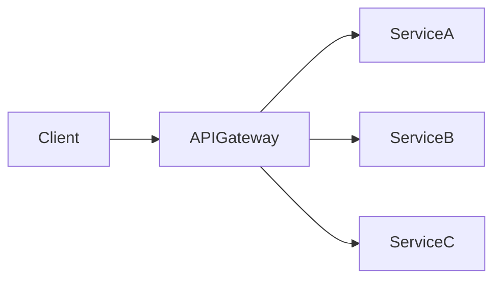

## 14.2.2 API Gateway Pattern

In the realm of microservices architecture, the API Gateway pattern emerges as a pivotal design strategy, serving as a singular entry point for client interactions with a suite of microservices. This pattern not only simplifies client communications but also encapsulates the complexity of service interactions, providing a robust framework for managing cross-cutting concerns such as authentication, rate limiting, and protocol translation. In this comprehensive exploration, we delve into the nuances of the API Gateway pattern, offering insights into its implementation, benefits, challenges, and best practices.

### Understanding the API Gateway Pattern

The API Gateway pattern acts as a centralized interface for client applications to access backend services. It functions similarly to a facade, abstracting the intricacies of multiple services behind a unified API. This pattern is particularly beneficial in microservices architectures where numerous services need to be coordinated to fulfill client requests.

#### Role and Responsibilities

The primary role of an API Gateway is to streamline client interactions by providing a single point of entry. Its responsibilities include:

- **Request Routing:** Directing incoming client requests to the appropriate microservices based on predefined routing rules.
- **Authentication and Authorization:** Enforcing security policies by authenticating requests and ensuring that clients have the necessary permissions.
- **Rate Limiting:** Controlling the rate at which clients can make requests to prevent abuse and ensure fair usage.
- **Protocol Translation:** Converting client requests from one protocol to another, such as from HTTP to gRPC.
- **Data Aggregation:** Combining data from multiple services into a single response to reduce client-side complexity.

### Implementing an API Gateway

Implementing an API Gateway involves several considerations, from selecting the right technology stack to designing efficient routing and security mechanisms. Here's a step-by-step guide to implementing an API Gateway in a microservices architecture:

1. **Choose the Right Technology:** Select a framework or product that aligns with your architectural goals. Popular choices include NGINX, Kong, Amazon API Gateway, and Express Gateway for Node.js environments.

2. **Define Routing Rules:** Establish clear routing rules that map client requests to the appropriate microservices. This involves configuring URL paths, HTTP methods, and any necessary query parameters.

3. **Implement Security Measures:** Incorporate authentication and authorization mechanisms. This can be achieved using OAuth, JWT tokens, or API keys, depending on your security requirements.

4. **Set Up Rate Limiting:** Configure rate limiting policies to control the flow of requests and prevent overloading services.

5. **Enable Protocol Translation:** If necessary, implement protocol translation to support different client and service communication protocols.

6. **Facilitate Data Aggregation:** Design the gateway to aggregate responses from multiple services when needed, reducing the number of client-side requests.

7. **Monitor and Optimize Performance:** Use monitoring tools to track the performance of the API Gateway and optimize for latency, throughput, and error rates.

### Benefits of the API Gateway Pattern

The API Gateway pattern offers numerous advantages, particularly in complex microservices environments:

- **Simplified Client Interactions:** Clients interact with a single endpoint, reducing the complexity of managing multiple service endpoints.
- **Service Abstraction:** The gateway abstracts the internal structure of the microservices, allowing services to evolve independently.
- **Centralized Security:** Security policies can be enforced consistently across all services, enhancing the overall security posture.
- **Cross-Cutting Concerns Management:** The gateway handles common concerns such as logging, caching, and monitoring, reducing the burden on individual services.

### Visualizing the API Gateway Pattern

To better understand the API Gateway's role, consider the following diagram illustrating its position in a microservices architecture:

In this diagram, the API Gateway serves as the intermediary between the client and various services, managing requests and responses efficiently.

### Challenges and Mitigation Strategies

While the API Gateway pattern offers significant benefits, it also introduces potential challenges:

- **Single Point of Failure:** The gateway can become a bottleneck or single point of failure. To mitigate this, implement load balancing and redundancy strategies.
- **Increased Latency:** Additional processing at the gateway can introduce latency. Optimize performance through caching and efficient routing.
- **Complexity in Configuration:** Managing complex routing and security configurations can be challenging. Use automated tools and configuration management systems to streamline this process.

### API Gateway Products and Frameworks

Several products and frameworks can be leveraged to implement an API Gateway:

- **NGINX:** A high-performance web server and reverse proxy that can be configured as an API Gateway.
- **Kong:** An open-source API Gateway built on top of NGINX, offering plugins for authentication, rate limiting, and more.
- **Amazon API Gateway:** A fully managed service that makes it easy to create, publish, maintain, monitor, and secure APIs.
- **Express Gateway:** A microservices API Gateway built on top of Express.js, ideal for Node.js environments.

### Handling Protocol Translation and Data Aggregation

The API Gateway can perform protocol translation, enabling seamless communication between clients and services using different protocols. For example, it can convert RESTful HTTP requests to gRPC calls. Additionally, the gateway can aggregate data from multiple services, reducing the number of requests a client must make.

### Security Considerations

Security is paramount in the API Gateway pattern. Consider the following measures:

- **SSL Termination:** Terminate SSL connections at the gateway to offload encryption and decryption overhead from backend services.
- **Authentication and Authorization:** Implement robust authentication mechanisms and enforce authorization policies to protect services from unauthorized access.

### Scaling the API Gateway

To ensure high availability and scalability, consider the following strategies:

- **Horizontal Scaling:** Deploy multiple instances of the API Gateway behind a load balancer to distribute traffic evenly.
- **Caching:** Implement caching strategies to reduce the load on backend services and improve response times.
- **Monitoring and Alerts:** Use monitoring tools to track the performance and health of the API Gateway, setting up alerts for anomalies.

### Cross-Cutting Concerns

The API Gateway is well-suited to handle cross-cutting concerns such as:

- **Logging:** Centralize logging for all requests and responses passing through the gateway.
- **Metrics Collection:** Gather metrics on request counts, response times, and error rates for analysis and optimization.
- **Response Caching:** Cache responses to reduce load on backend services and improve client response times.

### Request Validation and Response Caching

Implement request validation at the gateway to ensure that incoming requests meet predefined criteria before reaching backend services. This can prevent malformed requests from causing issues downstream. Additionally, use response caching to store frequently requested data, reducing the need for repeated service calls.

### Best Practices for Designing an API Gateway Layer

When designing an API Gateway layer, consider the following best practices:

- **Align with Architectural Goals:** Ensure the API Gateway aligns with the overall architectural goals and supports the desired scalability, security, and performance characteristics.
- **Keep It Simple:** Avoid overloading the gateway with too many responsibilities, which can lead to complexity and performance issues.
- **Automate Configuration Management:** Use tools to automate the configuration of routing, security, and other settings to reduce errors and streamline updates.
- **Regularly Review and Update Policies:** Continuously review and update security, rate limiting, and other policies to adapt to changing requirements.

### Conclusion

The API Gateway pattern is a powerful tool in the microservices architect's toolkit, offering a centralized interface for managing client interactions and cross-cutting concerns. By implementing an API Gateway, organizations can simplify client communications, enhance security, and improve the scalability and maintainability of their microservices architecture. However, careful consideration must be given to potential challenges, such as performance bottlenecks and configuration complexity, to ensure a successful implementation.

### References and Further Reading

- [NGINX API Gateway Documentation](https://www.nginx.com/products/nginx-api-gateway/)
- [Kong API Gateway](https://konghq.com/)
- [Amazon API Gateway](https://aws.amazon.com/api-gateway/)
- [Express Gateway](https://www.express-gateway.io/)

## Quiz Time!



### What is the primary role of an API Gateway in a microservices architecture?

- [x] To provide a single entry point for client requests
- [ ] To directly manage database transactions
- [ ] To replace all backend services
- [ ] To store client session data

> **Explanation:** The primary role of an API Gateway is to serve as a single entry point for client requests, managing routing, security, and other cross-cutting concerns.

### Which of the following is NOT a responsibility of an API Gateway?

- [ ] Request routing
- [ ] Authentication
- [x] Direct database access
- [ ] Rate limiting

> **Explanation:** An API Gateway does not directly access databases; it routes requests to appropriate services that may interact with databases.

### How can an API Gateway help in handling protocol translation?

- [x] By converting client requests from one protocol to another
- [ ] By storing protocol data for clients
- [ ] By enforcing a single protocol for all services
- [ ] By eliminating the need for protocols

> **Explanation:** An API Gateway can perform protocol translation, converting requests from one protocol (e.g., HTTP) to another (e.g., gRPC).

### What is a potential drawback of using an API Gateway?

- [x] It can become a single point of failure
- [ ] It simplifies client interactions
- [ ] It enhances security
- [ ] It reduces service complexity

> **Explanation:** While an API Gateway simplifies interactions and enhances security, it can become a single point of failure if not properly managed.

### Which of the following is a popular API Gateway product?

- [x] Kong
- [ ] MongoDB
- [ ] Redis
- [ ] Docker

> **Explanation:** Kong is a popular open-source API Gateway product used in microservices architectures.

### What is SSL termination in the context of an API Gateway?

- [x] Ending SSL connections at the gateway to offload encryption tasks
- [ ] Starting SSL connections at the backend services
- [ ] Removing SSL from all client communications
- [ ] Encrypting data only at the client side

> **Explanation:** SSL termination involves ending SSL connections at the gateway, offloading encryption and decryption tasks from backend services.

### How can an API Gateway improve performance with caching?

- [x] By storing frequently requested data to reduce backend load
- [ ] By increasing the number of requests to services
- [ ] By disabling caching entirely
- [ ] By storing all client data indefinitely

> **Explanation:** An API Gateway can cache frequently requested data, reducing the load on backend services and improving response times.

### What is a common security measure implemented at an API Gateway?

- [x] Authentication and authorization
- [ ] Direct database access
- [ ] Client-side encryption
- [ ] Manual request processing

> **Explanation:** Authentication and authorization are common security measures implemented at the API Gateway to protect services from unauthorized access.

### How does an API Gateway handle cross-cutting concerns?

- [x] By centralizing management of concerns like logging and metrics
- [ ] By distributing concerns across all services
- [ ] By ignoring cross-cutting concerns
- [ ] By delegating concerns to the client

> **Explanation:** An API Gateway centralizes the management of cross-cutting concerns, such as logging and metrics, simplifying service design.

### True or False: An API Gateway should align with the overall architectural goals of the system.

- [x] True
- [ ] False

> **Explanation:** An API Gateway should align with the architectural goals to ensure it supports the desired scalability, security, and performance characteristics.


