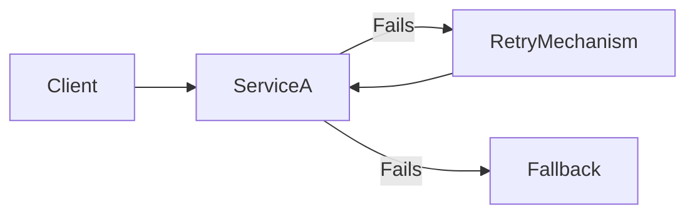

## 14.3.4 Fault Tolerance and Resilience Patterns

In the realm of microservices and distributed systems, designing for resilience and fault tolerance is paramount. These systems, by their nature, are complex and involve numerous components interacting across networks. This complexity introduces potential points of failure that can disrupt the entire application if not properly managed. Fault tolerance and resilience patterns are critical in ensuring that your microservices can withstand and recover from failures, maintaining service availability and reliability.

### Importance of Designing for Resilience and Fault Tolerance

Microservices architecture promotes the decomposition of applications into smaller, independent services. While this provides numerous benefits such as scalability and flexibility, it also increases the risk of failure due to the distributed nature of the system. Each service may depend on others, and a failure in one can cascade, affecting the entire system. Thus, designing for resilience and fault tolerance is not just an option but a necessity.

Resilience in microservices involves building systems that can recover from failures gracefully. Fault tolerance, on the other hand, is about continuing to operate, possibly at a reduced level, rather than failing completely. Together, these concepts ensure that systems are robust, reliable, and capable of handling unexpected disruptions.

### Key Patterns for Fault Tolerance and Resilience

Several design patterns help achieve fault tolerance and resilience in microservices. Here, we will discuss some of the most important ones: Bulkheads, Retry, Timeout, and Failover.

#### Bulkhead Pattern

The Bulkhead pattern is inspired by ship design, where watertight compartments prevent a single breach from flooding the entire vessel. In microservices, this pattern involves isolating different parts of the system to prevent a failure in one from affecting others. This isolation can be achieved through various means, such as separate thread pools, resource quotas, or physical separation of services.

**Implementing the Bulkhead Pattern:**

- **Thread Pools:** Assign separate thread pools for different operations or services. This ensures that if one operation consumes all its threads due to a failure, it does not affect other operations.
  
- **Resource Quotas:** Limit the resources (e.g., CPU, memory) available to each service. This prevents a single service from monopolizing resources, ensuring fair distribution and isolation.

- **Physical Separation:** Deploy services on different servers or containers. This physical isolation enhances fault tolerance by reducing the risk of a single point of failure.

**Example:**

In a payment processing system, you might separate the payment gateway service from the order management service. If the payment gateway experiences high latency or failure, it won't affect the order management service, which can continue to function independently.

#### Retry Pattern

The Retry pattern involves reattempting a failed operation in the hope that it will succeed on subsequent tries. This is particularly useful for transient failures, which are temporary and often resolve themselves.

**Considerations for Implementing the Retry Pattern:**

- **Exponential Backoff:** Instead of retrying immediately, use an exponential backoff strategy, which increases the wait time between retries. This reduces the load on the system and gives time for transient issues to resolve.

- **Maximum Retries:** Set a limit on the number of retries to prevent endless loops and excessive resource consumption.

- **Idempotency:** Ensure that operations are idempotent, meaning they can be repeated without causing unintended side effects. This is crucial for operations like payments or database updates.

**Example:**

Consider a service that fetches data from an external API. If the API call fails due to a network glitch, the service can retry the request after a short delay, increasing the delay with each subsequent failure.

#### Timeout Pattern

The Timeout pattern involves setting a maximum time limit for an operation to complete. If the operation exceeds this time, it is aborted. This prevents the system from waiting indefinitely for a response, which can lead to resource exhaustion and degraded performance.

**Setting Appropriate Timeouts:**

- **Balance:** Choose timeout values that balance between giving operations enough time to complete and avoiding excessive wait times.

- **Contextual Timeouts:** Different operations may require different timeout settings based on their expected duration and criticality.

- **Fallback Mechanisms:** Combine timeouts with fallback strategies to handle cases where operations time out. This could involve returning cached data or a default response.

**Example:**

In a microservices architecture, a service making a request to another service might set a timeout of 2 seconds. If the response is not received within this time, the service can return a fallback response or trigger a retry.

#### Failover Pattern

The Failover pattern involves switching to a backup component or system when a failure is detected. This ensures continuity of service, albeit potentially at a reduced capacity or performance.

**Implementing Failover:**

- **Redundancy:** Maintain redundant instances of critical services. In case of failure, traffic can be redirected to a standby instance.

- **Health Checks:** Continuously monitor the health of services. Use automated checks to detect failures and trigger failover processes.

- **Load Balancing:** Use load balancers to distribute traffic across multiple instances. In case of failure, the load balancer can redirect traffic to healthy instances.

**Example:**

A database service might have a primary and a secondary instance. If the primary fails, the system can automatically switch to the secondary, ensuring continued data availability.

### Practical Implementation: Fault Tolerance in Action

Let's consider a practical implementation using a combination of these patterns. We'll illustrate this with a Mermaid.js diagram to visualize the fault tolerance process.

In this diagram:

- The **Client** makes a request to **ServiceA**.
- If **ServiceA** fails, the **RetryMechanism** attempts the operation again.
- If retries fail, a **Fallback** mechanism provides an alternative response or service.

### Handling Transient Failures Gracefully

Transient failures are temporary issues that often resolve themselves. Handling them gracefully involves:

- **Retry with Exponential Backoff:** As discussed, this reduces load and allows time for recovery.
- **Circuit Breakers:** Temporarily halt requests to a failing service, allowing it to recover. This prevents overload and cascading failures.
- **Graceful Degradation:** Provide reduced functionality instead of complete failure. For example, serve cached data when the primary source is unavailable.

### Health Checks and Self-Healing Mechanisms

Health checks are automated tests that verify the health of services. They are crucial for detecting failures and triggering self-healing mechanisms.

- **Liveness and Readiness Probes:** Use these in containerized environments to determine if a service is running and ready to handle traffic.
- **Self-Healing:** Implement automated recovery processes, such as restarting failed services or scaling up resources in response to increased load.

### Redundancy and Replication

Redundancy and replication are key strategies for enhancing resilience:

- **Data Replication:** Maintain copies of data across multiple locations to ensure availability in case of failure.
- **Service Redundancy:** Deploy multiple instances of critical services to handle failures and distribute load.

### Disaster Recovery Planning

Disaster recovery involves preparing for major failures that affect the entire system. Key practices include:

- **Backups:** Regularly back up data and configurations to secure locations.
- **Recovery Procedures:** Develop and test procedures for restoring services and data after a failure.
- **Geographic Redundancy:** Deploy services across different geographic locations to protect against regional outages.

### Chaos Engineering: Simulating Failures

Chaos engineering involves intentionally introducing failures to test the system's resilience. This practice helps identify weaknesses and improve fault tolerance.

- **Simulate Failures:** Introduce controlled failures, such as shutting down services or introducing latency, to observe system behavior.
- **Monitor and Analyze:** Use monitoring tools to track the impact of failures and identify areas for improvement.

### Balancing Resilience with Complexity and Cost

While resilience is crucial, it must be balanced with complexity and cost:

- **Cost Considerations:** Implementing redundancy and failover mechanisms can be expensive. Evaluate the cost-benefit ratio for each strategy.
- **Complexity Management:** Avoid over-engineering solutions. Focus on critical services and prioritize resilience efforts where they have the most impact.

### Testing Fault Tolerance Mechanisms

Thorough testing is essential to ensure that fault tolerance mechanisms work as intended:

- **Automated Testing:** Use automated tests to simulate failures and validate recovery processes.
- **Load Testing:** Evaluate system performance under stress to identify bottlenecks and weaknesses.
- **Continuous Improvement:** Regularly review and update fault tolerance strategies based on testing results and changing requirements.

### Real-World Applications and Case Studies

Fault tolerance and resilience patterns are widely used in real-world applications. Here are a few examples:

- **Netflix:** Uses chaos engineering to test the resilience of its streaming services, ensuring high availability and performance.
- **Amazon:** Implements redundancy and failover mechanisms to maintain service availability during peak traffic and outages.
- **Google:** Employs sophisticated load balancing and failover strategies to handle global traffic and ensure data availability.

### Cultivating a Culture of Resilience Engineering

Adopting a culture of resilience engineering involves:

- **Continuous Learning:** Encourage teams to learn from failures and improve systems based on insights gained.
- **Collaboration:** Foster collaboration across teams to share knowledge and best practices for resilience.
- **Proactive Measures:** Prioritize resilience in design and development processes, making it an integral part of the software lifecycle.

### Conclusion

Designing for fault tolerance and resilience is essential for building robust microservices and distributed systems. By implementing patterns such as Bulkheads, Retry, Timeout, and Failover, you can enhance the reliability and availability of your services. Remember to balance resilience with complexity and cost, and continuously test and improve your fault tolerance mechanisms. By fostering a culture of resilience engineering, you can ensure that your systems are prepared to handle failures gracefully and maintain service continuity.

## Quiz Time!



### What is the primary goal of the Bulkhead pattern in microservices?

- [x] To isolate failures and prevent them from affecting other parts of the system
- [ ] To retry failed operations with exponential backoff
- [ ] To set time limits on service calls
- [ ] To switch to backup components during failures

> **Explanation:** The Bulkhead pattern is designed to isolate failures and prevent them from affecting other parts of the system, similar to watertight compartments in a ship.

### Which strategy is recommended for retrying failed operations?

- [x] Exponential backoff
- [ ] Immediate retries without delay
- [ ] Infinite retries until success
- [ ] Retry only once

> **Explanation:** Exponential backoff is recommended for retrying failed operations as it increases the wait time between retries, reducing system load and allowing time for transient issues to resolve.

### What is the purpose of setting timeouts for service calls?

- [x] To prevent the system from waiting indefinitely for a response
- [ ] To ensure that operations are retried immediately
- [ ] To isolate failures in different parts of the system
- [ ] To switch to a fallback mechanism

> **Explanation:** Setting timeouts prevents the system from waiting indefinitely for a response, which can lead to resource exhaustion and degraded performance.

### How does the Failover pattern contribute to fault tolerance?

- [x] By switching to backup components or systems when a failure is detected
- [ ] By retrying failed operations
- [ ] By setting time limits on operations
- [ ] By isolating failures in different parts of the system

> **Explanation:** The Failover pattern contributes to fault tolerance by switching to backup components or systems when a failure is detected, ensuring continuity of service.

### What is a key consideration when implementing the Retry pattern?

- [x] Ensuring operations are idempotent
- [ ] Setting very short timeouts
- [ ] Using immediate retries
- [ ] Avoiding the use of exponential backoff

> **Explanation:** When implementing the Retry pattern, it's important to ensure that operations are idempotent, meaning they can be repeated without causing unintended side effects.

### What is chaos engineering?

- [x] A practice of intentionally introducing failures to test system resilience
- [ ] A method of preventing failures in microservices
- [ ] A strategy for retrying failed operations
- [ ] A technique for setting timeouts

> **Explanation:** Chaos engineering is a practice of intentionally introducing failures to test system resilience, helping identify weaknesses and improve fault tolerance.

### Why are health checks important in microservices?

- [x] They verify the health of services and trigger self-healing mechanisms
- [ ] They isolate failures in different parts of the system
- [ ] They set time limits on operations
- [ ] They retry failed operations

> **Explanation:** Health checks are important because they verify the health of services and can trigger self-healing mechanisms, ensuring system reliability.

### What role does redundancy play in resilience?

- [x] It provides backup instances to handle failures and distribute load
- [ ] It retries failed operations
- [ ] It sets time limits on service calls
- [ ] It isolates failures in different parts of the system

> **Explanation:** Redundancy provides backup instances to handle failures and distribute load, enhancing system resilience and availability.

### How can disaster recovery planning improve resilience?

- [x] By preparing for major failures and ensuring quick recovery
- [ ] By retrying failed operations with exponential backoff
- [ ] By setting timeouts on service calls
- [ ] By isolating failures in different parts of the system

> **Explanation:** Disaster recovery planning improves resilience by preparing for major failures and ensuring quick recovery, maintaining service continuity.

### True or False: Testing fault tolerance mechanisms is not necessary if the system is already resilient.

- [ ] True
- [x] False

> **Explanation:** False. Testing fault tolerance mechanisms is essential to ensure they work as intended and to identify areas for improvement, even in systems that are already resilient.


