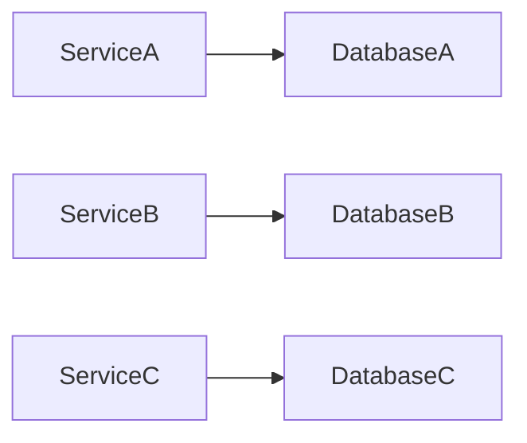

## 14.4.1 Database Per Service Pattern

In the realm of microservices architecture, the "Database Per Service" pattern is a fundamental design strategy that emphasizes the independence and autonomy of each service. This pattern dictates that each microservice should have its own database, which it exclusively owns and manages. This approach aligns with the core principles of microservices, promoting loose coupling and high cohesion by ensuring that services are independent units of deployment and scaling.

### Understanding the Database Per Service Pattern

The Database Per Service pattern is a key aspect of microservices architecture, where each service is responsible for its own data management. This means that a microservice does not share its database with other services, ensuring that it can evolve independently without being constrained by the needs or changes in other services.

#### Benefits of the Pattern

1. **Encapsulation and Autonomy**: Each service having its own database allows for encapsulation of data, meaning that the service can change its data model without affecting others. This autonomy is crucial for maintaining the independence of services.

2. **Independent Scaling**: Services can be scaled independently based on their specific needs. For instance, a service with high read demand can optimize its database for read operations without impacting other services.

3. **Technology Heterogeneity**: Different services can use different database technologies that best suit their needs. For example, a service handling complex transactions might use a relational database, while another dealing with large-scale analytics might opt for a NoSQL solution.

4. **Improved Fault Isolation**: Since services do not share databases, a failure in one service's database does not directly impact the databases of other services, enhancing the overall resilience of the system.

5. **Simplified Security Management**: Each service can implement security measures tailored to its specific data, reducing the risk of a breach affecting multiple services.

Let's visualize this pattern using a Mermaid.js diagram:

### Managing Data Consistency Across Services

One of the challenges of the Database Per Service pattern is maintaining data consistency across services. Since each service has its own database, achieving strong consistency can be complex, especially in distributed environments.

#### Strategies for Data Consistency

- **Eventual Consistency**: Accept that data will be eventually consistent across services. This approach works well for use cases where immediate consistency is not critical.

- **Sagas**: Implement saga patterns for managing distributed transactions. Sagas break a transaction into a series of smaller transactions, each managed by a different service, with compensating transactions to handle failures.

- **Event Sourcing**: Use event sourcing to maintain a log of changes, which can be replayed to achieve consistency across services.

- **Command Query Responsibility Segregation (CQRS)**: Separate the read and write operations to handle data consistency more effectively.

### Data Replication and Synchronization

In some cases, data replication and synchronization between services might be necessary. This can be achieved through:

- **Change Data Capture (CDC)**: Capture changes in the database and propagate them to other services that need to be aware of these changes.

- **Data Streaming**: Use data streaming platforms like Apache Kafka to stream changes in real-time to other services.

- **API Calls**: Services can expose APIs that other services can call to fetch the latest data when needed.

### Challenges and Considerations

While the Database Per Service pattern offers numerous benefits, it also presents challenges:

- **Data Duplication**: There might be some overlap in the data stored by different services, leading to duplication. This requires careful management to ensure data consistency and integrity.

- **Complex Queries**: Queries that span multiple services can become complex and inefficient, as they require aggregating data from multiple databases.

- **Reporting and Analytics**: Centralized reporting and analytics can be challenging in a decentralized data environment. Solutions include using a data warehouse to aggregate data from different services or employing a federated query approach.

### Choosing the Right Database Technology

Selecting the appropriate database technology for each service is crucial. Considerations include:

- **Data Model**: Choose a database that aligns with the service's data model. For example, a document database for hierarchical data or a graph database for complex relationships.

- **Query Patterns**: Consider the types of queries the service will perform. A service with complex joins might benefit from a relational database.

- **Scalability Requirements**: Services with high scalability needs might opt for NoSQL databases that offer horizontal scaling.

- **Consistency vs. Availability**: Decide whether the service prioritizes consistency or availability, influencing the choice between SQL and NoSQL databases.

### Transactions and Cross-Service Queries

Handling transactions and queries that span multiple services is a significant challenge in the Database Per Service pattern:

- **Distributed Transactions**: Avoid using distributed transactions due to their complexity and performance overhead. Instead, use patterns like sagas or eventual consistency.

- **API Aggregation**: Use API gateways or aggregation services to perform cross-service queries, collecting data from multiple services and combining it as needed.

### Reporting and Analytics

In a decentralized data environment, reporting and analytics require special attention:

- **Data Warehousing**: Aggregate data from various services into a centralized data warehouse for reporting and analytics.

- **Federated Queries**: Use federated queries to access data across multiple databases without moving data to a central location.

- **ETL Processes**: Implement Extract, Transform, Load (ETL) processes to periodically aggregate data from different services.

### Backup and Disaster Recovery

Managing backups and disaster recovery for each service's database is critical:

- **Service-Specific Backups**: Each service should have its own backup strategy, tailored to its data and recovery requirements.

- **Automated Backups**: Use automated tools to ensure regular backups and quick recovery in case of failures.

- **Cross-Service Recovery Plans**: Develop recovery plans that consider dependencies between services, ensuring that all services can be restored to a consistent state.

### Security Best Practices

Securing each database is paramount to protect sensitive data:

- **Access Controls**: Implement strict access controls, ensuring that only authorized services and users can access the database.

- **Encryption**: Use encryption for data at rest and in transit to protect against unauthorized access.

- **Audit Logging**: Maintain audit logs to track access and changes to the database, helping detect and respond to security incidents.

### Tools and Frameworks

Several tools and frameworks can support the Database Per Service pattern:

- **Spring Boot**: Provides support for building microservices with independent databases.

- **AWS RDS**: Offers managed database services that can be used for each microservice.

- **Kubernetes**: Facilitates the deployment and management of microservices, including their databases.

- **Apache Kafka**: Supports data streaming and synchronization between services.

### Data Boundaries and Ownership

Careful consideration of data boundaries and ownership is essential:

- **Clear Ownership**: Define clear ownership of data by each service to avoid conflicts and ensure accountability.

- **Data Contracts**: Establish data contracts between services to manage shared data and dependencies.

### Alternatives to Database Per Service Pattern

While the Database Per Service pattern is ideal for many scenarios, there are cases where a shared database might be necessary:

- **Shared Data Needs**: When multiple services require access to the same data, a shared database can simplify management.

- **Complex Transactions**: For complex transactions involving multiple services, a shared database might offer simpler solutions.

- **Legacy Systems**: In systems with existing shared databases, transitioning to a Database Per Service pattern may not be feasible.

### Conclusion

The Database Per Service pattern is a powerful strategy for managing data in microservices architectures. By ensuring that each service owns its database, organizations can achieve greater autonomy, scalability, and resilience. However, this pattern also requires careful management of data consistency, security, and reporting. By understanding the benefits and challenges, and implementing best practices, organizations can effectively leverage this pattern to build robust and scalable microservices systems.

## Quiz Time!



### Which of the following is a key benefit of the Database Per Service pattern?

- [x] Encapsulation and autonomy of services
- [ ] Simplified transaction management across services
- [ ] Reduced data redundancy
- [ ] Unified database technology across services

> **Explanation:** The Database Per Service pattern provides encapsulation and autonomy, allowing each service to manage its own data independently.

### What is a common challenge when using the Database Per Service pattern?

- [ ] Improved fault isolation
- [ ] Simplified security management
- [ ] Technology heterogeneity
- [x] Data duplication

> **Explanation:** Data duplication can occur when multiple services store overlapping data, requiring careful management to ensure consistency.

### Which strategy can be used to manage data consistency across microservices?

- [ ] Shared databases
- [ ] Centralized transaction management
- [x] Eventual consistency
- [ ] Single database per organization

> **Explanation:** Eventual consistency is a strategy where data is allowed to be temporarily inconsistent across services, eventually becoming consistent.

### How can complex queries that span multiple services be handled?

- [ ] By using a single database for all services
- [x] Through API aggregation
- [ ] By implementing distributed transactions
- [ ] By using a shared database schema

> **Explanation:** API aggregation involves collecting data from multiple services and combining it as needed, which helps handle complex queries.

### What is a key consideration when choosing a database technology for a service?

- [ ] Ensuring it is the same as other services
- [x] Aligning with the service's data model and query patterns
- [ ] Minimizing cost
- [ ] Maximizing storage capacity

> **Explanation:** The chosen database should align with the service's specific data model and query patterns to optimize performance.

### Which pattern can be used to handle distributed transactions in microservices?

- [ ] Centralized transaction management
- [ ] Shared database pattern
- [x] Saga pattern
- [ ] Monolithic transaction pattern

> **Explanation:** The Saga pattern breaks a transaction into smaller transactions managed by different services, with compensating actions for failures.

### How can reporting and analytics be managed in a decentralized data environment?

- [ ] By using a single centralized database
- [x] Through data warehousing and ETL processes
- [ ] By aggregating all data into a single service
- [ ] By using a shared database schema

> **Explanation:** Data warehousing and ETL processes can aggregate data from various services for centralized reporting and analytics.

### What is a best practice for securing each database in the Database Per Service pattern?

- [x] Implementing strict access controls
- [ ] Using the same encryption key for all databases
- [ ] Allowing open access to all services
- [ ] Centralizing all security measures in one service

> **Explanation:** Implementing strict access controls ensures that only authorized services and users can access each database.

### Which tool can support data streaming and synchronization between services?

- [ ] AWS RDS
- [ ] Spring Boot
- [x] Apache Kafka
- [ ] Kubernetes

> **Explanation:** Apache Kafka is a data streaming platform that supports real-time data synchronization between services.

### True or False: The Database Per Service pattern eliminates the need for data consistency management.

- [ ] True
- [x] False

> **Explanation:** The Database Per Service pattern requires careful management of data consistency across services, as each service has its own database.


