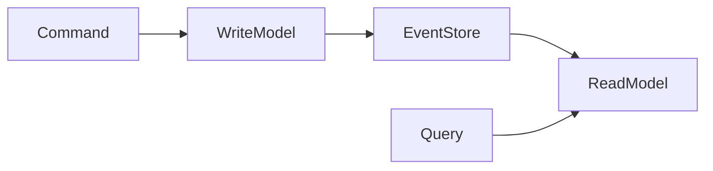

## 14.4.2 Event Sourcing and CQRS Patterns

In the dynamic world of microservices and distributed systems, maintaining data consistency and scalability while ensuring auditability can be challenging. Two powerful design patterns, Event Sourcing and Command Query Responsibility Segregation (CQRS), offer innovative solutions to these challenges. This article delves into the intricacies of these patterns, exploring their implementation, benefits, and potential complexities.

### Introduction to Event Sourcing

Event Sourcing is a pattern where state changes in a system are stored as a sequence of events. Unlike traditional data management approaches that store the current state, Event Sourcing captures every change to the state as an immutable event. This approach offers a complete history of changes, enabling powerful capabilities like audit trails, temporal queries, and the ability to reconstruct past states.

#### Key Concepts of Event Sourcing

- **Event Store**: A specialized database that persists events. Each event represents a state change and is stored in an append-only manner.
- **Event Replay**: The process of reconstructing the current state by replaying all events from the event store.
- **Immutability**: Events, once stored, are immutable. This ensures a reliable and consistent history of state changes.

### Command Query Responsibility Segregation (CQRS)

CQRS is a pattern that separates the read and write models of a system. In traditional architectures, the same data model is used for both querying and updating data, which can lead to complex and inefficient designs. CQRS proposes distinct models for handling commands (write operations) and queries (read operations), optimizing each for its specific purpose.

#### Key Concepts of CQRS

- **Command Model**: Handles the write operations. It is optimized for processing commands that change the state of the system.
- **Query Model**: Handles the read operations. It is optimized for retrieving data and can be structured differently from the command model.
- **Separation of Concerns**: By separating the read and write models, CQRS allows for more flexible and scalable system designs.

### Addressing Data Consistency Challenges in Microservices

In microservices architectures, data consistency is a significant challenge due to the distributed nature of the system. Event Sourcing and CQRS can help address these challenges by:

- **Ensuring Consistency**: Event Sourcing provides a single source of truth through the event store, ensuring consistency across services.
- **Scalability**: CQRS allows scaling read and write models independently, optimizing performance and resource usage.
- **Auditability**: Event Sourcing inherently supports auditability by maintaining a complete history of state changes.

### Implementing Event Sourcing with an Event Store

Implementing Event Sourcing involves setting up an event store to persist events. The event store should support append-only operations and provide mechanisms for event replay. Here's a basic implementation guide:

1. **Define Events**: Identify and define the events that represent state changes in your system. Each event should capture the necessary data to describe the change.

2. **Set Up Event Store**: Choose a suitable event store technology. Options include databases like Apache Kafka, EventStoreDB, or custom implementations using relational databases.

3. **Persist Events**: Implement logic to persist events to the event store whenever a state change occurs.

4. **Event Replay**: Develop mechanisms to replay events to reconstruct the current state or past states as needed.

#### Example: Event Sourcing in JavaScript

```javascript
class EventStore {
  constructor() {
    this.events = [];
  }

  append(event) {
    this.events.push(event);
  }

  replay() {
    return this.events.reduce((state, event) => {
      // Apply each event to reconstruct state
      return applyEvent(state, event);
    }, initialState);
  }
}

function applyEvent(state, event) {
  switch (event.type) {
    case 'UserCreated':
      return { ...state, users: [...state.users, event.payload] };
    // Handle other event types
    default:
      return state;
  }
}

const eventStore = new EventStore();
eventStore.append({ type: 'UserCreated', payload: { id: 1, name: 'Alice' } });
const currentState = eventStore.replay();
console.log(currentState);
```

### Visualizing Event Sourcing and CQRS

To better understand how Event Sourcing and CQRS work together, consider the following diagram:



- **Command**: Represents an action that changes the system's state.
- **Write Model**: Processes commands and updates the event store.
- **Event Store**: Stores events representing state changes.
- **Read Model**: Builds a view of the data for querying.
- **Query**: Retrieves data from the read model.

### Benefits of Event Sourcing and CQRS

- **Auditability**: Every change is recorded as an event, providing a complete audit trail.
- **Scalability**: Read and write models can be scaled independently, optimizing performance.
- **Flexibility**: The read model can be tailored to specific query requirements without affecting the write model.
- **Temporal Queries**: Ability to query the state at any point in time by replaying events.

### Handling Eventual Consistency in CQRS Implementations

In CQRS, eventual consistency is a common challenge due to the separation of read and write models. Here are some strategies to handle it:

- **Eventual Consistency**: Accept that the read model may not always be immediately consistent with the write model. Design the system to handle temporary inconsistencies gracefully.
- **Eventual Consistency Notifications**: Use notifications or events to inform the read model of changes, allowing it to update asynchronously.
- **Compensating Actions**: Implement compensating actions to handle inconsistencies or errors in the read model.

### Complexities Involved in Event Sourcing and CQRS

While powerful, these patterns introduce complexities such as:

- **Event Versioning**: As the system evolves, events may need to change. Implement versioning strategies to handle different event versions.
- **Event Replay**: Replaying a large number of events can be resource-intensive. Consider strategies like snapshots to optimize performance.
- **Data Migration**: Migrating existing systems to Event Sourcing and CQRS can be challenging. Plan carefully to ensure a smooth transition.

### Frameworks and Tools Supporting Event Sourcing and CQRS

Several frameworks and tools can facilitate the implementation of these patterns:

- **Axon Framework**: A Java framework that provides comprehensive support for Event Sourcing and CQRS.
- **EventStoreDB**: A database specifically designed for Event Sourcing.
- **Apache Kafka**: A distributed event streaming platform that can be used as an event store.
- **NestJS CQRS Module**: A Node.js framework that provides CQRS support for building scalable applications.

### Designing Events and Commands Effectively

Effective design of events and commands is crucial for successful implementation:

- **Event Granularity**: Define events at the right level of granularity to capture meaningful state changes.
- **Command Validation**: Ensure commands are validated before processing to maintain data integrity.
- **Event Naming**: Use clear and descriptive names for events to improve readability and maintainability.

### Strategies for Migrating Existing Systems

Migrating to Event Sourcing and CQRS requires careful planning:

- **Incremental Migration**: Migrate parts of the system incrementally to minimize disruption.
- **Data Transformation**: Develop strategies for transforming existing data into events.
- **Parallel Operation**: Run the new system in parallel with the old one to ensure consistency and reliability.

### Best Practices for Testing and Maintaining Systems

Testing and maintaining systems using these patterns require specific approaches:

- **Automated Testing**: Implement automated tests for both the command and query models to ensure correctness.
- **Monitoring and Logging**: Set up comprehensive monitoring and logging to track system behavior and diagnose issues.
- **Continuous Integration**: Use continuous integration practices to ensure changes are tested and deployed reliably.

### Impact on Team Skills and Required Expertise

Adopting Event Sourcing and CQRS may require upskilling your team:

- **Domain-Driven Design**: Encourage understanding of domain-driven design principles to effectively model events and commands.
- **Event-Driven Architecture**: Familiarize the team with event-driven architecture concepts and practices.
- **Tool Proficiency**: Ensure the team is proficient with the tools and frameworks used for implementation.

### Conclusion

Event Sourcing and CQRS offer powerful solutions for managing data consistency, scalability, and auditability in microservices. While they introduce complexities, careful planning and implementation can unlock significant benefits. Consider these patterns when dealing with complex domain logic and strive to apply best practices to maximize their potential.

By embracing these patterns, you can transform your system's architecture, enabling it to handle complex scenarios with ease and flexibility. As you explore these patterns, remember to consider the unique needs of your system and domain, and tailor your implementation accordingly.

## Quiz Time!



### What is Event Sourcing?

- [x] A pattern where state changes are stored as a sequence of events.
- [ ] A pattern where the current state is stored directly in the database.
- [ ] A pattern that combines read and write models into a single model.
- [ ] A pattern that focuses solely on data retrieval.

> **Explanation:** Event Sourcing is a pattern where state changes are stored as a sequence of events, providing a complete history of changes.

### What does CQRS stand for?

- [x] Command Query Responsibility Segregation
- [ ] Command Query Relationship System
- [ ] Concurrent Queue Request System
- [ ] Command Queue Response Segregation

> **Explanation:** CQRS stands for Command Query Responsibility Segregation, which separates the read and write models of a system.

### How does Event Sourcing ensure auditability?

- [x] By storing every change as an immutable event.
- [ ] By maintaining a separate audit log.
- [ ] By using a centralized logging system.
- [ ] By storing only the current state.

> **Explanation:** Event Sourcing ensures auditability by storing every change as an immutable event, providing a complete history of state changes.

### What is a key benefit of CQRS?

- [x] It allows read and write models to be scaled independently.
- [ ] It combines read and write models for simplicity.
- [ ] It focuses solely on data consistency.
- [ ] It eliminates the need for event stores.

> **Explanation:** A key benefit of CQRS is that it allows read and write models to be scaled independently, optimizing performance.

### What challenge does eventual consistency address in CQRS?

- [x] Temporary inconsistencies between read and write models.
- [ ] Data loss during state changes.
- [ ] Security vulnerabilities in data storage.
- [ ] Performance issues in event replay.

> **Explanation:** Eventual consistency addresses temporary inconsistencies between read and write models in CQRS implementations.

### Which tool is specifically designed for Event Sourcing?

- [x] EventStoreDB
- [ ] MySQL
- [ ] Redis
- [ ] MongoDB

> **Explanation:** EventStoreDB is a database specifically designed for Event Sourcing, supporting append-only operations and event replay.

### What is a common strategy for handling large numbers of events in Event Sourcing?

- [x] Using snapshots to optimize performance.
- [ ] Storing events in a relational database.
- [ ] Reducing the number of events stored.
- [ ] Combining events into a single state change.

> **Explanation:** Using snapshots is a common strategy to optimize performance when handling large numbers of events in Event Sourcing.

### What is an important consideration when designing events?

- [x] Event granularity and naming.
- [ ] Combining multiple state changes into a single event.
- [ ] Storing events in a single model.
- [ ] Ignoring validation for simplicity.

> **Explanation:** Event granularity and naming are important considerations when designing events to ensure meaningful and maintainable state changes.

### What is a recommended approach for migrating to Event Sourcing and CQRS?

- [x] Incremental migration and parallel operation.
- [ ] Immediate full migration.
- [ ] Discarding existing data models.
- [ ] Using a single event store for all services.

> **Explanation:** Incremental migration and parallel operation are recommended approaches to minimize disruption and ensure consistency during migration.

### True or False: Event Sourcing and CQRS can help address data consistency challenges in microservices.

- [x] True
- [ ] False

> **Explanation:** True. Event Sourcing and CQRS can help address data consistency challenges in microservices by providing a single source of truth and separating read and write models.


