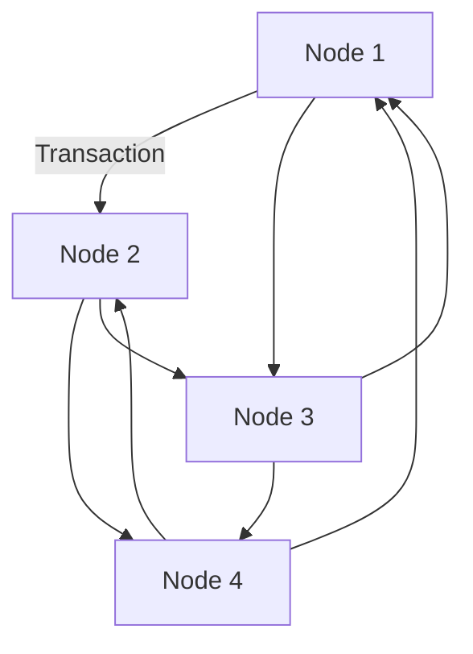
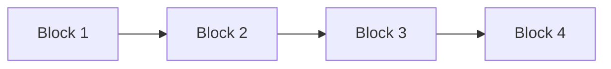

## 15.1.1 Fundamentals of Blockchain

Blockchain technology has emerged as a transformative force across various industries, offering new ways to secure, verify, and share data. At its core, blockchain is a decentralized, immutable, and transparent ledger that records transactions across a network of computers. This section will delve into the fundamental principles of blockchain technology, providing a comprehensive understanding of its components, mechanisms, and potential applications.

### Basic Principles of Blockchain Technology

#### Decentralization

Decentralization is a cornerstone of blockchain technology, where control and decision-making are distributed across a network rather than a centralized authority. In traditional systems, a central entity manages and verifies transactions. However, in a decentralized blockchain network, all nodes (participants) have equal authority and access to the entire transaction history. This decentralization enhances security and trust, as no single point of failure or control exists.

**Real-World Analogy:** Imagine a group of friends maintaining a shared diary. Instead of one person holding the diary, each friend keeps a copy, ensuring that any entry must be agreed upon by everyone. This prevents any single person from altering past entries without the group's consensus.

#### Immutability

Immutability refers to the unchangeable nature of blockchain records. Once a transaction is recorded and confirmed on the blockchain, it cannot be altered or deleted. This is achieved through cryptographic hashing and the chaining of blocks, which we will explore later. Immutability ensures data integrity and trustworthiness, as all records are permanent and tamper-proof.

**Real-World Analogy:** Consider a permanent marker used to write in a diary. Once an entry is made, it cannot be erased or modified, ensuring the authenticity of the recorded information.

#### Transparency

Transparency in blockchain means that all transactions are visible to all network participants. This openness fosters trust among users, as everyone can verify the legitimacy of transactions. While transparency is a hallmark of public blockchains, private and permissioned blockchains can restrict visibility to authorized participants.

**Real-World Analogy:** Think of a public bulletin board where anyone can post notices, and everyone can see them. The transparency of the board ensures that all posted information is accessible and verifiable by the community.

### How Blockchain Functions as a Distributed Ledger

A blockchain operates as a distributed ledger, a digital record of transactions maintained across a network of nodes. Each node holds a copy of the entire blockchain, ensuring redundancy and resilience. When a new transaction occurs, it is broadcast to the network, and nodes work together to validate and record it. This distributed nature eliminates the need for a central authority, enhancing security and reducing the risk of fraud.

**Mermaid Diagram:**



**Explanation:** The diagram illustrates a network of nodes (A, B, C, D) that share and validate transactions. Each node maintains a copy of the blockchain, ensuring consistency and security across the network.

### Key Concepts: Blocks, Transactions, and the Chaining Mechanism

#### Blocks

A block is a collection of transactions bundled together and added to the blockchain. Each block contains a unique identifier called a hash, a timestamp, and a reference to the previous block's hash, forming a chain. This structure ensures that altering any block would require changing all subsequent blocks, making tampering computationally infeasible.

#### Transactions

Transactions are the fundamental units of activity recorded on the blockchain. They represent the transfer of value or information between parties. Each transaction is verified by network nodes and, once confirmed, is added to a block.

#### Chaining Mechanism

The chaining mechanism is the process by which blocks are linked together in a linear sequence. Each block references the hash of the previous block, creating an unbreakable chain. This linkage ensures data integrity, as altering one block would require recalculating the hashes of all subsequent blocks.

**Mermaid Diagram:**



**Explanation:** The diagram shows how blocks are linked in a chain, with each block referencing the previous one's hash. This chaining ensures the immutability and integrity of the blockchain.

### Cryptographic Hashing: Securing Data and Enabling Block Linkage

Cryptographic hashing is a critical component of blockchain security. A hash is a fixed-size string of characters generated from input data using a cryptographic algorithm. In blockchain, hashes are used to secure transactions and link blocks.

**Key Properties of Cryptographic Hashing:**

- **Deterministic:** The same input always produces the same hash.
- **Pre-image Resistance:** It is computationally infeasible to reverse-engineer the original input from its hash.
- **Collision Resistance:** It is highly unlikely for two different inputs to produce the same hash.
- **Avalanche Effect:** A small change in input results in a significantly different hash.

**Example:** In JavaScript, the SHA-256 hashing algorithm can be used to generate a hash:

```javascript
const crypto = require('crypto');

// Example data
const data = "Blockchain";

// Generate SHA-256 hash
const hash = crypto.createHash('sha256').update(data).digest('hex');

console.log(`Hash: ${hash}`);
```

**Explanation:** This code snippet demonstrates how to generate a SHA-256 hash in JavaScript, providing a unique identifier for the input data "Blockchain."

### Consensus Mechanisms: Decentralized Agreement Among Nodes

Consensus mechanisms are protocols that enable nodes in a blockchain network to agree on the validity of transactions. They ensure that all nodes have a consistent view of the blockchain, preventing double-spending and fraud.

#### Common Consensus Mechanisms

- **Proof of Work (PoW):** Nodes (miners) compete to solve complex mathematical puzzles. The first to solve the puzzle adds a new block to the blockchain and is rewarded. PoW is energy-intensive but secure, used by Bitcoin.

- **Proof of Stake (PoS):** Validators are chosen to create new blocks based on their stake (ownership) in the network. PoS is more energy-efficient than PoW and is used by Ethereum 2.0.

- **Delegated Proof of Stake (DPoS):** Stakeholders vote for a small group of delegates to validate transactions and create blocks. DPoS is fast and scalable, used by platforms like EOS.

- **Practical Byzantine Fault Tolerance (PBFT):** Nodes reach consensus through a majority vote, ensuring agreement even if some nodes are faulty or malicious. PBFT is used in permissioned blockchains.

**Real-World Analogy:** Consensus mechanisms can be likened to a group decision-making process, where participants must agree on a decision before it is finalized. Different mechanisms represent different voting systems, each with its strengths and weaknesses.

### Public, Private, and Permissioned Blockchains

#### Public Blockchains

Public blockchains are open to anyone, allowing anyone to participate in the network, validate transactions, and access the ledger. They are decentralized and secure but can be slower due to the need for consensus among many nodes. Examples include Bitcoin and Ethereum.

**Use Cases:** Cryptocurrency transactions, decentralized applications (dApps), and smart contracts.

#### Private Blockchains

Private blockchains restrict access to a select group of participants. They offer faster transaction speeds and greater control but sacrifice some decentralization. Private blockchains are often used by enterprises for internal processes.

**Use Cases:** Supply chain management, internal audits, and enterprise resource planning (ERP).

#### Permissioned Blockchains

Permissioned blockchains combine elements of public and private blockchains. They allow certain participants to validate transactions while others have restricted access. This hybrid approach balances transparency and control.

**Use Cases:** Consortiums, inter-organizational collaborations, and regulatory compliance.

### Common Misconceptions About Blockchain

#### Myth: Blockchain Is Synonymous with Bitcoin

Reality: While Bitcoin was the first application of blockchain technology, blockchain has evolved far beyond cryptocurrency. It now powers a wide range of applications, from supply chain management to digital identity verification.

#### Myth: Blockchain Is Completely Anonymous

Reality: Blockchain transactions are pseudonymous, meaning they are linked to a public address rather than a user's identity. While this offers some privacy, it is not complete anonymity.

#### Myth: Blockchain Is Tamper-Proof

Reality: While blockchain is highly secure and tamper-resistant, it is not entirely immune to attacks. Security depends on the network's size, consensus mechanism, and implementation.

### Evolution of Blockchain: From Bitcoin to Ethereum and Beyond

The blockchain journey began with Bitcoin, introduced by an anonymous entity known as Satoshi Nakamoto in 2008. Bitcoin demonstrated the potential of a decentralized currency, sparking interest in blockchain technology.

Ethereum, launched in 2015, expanded blockchain's capabilities by introducing smart contracts—self-executing contracts with the terms of the agreement directly written into code. Ethereum's programmability opened new possibilities for decentralized applications (dApps) and led to the rise of decentralized finance (DeFi) and non-fungible tokens (NFTs).

Since then, numerous blockchain platforms have emerged, each offering unique features and use cases. These include:

- **Hyperledger:** A permissioned blockchain framework for enterprise applications.
- **Polkadot:** A multi-chain network enabling interoperability between blockchains.
- **Cardano:** A blockchain platform focused on sustainability and scalability.

### Importance of Understanding Blockchain's Foundational Elements

Before diving into advanced blockchain topics, it is crucial to grasp the foundational elements discussed in this section. Understanding decentralization, immutability, transparency, and consensus mechanisms provides a solid foundation for exploring more complex concepts and applications.

### Potential Applications of Blockchain Technology

Blockchain's versatility makes it applicable across various industries, offering solutions to longstanding challenges. Some potential applications include:

- **Finance:** Cross-border payments, remittances, and decentralized finance (DeFi).
- **Supply Chain:** Traceability, provenance, and anti-counterfeiting.
- **Healthcare:** Secure patient records, data sharing, and clinical trials.
- **Voting:** Transparent and tamper-proof election systems.
- **Identity:** Digital identity verification and management.

### Critical Thinking: When and Where Blockchain Adds Value

While blockchain offers numerous benefits, it is not a one-size-fits-all solution. Critical thinking is essential to determine when and where blockchain adds value. Consider the following questions:

- Does the application require decentralization and trustless interactions?
- Is there a need for an immutable and transparent record of transactions?
- Can blockchain improve security, efficiency, or cost-effectiveness?

### Limitations and Challenges of Blockchain Adoption

Despite its potential, blockchain faces several challenges:

- **Scalability:** Blockchain networks can struggle to handle large volumes of transactions efficiently.
- **Interoperability:** Lack of standardization can hinder communication between different blockchains.
- **Regulation:** Unclear regulatory frameworks can create uncertainty for blockchain projects.
- **Energy Consumption:** Some consensus mechanisms, like PoW, are energy-intensive.

### Resources for Further Reading

To deepen your understanding of blockchain, consider exploring the following resources:

- **Books:**
  - "Mastering Bitcoin" by Andreas M. Antonopoulos
  - "Mastering Ethereum" by Andreas M. Antonopoulos and Gavin Wood

- **Online Courses:**
  - "Blockchain Basics" by Coursera
  - "Ethereum and Solidity: The Complete Developer's Guide" by Udemy

- **Articles and Websites:**
  - The Bitcoin Whitepaper by Satoshi Nakamoto
  - Ethereum's official website and documentation
  - Hyperledger's resources and community forums

### Conclusion

Blockchain technology represents a paradigm shift in how we think about data security, transparency, and decentralization. By understanding its fundamental principles, you are equipped to explore its potential applications and challenges. As blockchain continues to evolve, it will undoubtedly play a significant role in shaping the future of technology and society.

## Quiz Time!



### What is decentralization in the context of blockchain?

- [x] Distribution of control and decision-making across a network
- [ ] Centralization of authority in a single entity
- [ ] Exclusive access to data by a central authority
- [ ] Restriction of network participation to a few nodes

> **Explanation:** Decentralization in blockchain involves distributing control and decision-making across a network, eliminating the need for a central authority.

### What ensures the immutability of blockchain records?

- [x] Cryptographic hashing and the chaining of blocks
- [ ] Centralized control of data
- [ ] Regular updates by a central authority
- [ ] Limited access to transaction history

> **Explanation:** Blockchain records are immutable due to cryptographic hashing and the chaining of blocks, which make altering past records computationally infeasible.

### How does a public blockchain differ from a private blockchain?

- [x] Public blockchains are open to anyone, while private blockchains restrict access
- [ ] Public blockchains are faster than private blockchains
- [ ] Private blockchains are more secure than public blockchains
- [ ] Public blockchains require permission to join

> **Explanation:** Public blockchains are open to anyone, allowing unrestricted participation, while private blockchains limit access to a select group.

### What is the role of consensus mechanisms in blockchain?

- [x] To enable nodes to agree on the validity of transactions
- [ ] To centralize control over the network
- [ ] To restrict access to transaction data
- [ ] To ensure anonymity of users

> **Explanation:** Consensus mechanisms allow nodes in a blockchain network to agree on the validity of transactions, ensuring a consistent and secure ledger.

### Which consensus mechanism is known for being energy-intensive?

- [x] Proof of Work (PoW)
- [ ] Proof of Stake (PoS)
- [ ] Delegated Proof of Stake (DPoS)
- [ ] Practical Byzantine Fault Tolerance (PBFT)

> **Explanation:** Proof of Work (PoW) is energy-intensive as it requires nodes to solve complex mathematical puzzles to validate transactions.

### What is a common misconception about blockchain?

- [x] Blockchain is synonymous with Bitcoin
- [ ] Blockchain is a type of distributed ledger technology
- [ ] Blockchain can be used for various applications beyond cryptocurrency
- [ ] Blockchain transactions are pseudonymous

> **Explanation:** A common misconception is that blockchain is synonymous with Bitcoin, whereas blockchain technology has applications far beyond cryptocurrency.

### What was a significant advancement introduced by Ethereum?

- [x] Smart contracts and programmability
- [ ] The concept of a decentralized currency
- [ ] The use of a centralized ledger
- [ ] The introduction of private blockchains

> **Explanation:** Ethereum introduced smart contracts and programmability, enabling the development of decentralized applications (dApps).

### What is a potential application of blockchain in healthcare?

- [x] Secure patient records and data sharing
- [ ] Centralized control of medical data
- [ ] Restricted access to patient information
- [ ] Manual verification of clinical trials

> **Explanation:** Blockchain can be used in healthcare for secure patient records and data sharing, enhancing privacy and interoperability.

### What challenge does blockchain face regarding scalability?

- [x] Difficulty in handling large volumes of transactions efficiently
- [ ] Lack of transparency in transactions
- [ ] Inability to secure data
- [ ] Centralization of control

> **Explanation:** Blockchain networks can struggle with scalability, as they may have difficulty handling large volumes of transactions efficiently.

### True or False: Blockchain transactions are completely anonymous.

- [ ] True
- [x] False

> **Explanation:** Blockchain transactions are pseudonymous, meaning they are linked to a public address rather than a user's identity, offering some privacy but not complete anonymity.


