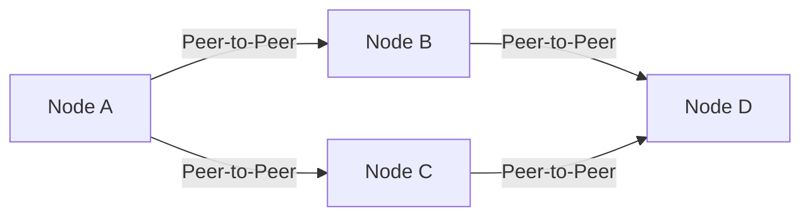
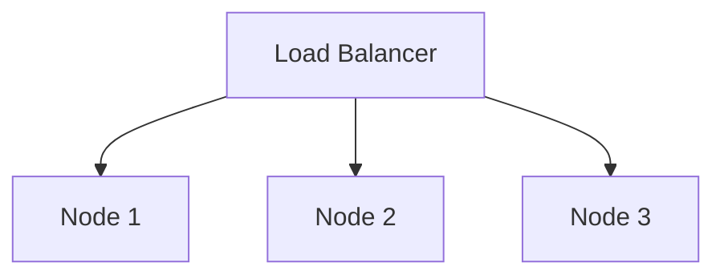

## 15.2.1 Node Design and Network Topology

In the rapidly evolving world of blockchain technology, understanding the architecture of nodes and the network topology is crucial for building robust, efficient, and secure blockchain networks. This section delves into the different types of nodes, their roles, and the network topologies that connect them. We'll also explore best practices for setting up, securing, and scaling nodes, as well as the implications for privacy, compliance, and network stability.

### Understanding Blockchain Nodes

Blockchain networks are composed of various types of nodes, each serving distinct functions. The primary node types include full nodes, light nodes, and validator nodes. Each plays a vital role in maintaining the integrity and functionality of the network.

#### Full Nodes

**Definition and Role:**
- Full nodes are the backbone of a blockchain network. They store the entire blockchain ledger, validate transactions, and enforce consensus rules. By maintaining a complete copy of the blockchain, full nodes ensure the network's transparency and security.

**Setup and Requirements:**
- **Hardware Requirements:** Running a full node requires substantial storage capacity, processing power, and bandwidth. Typically, a full node might need a multi-core processor, at least 8GB of RAM, and several terabytes of disk space, depending on the blockchain's size.
- **Software Installation:** Installing a full node involves downloading the blockchain software (e.g., Bitcoin Core, Geth for Ethereum) and syncing the blockchain data. This process can take several days for large blockchains.

```bash
sudo apt-get update
sudo apt-get install -y bitcoind
bitcoind -daemon
```

#### Light Nodes

**Definition and Role:**
- Light nodes, also known as SPV (Simplified Payment Verification) nodes, do not store the entire blockchain. Instead, they download only block headers and rely on full nodes for transaction verification. Light nodes are ideal for devices with limited resources, such as mobile phones.

**Advantages:**
- Lower resource consumption makes light nodes suitable for everyday users who need quick access to the blockchain without the burden of full storage requirements.

#### Validator Nodes

**Definition and Role:**
- Validator nodes are crucial in proof-of-stake (PoS) networks. They participate in the consensus process by validating new blocks and transactions. Validators are selected based on their stake in the network, which incentivizes honest behavior.

**Responsibilities:**
- Validators are responsible for proposing and attesting to new blocks. They must remain online and maintain high uptime to earn rewards and avoid penalties.

### Network Topology Options

The arrangement of nodes within a blockchain network, known as network topology, significantly impacts the network's performance, security, and decentralization.

#### Peer-to-Peer (P2P) Topology

**Description:**
- In a P2P topology, each node connects directly to multiple other nodes, forming a decentralized mesh network. This topology enhances resilience, as there is no single point of failure.

**Implications:**
- P2P networks are highly robust against censorship and attacks. However, they require efficient algorithms for node discovery and message propagation to maintain performance.



#### Hub-and-Spoke Topology

**Description:**
- In a hub-and-spoke topology, nodes connect to a central hub, which facilitates communication. This model is less decentralized and can introduce bottlenecks.

**Implications:**
- While easier to manage and scale, hub-and-spoke networks are vulnerable to hub failures, which can disrupt the entire network.

### Node Distribution and Decentralization

The geographic and logical distribution of nodes is critical for achieving decentralization and resilience. A well-distributed network can withstand regional outages and attacks.

**Decentralization Benefits:**
- Enhanced security through redundancy.
- Greater resistance to censorship.
- Increased network stability and trust.

**Challenges:**
- Ensuring even distribution requires incentives and policies to encourage node operation in diverse locations.

### Securing Blockchain Nodes

Security is paramount for blockchain nodes, which are frequent targets for attacks such as DDoS and tampering.

**Best Practices:**
- **Firewalls and Network Ports:** Configure firewalls to allow only necessary traffic. Use non-standard ports to reduce the risk of automated attacks.
- **Encryption:** Use TLS for node communication to prevent eavesdropping and tampering.
- **Regular Updates:** Keep node software up-to-date to protect against vulnerabilities.

```bash
sudo ufw allow 8333/tcp
sudo ufw enable
```

### Scaling Nodes for Increased Transaction Volumes

As blockchain networks grow, nodes must scale to handle increased transaction volumes.

**Strategies:**
- **Horizontal Scaling:** Add more nodes to distribute the load.
- **Vertical Scaling:** Upgrade hardware to improve node performance.
- **Load Balancing:** Use load balancers to evenly distribute traffic across node clusters.



### Redundancy and Failover Mechanisms

Redundancy and failover mechanisms are essential for maintaining node availability and reliability.

**Techniques:**
- **Replication:** Deploy multiple instances of nodes to ensure data availability.
- **Failover Clusters:** Configure nodes to automatically take over in case of a failure.

### Monitoring and Maintenance

Regular monitoring and maintenance are crucial for ensuring node health and performance.

**Tools and Practices:**
- **Monitoring Tools:** Use tools like Prometheus and Grafana to monitor node metrics.
- **Regular Backups:** Schedule regular data backups to prevent data loss.
- **Health Checks:** Implement automated health checks to detect and resolve issues promptly.

### Consensus Participation

Participating in the consensus mechanism as a node operator involves specific considerations.

**Considerations:**
- **Staking Requirements:** Ensure sufficient stake to participate in PoS networks.
- **Uptime and Reliability:** Maintain high uptime to avoid penalties and maximize rewards.
- **Protocol Updates:** Stay informed about protocol changes and updates to remain compliant.

### Cloud vs. On-Premises Node Hosting

Choosing between cloud services and on-premises infrastructure for hosting nodes depends on various factors.

**Cloud Hosting:**
- **Advantages:** Scalability, flexibility, and reduced maintenance overhead.
- **Disadvantages:** Potential privacy and compliance concerns.

**On-Premises Hosting:**
- **Advantages:** Greater control over data and security.
- **Disadvantages:** Higher upfront costs and maintenance responsibilities.

### Network Configuration

Proper network configuration is essential for node security and performance.

**Guidelines:**
- **Firewall Rules:** Define strict firewall rules to control access.
- **Port Management:** Use secure ports and protocols for node communication.
- **Network Isolation:** Isolate nodes from other network traffic to enhance security.

### Privacy and Compliance

Running a blockchain node has implications for privacy and compliance.

**Considerations:**
- **Data Privacy:** Ensure compliance with data protection regulations.
- **Anonymity:** Understand the trade-offs between node transparency and user privacy.

### Contributing to Network Stability

Node operators play a crucial role in maintaining network stability.

**Best Practices:**
- **Protocol Adherence:** Follow protocol rules and updates.
- **Community Engagement:** Participate in community discussions and governance.
- **Resource Sharing:** Contribute resources to support network growth and resilience.

### Conclusion

Understanding node design and network topology is fundamental for anyone involved in blockchain development or operation. By following best practices for node setup, security, and scaling, you can contribute to a more robust and decentralized blockchain network. As the blockchain landscape evolves, staying informed and engaged with the community will ensure your nodes remain secure, efficient, and compliant.

## Quiz Time!



### What is the primary role of a full node in a blockchain network?

- [x] To store the entire blockchain ledger and validate transactions
- [ ] To provide lightweight access to the blockchain
- [ ] To participate in consensus mechanisms
- [ ] To act as a central hub for communication

> **Explanation:** Full nodes store the entire blockchain ledger and validate transactions, ensuring the network's integrity and security.

### Which type of node is ideal for devices with limited resources?

- [ ] Full nodes
- [x] Light nodes
- [ ] Validator nodes
- [ ] Hub nodes

> **Explanation:** Light nodes download only block headers and rely on full nodes for transaction verification, making them suitable for devices with limited resources.

### What is a key advantage of a peer-to-peer network topology?

- [x] Enhanced resilience and decentralization
- [ ] Centralized control and management
- [ ] Easier scaling and maintenance
- [ ] Reduced communication overhead

> **Explanation:** Peer-to-peer networks enhance resilience and decentralization by eliminating single points of failure.

### What is a common security practice for blockchain nodes?

- [ ] Disabling firewalls
- [ ] Using default ports
- [x] Regular software updates
- [ ] Allowing all network traffic

> **Explanation:** Regular software updates protect nodes against vulnerabilities and attacks.

### Which scaling strategy involves adding more nodes to distribute the load?

- [x] Horizontal scaling
- [ ] Vertical scaling
- [ ] Load balancing
- [ ] Network isolation

> **Explanation:** Horizontal scaling involves adding more nodes to distribute the load and handle increased transaction volumes.

### What is the purpose of failover mechanisms in node deployment?

- [ ] To improve node performance
- [x] To maintain availability during failures
- [ ] To enhance node security
- [ ] To reduce network traffic

> **Explanation:** Failover mechanisms maintain node availability by automatically taking over in case of a failure.

### What is a consideration when choosing between cloud and on-premises node hosting?

- [x] Privacy and compliance concerns
- [ ] Ease of setup
- [ ] Availability of hardware
- [ ] Network speed

> **Explanation:** Privacy and compliance concerns are important when choosing between cloud and on-premises node hosting.

### How can node operators contribute to network stability?

- [x] By following protocol rules and updates
- [ ] By reducing node uptime
- [ ] By ignoring community discussions
- [ ] By using outdated software

> **Explanation:** Following protocol rules and updates helps maintain network stability and integrity.

### What is a potential disadvantage of hub-and-spoke topology?

- [ ] Increased decentralization
- [x] Vulnerability to hub failures
- [ ] Simplified communication
- [ ] Reduced network traffic

> **Explanation:** Hub-and-spoke topology is vulnerable to hub failures, which can disrupt the entire network.

### Running a blockchain node can have implications for privacy and compliance.

- [x] True
- [ ] False

> **Explanation:** Running a node involves handling sensitive data and requires compliance with data protection regulations.


