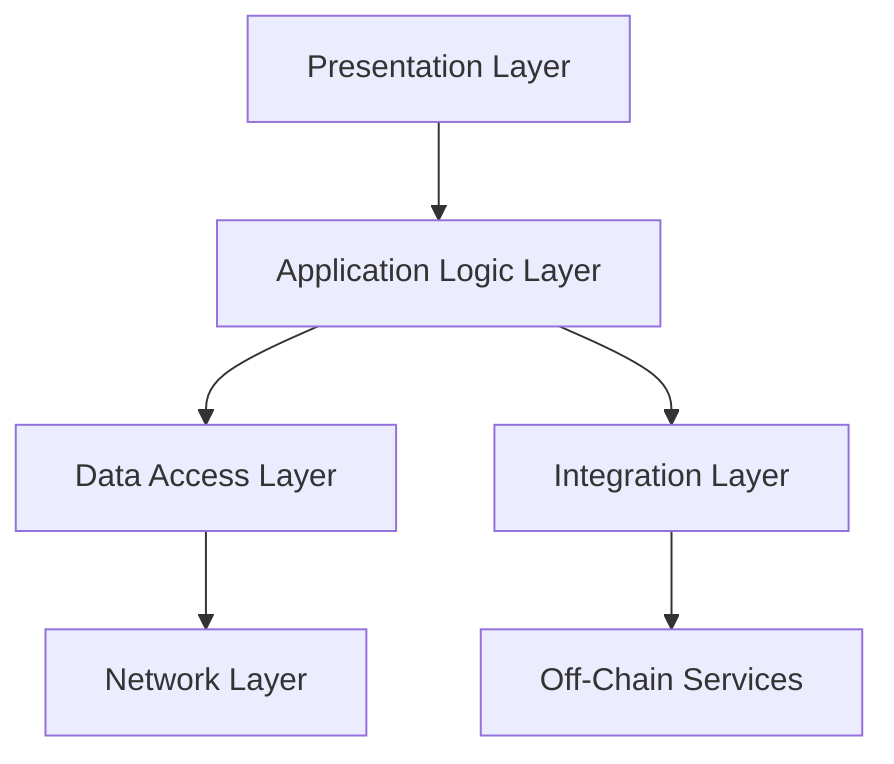

## 15.2.3 Layered Architecture and Modular Design in Blockchain Applications

In the rapidly evolving world of blockchain technology, designing applications that are both robust and flexible is paramount. A layered architecture offers a structured approach to building blockchain applications, enhancing maintainability, scalability, and modularity. This article delves into the principles of layered architecture and modular design, providing insights and practical guidance for developers working with blockchain technologies.

### The Benefits of Layered Architecture in Blockchain

Layered architecture is a design pattern that organizes a system into distinct layers, each with a specific responsibility. This separation of concerns brings several advantages:

- **Maintainability**: By isolating different functionalities into layers, developers can easily modify or update one layer without affecting others. This modularity simplifies maintenance and reduces the risk of introducing bugs.
- **Scalability**: Layers can be scaled independently, allowing for more efficient resource allocation and improved performance as the application grows.
- **Reusability**: Components within a layer can be reused across different parts of the application or even in different projects, enhancing development efficiency.
- **Parallel Development**: Teams can work on different layers simultaneously, speeding up the development process and improving collaboration.

### Defining Layers in Blockchain Applications

A well-defined layered architecture in blockchain applications typically includes the following layers:

1. **Presentation Layer**: This layer handles the user interface and user experience. It is responsible for displaying data to users and capturing user input. In a blockchain context, this might include web or mobile interfaces that interact with the blockchain network.

2. **Application Logic Layer**: Also known as the business logic layer, this layer contains the core functionality of the application. It processes user inputs, performs operations, and applies business rules. In blockchain applications, this layer might include the logic for transaction validation and processing.

3. **Data Access Layer**: This layer manages data interactions, including reading and writing to the blockchain. It abstracts the complexity of data storage and retrieval, providing a consistent API for the application logic layer.

4. **Network Layer**: This layer handles communication with the blockchain network. It manages peer-to-peer interactions, consensus protocols, and network security. This layer ensures that the application can reliably interact with the blockchain infrastructure.

5. **Integration Layer**: Often overlooked, this layer facilitates integration with off-chain services and data sources. It enables the application to interact with external APIs, databases, or other blockchain networks.

### Modular Design with Microservices and APIs

Modular design complements layered architecture by breaking down the application into smaller, independent components or services. Microservices architecture is a popular approach to achieving modularity, where each service is responsible for a specific functionality and communicates with others through well-defined APIs.

- **Microservices in Blockchain**: In a blockchain application, microservices can be used to separate functionalities such as user management, transaction processing, and analytics. Each microservice can be developed, deployed, and scaled independently, providing flexibility and resilience.

- **APIs for Communication**: APIs play a crucial role in modular design, enabling communication between services and layers. They define clear interfaces for data exchange, ensuring that changes in one service do not affect others.

### Designing Modular Smart Contracts

Smart contracts are self-executing contracts with the terms of the agreement directly written into code. Designing smart contracts modularly allows for reuse and easier updates.

- **Reusable Components**: Break down smart contracts into smaller, reusable components. For example, a library of utility functions can be shared across multiple contracts to avoid code duplication.

- **Interfaces and Inheritance**: Use interfaces and inheritance to define clear contracts between smart contract components. This approach allows for flexibility in implementation while maintaining a consistent interface.

- **Upgradable Contracts**: Consider using patterns like the Proxy pattern to enable contract upgrades without changing the contract address, preserving continuity for users and other contracts interacting with it.

### Clear Interfaces and Contracts Between Layers

Clear interfaces are essential for ensuring that each layer in the architecture can interact seamlessly with others. This involves:

- **Defining APIs**: Establish well-documented APIs for communication between layers. These should include input/output specifications, error handling, and versioning information.

- **Contracts for Interaction**: Use formal contracts or specifications to define how layers interact. This can include data formats, protocols, and security requirements.

### Integrating Off-Chain Services and Data

Blockchain applications often need to interact with off-chain services for data storage, processing, or integration with other systems. Strategies for integrating off-chain services include:

- **Oracles**: Use oracles to fetch external data and feed it into the blockchain. Oracles act as trusted data sources, providing real-world information to smart contracts.

- **Hybrid Architectures**: Combine on-chain and off-chain components to leverage the strengths of both. For example, use the blockchain for immutable data storage and off-chain databases for high-performance querying.

### Organizing Project Structures

A well-organized project structure reflects the layered architecture and promotes clarity and maintainability. Consider the following guidelines:

- **Directory Structure**: Organize code into directories corresponding to each layer. For example, separate directories for presentation, application logic, data access, and network layers.

- **Naming Conventions**: Use consistent naming conventions for files, classes, and functions to enhance readability and navigation.

- **Documentation**: Maintain comprehensive documentation for each module and layer, including purpose, dependencies, and usage instructions.

### Middleware for Layer Communication

Middleware acts as an intermediary, facilitating communication and data processing between layers. It can handle tasks such as:

- **Data Transformation**: Convert data formats between layers to ensure compatibility and consistency.

- **Security**: Implement security measures such as authentication, authorization, and encryption to protect data as it moves between layers.

- **Logging and Monitoring**: Capture logs and metrics to monitor application performance and diagnose issues.

### Best Practices for Dependency Management and Version Control

Effective dependency management and version control are crucial for maintaining modular designs:

- **Package Managers**: Use package managers like npm or yarn to manage dependencies, ensuring consistent versions across environments.

- **Semantic Versioning**: Adopt semantic versioning to communicate changes in APIs and dependencies. This helps teams understand the impact of updates and manage compatibility.

- **Dependency Injection**: Use dependency injection to decouple components and make them easier to test and maintain.

### Testing Layers Independently and as a Whole

Testing is vital to ensure the reliability and correctness of each layer and the overall system:

- **Unit Testing**: Test individual components or functions within a layer to verify their correctness in isolation.

- **Integration Testing**: Test interactions between layers to ensure they work together as expected.

- **End-to-End Testing**: Simulate real-world scenarios to test the entire application flow, from user input to blockchain interaction.

### Supporting Parallel Development and Teamwork

Layered architecture supports parallel development by allowing teams to work on different layers independently:

- **Clear Boundaries**: Define clear boundaries and interfaces between layers to minimize dependencies and conflicts.

- **Collaboration Tools**: Use collaboration tools like version control systems, issue trackers, and communication platforms to coordinate efforts and share progress.

### Documenting Modules and Their Interactions

Comprehensive documentation is essential for understanding the architecture and facilitating future development:

- **Module Documentation**: Document each module's purpose, functionality, and dependencies. Include usage examples and configuration instructions.

- **Interaction Diagrams**: Use diagrams to illustrate how modules and layers interact, providing a visual overview of the system architecture.

### Performance Considerations in Layered Systems

While layered architecture offers many benefits, it can introduce performance overhead:

- **Latency**: Each layer adds latency to data processing. Minimize this by optimizing communication and processing within layers.

- **Resource Utilization**: Ensure efficient use of resources by monitoring and optimizing each layer's performance.

- **Scalability**: Design layers to scale independently, allowing the system to handle increased load without degradation.

### Supporting Future Growth and Feature Addition

A well-designed layered architecture provides a solid foundation for future growth:

- **Extensibility**: Design layers with extensibility in mind, allowing new features to be added without disrupting existing functionality.

- **Backward Compatibility**: Maintain backward compatibility when introducing changes, ensuring that existing users and integrations are not affected.

- **Continuous Integration and Deployment**: Implement CI/CD pipelines to automate testing and deployment, enabling rapid iteration and delivery of new features.

### Conclusion

Layered architecture and modular design are powerful patterns for building blockchain applications that are maintainable, scalable, and adaptable. By organizing code into distinct layers and modules, developers can create systems that are easier to understand, extend, and maintain. This approach not only enhances the quality of the software but also supports collaboration and innovation in the fast-paced world of blockchain technology.

## Quiz Time!



### What is a primary benefit of using a layered architecture in blockchain applications?

- [x] Enhances maintainability and scalability
- [ ] Reduces the need for testing
- [ ] Eliminates the need for documentation
- [ ] Increases code complexity

> **Explanation:** Layered architecture enhances maintainability and scalability by organizing the system into distinct layers with specific responsibilities, making it easier to manage and extend.

### Which layer in a blockchain application is responsible for handling user interfaces?

- [x] Presentation Layer
- [ ] Application Logic Layer
- [ ] Data Access Layer
- [ ] Network Layer

> **Explanation:** The Presentation Layer is responsible for handling user interfaces, displaying data to users, and capturing user input.

### How do microservices contribute to modular design?

- [x] By allowing independent development and deployment of services
- [ ] By increasing the complexity of the application
- [ ] By reducing the need for APIs
- [ ] By centralizing all functionalities in a single service

> **Explanation:** Microservices contribute to modular design by allowing independent development and deployment of services, each responsible for a specific functionality.

### What is the role of middleware in a layered architecture?

- [x] Facilitates communication and data processing between layers
- [ ] Increases the number of layers in the architecture
- [ ] Replaces the need for a network layer
- [ ] Simplifies user interface design

> **Explanation:** Middleware facilitates communication and data processing between layers, handling tasks such as data transformation, security, and logging.

### Why is it important to have clear interfaces and contracts between layers?

- [x] To ensure seamless interaction and minimize dependencies
- [ ] To increase the number of dependencies
- [ ] To eliminate the need for testing
- [ ] To make the system more complex

> **Explanation:** Clear interfaces and contracts ensure seamless interaction between layers and minimize dependencies, making the system easier to manage and extend.

### What is a strategy for integrating off-chain services into blockchain applications?

- [x] Using oracles to fetch external data
- [ ] Storing all data on the blockchain
- [ ] Eliminating the need for external data
- [ ] Centralizing data storage in a single database

> **Explanation:** Using oracles is a strategy for integrating off-chain services into blockchain applications, allowing external data to be fed into the blockchain.

### Which testing type verifies the correctness of individual components within a layer?

- [x] Unit Testing
- [ ] Integration Testing
- [ ] End-to-End Testing
- [ ] Performance Testing

> **Explanation:** Unit Testing verifies the correctness of individual components or functions within a layer in isolation.

### How does layered architecture support parallel development?

- [x] By allowing teams to work on different layers independently
- [ ] By requiring all teams to work on the same layer
- [ ] By eliminating the need for collaboration
- [ ] By centralizing all development efforts

> **Explanation:** Layered architecture supports parallel development by allowing teams to work on different layers independently, minimizing conflicts and dependencies.

### What is a potential performance consideration when designing layered systems?

- [x] Latency introduced by each layer
- [ ] Increased need for documentation
- [ ] Reduced need for testing
- [ ] Simplified resource utilization

> **Explanation:** Each layer in a layered system can introduce latency to data processing, so it's important to optimize communication and processing within layers.

### True or False: Layered architecture makes it difficult to add new features to a blockchain application.

- [ ] True
- [x] False

> **Explanation:** Layered architecture actually supports future growth and feature addition by providing a structured and extensible foundation.


