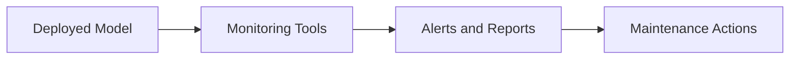

## 16.3.3 Model Monitoring and Maintenance Pattern

In the rapidly evolving landscape of artificial intelligence, deploying a machine learning model is just the beginning of its lifecycle. To ensure that models continue to perform optimally and deliver value, it is crucial to implement robust monitoring and maintenance practices. This section delves into the significance of model monitoring post-deployment, the key metrics to track, and the strategies for maintaining model performance over time.

### The Importance of Model Monitoring

Once a model is deployed, it operates in dynamic environments where data distributions, user interactions, and system conditions can change. Monitoring is essential to:

- **Ensure Continued Performance**: Models can degrade over time due to changes in input data, known as model drift or concept drift. Monitoring helps detect these changes early.
- **Maintain Accuracy and Reliability**: By tracking performance metrics, organizations can ensure that models continue to meet accuracy and reliability standards.
- **Optimize Resource Usage**: Monitoring helps identify inefficiencies in resource usage, such as excessive computation or memory consumption.
- **Comply with Regulatory Standards**: In regulated industries, monitoring is crucial for auditing and compliance purposes.

### Key Metrics for Model Monitoring

Effective model monitoring involves tracking a variety of metrics:

- **Accuracy and Precision**: Continuously evaluate the model's accuracy, precision, recall, and F1-score to ensure it meets performance benchmarks.
- **Latency**: Measure the time taken for predictions to ensure that the model meets real-time requirements.
- **Resource Usage**: Monitor CPU, memory, and GPU usage to optimize resource allocation and cost.
- **Error Rates**: Track the frequency and types of errors to identify potential issues.
- **Throughput**: Measure the number of predictions made over time to ensure scalability.

### Monitoring Workflow

The monitoring workflow can be visualized as a cycle that continuously feeds back into the model maintenance process:

- **Deployed Model**: The model actively making predictions in a production environment.
- **Monitoring Tools**: Systems that collect and analyze performance metrics.
- **Alerts and Reports**: Notifications triggered by anomalous behavior or performance degradation.
- **Maintenance Actions**: Steps taken to address issues, such as retraining or updating the model.

### Detecting Model Drift

**Model Drift** refers to the degradation of model performance over time due to changes in data distribution. There are two primary types:

- **Concept Drift**: Changes in the underlying patterns the model is trying to learn. For example, a model predicting stock prices may experience concept drift due to market changes.
- **Data Drift**: Changes in the input data distribution that the model was not trained on.

To detect drift:

- **Statistical Tests**: Use statistical tests like the Kolmogorov-Smirnov test to detect changes in data distribution.
- **Performance Metrics**: Monitor for significant drops in performance metrics.
- **Drift Detection Algorithms**: Implement algorithms specifically designed to detect drift, such as ADWIN or DDM.

### Setting Up Alerts

Alerts are critical for proactive monitoring. Consider the following:

- **Thresholds**: Define thresholds for key metrics that trigger alerts when exceeded.
- **Automated Notifications**: Use tools to send automated notifications via email, SMS, or dashboards.
- **Severity Levels**: Categorize alerts by severity to prioritize responses.

### Logging and Auditing

Logging predictions and model decisions is essential for:

- **Compliance**: Maintain records for regulatory compliance.
- **Debugging**: Facilitate troubleshooting by providing detailed logs of model inputs and outputs.
- **Auditing**: Ensure transparency and accountability in model decisions.

### Feedback Loops for Continuous Learning

Feedback loops involve using real-world data and outcomes to improve model performance:

- **User Feedback**: Incorporate user feedback to refine model predictions.
- **Retraining**: Use new data to retrain models periodically, ensuring they adapt to changes.

### Updating Models

Updating models is necessary when:

- **Performance Degrades**: Retrain the model when performance metrics fall below acceptable levels.
- **New Data is Available**: Incorporate new data to improve model accuracy and relevance.
- **Requirements Change**: Adapt the model to meet new business or technical requirements.

### Retraining and Automation

Automating the retraining process ensures models remain up-to-date:

- **Scheduled Retraining**: Set up automated retraining schedules based on data availability.
- **Continuous Integration**: Integrate retraining into the CI/CD pipeline for seamless updates.
- **Model Versioning**: Use version control to manage model updates and rollbacks.

### Scaling Monitoring Solutions

As model usage grows, so does the need for scalable monitoring solutions:

- **Distributed Monitoring**: Use distributed systems to handle large volumes of data.
- **Cloud-Based Solutions**: Leverage cloud platforms for scalable storage and processing.
- **Load Balancing**: Implement load balancing to distribute monitoring tasks efficiently.

### Visualization Tools

Visualization tools help analyze model performance:

- **Dashboards**: Use dashboards to provide real-time insights into model metrics.
- **Graphs and Charts**: Visualize trends and patterns in model performance over time.
- **Heatmaps**: Identify areas of high error rates or resource usage.

### External Factors and Adaptation

External factors such as economic shifts, regulatory changes, or technological advancements can impact model predictions:

- **Scenario Analysis**: Simulate different scenarios to understand potential impacts.
- **Adaptive Models**: Develop models that can adapt to changing conditions.

### Collaboration Between Teams

Effective model monitoring requires collaboration between data scientists and operations teams:

- **Shared Objectives**: Align on monitoring objectives and priorities.
- **Cross-Functional Tools**: Use tools that facilitate collaboration and data sharing.
- **Regular Reviews**: Conduct regular reviews to discuss findings and improvement strategies.

### Tools and Platforms

Several tools and platforms support model monitoring:

- **Prometheus**: An open-source monitoring system with a powerful query language.
- **ELK Stack**: A popular suite for logging and monitoring.
- **Grafana**: A visualization tool that integrates with various data sources.
- **Datadog**: A cloud-based monitoring and analytics platform.

### User Feedback and Model Accuracy

User feedback is invaluable for improving model accuracy:

- **Surveys and Feedback Forms**: Collect user feedback on model predictions.
- **A/B Testing**: Conduct experiments to evaluate model performance.

### Documenting Maintenance Procedures

Documenting procedures and lessons learned is crucial for:

- **Knowledge Sharing**: Ensure that insights are shared across the organization.
- **Process Improvement**: Identify areas for improvement in monitoring and maintenance practices.
- **Regulatory Compliance**: Maintain documentation for audit purposes.

### Conclusion

Model monitoring and maintenance are critical components of the AI lifecycle. By implementing robust monitoring practices, organizations can ensure that their models continue to deliver value and adapt to changing conditions. Collaboration, automation, and continuous learning are key to maintaining optimal model performance. As you apply these patterns, consider the ethical implications and strive for transparency and accountability in AI systems.

## Quiz Time!



### Why is model monitoring important post-deployment?

- [x] To ensure continued performance and accuracy
- [ ] To reduce the need for data scientists
- [ ] To eliminate the need for retraining
- [ ] To increase model complexity

> **Explanation:** Monitoring helps ensure that models continue to perform well and meet accuracy standards in dynamic environments.

### What is model drift?

- [x] Degradation of model performance over time due to changes in data distribution
- [ ] A sudden increase in model accuracy
- [ ] The process of deploying a model
- [ ] A type of machine learning algorithm

> **Explanation:** Model drift refers to the decline in model performance caused by changes in the data it processes, requiring monitoring and adaptation.

### Which tool is commonly used for monitoring and visualization?

- [x] Grafana
- [ ] TensorFlow
- [ ] Jupyter Notebook
- [ ] PyTorch

> **Explanation:** Grafana is a popular tool for creating dashboards and visualizing metrics, making it useful for monitoring.

### What is concept drift?

- [x] Changes in the underlying patterns the model is trying to learn
- [ ] A new model architecture
- [ ] A method for increasing model accuracy
- [ ] The process of feature engineering

> **Explanation:** Concept drift occurs when the statistical properties of the target variable change over time, affecting model predictions.

### How can alerts be categorized?

- [x] By severity levels
- [ ] By model architecture
- [ ] By the number of data points
- [ ] By the color of the dashboard

> **Explanation:** Alerts can be categorized by severity to prioritize responses to different levels of issues.

### What is a feedback loop in model monitoring?

- [x] Using real-world data and outcomes to improve model performance
- [ ] A method for visualizing model predictions
- [ ] A type of neural network
- [ ] A process for reducing model size

> **Explanation:** Feedback loops involve incorporating real-world data to refine and enhance model predictions.

### What is the role of user feedback in model accuracy?

- [x] It helps refine and improve model predictions
- [ ] It increases model complexity
- [ ] It reduces the need for monitoring
- [ ] It eliminates the need for retraining

> **Explanation:** User feedback provides insights that can be used to adjust and improve model predictions.

### Why is documentation important in model maintenance?

- [x] For knowledge sharing and compliance
- [ ] To increase model complexity
- [ ] To reduce the need for monitoring
- [ ] To eliminate the need for user feedback

> **Explanation:** Documentation helps share knowledge, improve processes, and ensure compliance with regulations.

### What is the purpose of retraining models?

- [x] To update models with new data and improve performance
- [ ] To increase latency
- [ ] To reduce model size
- [ ] To eliminate the need for monitoring

> **Explanation:** Retraining updates models with new data, ensuring they remain accurate and relevant.

### True or False: Model monitoring is only necessary during the initial deployment phase.

- [ ] True
- [x] False

> **Explanation:** Model monitoring is an ongoing process necessary throughout the model's lifecycle to ensure continued performance.


