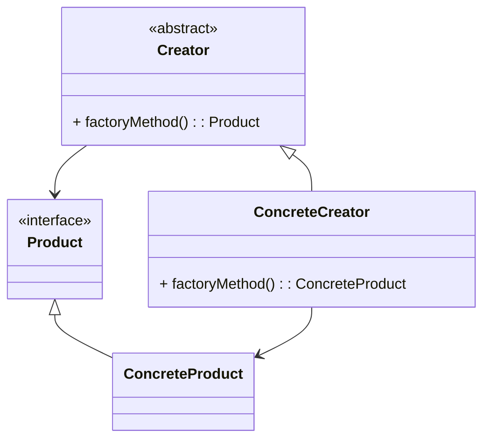

---

linkTitle: "2.2.1 Defining the Factory Method Pattern"
title: "Factory Method Pattern: Defining the Factory Method Pattern in Java"
description: "Explore the Factory Method Pattern in Java, a creational design pattern that promotes loose coupling and extensibility in object creation."
categories:
- Java Design Patterns
- Creational Patterns
- Software Engineering
tags:
- Factory Method
- Design Patterns
- Java
- Object-Oriented Design
- Software Development
date: 2024-10-25
type: docs
nav_weight: 221000
---

## 2.2.1 Defining the Factory Method Pattern

The Factory Method pattern is a creational design pattern that provides a way to delegate the instantiation logic to subclasses. This pattern is particularly useful when a class cannot anticipate the class of objects it must create. By defining an interface for creating an object, but allowing subclasses to alter the type of objects that will be created, the Factory Method pattern promotes flexibility and extensibility in software design.

### Purpose and Problem Addressed

The primary purpose of the Factory Method pattern is to abstract the process of object creation. In traditional object-oriented programming, creating an object typically involves specifying the exact class to instantiate. However, this approach can lead to tight coupling between classes, making the system less flexible and harder to extend.

The Factory Method pattern addresses this problem by allowing a class to defer instantiation to subclasses. This means that the class delegates the responsibility of creating an instance of a class to its subclasses, which can decide the specific class to instantiate. This promotes loose coupling and enhances the system's ability to evolve over time.

### Key Concepts and Structure

The Factory Method pattern involves several key components:

- **Creator**: This is an abstract class or interface that declares the factory method, which returns an object of a Product type. The Creator may also define a default implementation of the factory method that returns a default ConcreteProduct object.

- **Concrete Creator**: These are subclasses of the Creator that override the factory method to return instances of ConcreteProduct.

- **Product**: This is an interface or abstract class that defines the interface of objects the factory method creates.

- **Concrete Product**: These are classes that implement the Product interface.

The Factory Method pattern can be represented in a UML diagram as follows:



### Roles and Responsibilities

- **Creator**: The Creator class is responsible for declaring the factory method. It may also provide a default implementation, which can be overridden by subclasses. The Creator does not know which ConcreteProduct it will instantiate; this decision is deferred to the Concrete Creator.

- **Concrete Creator**: The Concrete Creator class overrides the factory method to return an instance of a ConcreteProduct. This class contains the logic to decide which class to instantiate and return.

### Factory Method vs. Simple Object Instantiation

Unlike simple object instantiation, where a class directly creates an instance of another class using the `new` keyword, the Factory Method pattern abstracts this process. This abstraction allows for greater flexibility and adherence to the Open/Closed Principle, which states that software entities should be open for extension but closed for modification.

### Practical Example in Java

Consider a scenario where you are developing a framework that requires logging functionality. The type of logger (e.g., console logger, file logger) might vary based on the environment or configuration.

```java
// Product Interface
interface Logger {
    void log(String message);
}

// Concrete Product
class ConsoleLogger implements Logger {
    @Override
    public void log(String message) {
        System.out.println("Console Logger: " + message);
    }
}

// Concrete Product
class FileLogger implements Logger {
    @Override
    public void log(String message) {
        // Code to log message to a file
        System.out.println("File Logger: " + message);
    }
}

// Creator
abstract class LoggerFactory {
    public abstract Logger createLogger();
}

// Concrete Creator
class ConsoleLoggerFactory extends LoggerFactory {
    @Override
    public Logger createLogger() {
        return new ConsoleLogger();
    }
}

// Concrete Creator
class FileLoggerFactory extends LoggerFactory {
    @Override
    public Logger createLogger() {
        return new FileLogger();
    }
}

// Client Code
public class Application {
    public static void main(String[] args) {
        LoggerFactory factory = new ConsoleLoggerFactory();
        Logger logger = factory.createLogger();
        logger.log("This is a test message.");
    }
}
```

### Benefits of the Factory Method Pattern

- **Extensibility**: New types of products can be added without altering existing code, adhering to the Open/Closed Principle.
- **Loose Coupling**: The client code is decoupled from the specific classes of objects it needs to instantiate.
- **Single Responsibility**: The responsibility of object creation is separated from the client code.

### When to Use the Factory Method Pattern

The Factory Method pattern is beneficial in scenarios where:

- A class cannot anticipate the class of objects it must create.
- A class wants its subclasses to specify the objects it creates.
- Classes delegate responsibility to one of several helper subclasses, and you want to localize the knowledge of which helper subclass is the delegate.

### When Factory Method May Not Be Necessary

While the Factory Method pattern offers significant benefits, it may not be necessary in simpler applications where the overhead of additional classes and abstraction is not justified. In such cases, direct instantiation using the `new` keyword may suffice.

### Encouraging Interface Programming

The Factory Method pattern encourages programming to an interface rather than an implementation. This approach enhances flexibility and allows for easier changes and extensions in the future.

### Conclusion

The Factory Method pattern is a powerful tool in the software developer's toolkit. It promotes loose coupling, adheres to the Open/Closed Principle, and provides a flexible way to handle object creation. By understanding and applying this pattern, developers can create robust, extensible, and maintainable Java applications.

## Quiz Time!



### What is the primary purpose of the Factory Method pattern?

- [x] To abstract the process of object creation and allow subclasses to alter the type of objects created.
- [ ] To directly instantiate objects using the `new` keyword.
- [ ] To provide a single instance of a class.
- [ ] To manage object destruction.

> **Explanation:** The Factory Method pattern abstracts object creation, allowing subclasses to determine the type of objects created, promoting flexibility and extensibility.

### Which component in the Factory Method pattern is responsible for declaring the factory method?

- [x] Creator
- [ ] Concrete Creator
- [ ] Product
- [ ] Concrete Product

> **Explanation:** The Creator class is responsible for declaring the factory method, which can be overridden by Concrete Creators.

### How does the Factory Method pattern promote loose coupling?

- [x] By decoupling the client code from the specific classes of objects it needs to instantiate.
- [ ] By using the `new` keyword for object creation.
- [ ] By enforcing a single instance of a class.
- [ ] By using inheritance to share code among classes.

> **Explanation:** The Factory Method pattern decouples client code from specific classes, allowing for more flexible and maintainable code.

### What principle does the Factory Method pattern adhere to?

- [x] Open/Closed Principle
- [ ] Single Responsibility Principle
- [ ] Liskov Substitution Principle
- [ ] Interface Segregation Principle

> **Explanation:** The Factory Method pattern adheres to the Open/Closed Principle by allowing new products to be added without changing existing code.

### In which scenario is the Factory Method pattern particularly useful?

- [x] When a class cannot anticipate the class of objects it must create.
- [ ] When a class needs to manage a single instance of itself.
- [ ] When a class needs to provide global access to its instance.
- [ ] When a class needs to implement multiple interfaces.

> **Explanation:** The Factory Method pattern is useful when a class cannot anticipate the class of objects it must create, allowing subclasses to specify the objects.

### What is the role of the Concrete Creator in the Factory Method pattern?

- [x] To override the factory method and return instances of ConcreteProduct.
- [ ] To declare the factory method.
- [ ] To implement the Product interface.
- [ ] To manage object destruction.

> **Explanation:** The Concrete Creator overrides the factory method to return instances of ConcreteProduct, determining the specific class to instantiate.

### How does the Factory Method pattern differ from simple object instantiation?

- [x] It abstracts the instantiation process, allowing subclasses to determine the object type.
- [ ] It uses the `new` keyword to create objects directly.
- [ ] It enforces a single instance of a class.
- [ ] It uses inheritance to create objects.

> **Explanation:** The Factory Method pattern abstracts object instantiation, allowing subclasses to determine the object type, unlike direct instantiation with `new`.

### Which of the following is a benefit of using the Factory Method pattern?

- [x] Extensibility
- [ ] Increased complexity
- [ ] Tight coupling
- [ ] Global access to instances

> **Explanation:** The Factory Method pattern provides extensibility by allowing new product types to be added without altering existing code.

### When might the Factory Method pattern not be necessary?

- [x] In simpler applications where the overhead of additional classes is not justified.
- [ ] In complex applications requiring multiple object types.
- [ ] In applications needing global access to a single instance.
- [ ] In applications requiring strict resource management.

> **Explanation:** In simpler applications, the overhead of additional classes and abstraction in the Factory Method pattern may not be justified.

### True or False: The Factory Method pattern encourages programming to an interface rather than an implementation.

- [x] True
- [ ] False

> **Explanation:** The Factory Method pattern encourages programming to an interface, enhancing flexibility and allowing for easier changes and extensions.




