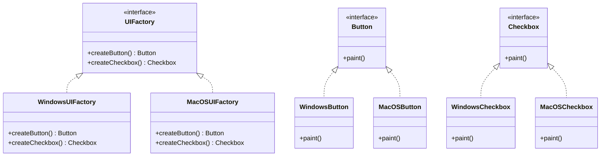

## 2.3.1 Abstract Factory Pattern: Concept and Use Cases

The Abstract Factory Pattern is a creational design pattern that provides an interface for creating families of related or dependent objects without specifying their concrete classes. This pattern is particularly useful when a system needs to be independent of how its objects are created, composed, and represented. It allows for the creation of a suite of products that are designed to work together seamlessly.

### Understanding the Abstract Factory Pattern

The Abstract Factory Pattern is essentially a factory of factories. It encapsulates a group of individual factories that have a common theme. The pattern provides a way to enforce consistency among products in a family, ensuring that related objects are used together.

#### Key Concepts

- **Abstract Factory**: An interface that declares a set of methods for creating each of the abstract products.
- **Concrete Factory**: Implements the operations to create concrete product objects.
- **Abstract Product**: Declares an interface for a type of product object.
- **Concrete Product**: Defines a product object to be created by the corresponding concrete factory, implementing the Abstract Product interface.

### Use Cases for the Abstract Factory Pattern

The Abstract Factory Pattern is ideal in scenarios where multiple related objects need to be created together, and the system should be independent of how these objects are created. Here are some common use cases:

1. **Cross-Platform UI Toolkits**: When developing applications that need to run on multiple operating systems, you might have different UI components for each OS. The Abstract Factory Pattern can be used to create a suite of UI components (buttons, text fields, etc.) that are consistent with the look and feel of the operating system.

2. **Database Connection Libraries**: If an application needs to support multiple databases, the Abstract Factory Pattern can be used to create a family of database connections, queries, and transactions that are specific to each database type.

3. **Themed Applications**: Applications that support multiple themes can use the Abstract Factory Pattern to create theme-specific components like colors, fonts, and icons.

### Example: Cross-Platform UI Components

Consider an application that needs to support both Windows and MacOS interfaces. Using the Abstract Factory Pattern, you can create an interface for UI components and implement concrete factories for each platform.

```java
// Abstract Factory
interface UIFactory {
    Button createButton();
    Checkbox createCheckbox();
}

// Concrete Factory for Windows
class WindowsUIFactory implements UIFactory {
    public Button createButton() {
        return new WindowsButton();
    }
    public Checkbox createCheckbox() {
        return new WindowsCheckbox();
    }
}

// Concrete Factory for MacOS
class MacOSUIFactory implements UIFactory {
    public Button createButton() {
        return new MacOSButton();
    }
    public Checkbox createCheckbox() {
        return new MacOSCheckbox();
    }
}

// Abstract Product
interface Button {
    void paint();
}

// Concrete Product for Windows
class WindowsButton implements Button {
    public void paint() {
        System.out.println("Rendering a button in Windows style.");
    }
}

// Concrete Product for MacOS
class MacOSButton implements Button {
    public void paint() {
        System.out.println("Rendering a button in MacOS style.");
    }
}

// Abstract Product
interface Checkbox {
    void paint();
}

// Concrete Product for Windows
class WindowsCheckbox implements Checkbox {
    public void paint() {
        System.out.println("Rendering a checkbox in Windows style.");
    }
}

// Concrete Product for MacOS
class MacOSCheckbox implements Checkbox {
    public void paint() {
        System.out.println("Rendering a checkbox in MacOS style.");
    }
}
```

### UML Diagram

Below is a UML diagram illustrating the structure of the Abstract Factory Pattern:



### Difference Between Abstract Factory and Factory Method Patterns

While both patterns deal with object creation, they serve different purposes:

- **Factory Method Pattern**: Focuses on a single product. It defines an interface for creating an object, but lets subclasses alter the type of objects that will be created.
- **Abstract Factory Pattern**: Focuses on families of related products. It provides an interface for creating families of related or dependent objects without specifying their concrete classes.

### Ensuring Consistency and Scalability

The Abstract Factory Pattern ensures consistency among products in a family by enforcing that related objects are used together. This is particularly beneficial in large systems where consistency is crucial.

#### Supporting the Open/Closed Principle

The pattern supports the Open/Closed Principle by allowing new families of products to be added without modifying existing code. This is achieved by introducing new concrete factories that implement the abstract factory interface.

### Complexity and Justification

The Abstract Factory Pattern introduces complexity due to the additional layers of abstraction. However, this complexity is justified when:

- The system needs to be independent of how its products are created.
- There is a need to enforce consistency among related products.
- The application is large and requires scalability.

### Promoting Scalability in Large Systems

By decoupling the client code from the concrete classes, the Abstract Factory Pattern promotes scalability. It allows the system to grow and evolve without significant changes to the existing codebase.

### Considerations for Multi-Platform Applications

When dealing with multi-platform applications, the Abstract Factory Pattern is particularly useful. It enables the creation of platform-specific components while maintaining a consistent interface across platforms.

### Conclusion

The Abstract Factory Pattern is a powerful tool for creating families of related objects without specifying their concrete classes. It promotes consistency, scalability, and adherence to the Open/Closed Principle, making it an excellent choice for large, complex systems and multi-platform applications.

## Quiz Time!



### What is the main purpose of the Abstract Factory Pattern?

- [x] To provide an interface for creating families of related or dependent objects without specifying their concrete classes.
- [ ] To create a single object without specifying its concrete class.
- [ ] To manage object lifecycle and memory allocation.
- [ ] To define a skeleton of an algorithm in a superclass.

> **Explanation:** The Abstract Factory Pattern is designed to provide an interface for creating families of related or dependent objects without specifying their concrete classes.

### Which of the following is NOT a component of the Abstract Factory Pattern?

- [ ] Abstract Factory
- [ ] Concrete Factory
- [x] Singleton
- [ ] Abstract Product

> **Explanation:** The Singleton is not a component of the Abstract Factory Pattern. The pattern includes Abstract Factory, Concrete Factory, Abstract Product, and Concrete Product.

### How does the Abstract Factory Pattern support the Open/Closed Principle?

- [x] By allowing new families of products to be added without modifying existing code.
- [ ] By enforcing a single responsibility for each class.
- [ ] By allowing multiple inheritance.
- [ ] By using static methods for object creation.

> **Explanation:** The Abstract Factory Pattern supports the Open/Closed Principle by allowing new families of products to be added without modifying existing code.

### In which scenario is the Abstract Factory Pattern particularly useful?

- [x] When multiple related objects need to be created together.
- [ ] When only one instance of a class is needed.
- [ ] When objects need to be created lazily.
- [ ] When there is a need to traverse a collection.

> **Explanation:** The Abstract Factory Pattern is particularly useful when multiple related objects need to be created together.

### What is the difference between the Abstract Factory Pattern and the Factory Method Pattern?

- [x] The Abstract Factory Pattern focuses on families of related products, while the Factory Method Pattern focuses on a single product.
- [ ] The Factory Method Pattern is used for creating families of related products, while the Abstract Factory Pattern is used for a single product.
- [ ] The Abstract Factory Pattern is used for creating singletons.
- [ ] The Factory Method Pattern is used for creating singletons.

> **Explanation:** The Abstract Factory Pattern focuses on families of related products, while the Factory Method Pattern focuses on a single product.

### Which of the following is a benefit of using the Abstract Factory Pattern?

- [x] It ensures consistency among products in a family.
- [ ] It reduces the number of classes in a system.
- [ ] It simplifies the creation of singletons.
- [ ] It eliminates the need for interfaces.

> **Explanation:** The Abstract Factory Pattern ensures consistency among products in a family, which is one of its key benefits.

### What is a potential drawback of the Abstract Factory Pattern?

- [x] It introduces additional complexity due to layers of abstraction.
- [ ] It makes it difficult to ensure consistency among products.
- [ ] It is not scalable for large systems.
- [ ] It does not support the Open/Closed Principle.

> **Explanation:** The Abstract Factory Pattern can introduce additional complexity due to layers of abstraction, which is a potential drawback.

### Which pattern is described as a "factory of factories"?

- [x] Abstract Factory Pattern
- [ ] Factory Method Pattern
- [ ] Singleton Pattern
- [ ] Builder Pattern

> **Explanation:** The Abstract Factory Pattern is often described as a "factory of factories."

### True or False: The Abstract Factory Pattern is suitable for applications that need to support multiple themes.

- [x] True
- [ ] False

> **Explanation:** True. The Abstract Factory Pattern is suitable for applications that need to support multiple themes, as it allows for the creation of theme-specific components.

### True or False: The Abstract Factory Pattern can be used to create platform-specific components while maintaining a consistent interface across platforms.

- [x] True
- [ ] False

> **Explanation:** True. The Abstract Factory Pattern can be used to create platform-specific components while maintaining a consistent interface across platforms.


