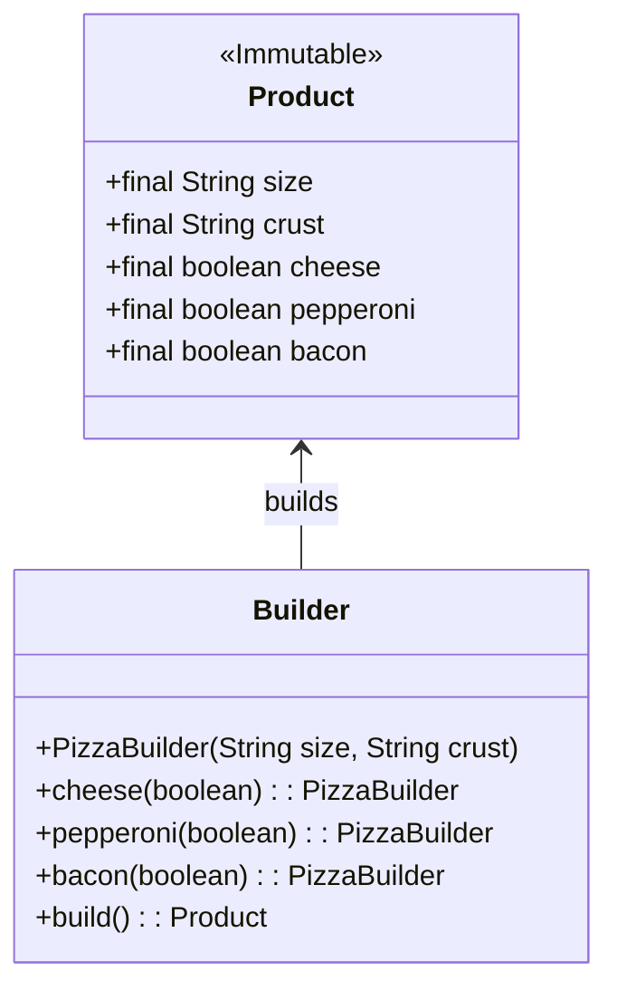

## 2.4.1 Managing Complex Object Creation

In software development, creating complex objects can often lead to cumbersome and error-prone code, especially when these objects require numerous parameters or configurations. The Builder pattern offers an elegant solution to this problem by facilitating the step-by-step construction of complex objects. This pattern not only enhances code readability and maintainability but also provides flexibility in object creation.

### Understanding the Builder Pattern

The Builder pattern is a creational design pattern that separates the construction of a complex object from its representation. By doing so, it allows the same construction process to create different representations. This pattern is particularly useful when an object needs to be created with many optional parameters or when the construction process involves several steps.

#### Scenarios for Using the Builder Pattern

Consider scenarios where objects have numerous parameters, some of which are optional. For instance, constructing a `Pizza` object might involve parameters like size, crust type, and a variety of optional toppings. Using traditional constructors for such objects can lead to the telescoping constructor anti-pattern, where constructors with increasing numbers of parameters are defined to accommodate various configurations.

#### Problems with Telescoping Constructors

Telescoping constructors can make code difficult to read and maintain. As the number of parameters increases, it becomes challenging to remember the order and purpose of each parameter. Moreover, adding new parameters or changing existing ones can lead to a proliferation of constructor overloads, making the codebase harder to manage.

### How the Builder Pattern Addresses These Issues

The Builder pattern addresses the issues associated with telescoping constructors by providing a more flexible and readable approach to object construction. It allows developers to construct objects step by step, specifying only the parameters they need. This pattern typically involves a `Builder` class that provides methods for setting different parameters and a `build()` method that constructs the final object.

#### Example: Constructing a Complex `Pizza` Object

Let's consider an example of using the Builder pattern to construct a `Pizza` object with optional ingredients:

```java
public class Pizza {
    private final String size;
    private final String crust;
    private final boolean cheese;
    private final boolean pepperoni;
    private final boolean bacon;

    private Pizza(PizzaBuilder builder) {
        this.size = builder.size;
        this.crust = builder.crust;
        this.cheese = builder.cheese;
        this.pepperoni = builder.pepperoni;
        this.bacon = builder.bacon;
    }

    public static class PizzaBuilder {
        private final String size;
        private final String crust;
        private boolean cheese;
        private boolean pepperoni;
        private boolean bacon;

        public PizzaBuilder(String size, String crust) {
            this.size = size;
            this.crust = crust;
        }

        public PizzaBuilder cheese(boolean value) {
            cheese = value;
            return this;
        }

        public PizzaBuilder pepperoni(boolean value) {
            pepperoni = value;
            return this;
        }

        public PizzaBuilder bacon(boolean value) {
            bacon = value;
            return this;
        }

        public Pizza build() {
            return new Pizza(this);
        }
    }
}

// Usage
Pizza pizza = new Pizza.PizzaBuilder("Large", "Thin Crust")
                        .cheese(true)
                        .pepperoni(true)
                        .bacon(false)
                        .build();
```

In this example, the `PizzaBuilder` class provides a fluent interface for setting optional ingredients. The `build()` method constructs the `Pizza` object, ensuring that the object is complete and valid.

### Benefits of the Builder Pattern

1. **Flexibility in Object Creation**: The Builder pattern allows for flexible and customizable object creation. Developers can specify only the parameters they need, leading to cleaner and more understandable code.

2. **Improved Code Readability and Maintainability**: By avoiding telescoping constructors, the Builder pattern makes code easier to read and maintain. It also simplifies the process of adding new parameters or modifying existing ones.

3. **Separation of Construction and Representation**: The pattern separates the construction logic from the representation of the object, allowing for different representations to be created using the same construction process.

4. **Enforcing Immutability**: The Builder pattern can enforce immutability in objects by ensuring that once an object is constructed, it cannot be modified. This is achieved by making the fields of the constructed object final and not providing any setters.

### The Role of the Director

In some implementations of the Builder pattern, a `Director` class is used to guide the building process. The `Director` encapsulates the construction logic and calls the appropriate methods on the `Builder` to construct the object. This approach is useful when the construction process is complex and involves multiple steps.

### Applicability for Constructing Immutable Objects

The Builder pattern is particularly well-suited for constructing immutable objects, where all fields are set at the time of construction and cannot be changed thereafter. By using a `Builder`, developers can ensure that objects are fully initialized before they are used, reducing the risk of errors.

### UML Diagram of the Builder Pattern

Below is a UML diagram illustrating the structure of the Builder pattern:



### When to Consider the Builder Pattern

Consider using the Builder pattern when dealing with objects that have numerous optional parameters or when the construction process is complex. This pattern is particularly useful in scenarios where immutability is desired, and it can significantly enhance the readability and maintainability of your code.

### Conclusion

The Builder pattern provides a robust solution for managing complex object creation in Java applications. By separating the construction of an object from its representation, it offers flexibility, improves code readability, and supports immutability. As you design your applications, consider the Builder pattern as a tool to simplify and enhance your object construction processes.

## Quiz Time!



### What is the primary purpose of the Builder pattern?

- [x] To construct complex objects step by step
- [ ] To provide a global point of access to an object
- [ ] To allow multiple objects to share a single instance
- [ ] To simplify object inheritance

> **Explanation:** The Builder pattern is designed to construct complex objects step by step, allowing for flexible and readable object creation.

### Which problem does the Builder pattern address?

- [x] Telescoping constructors
- [ ] Object cloning
- [ ] Singleton enforcement
- [ ] Interface segregation

> **Explanation:** The Builder pattern addresses the problem of telescoping constructors by providing a more flexible and readable approach to object construction.

### How does the Builder pattern improve code readability?

- [x] By providing a fluent interface for setting parameters
- [ ] By enforcing a single constructor for all objects
- [ ] By using inheritance to reduce code duplication
- [ ] By allowing objects to be modified after creation

> **Explanation:** The Builder pattern improves code readability by providing a fluent interface that allows developers to specify only the parameters they need, leading to cleaner and more understandable code.

### What role does the Director play in the Builder pattern?

- [x] It guides the building process
- [ ] It enforces immutability
- [ ] It provides a global point of access
- [ ] It manages object cloning

> **Explanation:** In some implementations, the Director guides the building process by encapsulating the construction logic and calling the appropriate methods on the Builder.

### How does the Builder pattern enforce immutability?

- [x] By making fields final and not providing setters
- [ ] By using synchronized methods
- [ ] By implementing the Cloneable interface
- [ ] By using static factory methods

> **Explanation:** The Builder pattern can enforce immutability by ensuring that fields are final and not providing setters, so once an object is constructed, it cannot be modified.

### In which scenario is the Builder pattern particularly useful?

- [x] When objects have numerous optional parameters
- [ ] When objects need to be cloned
- [ ] When objects require a global point of access
- [ ] When objects need to be serialized

> **Explanation:** The Builder pattern is particularly useful when objects have numerous optional parameters, as it allows for flexible and readable object creation.

### What is a common benefit of using the Builder pattern?

- [x] Improved code maintainability
- [ ] Reduced memory usage
- [ ] Faster execution time
- [ ] Simplified inheritance

> **Explanation:** The Builder pattern improves code maintainability by providing a more organized and flexible approach to object construction.

### How does the Builder pattern separate construction from representation?

- [x] By using a separate Builder class to construct the object
- [ ] By using inheritance to define different representations
- [ ] By implementing multiple interfaces
- [ ] By using static methods for construction

> **Explanation:** The Builder pattern separates construction from representation by using a separate Builder class to construct the object, allowing for different representations to be created using the same construction process.

### Can the Builder pattern be used to construct mutable objects?

- [x] Yes
- [ ] No

> **Explanation:** While the Builder pattern is often used to construct immutable objects, it can also be used to construct mutable objects if desired.

### True or False: The Builder pattern is only applicable for objects with a fixed set of parameters.

- [ ] True
- [x] False

> **Explanation:** The Builder pattern is particularly useful for objects with numerous optional parameters, allowing for flexible and customizable object creation.


