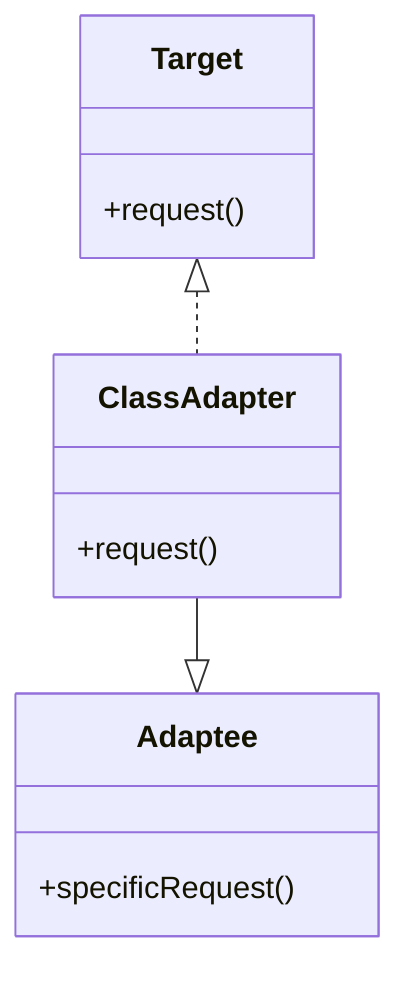
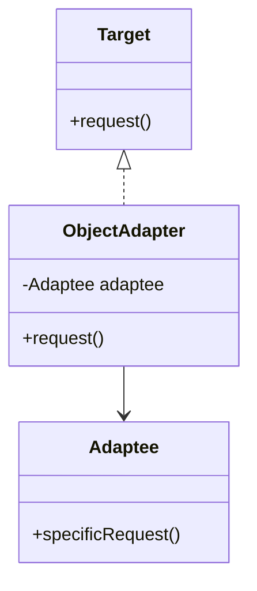

## 3.1.2 Class Adapter vs. Object Adapter

The Adapter Pattern is a structural design pattern that allows incompatible interfaces to work together. It acts as a bridge between two incompatible interfaces, enabling them to communicate. In Java, there are two primary forms of the Adapter Pattern: Class Adapter and Object Adapter. Each has its own unique approach and use cases, which we will explore in this section.

### Class Adapter

#### Definition and Implementation

A Class Adapter uses inheritance to adapt one interface to another. By extending the class whose interface needs to be adapted, the class adapter can override methods and provide the necessary interface to the client.

**Key Characteristics:**
- **Inheritance:** Class adapters use inheritance to adapt interfaces. This means the adapter class must inherit from the class it adapts.
- **Single Inheritance Limitation:** Due to Java's single inheritance constraint, a class adapter can only adapt one class at a time.

#### Java Code Example

```java
// Adaptee class with specific functionality
class Adaptee {
    public void specificRequest() {
        System.out.println("Specific request from Adaptee");
    }
}

// Target interface expected by the client
interface Target {
    void request();
}

// Class Adapter using inheritance
class ClassAdapter extends Adaptee implements Target {
    @Override
    public void request() {
        // Adapting the specificRequest to the request method
        specificRequest();
    }
}

// Client code
public class Client {
    public static void main(String[] args) {
        Target target = new ClassAdapter();
        target.request(); // Outputs: Specific request from Adaptee
    }
}
```

### Object Adapter

#### Definition and Implementation

An Object Adapter uses composition to adapt one interface to another. Instead of inheriting from the class it adapts, it holds an instance of the class and delegates calls to it.

**Key Characteristics:**
- **Composition:** Object adapters use composition, holding a reference to the adaptee object and forwarding requests to it.
- **Multiple Adaptation:** Can adapt multiple classes or interfaces since it does not rely on inheritance.

#### Java Code Example

```java
// Adaptee class with specific functionality
class Adaptee {
    public void specificRequest() {
        System.out.println("Specific request from Adaptee");
    }
}

// Target interface expected by the client
interface Target {
    void request();
}

// Object Adapter using composition
class ObjectAdapter implements Target {
    private Adaptee adaptee;

    public ObjectAdapter(Adaptee adaptee) {
        this.adaptee = adaptee;
    }

    @Override
    public void request() {
        // Adapting the specificRequest to the request method
        adaptee.specificRequest();
    }
}

// Client code
public class Client {
    public static void main(String[] args) {
        Adaptee adaptee = new Adaptee();
        Target target = new ObjectAdapter(adaptee);
        target.request(); // Outputs: Specific request from Adaptee
    }
}
```

### UML Diagrams

To better understand the differences between class and object adapters, let's look at UML diagrams for each approach.

#### Class Adapter UML



#### Object Adapter UML



### Advantages and Limitations

#### Class Adapter

**Advantages:**
- **Access to Protected Members:** Can access protected members of the adaptee class due to inheritance.
- **Simplicity:** Directly inherits and overrides methods, making it straightforward for simple adaptations.

**Limitations:**
- **Tight Coupling:** Inherits from the adaptee, leading to tight coupling and potential issues with future changes.
- **Single Inheritance Restriction:** Limited by Java's single inheritance, restricting its use to adapting one class at a time.

#### Object Adapter

**Advantages:**
- **Loose Coupling:** Uses composition, promoting loose coupling and flexibility.
- **Multiple Adaptation:** Can adapt multiple classes or interfaces, providing greater versatility.

**Limitations:**
- **Complexity:** May introduce additional complexity due to delegation.
- **Performance Overhead:** Slight performance overhead due to additional object composition.

### When to Use Each Adapter

#### Class Adapter

- **Access to Protected Members:** When access to protected members of the adaptee class is necessary.
- **Simple Adaptation Needs:** When the adaptation is straightforward and involves a single class.

#### Object Adapter

- **Multiple Adaptation Needs:** When adapting multiple classes or interfaces is required.
- **Loose Coupling Requirement:** When loose coupling is a priority for maintainability and extensibility.

### Best Practices

- **Evaluate Design Requirements:** Carefully assess the design requirements to choose the appropriate adapter approach.
- **Favor Composition Over Inheritance:** Generally, prefer object adapters to promote loose coupling unless specific needs dictate otherwise.
- **Consider Future Changes:** Anticipate potential changes and choose the adapter type that offers the best balance between flexibility and complexity.

### Conclusion

Choosing between a class adapter and an object adapter depends on the specific needs and constraints of your project. Understanding the trade-offs and benefits of each approach is crucial for effective design pattern implementation in Java.

## Quiz Time!



### What is the primary difference between class adapters and object adapters in Java?

- [x] Class adapters use inheritance, while object adapters use composition.
- [ ] Class adapters use composition, while object adapters use inheritance.
- [ ] Class adapters can adapt multiple interfaces, while object adapters cannot.
- [ ] Object adapters can access protected members, while class adapters cannot.

> **Explanation:** Class adapters rely on inheritance to adapt interfaces, whereas object adapters use composition to wrap and adapt classes.

### Which of the following is a limitation of class adapters in Java?

- [x] They are limited by Java's single inheritance.
- [ ] They cannot access protected members of the adaptee class.
- [ ] They promote loose coupling.
- [ ] They can adapt multiple classes simultaneously.

> **Explanation:** Class adapters are limited by Java's single inheritance, restricting them to adapting one class at a time.

### What is an advantage of using object adapters over class adapters?

- [x] They promote loose coupling through delegation.
- [ ] They have direct access to protected members of the adaptee.
- [ ] They are simpler to implement than class adapters.
- [ ] They require less memory than class adapters.

> **Explanation:** Object adapters promote loose coupling by using composition, which allows for more flexible and maintainable code.

### In which scenario would a class adapter be more suitable than an object adapter?

- [x] When access to protected members of the adaptee class is needed.
- [ ] When adapting multiple classes or interfaces.
- [ ] When loose coupling is a priority.
- [ ] When the adaptee class is final.

> **Explanation:** Class adapters are more suitable when access to protected members of the adaptee class is necessary, as they use inheritance.

### How does Java's single inheritance limitation affect class adapters?

- [x] It restricts them to adapting only one class at a time.
- [ ] It allows them to adapt multiple interfaces simultaneously.
- [ ] It prevents them from accessing protected members.
- [ ] It forces them to use composition instead of inheritance.

> **Explanation:** Java's single inheritance limitation restricts class adapters to adapting only one class at a time.

### Which adapter type is generally preferred for promoting loose coupling?

- [x] Object adapter
- [ ] Class adapter
- [ ] Both are equally effective
- [ ] Neither promotes loose coupling

> **Explanation:** Object adapters are generally preferred for promoting loose coupling because they use composition.

### What is a potential drawback of using object adapters?

- [x] They may introduce additional complexity due to delegation.
- [ ] They cannot adapt multiple interfaces.
- [ ] They are tightly coupled to the adaptee class.
- [ ] They cannot access protected members of the adaptee class.

> **Explanation:** Object adapters may introduce additional complexity due to the delegation involved in their implementation.

### When is it advisable to use a class adapter?

- [x] When the adaptation is straightforward and involves a single class.
- [ ] When adapting multiple classes or interfaces.
- [ ] When loose coupling is a priority.
- [ ] When the adaptee class is final.

> **Explanation:** Class adapters are advisable when the adaptation is straightforward and involves a single class.

### Which adapter type allows for adapting multiple classes or interfaces?

- [x] Object adapter
- [ ] Class adapter
- [ ] Both types
- [ ] Neither type

> **Explanation:** Object adapters can adapt multiple classes or interfaces because they use composition.

### True or False: Object adapters can access protected members of the adaptee class.

- [ ] True
- [x] False

> **Explanation:** Object adapters cannot access protected members of the adaptee class because they do not use inheritance.


