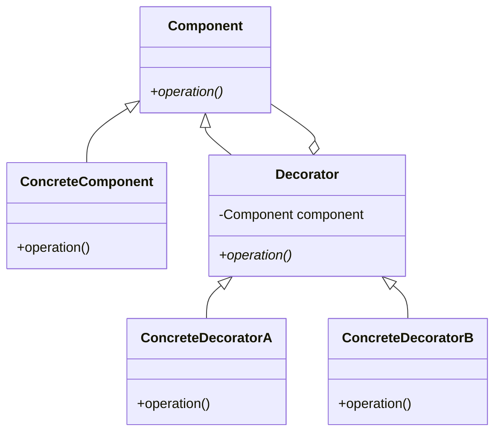

---

linkTitle: "3.2.1 Enhancing Object Functionality Dynamically"
title: "Enhancing Object Functionality Dynamically with the Decorator Pattern in Java"
description: "Explore how the Decorator Pattern in Java allows for dynamic enhancement of object functionality, providing a flexible alternative to subclassing and adhering to the Open/Closed Principle."
categories:
- Design Patterns
- Java Programming
- Software Development
tags:
- Decorator Pattern
- Java
- Object-Oriented Design
- Structural Patterns
- Software Architecture
date: 2024-10-25
type: docs
nav_weight: 321000
---

## 3.2.1 Enhancing Object Functionality Dynamically

In the realm of software design, the need to extend the functionality of objects dynamically and flexibly is a common requirement. The Decorator Pattern offers a robust solution to this challenge by allowing additional responsibilities to be attached to objects at runtime. This pattern provides a flexible alternative to subclassing, enabling developers to enhance object functionality without the pitfalls of inheritance, such as class explosion.

### The Purpose of the Decorator Pattern

The Decorator Pattern is a structural design pattern that allows behavior to be added to individual objects, either statically or dynamically, without affecting the behavior of other objects from the same class. It is particularly useful when you need to add features to objects in a flexible and reusable way.

#### Real-World Analogy

Consider a car. You can enhance its functionality by adding accessories like a sunroof, GPS navigation, or a high-end audio system. Each accessory adds a new feature without altering the car's fundamental structure. Similarly, the Decorator Pattern allows you to "decorate" an object with new behaviors or responsibilities.

### The Problem with Inheritance

Inheritance is a powerful feature of object-oriented programming, but it can lead to a problem known as class explosion. This occurs when you create a new subclass for every possible combination of features, leading to a proliferation of classes that are difficult to manage and maintain. The Decorator Pattern addresses this issue by allowing you to compose behavior dynamically.

### Adherence to the Open/Closed Principle

One of the key benefits of the Decorator Pattern is its adherence to the Open/Closed Principle, a fundamental principle of object-oriented design. This principle states that software entities should be open for extension but closed for modification. By using decorators, you can extend the functionality of objects without modifying their existing code, thus keeping the system flexible and maintainable.

### How the Decorator Pattern Works

The Decorator Pattern involves a set of decorator classes that are used to wrap concrete components. These decorators implement the same interface as the components they decorate, ensuring that they can be used interchangeably. This wrapping mechanism allows decorators to add new behavior before or after the method calls to the original object.

Here's a simple UML diagram illustrating the Decorator Pattern:



### Implementing the Decorator Pattern in Java

Let's look at a practical example of the Decorator Pattern in Java. Suppose we have a `Coffee` interface and a `SimpleCoffee` class implementing it. We want to add features like milk and sugar dynamically.

```java
// Component interface
interface Coffee {
    String getDescription();
    double cost();
}

// Concrete component
class SimpleCoffee implements Coffee {
    @Override
    public String getDescription() {
        return "Simple Coffee";
    }

    @Override
    public double cost() {
        return 2.0;
    }
}

// Decorator class
abstract class CoffeeDecorator implements Coffee {
    protected Coffee coffee;

    public CoffeeDecorator(Coffee coffee) {
        this.coffee = coffee;
    }

    @Override
    public String getDescription() {
        return coffee.getDescription();
    }

    @Override
    public double cost() {
        return coffee.cost();
    }
}

// Concrete decorator
class MilkDecorator extends CoffeeDecorator {
    public MilkDecorator(Coffee coffee) {
        super(coffee);
    }

    @Override
    public String getDescription() {
        return coffee.getDescription() + ", Milk";
    }

    @Override
    public double cost() {
        return coffee.cost() + 0.5;
    }
}

// Another concrete decorator
class SugarDecorator extends CoffeeDecorator {
    public SugarDecorator(Coffee coffee) {
        super(coffee);
    }

    @Override
    public String getDescription() {
        return coffee.getDescription() + ", Sugar";
    }

    @Override
    public double cost() {
        return coffee.cost() + 0.2;
    }
}

// Usage
public class CoffeeShop {
    public static void main(String[] args) {
        Coffee myCoffee = new SimpleCoffee();
        System.out.println(myCoffee.getDescription() + " $" + myCoffee.cost());

        myCoffee = new MilkDecorator(myCoffee);
        System.out.println(myCoffee.getDescription() + " $" + myCoffee.cost());

        myCoffee = new SugarDecorator(myCoffee);
        System.out.println(myCoffee.getDescription() + " $" + myCoffee.cost());
    }
}
```

### Key Points of the Decorator Pattern

1. **Interface Matching**: Decorators must implement the same interface as the components they decorate. This ensures that decorated objects can be used interchangeably with undecorated ones.

2. **Runtime Flexibility**: The pattern allows for the dynamic addition of behavior, which is particularly useful in scenarios like UI components where customization is required.

3. **Difference from Method Overriding**: Unlike method overriding, which changes behavior at compile time, the Decorator Pattern adds behavior at runtime. This provides greater flexibility and adaptability.

4. **Impact on Performance and Complexity**: While the Decorator Pattern offers flexibility, it can also introduce complexity and performance overhead due to the additional layers of wrapping. It's essential to evaluate the trade-offs when designing your system.

### Practical Applications

The Decorator Pattern is beneficial in various scenarios, such as:

- **UI Components**: Adding features like borders, scroll bars, or shadows to UI components without altering their core functionality.
- **Data Streams**: Enhancing data streams with additional capabilities like buffering, compression, or encryption.
- **Logging**: Adding logging capabilities to existing classes without modifying their code.

### Best Practices and Considerations

- **Evaluate the Need**: Before implementing the Decorator Pattern, assess whether dynamic behavior extension is necessary. Sometimes, simpler solutions like method overriding or composition might suffice.
- **Balance Complexity**: Be mindful of the added complexity and potential performance impacts. Use the pattern judiciously to avoid over-engineering.
- **Maintainability**: Ensure that the use of decorators enhances maintainability by keeping the system flexible and adhering to the Open/Closed Principle.

### Conclusion

The Decorator Pattern is a powerful tool for enhancing object functionality dynamically. By providing a flexible alternative to subclassing, it helps manage complexity and maintainability in software systems. When applied thoughtfully, it can significantly improve the adaptability and extensibility of your Java applications.

## Quiz Time!



### What is the primary purpose of the Decorator Pattern?

- [x] To add responsibilities to objects at runtime
- [ ] To create new classes through inheritance
- [ ] To simplify object creation
- [ ] To manage object lifecycles

> **Explanation:** The Decorator Pattern allows adding responsibilities to objects dynamically at runtime, providing flexibility without modifying existing code.

### How does the Decorator Pattern adhere to the Open/Closed Principle?

- [x] By allowing extension without modification
- [ ] By modifying existing classes
- [ ] By using inheritance to add features
- [ ] By simplifying the class hierarchy

> **Explanation:** The Decorator Pattern allows objects to be extended with new behavior without altering their existing code, adhering to the Open/Closed Principle.

### Which of the following is a real-world analogy for the Decorator Pattern?

- [x] Adding accessories to a car
- [ ] Building a house from scratch
- [ ] Baking a cake
- [ ] Painting a wall

> **Explanation:** Adding accessories to a car is analogous to the Decorator Pattern, as it enhances functionality without altering the car's core structure.

### What problem does the Decorator Pattern solve compared to inheritance?

- [x] Class explosion
- [ ] Lack of polymorphism
- [ ] Poor performance
- [ ] Difficult debugging

> **Explanation:** The Decorator Pattern solves the problem of class explosion by allowing dynamic composition of behavior instead of creating numerous subclasses.

### In the provided Java example, what role does `CoffeeDecorator` play?

- [x] It acts as a base class for concrete decorators
- [ ] It is the main component interface
- [ ] It is a concrete component
- [ ] It is a utility class

> **Explanation:** `CoffeeDecorator` serves as a base class for concrete decorators, providing a common interface and holding a reference to the component being decorated.

### Which of the following is a benefit of using the Decorator Pattern?

- [x] Runtime flexibility
- [ ] Compile-time behavior change
- [ ] Reduced memory usage
- [ ] Simplified inheritance hierarchy

> **Explanation:** The Decorator Pattern offers runtime flexibility by allowing behaviors to be added dynamically, unlike compile-time behavior changes through inheritance.

### What is a potential downside of the Decorator Pattern?

- [x] Increased complexity
- [ ] Lack of flexibility
- [ ] Poor code reuse
- [ ] Limited scalability

> **Explanation:** The Decorator Pattern can increase complexity due to the additional layers of wrapping, which can impact performance and maintainability.

### How does the Decorator Pattern differ from method overriding?

- [x] It adds behavior at runtime
- [ ] It changes behavior at compile time
- [ ] It simplifies method signatures
- [ ] It eliminates the need for interfaces

> **Explanation:** The Decorator Pattern adds behavior dynamically at runtime, whereas method overriding changes behavior at compile time.

### What is a common use case for the Decorator Pattern?

- [x] Enhancing UI components
- [ ] Managing database connections
- [ ] Simplifying network communication
- [ ] Reducing code duplication

> **Explanation:** The Decorator Pattern is commonly used to enhance UI components with additional features like borders or scroll bars.

### True or False: The Decorator Pattern can be used to modify the existing code of an object.

- [ ] True
- [x] False

> **Explanation:** False. The Decorator Pattern does not modify existing code; it extends functionality by wrapping objects.


